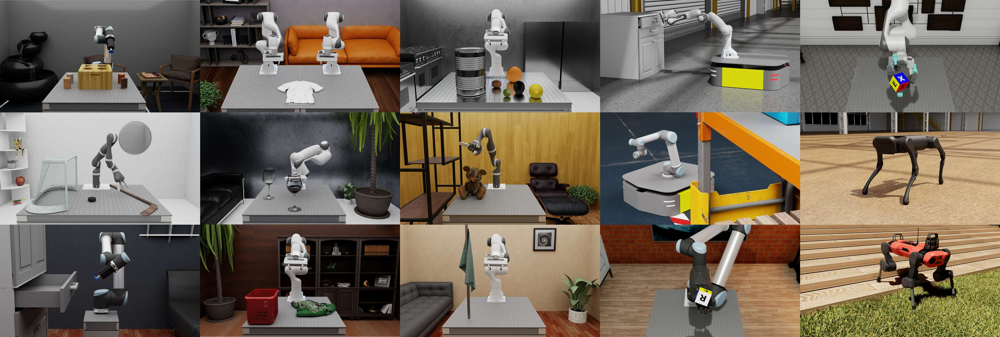

欢迎使用 Isaac Lab！
=====================

.. figure:: source/_static/isaaclab.jpg
   :width: 100%
   :alt: H1 Humanoid example using Isaac Lab

**Isaac Lab** 是一个统一且模块化的机器人学习框架，旨在简化机器人研究中的常见工作流
（例如强化学习、从演示中学习以及运动规划）。它构建在
`NVIDIA Isaac Sim`_ 之上，以利用最新的仿真能力实现照片级真实感场景，以及快速
高效的仿真。

该框架的核心目标是：

- **模块化**：轻松定制和添加新环境、机器人以及传感器。
- **敏捷性**：适应社区不断变化的需求。
- **开放性**：保持开源，让社区能够贡献并扩展该框架。
- **开箱即用**：内置多项可直接使用的环境、传感器和任务。

Isaac Lab 提供的关键特性包括由 PhysX 提供的快速而准确的物理仿真、
用于向量化渲染的平铺渲染 API、用于提升鲁棒性和适应性的域随机化，
以及云端运行支持。

此外，Isaac Lab 还提供了多种环境，我们也正在积极向列表中添加更多环境。
这些环境包括经典控制任务、固定臂与灵巧操作任务、腿式运动任务
以及导航任务。完整列表可在 `环境 <source/overview/environments>`_ 一节中找到。

Isaac Lab 是围绕特定的机器人资产开发的，这些资产现在作为平台的一部分**开箱即用**，可以直接用于学习！这些机器人包括……

- **经典**：Cartpole、Humanoid、Ant
- **固定臂与灵巧手**：UR10、Franka、Allegro、Shadow Hand
- **四足机器人**：Anybotics Anymal-B、Anymal-C、Anymal-D、Unitree A1、Unitree Go1、Unitree Go2、Boston Dynamics Spot
- **人形机器人**：Unitree H1、Unitree G1
- **四旋翼**：Crazyflie

该平台的设计也允许你添加自己的机器人！详细信息请参阅
:ref:`how-to` 一节。

关于该框架的更多信息，请参阅 `技术报告 <https://arxiv.org/abs/2511.04831>`_
:cite:`mittal2025isaaclab`。关于 NVIDIA Isaac 生态系统的说明，请查看
:ref:`isaac-lab-ecosystem` 一节。

许可证
======

Isaac Lab 框架基于 BSD-3-Clause 许可证开源，
其中部分内容基于 Apache-2.0 许可证。详细信息请参阅 :ref:`license`。

引用
====

如果你在研究中使用了 Isaac Lab，请引用我们的技术报告：

.. code:: bibtex

   @article{mittal2025isaaclab,
      title={Isaac Lab: A GPU-Accelerated Simulation Framework for Multi-Modal Robot Learning},
      author={Mayank Mittal and Pascal Roth and James Tigue and Antoine Richard and Octi Zhang and Peter Du and Antonio Serrano-Muñoz and Xinjie Yao and René Zurbrügg and Nikita Rudin and Lukasz Wawrzyniak and Milad Rakhsha and Alain Denzler and Eric Heiden and Ales Borovicka and Ossama Ahmed and Iretiayo Akinola and Abrar Anwar and Mark T. Carlson and Ji Yuan Feng and Animesh Garg and Renato Gasoto and Lionel Gulich and Yijie Guo and M. Gussert and Alex Hansen and Mihir Kulkarni and Chenran Li and Wei Liu and Viktor Makoviychuk and Grzegorz Malczyk and Hammad Mazhar and Masoud Moghani and Adithyavairavan Murali and Michael Noseworthy and Alexander Poddubny and Nathan Ratliff and Welf Rehberg and Clemens Schwarke and Ritvik Singh and James Latham Smith and Bingjie Tang and Ruchik Thaker and Matthew Trepte and Karl Van Wyk and Fangzhou Yu and Alex Millane and Vikram Ramasamy and Remo Steiner and Sangeeta Subramanian and Clemens Volk and CY Chen and Neel Jawale and Ashwin Varghese Kuruttukulam and Michael A. Lin and Ajay Mandlekar and Karsten Patzwaldt and John Welsh and Huihua Zhao and Fatima Anes and Jean-Francois Lafleche and Nicolas Moënne-Loccoz and Soowan Park and Rob Stepinski and Dirk Van Gelder and Chris Amevor and Jan Carius and Jumyung Chang and Anka He Chen and Pablo de Heras Ciechomski and Gilles Daviet and Mohammad Mohajerani and Julia von Muralt and Viktor Reutskyy and Michael Sauter and Simon Schirm and Eric L. Shi and Pierre Terdiman and Kenny Vilella and Tobias Widmer and Gordon Yeoman and Tiffany Chen and Sergey Grizan and Cathy Li and Lotus Li and Connor Smith and Rafael Wiltz and Kostas Alexis and Yan Chang and David Chu and Linxi "Jim" Fan and Farbod Farshidian and Ankur Handa and Spencer Huang and Marco Hutter and Yashraj Narang and Soha Pouya and Shiwei Sheng and Yuke Zhu and Miles Macklin and Adam Moravanszky and Philipp Reist and Yunrong Guo and David Hoeller and Gavriel State},
      journal={arXiv preprint arXiv:2511.04831},
      year={2025},
      url={https://arxiv.org/abs/2511.04831}
   }

致谢
====

Isaac Lab 的开发源自 `Orbit <https://isaac-orbit.github.io/>`_ 框架。
我们衷心感谢 Orbit 的作者们所做出的奠基性贡献。

目录
====

.. toctree::
   :maxdepth: 1
   :caption: Isaac Lab

   source/setup/ecosystem
   source/setup/installation/index
   source/deployment/index
   source/setup/installation/cloud_installation
   source/refs/reference_architecture/index

.. toctree::
   :maxdepth: 2
   :caption: 快速上手
   :titlesonly:

   source/setup/quickstart
   source/overview/own-project/index
   source/setup/walkthrough/index
   source/tutorials/index
   source/how-to/index
   source/overview/developer-guide/index

.. toctree::
   :maxdepth: 3
   :caption: 概述
   :titlesonly:

   source/overview/core-concepts/index
   source/overview/environments
   source/overview/reinforcement-learning/index
   source/overview/imitation-learning/index
   source/overview/showroom
   source/overview/simple_agents

.. toctree::
   :maxdepth: 2
   :caption: 特性

   source/features/hydra
   source/features/multi_gpu
   source/features/population_based_training
   平铺渲染</source/overview/core-concepts/sensors/camera>
   source/features/ray
   source/features/reproducibility

.. toctree::
   :maxdepth: 3
   :caption: 实验特性

   source/experimental-features/bleeding-edge
   source/experimental-features/newton-physics-integration/index

.. toctree::
   :maxdepth: 1
   :caption: 资源
   :titlesonly:

   source/setup/installation/cloud_installation
   source/policy_deployment/index

.. toctree::
   :maxdepth: 1
   :caption: 迁移指南
   :titlesonly:

   source/migration/migrating_from_isaacgymenvs
   source/migration/migrating_from_omniisaacgymenvs
   source/migration/migrating_from_orbit

.. toctree::
   :maxdepth: 1
   :caption: 源码 API

   source/api/index

.. toctree::
   :maxdepth: 1
   :caption: 参考资料

   source/refs/additional_resources
   source/refs/contributing
   source/refs/troubleshooting
   source/refs/migration
   source/refs/issues
   source/refs/release_notes
   source/refs/changelog
   source/refs/license
   source/refs/bibliography

.. toctree::
    :hidden:
    :caption: 项目链接

    GitHub <https://github.com/isaac-sim/IsaacLab>
    NVIDIA Isaac Sim <https://docs.isaacsim.omniverse.nvidia.com/latest/index.html>
    NVIDIA PhysX <https://nvidia-omniverse.github.io/PhysX/physx/5.4.1/index.html>

索引与表格
==========

* :ref:`genindex`
* :ref:`modindex`
* :ref:`search`

.. _NVIDIA Isaac Sim: https://docs.isaacsim.omniverse.nvidia.com/latest/index.html
