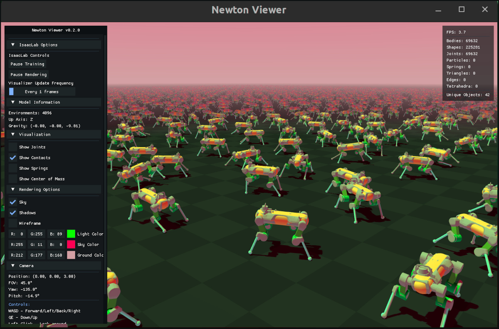

可视化
=======

.. currentmodule:: isaaclab

Isaac Lab 提供多个轻量级可视化器，用于实时仿真检查与调试。与处理传感器数据的渲染器不同，可视化器定位于快速、交互式的反馈。

无论你选择哪种物理引擎或渲染后端，都可以使用任意可视化器。

概述
----

Isaac Lab 支持三种可视化器后端，各自针对不同用例进行了优化：

.. list-table:: 可视化器对比
   :widths: 15 35 50
   :header-rows: 1

   * - 可视化器
     - 最适合
     - 关键特性
   * - **Omniverse**
     - 高保真、Isaac Sim 集成
     - USD、可视化标记、实时曲线图
   * - **Newton**
     - 快速迭代
     - 低开销、可视化标记
   * - **Rerun**
     - 远程查看、回放
     - 网页查看器、时间轴拖动、录像导出

*以下可视化器展示的是训练 Isaac-Velocity-Flat-Anymal-D-v0 环境的效果。*

.. figure:: ../../_static/visualizers/ov_viz.jpg
   :width: 100%
   :alt: Omniverse Visualizer

   Omniverse 可视化器

   Newton 可视化器

.. figure:: ../../_static/visualizers/rerun_viz.jpg
   :width: 100%
   :alt: Rerun Visualizer

   Rerun 可视化器

快速上手
--------

在命令行中使用 ``--visualizer`` 启动可视化器：

.. code-block:: bash

    # Launch all visualizers
    python scripts/reinforcement_learning/rsl_rl/train.py --task Isaac-Cartpole-v0 --visualizer omniverse newton rerun

    # Launch just newton visualizer
    python scripts/reinforcement_learning/rsl_rl/train.py --task Isaac-Cartpole-v0 --visualizer newton

如果指定了 ``--headless``，则不会启动任何可视化器。

.. note::

    为避免与 ``--visualizer`` 参数混淆，``--headless`` 参数在未来版本中可能被弃用。目前，``--headless`` 优先级更高，会禁用所有可视化器。

配置
~~~~

通过命令行启动可视化器将使用默认可视化器配置。默认配置可在 ``source/isaaclab/isaaclab/visualizers`` 中找到并编辑。

你也可以在代码中通过为 ``SimulationCfg`` 定义新的 ``VisualizerCfg`` 实例来配置自定义可视化器，例如：

.. code-block:: python

    from isaaclab.sim import SimulationCfg
    from isaaclab.visualizers import NewtonVisualizerCfg, OVVisualizerCfg, RerunVisualizerCfg

    sim_cfg = SimulationCfg(
        visualizer_cfgs=[
            OVVisualizerCfg(
                viewport_name="Visualizer Viewport",
                create_viewport=True,
                dock_position="SAME",
                window_width=1280,
                window_height=720,
                camera_position=(0.0, 0.0, 20.0), # high top down view
                camera_target=(0.0, 0.0, 0.0),
            ),
            NewtonVisualizerCfg(
                camera_position=(5.0, 5.0, 5.0), # closer quarter view
                camera_target=(0.0, 0.0, 0.0),
                show_joints=True,
            ),
            RerunVisualizerCfg(
                keep_historical_data=True,
                keep_scalar_history=True,
                record_to_rrd="my_training.rrd",
            ),
        ]
    )

可视化器后端
------------

Omniverse 可视化器
~~~~~~~~~~~~~~~~~~

**主要特性：**

- 原生 USD Stage 集成
- 用于调试的可视化标记（箭头、坐标系、点等）
- 用于监控训练指标的实时曲线图
- 完整的 Isaac Sim 渲染能力与工具链

**核心配置：**

.. code-block:: python

    from isaaclab.visualizers import OVVisualizerCfg

    visualizer_cfg = OVVisualizerCfg(
        # Viewport settings
        viewport_name="Visualizer Viewport",      # Viewport window name
        create_viewport=True,                     # Create new viewport vs. use existing
        dock_position="SAME",                     # Docking: 'LEFT', 'RIGHT', 'BOTTOM', 'SAME'
        window_width=1280,                        # Viewport width in pixels
        window_height=720,                        # Viewport height in pixels

        # Camera settings
        camera_position=(8.0, 8.0, 3.0),         # Initial camera position (x, y, z)
        camera_target=(0.0, 0.0, 0.0),           # Camera look-at target

        # Feature toggles
        enable_markers=True,                      # Enable visualization markers
        enable_live_plots=True,                   # Enable live plots (auto-expands frames)
    )

Newton 可视化器
~~~~~~~~~~~~~~~

**主要特性：**

- 轻量级 OpenGL 渲染，开销低
- 可视化标记（关节、接触、弹簧、质心）
- 训练与渲染暂停控制
- 可调节更新频率，便于性能调优
- 部分可自定义的渲染选项（阴影、天空、线框）

**交互控制：**

.. list-table::
   :widths: 30 70
   :header-rows: 1

   * - 按键/输入
     - 动作
   * - **W、A、S、D** 或 **方向键**
     - 前进 / 左移 / 后退 / 右移
   * - **Q、E**
     - 下降 / 上升
   * - **左键拖拽**
     - 环视
   * - **鼠标滚轮**
     - 缩放
   * - **空格**
     - 暂停/恢复渲染（物理继续运行）
   * - **H**
     - 切换 UI 侧边栏
   * - **ESC**
     - 退出查看器

**核心配置：**

.. code-block:: python

    from isaaclab.visualizers import NewtonVisualizerCfg

    visualizer_cfg = NewtonVisualizerCfg(
        # Window settings
        window_width=1920,                        # Window width in pixels
        window_height=1080,                       # Window height in pixels

        # Camera settings
        camera_position=(8.0, 8.0, 3.0),         # Initial camera position (x, y, z)
        camera_target=(0.0, 0.0, 0.0),           # Camera look-at target

        # Performance tuning
        update_frequency=1,                       # Update every N frames (1=every frame)

        # Physics debug visualization
        show_joints=False,                        # Show joint visualizations
        show_contacts=False,                      # Show contact points and normals
        show_springs=False,                       # Show spring constraints
        show_com=False,                           # Show center of mass markers

        # Rendering options
        enable_shadows=True,                      # Enable shadow rendering
        enable_sky=True,                          # Enable sky rendering
        enable_wireframe=False,                   # Enable wireframe mode

        # Color customization
        background_color=(0.53, 0.81, 0.92),     # Sky/background color (RGB [0,1])
        ground_color=(0.18, 0.20, 0.25),         # Ground plane color (RGB [0,1])
        light_color=(1.0, 1.0, 1.0),             # Directional light color (RGB [0,1])
    )

Rerun 可视化器
~~~~~~~~~~~~~~

**主要特性：**

- 可从本地或远程浏览器访问的网页查看器界面
- 元数据记录与过滤
- 录制为 .rrd 文件以便离线回放（.rrd 文件可在网页查看器中按 ctrl+O 打开）
- 对录像进行时间轴拖动与播放控制

**核心配置：**

.. code-block:: python

    from isaaclab.visualizers import RerunVisualizerCfg

    visualizer_cfg = RerunVisualizerCfg(
        # Server settings
        app_id="isaaclab-simulation",             # Application identifier for viewer
        web_port=9090,                            # Port for local web viewer (launched in browser)

        # Camera settings
        camera_position=(8.0, 8.0, 3.0),         # Initial camera position (x, y, z)
        camera_target=(0.0, 0.0, 0.0),           # Camera look-at target

        # History settings
        keep_historical_data=False,               # Keep transforms for time scrubbing
        keep_scalar_history=False,                # Keep scalar/plot history

        # Recording
        record_to_rrd="recording.rrd",            # Path to save .rrd file (None = no recording)
    )

性能说明
--------

在可视化大规模环境时，为降低开销，可以考虑：

- 使用 Newton 而非 Omniverse 或 Rerun
- 减小窗口尺寸
- 提高 ``update_frequency`` 设置
- 不使用可视化器时将其暂停

限制
----

**Rerun 可视化器性能**

基于网页的 Rerun 可视化器在可视化大规模环境时可能出现性能问题或崩溃。对于大规模仿真，建议使用 Newton 可视化器。或者，为降低负载，可以通过 ``--num_envs`` 覆盖并减少环境数量：

.. code-block:: bash

    python scripts/reinforcement_learning/rsl_rl/train.py --task Isaac-Cartpole-v0 --visualizer rerun --num_envs 512

.. note::

    未来的特性将支持只可视化一部分环境，在后台保持全量训练的同时提升可视化性能并降低资源占用。

**Rerun 可视化器 FPS 控制**

在某些配置下，Rerun 可视化器 UI 中的 FPS 控制可能不会影响可视化帧率。

**Newton 可视化器的接触与质心标记**

Newton 可视化器尚不支持接触与质心标记，这将在未来版本中解决。

**Newton 可视化器 CUDA/OpenGL 互操作警告**

在某些系统配置上，Newton 可视化器可能显示有关 CUDA/OpenGL 互操作的警告：

.. code-block:: text

    Warning: Could not get MSAA config, falling back to non-AA.
    Warp CUDA error 999: unknown error (in function wp_cuda_graphics_register_gl_buffer)
    Warp UserWarning: Could not register GL buffer since CUDA/OpenGL interoperability
    is not available. Falling back to copy operations between the Warp array and the
    OpenGL buffer.

可视化器仍能正常工作，但由于回退到 CPU 拷贝操作而非直接 GPU 内存共享，性能可能下降。
