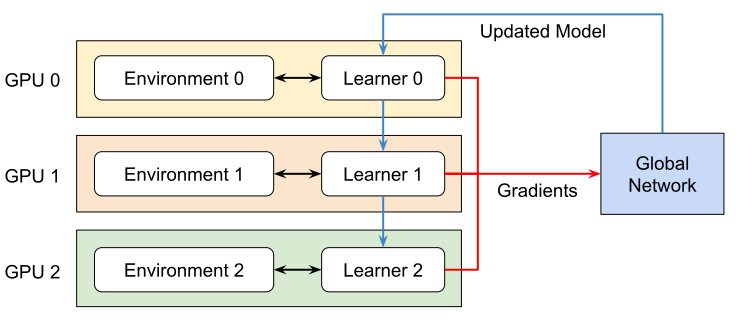
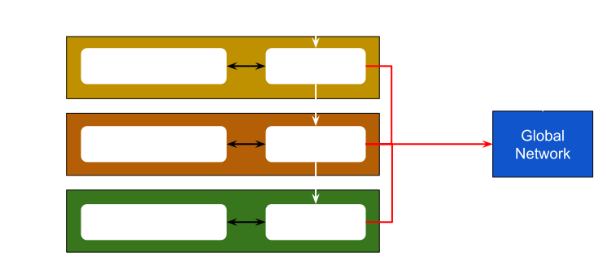

多 GPU 与多节点训练
=================================

.. currentmodule:: isaaclab

Isaac Lab 支持多 GPU 和多节点强化学习。目前，该功能仅适用于 RL-Games、RSL-RL 和 skrl 库的工作流。我们正在努力将该功能扩展到其他工作流。

.. attention::

    多 GPU 和多节点训练仅支持 Linux。目前不支持 Windows。这是由于 Windows 上 NCCL 库的限制。

多 GPU 训练
------------------

Isaac Lab 支持以下多 GPU 训练框架：

* 基于 `PyTorch distributed <https://pytorch.org/docs/stable/distributed.html>`_ 的 `Torchrun <https://docs.pytorch.org/docs/stable/elastic/run.html>`_
* `JAX distributed <https://jax.readthedocs.io/en/latest/jax.distributed.html>`_

PyTorch Torchrun 实现
^^^^^^^^^^^^^^^^^^^^^^^^^^^^^^^

我们使用 `Pytorch Torchrun <https://docs.pytorch.org/docs/stable/elastic/run.html>`_ 来管理多 GPU 训练。Torchrun 通过以下方式管理分布式训练：

* **进程管理** ：为每个 GPU 启动一个进程，每个进程被分配到特定的 GPU。
* **脚本执行** ：在每个进程上运行相同的训练脚本（例如 RL Games 训练器）。
* **环境实例** ：每个进程创建自己的 Isaac Lab 环境实例。
* **梯度同步** ：聚合所有进程的梯度，并在每个训练步骤后将同步后的梯度广播回每个进程。

.. tip::
    观看这个 `来自 PyTorch 的 3 分钟 YouTube 视频 <https://www.youtube.com/watch?v=Cvdhwx-OBBo&list=PL_lsbAsL_o2CSuhUhJIiW0IkdT5C2wGWj&index=2>`_ ，了解 Torchrun 的工作原理。

此设置中的关键组件包括：

* **Torchrun** ：负责进程生成、通信和梯度同步。
* **RL 库** ：运行实际训练算法的强化学习库。
* **Isaac Lab** ：提供仿真环境，每个进程独立地对其进行实例化。

在底层，Torchrun 使用 `DistributedDataParallel <https://docs.pytorch.org/docs/2.7/notes/ddp.html#internal-design>`_ 模块来管理分布式训练。使用 Torchrun 在多个 GPU 上训练时，会发生以下情况：

* 每个 GPU 运行一个独立的进程
* 每个进程执行完整的训练脚本
* 每个进程维护自己的：

  * Isaac Lab 环境实例（包含 *n* 个并行环境）
  * 策略网络副本
  * 用于收集 rollout 的经验缓冲区

* 所有进程仅在梯度更新时进行同步

要深入了解 Torchrun 的工作原理，请参阅
`PyTorch Docs: DistributedDataParallel - Internal Design <https://pytorch.org/docs/stable/notes/ddp.html#internal-design>`_ 。

JAX 实现
^^^^^^^^^^^^^^^^^^

.. tip::
    JAX 仅支持 skrl 库。

对于 JAX，我们使用 `skrl.utils.distributed.jax <https://skrl.readthedocs.io/en/latest/api/utils/distributed.html>`_ 。由于该机器学习框架不会在单次程序调用时自动启动多个进程，skrl 库提供了一个模块来启动它们。

|

运行多 GPU 训练
^^^^^^^^^^^^^^^^^^^^^^^^^^

要使用多个 GPU 进行训练，请使用以下命令，其中 ``--nproc_per_node`` 表示可用 GPU 的数量：

.. tab-set::
    :sync-group: rl-train

    .. tab-item:: rl_games
        :sync: rl_games

        .. code-block:: shell

            python -m torch.distributed.run --nnodes=1 --nproc_per_node=2 scripts/reinforcement_learning/rl_games/train.py --task=Isaac-Cartpole-v0 --headless --distributed

    .. tab-item:: rsl_rl
        :sync: rsl_rl

        .. code-block:: shell

            python -m torch.distributed.run --nnodes=1 --nproc_per_node=2 scripts/reinforcement_learning/rsl_rl/train.py --task=Isaac-Cartpole-v0 --headless --distributed

    .. tab-item:: skrl
        :sync: skrl

        .. tab-set::

            .. tab-item:: PyTorch
                :sync: torch

                .. code-block:: shell

                    python -m torch.distributed.run --nnodes=1 --nproc_per_node=2 scripts/reinforcement_learning/skrl/train.py --task=Isaac-Cartpole-v0 --headless --distributed

            .. tab-item:: JAX
                :sync: jax

                .. code-block:: shell

                    python -m skrl.utils.distributed.jax --nnodes=1 --nproc_per_node=2 scripts/reinforcement_learning/skrl/train.py --task=Isaac-Cartpole-v0 --headless --distributed --ml_framework jax

多节点训练
-------------------

要将训练从单机多 GPU 进一步扩展，还可以跨多个节点进行训练。要跨多个节点/机器进行训练，需要在每个节点上启动一个单独的进程。

对于主节点，请使用以下命令，其中 ``--nproc_per_node`` 表示可用 GPU 的数量， ``--nnodes`` 表示节点数量：

.. tab-set::
    :sync-group: rl-train

    .. tab-item:: rl_games
        :sync: rl_games

        .. code-block:: shell

            python -m torch.distributed.run --nproc_per_node=2 --nnodes=2 --node_rank=0 --master_addr=<ip_of_master> --master_port=5555 scripts/reinforcement_learning/rl_games/train.py --task=Isaac-Cartpole-v0 --headless --distributed

    .. tab-item:: rsl_rl
        :sync: rsl_rl

        .. code-block:: shell

            python -m torch.distributed.run --nproc_per_node=2 --nnodes=2 --node_rank=0 --master_addr=<ip_of_master> --master_port=5555 scripts/reinforcement_learning/rsl_rl/train.py --task=Isaac-Cartpole-v0 --headless --distributed

    .. tab-item:: skrl
        :sync: skrl

        .. tab-set::

            .. tab-item:: PyTorch
                :sync: torch

                .. code-block:: shell

                    python -m torch.distributed.run --nproc_per_node=2 --nnodes=2 --node_rank=0 --master_addr=<ip_of_master> --master_port=5555 scripts/reinforcement_learning/skrl/train.py --task=Isaac-Cartpole-v0 --headless --distributed

            .. tab-item:: JAX
                :sync: jax

                .. code-block:: shell

                    python -m skrl.utils.distributed.jax --nproc_per_node=2 --nnodes=2 --node_rank=0 --coordinator_address=ip_of_master_machine:5555 scripts/reinforcement_learning/skrl/train.py --task=Isaac-Cartpole-v0 --headless --distributed --ml_framework jax

请注意，端口（ ``5555`` ）可以替换为任何其他可用端口。

对于非主节点，请使用以下命令，并将 ``--node_rank`` 替换为每台机器的索引：

.. tab-set::
    :sync-group: rl-train

    .. tab-item:: rl_games
        :sync: rl_games

        .. code-block:: shell

            python -m torch.distributed.run --nproc_per_node=2 --nnodes=2 --node_rank=1 --master_addr=<ip_of_master> --master_port=5555 scripts/reinforcement_learning/rl_games/train.py --task=Isaac-Cartpole-v0 --headless --distributed

    .. tab-item:: rsl_rl
        :sync: rsl_rl

        .. code-block:: shell

            python -m torch.distributed.run --nproc_per_node=2 --nnodes=2 --node_rank=1 --master_addr=<ip_of_master> --master_port=5555 scripts/reinforcement_learning/rsl_rl/train.py --task=Isaac-Cartpole-v0 --headless --distributed

    .. tab-item:: skrl
        :sync: skrl

        .. tab-set::

            .. tab-item:: PyTorch
                :sync: torch

                .. code-block:: shell

                    python -m torch.distributed.run --nproc_per_node=2 --nnodes=2 --node_rank=1 --master_addr=<ip_of_master> --master_port=5555 scripts/reinforcement_learning/skrl/train.py --task=Isaac-Cartpole-v0 --headless --distributed

            .. tab-item:: JAX
                :sync: jax

                .. code-block:: shell

                    python -m skrl.utils.distributed.jax --nproc_per_node=2 --nnodes=2 --node_rank=1 --coordinator_address=ip_of_master_machine:5555 scripts/reinforcement_learning/skrl/train.py --task=Isaac-Cartpole-v0 --headless --distributed --ml_framework jax

有关使用 PyTorch 进行多节点训练的更多详细信息，请访问
`PyTorch 文档 <https://pytorch.org/tutorials/intermediate/ddp_series_multinode.html>`_ 。
有关使用 JAX 进行多节点训练的更多详细信息，请访问
`skrl 文档 <https://skrl.readthedocs.io/en/latest/api/utils/distributed.html>`_ 和
`JAX 文档 <https://jax.readthedocs.io/en/latest/multi_process.html>`_ 。

.. note::

    正如 PyTorch 文档中提到的，“多节点训练受限于节点间通信延迟”。当该延迟较高时，多节点训练的性能可能不如在单节点实例上运行。
