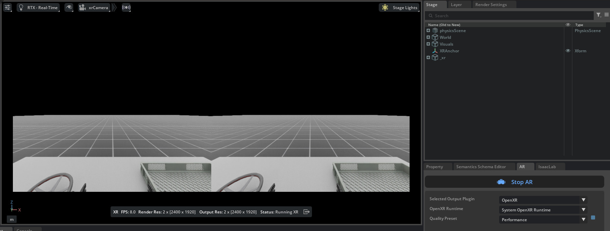
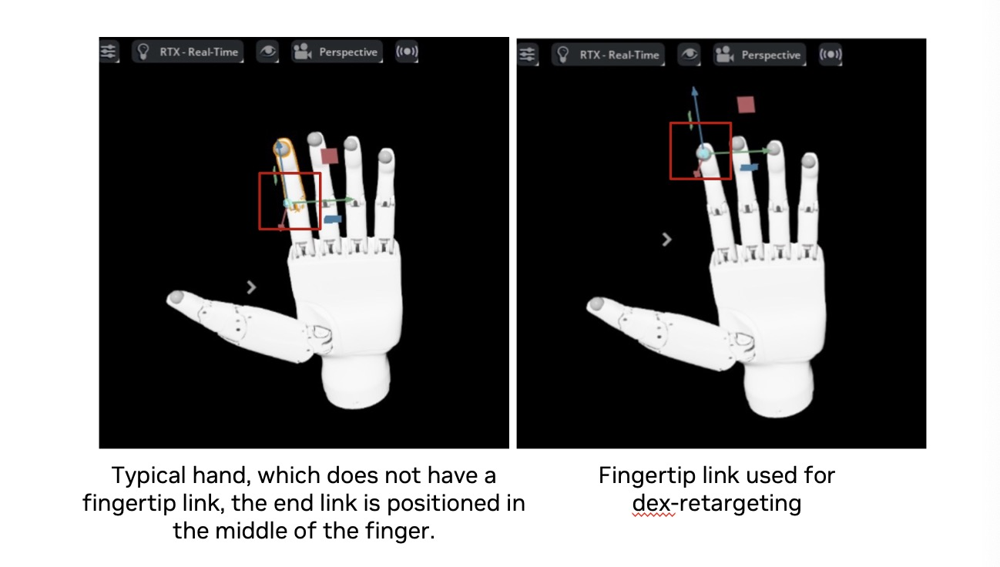

.. _cloudxr-teleoperation:

设置 CloudXR 遥操作
================================

.. currentmodule:: isaaclab

`NVIDIA CloudXR`_ 能够通过任意网络向扩展现实（XR）设备提供无缝、高保真的沉浸式串流。

Isaac Lab 开发者可以将 CloudXR 与 Isaac Lab 结合使用，构建需要沉浸式 XR 渲染以提升空间感知精度，
和/或需要手部追踪来遥操作灵巧机器人的遥操作工作流。

在这些工作流中，Isaac Lab 渲染并向 CloudXR 提交机器人仿真的立体视图，CloudXR 随后通过低延迟、
GPU 加速的流水线对渲染视图进行编码并实时串流到兼容的 XR 设备。手部追踪数据等控制输入则通过
CloudXR 从 XR 设备传回 Isaac Lab，用于控制机器人。

本指南介绍如何在 Isaac Lab 中使用 CloudXR 和 `Apple Vision Pro`_ 进行沉浸式串流与遥操作。

.. note::

   有关支持的手部追踪外设的更多信息，请参见 :ref:`manus-vive-handtracking`。

.. note::

   **Meta Quest 3 与 Pico 4 Ultra 支持（抢先体验）**

   现已通过 `CloudXR Early Access program`_ 支持 Meta Quest 3 和 Pico 4 Ultra。
   在申请时说明您的 Isaac 使用场景即可加入该计划。获批后，您会收到设置 NGC 的邮件，
   然后下载 `CloudXR.js with Isaac Teleop samples`_ 并按照其指南操作。
   Pico 4 Ultra 必须使用 HTTPS 模式（详情参见 NGC 文档）。正式版本将在未来的 Isaac Lab
   版本中提供。

.. _`CloudXR Early Access program`: https://developer.nvidia.com/cloudxr-sdk-early-access-program/join
.. _`CloudXR.js with Isaac Teleop samples`: https://catalog.ngc.nvidia.com/orgs/nvidia/resources/cloudxr-js-early-access?version=6.0.0-beta

概述
--------

将 CloudXR 与 Isaac Lab 结合使用涉及以下组件：

* **Isaac Lab** 用于仿真机器人环境，并应用从遥操作端接收到的控制数据。

* **NVIDIA CloudXR Runtime** 运行在 Isaac Lab 工作站上的 Docker 容器中，将 Isaac Lab 的
  虚拟仿真串流到兼容的 XR 设备。

* **Isaac XR Teleop Sample Client** 是一个适用于 Apple Vision Pro 的示例应用，可基于
  CloudXR 实现对 Isaac Lab 仿真的沉浸式串流与遥操作。

本指南将带您了解如何：

* :ref:`run-isaac-lab-with-the-cloudxr-runtime`

* :ref:`use-apple-vision-pro`，包括如何 :ref:`build-apple-vision-pro`、
  :ref:`teleoperate-apple-vision-pro` 以及 :ref:`manus-vive-handtracking`。

* :ref:`develop-xr-isaac-lab`，包括如何 :ref:`run-isaac-lab-with-xr`、
  :ref:`configure-scene-placement` 以及 :ref:`optimize-xr-performance`。

* :ref:`control-robot-with-xr`，包括 :ref:`openxr-device-architecture`、
  :ref:`control-robot-with-xr-retargeters`，以及如何实现 :ref:`control-robot-with-xr-callbacks`。

此外还包括 :ref:`xr-known-issues`。

系统要求
-------------------

在将 CloudXR 与 Isaac Lab 结合使用之前，请先查看以下系统要求：

  * Isaac Lab 工作站

    * Ubuntu 22.04 或 Ubuntu 24.04
    * 在 120Hz 物理仿真下维持 45 FPS 所需的硬件要求：
       * CPU：16 核 AMD Ryzen Threadripper Pro 5955WX 或更高
       * 内存：64GB RAM
       * GPU：1 块 RTX PRO 6000 GPU（或同等性能，例如 1 块 RTX 5090）或更高
    * 有关驱动要求的详细信息，请参见 `Technical Requirements <https://docs.omniverse.nvidia.com/materials-and-rendering/latest/common/technical-requirements.html>`_ 指南
    * `Docker`_ 26.0.0+、`Docker Compose`_ 2.25.0+ 以及 `NVIDIA Container Toolkit`_。安装方法请参见
      Isaac Lab 的 :ref:`deployment-docker`。

  * Apple Vision Pro

    * visionOS 26
    * Apple M3 Pro 芯片，11 核 CPU，至少 5 个性能核与 6 个能效核
    * 16GB 统一内存
    * 256 GB SSD

  * 基于 Apple Silicon 的 Mac（用于配合 Xcode 构建 Apple Vision Pro 的 Isaac XR Teleop
    Sample Client 应用）

    * macOS Sequoia 15.6 或更高版本
    * Xcode 26.0

  * 支持 Wifi 6 的路由器

    * 强大的无线连接对于高质量的串流体验至关重要。更多细节请参见
      `Omniverse Spatial Streaming`_ 的要求。
    * 我们建议使用专用路由器，因为多设备并发使用会降低质量
    * Apple Vision Pro 与 Isaac Lab 工作站之间必须能够通过 IP 互相访问（注意：许多机构的
      无线网络会阻止设备之间互相访问，导致 Apple Vision Pro 无法在网络中找到 Isaac Lab
      工作站）

.. note::
   如果您使用的是 DGX Spark，请查看 `DGX Spark Limitations <https://isaac-sim.github.io/IsaacLab/v2.3.2/source/setup/installation/index.html#dgx-spark-details-and-limitations>`_ 了解兼容性。

.. _`Omniverse Spatial Streaming`: https://docs.omniverse.nvidia.com/avp/latest/setup-network.html

.. _run-isaac-lab-with-the-cloudxr-runtime:

使用 CloudXR Runtime 运行 Isaac Lab
--------------------------------------

CloudXR Runtime 运行在您 Isaac Lab 工作站上的 Docker 容器中，负责将 Isaac Lab 仿真串流到
兼容的 XR 设备。

请按照 Isaac Lab :ref:`deployment-docker` 中的说明，确保您的 Isaac Lab 工作站上已安装
`Docker`_、`Docker Compose`_ 和 `NVIDIA Container Toolkit`_。

同时，请确保防火墙允许连接 CloudXR 使用的端口，可运行：

.. code:: bash

   sudo ufw allow 47998:48000,48005,48008,48012/udp
   sudo ufw allow 48010/tcp

运行 CloudXR Runtime Docker 容器有两种方式：

.. dropdown:: 方式一（推荐）：使用 Docker Compose 将 Isaac Lab 与 CloudXR Runtime 容器一起运行
   :open:

   在您的 Isaac Lab 工作站上：

   #. 在 Isaac Lab 仓库根目录下，使用 Isaac Lab 的 ``container.py`` 脚本启动 Isaac Lab 和
      CloudXR Runtime 容器

      .. code:: bash

         ./docker/container.py start \
             --files docker-compose.cloudxr-runtime.patch.yaml \
             --env-file .env.cloudxr-runtime

      如果出现提示，请选择启用 X11 转发，这是查看 Isaac Sim UI 所必需的。

      .. note::

         ``container.py`` 脚本是 Docker Compose 的一个轻量封装。额外的 ``--files`` 和
         ``--env-file`` 参数会在基础 Docker Compose 配置之上进行扩展，以额外运行 CloudXR
         Runtime。

         有关 ``container.py`` 以及使用 Docker Compose 运行 Isaac Lab 的更多细节，请参见
         :ref:`deployment-docker`。

   #. 使用以下命令进入 Isaac Lab base 容器：

      .. code:: bash

         ./docker/container.py enter base

      在 Isaac Lab base 容器内，您可以运行使用 XR 的 Isaac Lab 脚本。

   #. 使用以下命令运行一个示例遥操作任务：

      .. code:: bash

         ./isaaclab.sh -p scripts/environments/teleoperation/teleop_se3_agent.py \
             --task Isaac-PickPlace-GR1T2-Abs-v0 \
             --teleop_device handtracking \
             --enable_pinocchio

   #. 在后续步骤中您需要保持容器运行。完成之后，可以使用以下命令停止容器：

      .. code:: bash

         ./docker/container.py stop \
             --files docker-compose.cloudxr-runtime.patch.yaml \
             --env-file .env.cloudxr-runtime

      .. tip::

         如果在重启时遇到问题，可以运行以下命令清理孤立的容器：

         .. code:: bash

            docker system prune -f

.. dropdown:: 方式二：Isaac Lab 作为本地进程运行，CloudXR Runtime 容器通过 Docker 运行

   Isaac Lab 可以作为本地进程运行，并连接到 CloudXR Runtime Docker 容器。但是，这种方式需要
   手动指定一个共享目录，用于 Isaac Lab 实例与 CloudXR Runtime 之间的通信。

   在您的 Isaac Lab 工作站上：

   #. 在 Isaac Lab 仓库根目录下，创建一个用于临时缓存文件的本地文件夹：

      .. code:: bash

         mkdir -p $(pwd)/openxr

   #. 启动 CloudXR Runtime，并将上面创建的目录挂载到容器内的 ``/openxr`` 目录：

      .. code:: bash

         docker run -it --rm --name cloudxr-runtime \
             --user $(id -u):$(id -g) \
             --gpus=all \
             -e "ACCEPT_EULA=Y" \
             --mount type=bind,src=$(pwd)/openxr,dst=/openxr \
             -p 48010:48010 \
             -p 47998:47998/udp \
             -p 47999:47999/udp \
             -p 48000:48000/udp \
             -p 48005:48005/udp \
             -p 48008:48008/udp \
             -p 48012:48012/udp \
             nvcr.io/nvidia/cloudxr-runtime:5.0.1

      .. note::
         如果您选择指定某个 GPU 而不是 ``all``，需要确保 Isaac Lab 也在该 GPU 上运行。

      .. tip::

         如果在运行 cloudxr-runtime 容器时遇到问题，可以运行以下命令清理孤立的容器：

         .. code:: bash

            docker stop cloudxr-runtime
            docker rm cloudxr-runtime

   #. 在您打算运行 Isaac Lab 的新终端中，导出以下环境变量，它们引用了上面创建的目录：

      .. code:: bash

         export XDG_RUNTIME_DIR=$(pwd)/openxr/run
         export XR_RUNTIME_JSON=$(pwd)/openxr/share/openxr/1/openxr_cloudxr.json

      现在您就可以运行使用 XR 的 Isaac Lab 脚本了。

   #. 使用以下命令运行一个示例遥操作任务：

      .. code:: bash

         ./isaaclab.sh -p scripts/environments/teleoperation/teleop_se3_agent.py \
             --task Isaac-PickPlace-GR1T2-Abs-v0 \
             --teleop_device handtracking \
             --enable_pinocchio

在 Isaac Lab 与 CloudXR Runtime 运行起来之后：

#. 在 Isaac Sim UI 中：找到名为 **AR** 的面板并选择以下选项：

   * Selected Output Plugin: **OpenXR**

   * OpenXR Runtime: **System OpenXR Runtime**

   .. figure:: ../_static/setup/cloudxr_ar_panel.jpg
      :align: center
      :figwidth: 50%
      :alt: Isaac Sim UI: AR Panel

   .. note::
      Isaac Sim 允许您从多个 OpenXR runtime 选项中进行选择：

      * **System OpenXR Runtime**：使用安装在 Isaac Lab 之外的 runtime，例如本教程中通过
        Docker 设置的 CloudXR Runtime。

      * **CloudXR Runtime (5.0)**：使用内置的 CloudXR Runtime。

      * **Custom**：允许您指定并运行任意自定义的 OpenXR Runtime。

#. 点击 **Start AR**。

Viewport 应该会显示正在渲染的两只眼睛的画面，并且您应该会看到 "AR profile is active" 的状态。

现在 Isaac Lab 已准备好接收来自 CloudXR 客户端的连接。接下来的章节将引导您构建并连接一个
CloudXR 客户端。

.. admonition:: Learn More about Teleoperation and Imitation Learning in Isaac Lab

   要进一步了解 Isaac Lab 的遥操作脚本，以及如何在 Isaac Lab 中构建新的遥操作与模仿学习工作流，
   请参见 :ref:`teleoperation-imitation-learning`。

.. _use-apple-vision-pro:

使用 Apple Vision Pro 进行遥操作
--------------------------------------

本节将引导您为 Apple Vision Pro 构建并安装 Isaac XR Teleop Sample Client，连接 Isaac Lab，
并遥操作一个仿真机器人。

.. _build-apple-vision-pro:

为 Apple Vision Pro 构建并安装 Isaac XR Teleop Sample Client 应用
~~~~~~~~~~~~~~~~~~~~~~~~~~~~~~~~~~~~~~~~~~~~~~~~~~~~~~~~~~~~~~~~~~~~~~~~~~~~

在您的 Mac 上：

#. 克隆 `Isaac XR Teleop Sample Client`_ GitHub 仓库：

   .. code-block:: bash

      git clone git@github.com:isaac-sim/isaac-xr-teleop-sample-client-apple.git

#. 检出与您的 Isaac Lab 版本匹配的应用版本：

   +-------------------+---------------------+
   | Isaac Lab Version | Client App Version  |
   +-------------------+---------------------+
   | 2.3               | v2.3.0              |
   +-------------------+---------------------+
   | 2.2               | v2.2.0              |
   +-------------------+---------------------+
   | 2.1               | v1.0.0              |
   +-------------------+---------------------+

   .. code-block:: bash

      git checkout <client_app_version>

#. 按照仓库中的 README 在您的 Apple Vision Pro 上构建并安装该应用。

.. _teleoperate-apple-vision-pro:

使用 Apple Vision Pro 遥操作 Isaac Lab 机器人
~~~~~~~~~~~~~~~~~~~~~~~~~~~~~~~~~~~~~~~~~~~~~~~~~~~~

在 Apple Vision Pro 上安装好 Isaac XR Teleop Sample Client 后，就可以连接 Isaac Lab 了。

.. tip::

   **在戴上头显之前**，您可以先在 Mac 上验证连通性：

   .. code:: bash

      # Test signaling port (replace <isaac-lab-ip> with your workstation IP)
      nc -vz <isaac-lab-ip> 48010

   预期输出：``Connection to <ip> port 48010 [tcp/*] succeeded!``

   如果连接失败，请检查 runtime 容器是否正在运行（``docker ps``），以及是否有残留的 runtime
   容器占用了端口。

在您的 Isaac Lab 工作站上：

#. 按照 :ref:`run-isaac-lab-with-the-cloudxr-runtime` 中的说明，确保 Isaac Lab 和 CloudXR 都
   正在运行，包括使用支持遥操作的脚本启动 Isaac Lab。例如：

   .. code-block:: bash

      ./isaaclab.sh -p scripts/environments/teleoperation/teleop_se3_agent.py \
          --task Isaac-PickPlace-GR1T2-Abs-v0 \
          --teleop_device handtracking \
          --enable_pinocchio

   .. note::
      请注意，上述脚本应当运行在 Isaac Lab Docker 容器内（方式一，推荐），或者在配置了环境变量、
      指向与正在运行的 CloudXR Runtime Docker 容器共享的目录（方式二）的情况下运行。

#. 找到名为 **AR** 的面板。

#. 点击 **Start AR**，并确保 Viewport 显示正在渲染的两只眼睛的画面。

回到您的 Apple Vision Pro：

#. 打开 Isaac XR Teleop Sample Client。您应该会看到一个 UI 窗口：

   .. figure:: ../_static/setup/cloudxr_avp_connect_ui.jpg
      :align: center
      :figwidth: 50%
      :alt: Isaac Sim UI: AR Panel

#. 输入您的 Isaac Lab 工作站的 IP 地址。

   .. note::
      Apple Vision Pro 与 Isaac Lab 机器之间必须能够通过 IP 互相访问。

      我们建议在此过程中使用专用的 Wifi 6 路由器，因为许多机构的无线网络会阻止设备之间互相访问，
      导致 Apple Vision Pro 无法在网络中找到 Isaac Lab 工作站。

#. 点击 **Connect**。

   第一次尝试连接时，您可能需要允许该应用访问手部追踪和本地网络使用等权限，然后再次连接。

#. 片刻之后，您应该会在 Apple Vision Pro 中看到渲染出来的 Isaac Lab 仿真，以及一组用于遥操作的
   控件。

   .. figure:: ../_static/setup/cloudxr_avp_teleop_ui.jpg
      :align: center
      :figwidth: 50%
      :alt: Isaac Sim UI: AR Panel

#. 点击 **Play** 开始遥操作仿真机器人。此时机器人的运动应当由您的手部动作来控制。

   您可以使用 UI 控件反复对遥操作会话执行 **Play**、**Stop** 和 **Reset**。

   .. tip::
      对于需要双手操作的遥操作任务，可以使用 visionOS 的辅助功能来在不使用手势的情况下控制遥操作。
      例如，要启用对 UI 的语音控制：

      #. 在 **Settings** > **Accessibility** > **Voice Control** 中，打开 **Voice Control**

      #. 在 **Settings** > **Accessibility** > **Voice Control** > **Commands** > **Basic
         Navigation** 中，打开 **<item name>**

      #. 现在您可以在应用连接后说 "Play"、"Stop" 和 "Reset" 来控制遥操作。

#. 通过移动双手来遥操作仿真机器人。

   .. figure:: https://download.isaacsim.omniverse.nvidia.com/isaaclab/images/cloudxr_bimanual_teleop.gif
      :align: center
      :alt: Isaac Lab teleoperation of a bimanual dexterous robot with CloudXR

   .. note::

      红点表示手部关节的追踪位置。红点运动与机器人运动之间的延迟或偏差可能是由机器人关节限制
      和/或机器人控制器导致的。

   .. note::
      当逆运动学求解器无法找到有效解时，XR 设备屏幕上会出现错误提示。要从该状态恢复，
      请点击 **Reset** 按钮使机器人回到初始姿态，然后继续遥操作。

      .. figure:: ../_static/setup/cloudxr_avp_ik_error.jpg
         :align: center
         :figwidth: 80%
         :alt: IK Error Message Display in XR Device

#. 完成示例后，点击 **Disconnect** 断开与 Isaac Lab 的连接。

.. admonition:: Learn More about Teleoperation and Imitation Learning in Isaac Lab

   请参见 :ref:`teleoperation-imitation-learning`，了解如何在 Isaac Lab 中录制遥操作演示数据，
   以及构建遥操作与模仿学习工作流。

.. _manus-vive-handtracking:

Manus + Vive 手部追踪
~~~~~~~~~~~~~~~~~~~~~~~~~~

当头显的光学手部追踪被遮挡时，Manus 手套和 HTC Vive 追踪器可以提供手部追踪。此方案要求 Manus
手套带有 Manus SDK 许可证，并且手套上绑定了 Vive 追踪器。需要 Isaac Sim 5.1 或更高版本。

使用 Manus + Vive 追踪运行遥操作示例：

.. dropdown:: 安装说明
   :open:

   Vive 追踪器的集成通过 libsurvive 库提供。

   要进行安装，请克隆仓库、构建 Python 包并安装所需的 udev 规则。在您的 Isaac Lab 虚拟环境中，
   运行以下命令：

   .. code-block:: bash

      git clone https://github.com/collabora/libsurvive.git
      cd libsurvive
      pip install scikit-build
      python setup.py install

      sudo cp ./useful_files/81-vive.rules /etc/udev/rules.d/
      sudo udevadm control --reload-rules && sudo udevadm trigger

   Manus 的集成通过 Isaac Sim 遥操作输入插件框架提供。按照
   `isaac-teleop-device-plugins <https://github.com/isaac-sim/isaac-teleop-device-plugins>`_
   中的构建与安装步骤安装该插件。

在您即将启动 Isaac Lab 的同一终端中，设置：

.. code-block:: bash

      export ISAACSIM_HANDTRACKER_LIB=<path to isaac-teleop-device-plugins>/build-manus-default/lib/libIsaacSimManusHandTracking.so

插件安装完成后，运行遥操作示例：

.. code-block:: bash

   ./isaaclab.sh -p scripts/environments/teleoperation/teleop_se3_agent.py \
       --task Isaac-PickPlace-GR1T2-Abs-v0 \
       --teleop_device manusvive \
       --xr \
       --enable_pinocchio

推荐的工作流程是：先启动 Isaac Lab，点击 **Start AR**，然后戴上 Manus 手套、Vive 追踪器和
头显。准备好开始会话后，使用语音命令启动 Isaac XR teleop sample client 并连接到 Isaac Lab。

Isaac Lab 会在会话的初始帧期间，使用来自 Apple Vision Pro 的手腕姿态数据自动校准 Vive 追踪器。
如果校准失败（例如红点无法准确跟随遥操作者的手），请重启 Isaac Lab，并以手掌朝上的姿势开始，
以提高校准的可靠性。

为获得最佳性能，请将 lighthouse 放置在双手上方，并稍微向下倾斜。确保 lighthouse 保持稳定；
建议使用支架以防止晃动。

在遥操作任务进行期间，请确保双手始终保持稳定，并且始终对 lighthouse 可见。
参见：`Installing the Base Stations <https://www.vive.com/us/support/vive/category_howto/installing-the-base-stations.html>`_
和 `Tips for Setting Up the Base Stations <https://www.vive.com/us/support/vive/category_howto/tips-for-setting-up-the-base-stations.html>`_

.. note::

   首次启动 Manus Vive 设备时，Vive lighthouse 可能需要几秒钟进行校准。在此期间请保持 Vive
   追踪器稳定并对 lighthouse 可见。如果 lighthouse 被移动，或者追踪失败或不稳定，可以通过删除
   以下校准文件来强制重新校准：``$XDG_RUNTIME_DIR/libsurvive/config.json`` 。如果
   XDG_RUNTIME_DIR 未设置，默认目录为 ``~/.config/libsurvive``。

   更多信息请查阅 libsurvive 文档：`libsurvive <https://github.com/collabora/libsurvive>`_。

为获得最佳性能，请将 lighthouse 放置在双手上方，并稍微向下倾斜。
只要双手都可见，一个 lighthouse 就足够了。
确保 lighthouse 保持稳定；建议使用支架以防止晃动。

.. note::

   为避免资源争用和崩溃，请确保 Manus 和 Vive 设备连接到不同的 USB 控制器/总线。
   使用 ``lsusb -t`` 来识别不同的总线，并据此连接设备。

   Vive 追踪器会自动计算映射到从稳定的 OpenXR 手部追踪手腕姿态获得的左、右手腕关节。
   这种自动映射计算最多支持 2 个 Vive 追踪器；
   如果检测到超过 2 个 Vive 追踪器，将使用最先检测到的前两个追踪器进行校准，结果可能不正确。

.. _develop-xr-isaac-lab:

在 Isaac Lab 中开发 XR
---------------------------

本节将引导您如何在 Isaac Lab 中开发 XR 环境，以构建遥操作工作流。

.. _run-isaac-lab-with-xr:

在启用 XR 扩展的情况下运行 Isaac Lab
~~~~~~~~~~~~~~~~~~~~~~~~~~~~~~~~~~~~~~~~

为了启用 XR 所需的扩展并在 UI 中看到 AR 面板，Isaac Lab 必须加载 XR experience 文件。
这可以通过向任何使用 :class:`app.AppLauncher` 的 Isaac Lab 脚本传入 ``--xr`` 标志来自动完成。

例如：您可以在任何 :ref:`tutorials` 中，通过附带 ``--xr`` 标志调用来启用并使用 XR。

.. _configure-scene-placement:

配置 XR 场景放置
~~~~~~~~~~~~~~~~~~~~~~~~

可以使用 XR anchor 将机器人仿真放置在 XR 设备的局部坐标系中，并通过环境配置中的 ``xr`` 字段
（类型为 :class:`openxr.XrCfg`）进行配置。

具体来说：:class:`openxr.XrCfg` 中 ``anchor_pos`` 和 ``anchor_rot`` 字段指定的位姿会出现在
XR 设备局部坐标系的原点处，该原点应当位于地面上。

.. note::

   在 Apple Vision Pro 上，按住数码表冠（digital crown）可以将局部坐标系重置到用户脚下地面上
   的某一点。

例如：如果机器人应当出现在用户所在的位置，则 ``anchor_pos`` 和 ``anchor_rot`` 属性应设置为
机器人正下方地面上的位姿。

.. note::

   XR anchor 配置在 :class:`openxr.OpenXRDevice` 中通过在 anchor 位置创建一个 prim，并修改
   ``xr/profile/ar/anchorMode`` 和 ``/xrstage/profile/ar/customAnchor`` 设置来应用。

   如果您运行的脚本未使用 :class:`openxr.OpenXRDevice`，则需要显式地执行这些操作。

.. _optimize-xr-performance:

优化 XR 性能
~~~~~~~~~~~~~~~~~~~~~~~

.. dropdown:: 配置物理与渲染时间步
   :open:

   为了提供高保真的沉浸式体验，建议确保仿真渲染时间步大致匹配 XR 设备的显示时间步。

   同样重要的是，要确保该时间步能够被实时仿真和渲染。

   Apple Vision Pro 的显示屏运行在 90Hz，但许多 Isaac Lab 仿真在为 XR 渲染立体视图时无法达到
   90Hz 的性能；因此为了在 Apple Vision Pro 上获得最佳体验，我们建议以 90Hz 的仿真 dt 和 2 的
   渲染间隔运行，即每两个仿真步渲染一次（45Hz），前提是性能允许。

   您仍然可以根据需求将仿真 dt 设置得更低或更高，但这可能导致仿真在 XR 中渲染时显得更快或更慢。

   覆盖环境的时间步配置可以通过在环境的 ``__post_init__`` 函数中修改
   :class:`sim.SimulationCfg` 来完成。例如：

   .. code-block:: python

      @configclass
      class XrTeleopEnvCfg(ManagerBasedRLEnvCfg):

          def __post_init__(self):
              self.sim.dt = 1.0 / 90
              self.sim.render_interval = 2

   另请注意，默认情况下 CloudXR Runtime 会尝试根据 Isaac Lab 渲染所花费的时间动态调整其节奏。
   如果渲染时间变化很大，这可能导致仿真在 XR 中渲染时显得时快时慢。如果这成为问题，可以在启动
   CloudXR Runtime Docker 容器时，将环境变量 ``NV_PACER_FIXED_TIME_STEP_MS`` 设置为一个整数值，
   使 CloudXR Runtime 使用固定的时间步。

.. dropdown:: 尝试在 CPU 上运行物理仿真
   :open:

   目前建议尝试使用 ``--device
   cpu`` 标志运行 Isaac Lab 遥操作脚本。这会使物理计算在 CPU 上进行，当仿真中只存在单个环境时，
   可能有助于降低延迟。

.. _control-robot-with-xr:

使用 XR 设备输入控制机器人
~~~~~~~~~~~~~~~~~~~~~~~~~~~~~~~~~~~~~~~

Isaac Lab 提供了一套灵活的架构，用于使用 XR 追踪数据来控制仿真机器人。本节介绍该架构的组成部分
以及它们如何协同工作。

.. _openxr-device-architecture:

OpenXR 设备
^^^^^^^^^^^^^^^^^^^^^^^^^^^

:class:`isaaclab.devices.OpenXRDevice` 是在 Isaac Lab 中实现基于 XR 的遥操作的核心组件。
该设备与 CloudXR 交互，从 XR 头显接收追踪数据，并将其转换为机器人控制命令。

本质上，XR 遥操作需要将用户的输入（例如手部动作和姿态）映射（或称为「重定向/retargeting」）为
机器人控制信号。Isaac Lab 通过其 OpenXRDevice 与 Retargeter 架构使这一点变得非常直接。
OpenXRDevice 通过 Isaac Sim 的 OpenXR API 捕获手部追踪数据，然后将这些数据传递给一个或多个
Retargeter，由其转换为机器人动作。

在使用 CloudXR 时，OpenXRDevice 还与 XR 设备的用户界面集成，允许用户直接从其 XR 环境中触发
仿真事件。

.. _control-robot-with-xr-retargeters:

重定向架构
^^^^^^^^^^^^^^^^^^^^^^^^^^^

Retargeter 是专门将原始追踪数据转换为有意义的机器人控制信号的组件。它们实现了
:class:`isaaclab.devices.RetargeterBase` 接口，并在初始化时传递给 OpenXRDevice。

Isaac Lab 为手部追踪提供了三个主要的 retargeter：

.. dropdown:: Se3RelRetargeter (:class:`isaaclab.devices.openxr.retargeters.Se3RelRetargeter`)

   * 根据相对手部运动生成增量机器人命令
   * 最适合精确操作任务

.. dropdown:: Se3AbsRetargeter (:class:`isaaclab.devices.openxr.retargeters.Se3AbsRetargeter`)

   * 将手部位置直接映射到机器人末端执行器位置
   * 实现 1:1 的空间控制

.. dropdown:: GripperRetargeter (:class:`isaaclab.devices.openxr.retargeters.GripperRetargeter`)

   * 根据拇指与食指之间的距离控制夹爪状态
   * 与位置 retargeter 配合使用，实现对机器人的完整控制

.. dropdown:: GR1T2Retargeter (:class:`isaaclab.devices.openxr.retargeters.GR1T2Retargeter`)

   * 将 OpenXR 手部追踪数据重定向为 GR1T2 手部末端执行器命令
   * 同时处理左手和右手，将手部姿态转换为 GR1T2 机器人手部的关节角度
   * 支持可视化被追踪的手部关节

.. dropdown:: UnitreeG1Retargeter (:class:`isaaclab.devices.openxr.retargeters.UnitreeG1Retargeter`)

   * 将 OpenXR 手部追踪数据重定向为使用 Inspire 五指手的 Unitree G1 手部末端执行器命令
   * 同时处理左手和右手，将手部姿态转换为 G1 机器人手部的关节角度
   * 支持可视化被追踪的手部关节

可以组合多个 retargeter 来同时控制机器人的不同功能。

在手部追踪中使用 Retargeter
^^^^^^^^^^^^^^^^^^^^^^^^^^^^^^^^^^^^

下面是一个设置手部追踪的示例：

.. code-block:: python

   from isaaclab.devices import OpenXRDevice, OpenXRDeviceCfg
   from isaaclab.devices.openxr.retargeters import Se3AbsRetargeter, GripperRetargeter

   # Create retargeters
   position_retargeter = Se3AbsRetargeter(
       bound_hand=DeviceBase.TrackingTarget.HAND_RIGHT,
       zero_out_xy_rotation=True,
       use_wrist_position=False  # Use pinch position (thumb-index midpoint) instead of wrist
   )
   gripper_retargeter = GripperRetargeter(bound_hand=DeviceBase.TrackingTarget.HAND_RIGHT)

   # Create OpenXR device with hand tracking and both retargeters
   device = OpenXRDevice(
       OpenXRDeviceCfg(xr_cfg=env_cfg.xr),
       retargeters=[position_retargeter, gripper_retargeter],
   )

   # Main control loop
   while True:
       # Get the latest commands from the XR device
       commands = device.advance()
       if commands is None:
           continue

       # Apply the commands to the environment
       obs, reward, terminated, truncated, info = env.step(commands)

       if terminated or truncated:
           break

下面是人形机器人遥操作中所用数据流和算法的示意图。使用 Apple Vision Pro 时，我们为每只手采集
26 个关键点。手腕关键点用于控制手部末端执行器，其余手部关键点则用于手部重定向。

.. figure:: ../_static/teleop/teleop_diagram.jpg
  :align: center
  :figwidth: 80%
  :alt: teleop_diagram

对于灵巧手重定向（dex-retargeting），我们目前使用 Dexpilot 优化器，它依赖五个指尖和手掌来进行
重定向。用于重定向的连杆必须精确定义在指尖处——而不是手指中部——以确保优化的准确性。请参考下图
选择手部资产，找到合适的手部资产，或根据需要在 IsaacLab 中添加指尖连杆。

.. _control-robot-with-xr-callbacks:

为 XR UI 事件添加回调
^^^^^^^^^^^^^^^^^^^^^^^^^^^^^^^^^

OpenXRDevice 可以处理用户与按钮、菜单等 XR UI 元素交互时触发的事件。当用户与这些元素交互时，
设备会触发已注册的回调函数：

.. code-block:: python

   # Register callbacks for teleop control events
   device.add_callback("RESET", reset_callback)
   device.add_callback("START", start_callback)
   device.add_callback("STOP", stop_callback)

当用户与 XR UI 交互时，这些回调会被触发，用于控制仿真或录制过程。您还可以在客户端使用自定义
key 添加自定义消息来触发这些回调，从而在直接用户交互之外实现对仿真的程序化控制。
自定义 key 可以是任何与回调注册时相匹配的字符串值。

遥操作环境配置
^^^^^^^^^^^^^^^^^^^^^^^^^^^^^^^^

基于 XR 的遥操作可以使用环境配置中的 ``teleop_devices`` 字段与 Isaac Lab 的环境配置系统集成：

.. code-block:: python

   from dataclasses import field
   from isaaclab.envs import ManagerBasedEnvCfg
   from isaaclab.devices import DevicesCfg, OpenXRDeviceCfg
   from isaaclab.devices.openxr import XrCfg
   from isaaclab.devices.openxr.retargeters import Se3AbsRetargeterCfg, GripperRetargeterCfg

   @configclass
   class MyEnvironmentCfg(ManagerBasedEnvCfg):
       """Configuration for a teleoperation-enabled environment."""

       # Add XR configuration with custom anchor position
       xr: XrCfg = XrCfg(
           anchor_pos=[0.0, 0.0, 0.0],
           anchor_rot=[1.0, 0.0, 0.0, 0.0]
       )

       # Define teleoperation devices
       teleop_devices: DevicesCfg = field(default_factory=lambda: DevicesCfg(
           # Configuration for hand tracking with absolute position control
           handtracking=OpenXRDeviceCfg(
               xr_cfg=None,  # Will use environment's xr config
               retargeters=[
                   Se3AbsRetargeterCfg(
                       bound_hand=0,  # HAND_LEFT enum value
                       zero_out_xy_rotation=True,
                       use_wrist_position=False,
                   ),
                   GripperRetargeterCfg(bound_hand=0),
               ]
           ),
           # Add other device configurations as needed
       ))

遥操作设备工厂
^^^^^^^^^^^^^^^^^^^^^

要从环境配置创建遥操作设备，请使用 ``create_teleop_device`` 工厂函数：

.. code-block:: python

   from isaaclab.devices import create_teleop_device
   from isaaclab.envs import ManagerBasedEnv

   # Create environment from configuration
   env_cfg = MyEnvironmentCfg()
   env = ManagerBasedEnv(env_cfg)

   # Define callbacks for teleop events
   callbacks = {
       "RESET": lambda: print("Reset simulation"),
       "START": lambda: print("Start teleoperation"),
       "STOP": lambda: print("Stop teleoperation"),
   }

   # Create teleop device from configuration with callbacks
   device_name = "handtracking"  # Must match a key in teleop_devices
   device = create_teleop_device(
       device_name,
       env_cfg.teleop_devices,
       callbacks=callbacks
   )

   # Use device in control loop
   while True:
       # Get the latest commands from the device
       commands = device.advance()
       if commands is None:
           continue

       # Apply commands to environment
       obs, reward, terminated, truncated, info = env.step(commands)

扩展重定向系统
^^^^^^^^^^^^^^^^^^^^^^^^^^^^^^^^

重定向系统设计为可扩展的。您可以按照以下步骤创建自定义 retargeter：

1. 为您的 retargeter 创建一个配置 dataclass：

.. code-block:: python

   from dataclasses import dataclass
   from isaaclab.devices.retargeter_base import RetargeterCfg

   @dataclass
   class MyCustomRetargeterCfg(RetargeterCfg):
       """Configuration for my custom retargeter."""
       scaling_factor: float = 1.0
       filter_strength: float = 0.5
       # Add any other configuration parameters your retargeter needs

2. 通过继承 RetargeterBase 实现您的 retargeter 类：

.. code-block:: python

   from isaaclab.devices.retargeter_base import RetargeterBase
   from isaaclab.devices import OpenXRDevice
   import torch
   from typing import Any

   class MyCustomRetargeter(RetargeterBase):
       """A custom retargeter that processes OpenXR tracking data."""

       def __init__(self, cfg: MyCustomRetargeterCfg):
           """Initialize retargeter with configuration.

           Args:
               cfg: Configuration object for retargeter settings.
           """
           super().__init__()
           self.scaling_factor = cfg.scaling_factor
           self.filter_strength = cfg.filter_strength
           # Initialize any other required attributes

       def retarget(self, data: dict) -> Any:
           """Transform raw tracking data into robot control commands.

           Args:
               data: Dictionary containing tracking data from OpenXRDevice.
                   Keys are TrackingTarget enum values, values are joint pose dictionaries.

           Returns:
               Any: The transformed control commands for the robot.
           """
           # Access hand tracking data using TrackingTarget enum
           right_hand_data = data[DeviceBase.TrackingTarget.HAND_RIGHT]

           # Extract specific joint positions and orientations
           wrist_pose = right_hand_data.get("wrist")
           thumb_tip_pose = right_hand_data.get("thumb_tip")
           index_tip_pose = right_hand_data.get("index_tip")

           # Access head tracking data
           head_pose = data[DeviceBase.TrackingTarget.HEAD]

           # Process the tracking data and apply your custom logic
           # ...

           # Return control commands in appropriate format
           return torch.tensor([0.0, 0.0, 0.0, 0.0, 0.0, 0.0, 1.0])  # Example output

3. 通过在配置类上设置 ``retargeter_type`` 来注册您的 retargeter：

.. code-block:: python

   # Import your retargeter at the top of your module
   from my_package.retargeters import MyCustomRetargeter, MyCustomRetargeterCfg

   # Link the config to the implementation for factory construction
   MyCustomRetargeterCfg.retargeter_type = MyCustomRetargeter

4. 现在您可以在遥操作设备配置中使用自定义 retargeter：

.. code-block:: python

   from isaaclab.devices import OpenXRDeviceCfg, DevicesCfg
   from isaaclab.devices.openxr import XrCfg
   from my_package.retargeters import MyCustomRetargeterCfg

   # Create XR configuration for proper scene placement
   xr_config = XrCfg(anchor_pos=[0.0, 0.0, 0.0], anchor_rot=[1.0, 0.0, 0.0, 0.0])

   # Define teleop devices with custom retargeter
   teleop_devices = DevicesCfg(
       handtracking=OpenXRDeviceCfg(
           xr_cfg=xr_config,
           retargeters=[
               MyCustomRetargeterCfg(
                   scaling_factor=1.5,
                   filter_strength=0.7,
               ),
           ]
       ),
   )

随着 OpenXR 的能力从手部追踪扩展到头部追踪等其他特性，还可以开发更多 retargeter，将这些数据
映射到各种机器人控制范式。

创建自定义遥操作设备
^^^^^^^^^^^^^^^^^^^^^^^^^^^^^^

您可以按照以下步骤创建并注册自己的自定义遥操作设备：

1. 为您的设备创建一个配置 dataclass：

.. code-block:: python

   from dataclasses import dataclass
   from isaaclab.devices import DeviceCfg

   @dataclass
   class MyCustomDeviceCfg(DeviceCfg):
       """Configuration for my custom device."""
       sensitivity: float = 1.0
       invert_controls: bool = False
       # Add any other configuration parameters your device needs

2. 通过继承 DeviceBase 实现您的设备类：

.. code-block:: python

   from isaaclab.devices import DeviceBase
   import torch

   class MyCustomDevice(DeviceBase):
       """A custom teleoperation device."""

       def __init__(self, cfg: MyCustomDeviceCfg):
           """Initialize the device with configuration.

           Args:
               cfg: Configuration object for device settings.
           """
           super().__init__()
           self.sensitivity = cfg.sensitivity
           self.invert_controls = cfg.invert_controls
           # Initialize any other required attributes
           self._device_input = torch.zeros(7)  # Example: 6D pose + gripper

       def reset(self):
           """Reset the device state."""
           self._device_input.zero_()
           # Reset any other state variables

       def add_callback(self, key: str, func):
           """Add callback function for a button/event.

           Args:
               key: Button or event name.
               func: Callback function to be called when event occurs.
           """
           # Implement callback registration
           pass

       def advance(self) -> torch.Tensor:
           """Get the latest commands from the device.

           Returns:
               torch.Tensor: Control commands (e.g., delta pose + gripper).
           """
           # Update internal state based on device input
           # Return command tensor
           return self._device_input

3. 通过将您的设备添加到 ``DEVICE_MAP`` 中，向遥操作设备工厂注册：

.. code-block:: python

   # Import your device at the top of your module
   from my_package.devices import MyCustomDevice, MyCustomDeviceCfg

   # Add your device to the factory
   from isaaclab.devices.teleop_device_factory import DEVICE_MAP

   # Register your device type with its constructor
   DEVICE_MAP[MyCustomDeviceCfg] = MyCustomDevice

4. 现在您可以在环境配置中使用自定义设备：

.. code-block:: python

   from dataclasses import field
   from isaaclab.envs import ManagerBasedEnvCfg
   from isaaclab.devices import DevicesCfg
   from my_package.devices import MyCustomDeviceCfg

   @configclass
   class MyEnvironmentCfg(ManagerBasedEnvCfg):
       """Environment configuration with custom teleop device."""

       teleop_devices: DevicesCfg = field(default_factory=lambda: DevicesCfg(
           my_custom_device=MyCustomDeviceCfg(
               sensitivity=1.5,
               invert_controls=True,
           ),
       ))

.. _xr-known-issues:

已知问题
------------

* 停止 AR 模式时出现 ``XR_ERROR_VALIDATION_FAILURE: xrWaitFrame(frameState->type == 0)``

  可以安全地忽略此错误消息。它是由 AR 模式退出处理程序中的竞态条件引起的。

* ``XR_ERROR_INSTANCE_LOST in xrPollEvent: Call to "xrt_session_poll_events" failed``

  如果 CloudXR runtime 在 Isaac Lab 之前退出，可能会出现此错误。重启 CloudXR runtime 即可
  恢复遥操作。

* 启动/停止 AR 模式时出现 ``[omni.usd] TF_PYTHON_EXCEPTION``

  可以安全地忽略此错误消息。它是由 AR 模式进入/退出处理程序中的竞态条件引起的。

* ``Invalid version string in _ParseVersionString``

  此错误消息可能由使用旧版本 USD 编写的着色器资产引起，通常可以忽略。

* XR 设备连接成功，但没有显示视频，尽管 Isaac Lab viewport 对追踪有响应。

  此错误发生在主机与容器的 GPU 编号不一致时，导致 CUDA 加载到错误的 GPU 上。要解决此问题，
  请在 runtime 容器中将 ``NV_GPU_INDEX`` 设置为 ``0``、``1``
  或 ``2``，以确保 CUDA 选择的 GPU 与主机一致。

Kubernetes 部署
---------------------

有关在 Kubernetes 集群上为 Isaac Lab 部署 XR Teleop 的信息，请参见 :ref:`cloudxr-teleoperation-cluster`。

..
  References
.. _`Apple Vision Pro`: https://www.apple.com/apple-vision-pro/
.. _`Docker Compose`: https://docs.docker.com/compose/install/linux/#install-using-the-repository
.. _`Docker`: https://docs.docker.com/desktop/install/linux-install/
.. _`NVIDIA CloudXR`: https://developer.nvidia.com/cloudxr-sdk
.. _`NVIDIA Container Toolkit`: https://github.com/NVIDIA/nvidia-container-toolkit
.. _`Isaac XR Teleop Sample Client`: https://github.com/isaac-sim/isaac-xr-teleop-sample-client-apple
