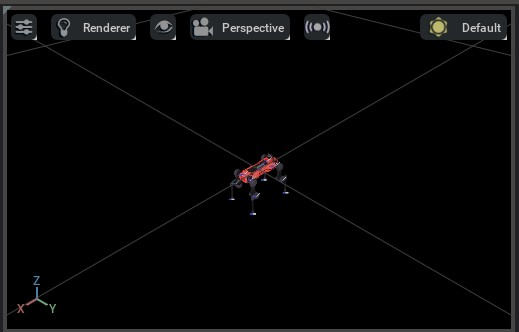
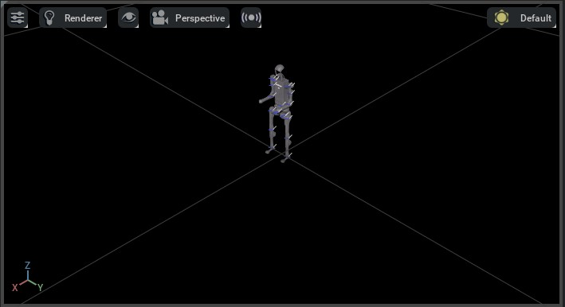
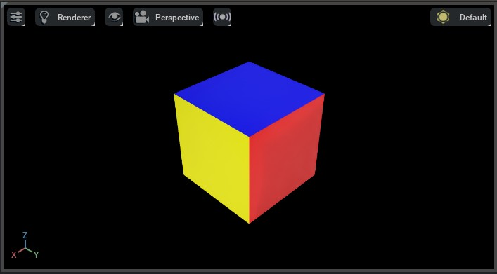

导入新资产
=====================

.. currentmodule:: isaaclab

NVIDIA Omniverse 依赖通用场景描述（USD）文件格式来导入和导出资产。USD 是由 Pixar
动画工作室开发的开源文件格式。它是一种针对大规模、复杂数据集优化的场景描述格式。
虽然这种格式在电影和动画行业中被广泛使用，但在机器人社区中并不常见。

为此，NVIDIA 开发了多种导入器，允许您将其他文件格式的资产导入为 USD。这些导入器以
Omniverse Kit 扩展的形式提供：

* **URDF Importer** - 从 URDF 文件导入资产。
* **MJCF Importer** - 从 MJCF 文件导入资产。
* **Mesh Importer** - 从多种文件格式导入资产，包括
  OBJ、FBX、STL 和 glTF。

NVIDIA 推荐的工作流程是使用上述导入器将资产转换为其 USD 表示。资产转换为 USD 格式后，
您可以使用 Omniverse Kit 编辑资产并将其导出为其他文件格式。Isaac Sim 默认包含
这些导入器。它们也可以在 Omniverse Kit 中手动启用。

在将资产用于大规模仿真时需要注意的重要一点是，确保资产为 `instanceable`_ 格式。
这样资产才能被高效地加载到内存中，并在场景中被多次使用。否则，资产会被多次加载到
内存中，可能导致性能问题。
有关 instanceable 资产的更多细节，请查看 Isaac Sim 的 `documentation`_。

使用 URDF Importer
-------------------

如果要在 GUI 中使用 URDF 导入器，请查看 `URDF importer`_ 处的文档。如果要在 Python 脚本中使用
URDF 导入器，我们提供了一个名为 ``convert_urdf.py`` 的实用工具。该脚本会创建一个
:class:`~sim.converters.UrdfConverterCfg` 实例，
然后将其传递给 :class:`~sim.converters.UrdfConverter` 类。

URDF 导入器有多种配置参数，可以设置这些参数来控制导入器的行为。
导入器配置参数的默认值在 :class:`~sim.converters.UrdfConverterCfg` 类中指定，
并在下面列出。我们把一些常用的设置做成了调用 ``convert_urdf.py`` 时可用的命令行参数，
它们在列表中用 ``*`` 标出。有关配置参数的完整列表，请查看 `URDF importer`_ 处的文档。

* :attr:`~sim.converters.UrdfConverterCfg.fix_base` * - 是否固定机器人的基座。
  这取决于您使用的是浮动基座还是固定基座机器人。命令行参数为
  ``--fix-base`` ，设置后导入器将固定机器人的基座，否则默认为浮动基座。
* :attr:`~sim.converters.UrdfConverterCfg.root_link_name` - 放置 PhysX 关节体根（articulation root）的连杆。
* :attr:`~sim.converters.UrdfConverterCfg.merge_fixed_joints` * - 是否合并固定关节。
  通常应设置为 ``True`` 以降低资产复杂度。命令行参数为
  ``--merge-joints`` ，设置后导入器将合并固定关节，否则默认不合并固定关节。
* :attr:`~sim.converters.UrdfConverterCfg.joint_drive` - 机器人上关节驱动（joint drive）的配置。

  * :attr:`~sim.converters.UrdfConverterCfg.JointDriveCfg.drive_type` - 关节的驱动类型。
    可以是 ``"acceleration"`` 或 ``"force"`` 。在大多数情况下我们建议使用 ``"force"`` 。
  * :attr:`~sim.converters.UrdfConverterCfg.JointDriveCfg.target_type` - 关节的目标类型。
    可以是 ``"none"`` 、 ``"position"`` 或 ``"velocity"`` 。在大多数情况下我们建议使用 ``"position"`` 。
    将其设置为 ``"none"`` 会禁用驱动并将关节增益设置为 0.0。
  * :attr:`~sim.converters.UrdfConverterCfg.JointDriveCfg.gains` - 关节的驱动刚度和阻尼增益。
    我们支持两种设置增益的方式：

    * :attr:`~sim.converters.UrdfConverterCfg.JointDriveCfg.PDGainsCfg` - 直接设置刚度和阻尼。
    * :attr:`~sim.converters.UrdfConverterCfg.JointDriveCfg.NaturalFrequencyGainsCfg` - 使用
      系统期望的自然频率响应来设置增益。

有关配置参数的更多详细信息，请查看 :class:`~sim.converters.UrdfConverterCfg` 的文档。

用法示例
~~~~~~~~~~~~~

在本例中，我们使用 ANYmal-D 机器人预先处理过的 URDF 文件。要查看预处理后的
URDF，请查看 `anymal.urdf`_ 文件。预处理后的 URDF 与原始 URDF 的主要区别如下：

* 我们从 URDF 中移除了 ``<gazebo>`` 标签。URDF 导入器不支持该标签。
* 我们从 URDF 中移除了 ``<transmission>`` 标签。URDF 导入器不支持该标签。
* 我们从 URDF 中移除了多个碰撞体，以降低资产的复杂度。
* 我们将所有关节的阻尼和摩擦参数改为 ``0.0`` 。这确保我们可以对关节进行力控（effort-control），
  而不会让 PhysX 额外添加阻尼。
* 我们为固定关节添加了 ``<dont_collapse>`` 标签。这确保导入器不会
  合并这些固定关节。

下面展示了克隆仓库并运行转换器的步骤：

.. tab-set::
   :sync-group: os

   .. tab-item:: :icon:`fa-brands fa-linux` Linux
      :sync: linux

      .. code-block:: bash

        # clone a repository with URDF files
        git clone git@github.com:isaac-orbit/anymal_d_simple_description.git

        # go to top of the Isaac Lab repository
        cd IsaacLab
        # run the converter
        ./isaaclab.sh -p scripts/tools/convert_urdf.py \
          ../anymal_d_simple_description/urdf/anymal.urdf \
          source/isaaclab_assets/data/Robots/ANYbotics/anymal_d.usd \
          --merge-joints \
          --joint-stiffness 0.0 \
          --joint-damping 0.0 \
          --joint-target-type none

   .. tab-item:: :icon:`fa-brands fa-windows` Windows
      :sync: windows

      .. code-block:: batch

        :: clone a repository with URDF files
        git clone git@github.com:isaac-orbit/anymal_d_simple_description.git

        :: go to top of the Isaac Lab repository
        cd IsaacLab
        :: run the converter
        isaaclab.bat -p scripts\tools\convert_urdf.py ^
          ..\anymal_d_simple_description\urdf\anymal.urdf ^
          source\isaaclab_assets\data\Robots\ANYbotics\anymal_d.usd ^
          --merge-joints ^
          --joint-stiffness 0.0 ^
          --joint-damping 0.0 ^
          --joint-target-type none

执行上述脚本会在 ``source/isaaclab_assets/data/Robots/ANYbotics/`` 目录中创建一个
USD 文件：

* ``anymal_d.usd`` - 这是主要的资产文件。

要以无头（headless）模式运行脚本，可以添加 ``--headless`` 标志。这不会打开 GUI，
并在转换完成后退出脚本。

您可以在打开的窗口中按下 play 来查看场景中的资产。资产应当在重力作用下下落。
如果它炸开了，可能是 URDF 中存在自碰撞。

使用 MJCF Importer
-------------------

与 URDF 导入器类似，MJCF 导入器也有 GUI 界面。更多细节请查看
`MJCF importer`_ 处的文档。如果要在 Python 脚本中使用 MJCF 导入器，我们提供了一个名为
``convert_mjcf.py`` 的实用工具。该脚本会创建一个 :class:`~sim.converters.MjcfConverterCfg`
实例，然后将其传递给 :class:`~sim.converters.MjcfConverter` 类。

导入器配置参数的默认值在 :class:`~sim.converters.MjcfConverterCfg` 类中指定。
配置参数在下面列出。
我们把一些常用的设置做成了调用 ``convert_mjcf.py`` 时可用的命令行参数，
它们在列表中用 ``*`` 标出。有关配置参数的完整列表，
请查看 `MJCF importer`_ 处的文档。

* :attr:`~sim.converters.MjcfConverterCfg.fix_base*` - 是否固定机器人的基座。
  这取决于您使用的是浮动基座还是固定基座机器人。命令行参数为
  ``--fix-base`` ，设置后导入器将固定机器人的基座，否则默认为浮动基座。
* :attr:`~sim.converters.MjcfConverterCfg.make_instanceable*` - 是否创建 instanceable 资产。
  通常应设置为 ``True`` 。命令行参数为 ``--make-instanceable`` ，
  设置后导入器将创建 instanceable 资产，否则默认为非 instanceable。
* :attr:`~sim.converters.MjcfConverterCfg.import_sites*` - 是否解析 MJCF 中的 <site> 标签。
  通常应设置为 ``True`` 。命令行参数为 ``--import-sites`` ，设置后导入器将解析 <site> 标签，否则默认不解析 <site> 标签。

用法示例
~~~~~~~~~~~~~

在本例中，我们使用 `mujoco_menagerie`_ 中 Unitree H1 人形机器人的 MuJoCo 模型。

下面展示了克隆仓库并运行转换器的步骤：

.. tab-set::
   :sync-group: os

   .. tab-item:: :icon:`fa-brands fa-linux` Linux
      :sync: linux

      .. code-block:: bash

        # clone a repository with URDF files
        git clone git@github.com:google-deepmind/mujoco_menagerie.git

        # go to top of the Isaac Lab repository
        cd IsaacLab
        # run the converter
        ./isaaclab.sh -p scripts/tools/convert_mjcf.py \
          ../mujoco_menagerie/unitree_h1/h1.xml \
          source/isaaclab_assets/data/Robots/Unitree/h1.usd \
          --import-sites \
          --make-instanceable

   .. tab-item:: :icon:`fa-brands fa-windows` Windows
      :sync: windows

      .. code-block:: batch

        :: clone a repository with URDF files
        git clone git@github.com:google-deepmind/mujoco_menagerie.git

        :: go to top of the Isaac Lab repository
        cd IsaacLab
        :: run the converter
        isaaclab.bat -p scripts\tools\convert_mjcf.py ^
          ..\mujoco_menagerie\unitree_h1\h1.xml ^
          source\isaaclab_assets\data\Robots\Unitree\h1.usd ^
          --import-sites ^
          --make-instanceable

执行上述脚本会在 ``source/isaaclab_assets/data/Robots/Unitree/`` 目录中创建
USD 文件：

* ``h1.usd`` - 这是主要的资产文件。它包含所有非网格（mesh）数据。
* ``Props/instanceable_assets.usd`` - 这是网格数据文件。

使用 Mesh Importer
-------------------

Omniverse Kit 包含网格转换工具，它使用 ASSIMP 库从多种网格格式（例如 OBJ、FBX、STL、glTF 等）
导入资产。资产转换工具以 Omniverse Kit 扩展的形式提供。更多细节请查看 `asset converter`_ 文档。
但是，与 Isaac Sim 的 URDF 和 MJCF 导入器不同，资产转换工具不支持
创建 instanceable 资产。这意味着如果资产在场景中被多次使用，它会被多次加载到
内存中。

因此，我们提供了一个名为 ``convert_mesh.py`` 的实用工具，它使用资产转换工具
导入资产，然后将其转换为 instanceable 资产。在内部，该脚本会创建一个
:class:`~sim.converters.MeshConverterCfg` 实例，然后将其传递给
:class:`~sim.converters.MeshConverter` 类。由于网格文件不包含任何物理信息，
配置类接受不同的物理属性（例如质量、碰撞形状等）作为输入。更多细节请查看
:class:`~sim.converters.MeshConverterCfg` 的文档。

用法示例
~~~~~~~~~~~~~

我们使用一个立方体的 OBJ 文件来演示网格转换器的用法。下面展示了
克隆仓库并运行转换器的步骤：

.. tab-set::
   :sync-group: os

   .. tab-item:: :icon:`fa-brands fa-linux` Linux
      :sync: linux

      .. code-block:: bash

        # clone a repository with URDF files
        git clone git@github.com:NVIDIA-Omniverse/IsaacGymEnvs.git

        # go to top of the Isaac Lab repository
        cd IsaacLab
        # run the converter
        ./isaaclab.sh -p scripts/tools/convert_mesh.py \
          ../IsaacGymEnvs/assets/trifinger/objects/meshes/cube_multicolor.obj \
          source/isaaclab_assets/data/Props/CubeMultiColor/cube_multicolor.usd \
          --make-instanceable \
          --collision-approximation convexDecomposition \
          --mass 1.0

   .. tab-item:: :icon:`fa-brands fa-windows` Windows
      :sync: windows

      .. code-block:: batch

        :: clone a repository with URDF files
        git clone git@github.com:NVIDIA-Omniverse/IsaacGymEnvs.git

        :: go to top of the Isaac Lab repository
        cd IsaacLab
        :: run the converter
        isaaclab.bat -p scripts\tools\convert_mesh.py ^
          ..\IsaacGymEnvs\assets\trifinger\objects\meshes\cube_multicolor.obj ^
          source\isaaclab_assets\data\Props\CubeMultiColor\cube_multicolor.usd ^
          --make-instanceable ^
          --collision-approximation convexDecomposition ^
          --mass 1.0

导入后您可能需要按 'F' 来放大查看资产。

与 URDF 和 MJCF 转换器类似，执行上述脚本会在 ``source/isaaclab_assets/data/Props/CubeMultiColor/``
目录中创建两个 USD 文件。此外，
如果您在打开的窗口中按下 play，应该会看到资产在重力作用下下落。

* 如果不设置 ``--mass`` 参数，则不会向资产添加任何刚体属性。
  资产将作为静态资产导入。
* 如果同时不设置 ``--collision-approximation`` 参数，则资产也不会有任何碰撞器属性，
  将作为可视化资产导入。

.. _instanceable: https://openusd.org/dev/api/_usd__page__scenegraph_instancing.html
.. _documentation: https://docs.isaacsim.omniverse.nvidia.com/latest/isaac_lab_tutorials/tutorial_instanceable_assets.html
.. _MJCF importer: https://docs.isaacsim.omniverse.nvidia.com/latest/importer_exporter/ext_isaacsim_asset_importer_mjcf.html
.. _URDF importer: https://docs.isaacsim.omniverse.nvidia.com/latest/importer_exporter/ext_isaacsim_asset_importer_urdf.html
.. _anymal.urdf: https://github.com/isaac-orbit/anymal_d_simple_description/blob/master/urdf/anymal.urdf
.. _asset converter: https://docs.omniverse.nvidia.com/extensions/latest/ext_asset-converter.html
.. _mujoco_menagerie: https://github.com/google-deepmind/mujoco_menagerie/tree/main/unitree_h1
