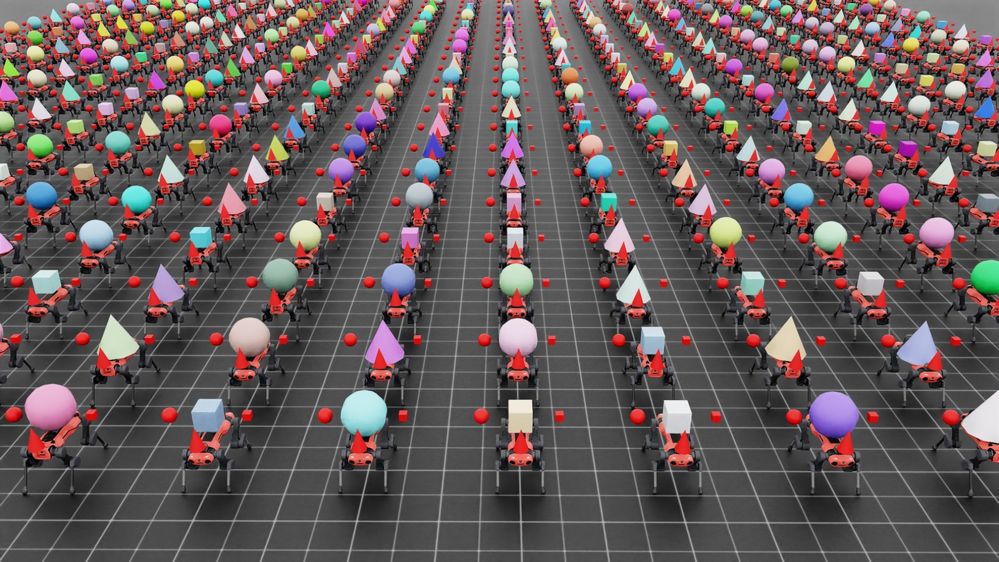

生成多个资产
========================

.. currentmodule:: isaaclab

典型的生成（spawn）配置（在 :ref:`tutorial-spawn-prims` 教程中介绍）会把同一个
资产（或 USD 图元）复制到由表达式解析出的不同 prim 路径上。
例如，如果用户指定在 "/World/Table\_.*/Object" 处生成资产，那么会在
"/World/Table_0/Object"、"/World/Table_1/Object" 等路径上创建相同的
资产。

不过，我们还通过两种机制支持多资产生成：

1. 刚体对象集合。这允许用户在每个环境中生成多个刚体对象，并通过统一的 API 访问/修改
   它们，从而提升性能。

2. 在同一 prim 路径下生成不同的资产。这允许用户创建多样化的仿真，使每个
   环境拥有不同的资产。

本指南介绍如何使用这两种机制。

示例脚本 ``multi_asset.py`` 可作为参考，位于
``IsaacLab/scripts/demos`` 目录中。

.. dropdown:: multi_asset.py 的代码
   :icon: code

   .. literalinclude:: ../../../scripts/demos/multi_asset.py
      :language: python
      :emphasize-lines: 109-131, 135-179, 184-203
      :linenos:

该脚本会创建多个环境，每个环境包含：

* 一个刚体对象集合，其中包含一个圆锥体、一个立方体和一个球体
* 一个刚体对象，它可以是圆锥体、立方体或球体，随机选择
* 一个关节体，它可以是 ANYmal-C 或 ANYmal-D 机器人，随机选择

刚体对象集合
------------------------

可以在每个环境中生成多个刚体对象，并通过统一的 ``(env_ids, obj_ids)`` API 访问/修改它们。
虽然用户也可以通过逐个生成的方式来创建多个刚体对象，但该 API 更易于使用且
更加高效，因为它在底层使用单个物理视图来处理所有对象。

.. literalinclude:: ../../../scripts/demos/multi_asset.py
   :language: python
   :lines: 135-179
   :dedent:

配置类 :class:`~assets.RigidObjectCollectionCfg` 用于创建集合。其属性 :attr:`~assets.RigidObjectCollectionCfg.rigid_objects`
是一个包含 :class:`~assets.RigidObjectCfg` 对象的字典。这些键作为集合中每个
刚体对象的唯一标识符。

在同一 prim 路径下生成不同的资产
--------------------------------------------------

可以使用生成器 :class:`~sim.spawners.wrappers.MultiAssetSpawnerCfg` 和 :class:`~sim.spawners.wrappers.MultiUsdFileCfg`
在每个环境的同一 prim 路径下生成不同的资产和 USD：

* 我们将 :class:`~assets.RigidObjectCfg` 中的生成配置设置为
  :class:`~sim.spawners.wrappers.MultiAssetSpawnerCfg`：

  .. literalinclude:: ../../../scripts/demos/multi_asset.py
     :language: python
     :lines: 107-133
     :dedent:

  该函数允许您定义一个由不同资产组成的列表，这些资产可以作为刚体对象生成。
  当 :attr:`~sim.spawners.wrappers.MultiAssetSpawnerCfg.random_choice` 设置为 True 时，会从列表中
  随机选择一个资产并在指定的 prim 路径处生成。

* 类似地，我们将 :class:`~assets.ArticulationCfg` 中的生成配置设置为
  :class:`~sim.spawners.wrappers.MultiUsdFileCfg`：

  .. literalinclude:: ../../../scripts/demos/multi_asset.py
     :language: python
     :lines: 182-215
     :dedent:

  与前面类似，该配置允许选择表示关节体资产的不同 USD 文件。

注意事项
~~~~~~~~~~~~~~

相似的资产结构
~~~~~~~~~~~~~~~~~~~~~~~~~

当使用同一个物理接口（刚体对象或关节体类）生成和处理多个资产时，
所有 prim 位置上的资产必须遵循相似的结构。对于关节体而言，
这意味着它们都必须具有相同数量的连杆和关节、相同数量的碰撞体，
以及相同的名称。否则，prim 的物理解析可能受到影响并失败。

此功能的主要目的是让用户能够创建同一资产的随机化版本，
例如具有不同连杆长度的机器人，或具有不同碰撞体形状的刚体对象。

在交互式场景中禁用物理复制
~~~~~~~~~~~~~~~~~~~~~~~~~~~~~~~~~~~~~~~~~~~~~~~~~~

默认情况下，标志 :attr:`scene.InteractiveScene.replicate_physics` 被设置为 True。该标志告知物理
引擎各仿真环境互为副本，因此它只需解析第一个环境即可理解整个仿真场景。
这有助于加速仿真场景的解析。

然而，在不同环境中生成不同资产的情况下，这一假设不再
成立。因此必须禁用 :attr:`scene.InteractiveScene.replicate_physics` 标志。

.. literalinclude:: ../../../scripts/demos/multi_asset.py
   :language: python
   :lines: 280-283
   :dedent:

代码执行
------------------

要使用多个环境和随机化资产执行该脚本，请使用以下命令：

.. code-block:: bash

  ./isaaclab.sh -p scripts/demos/multi_asset.py --num_envs 2048

该命令会以 2048 个环境运行仿真，每个环境具有随机选择的资产。
要停止仿真，您可以关闭窗口，或在终端中按 ``Ctrl+C`` 。
