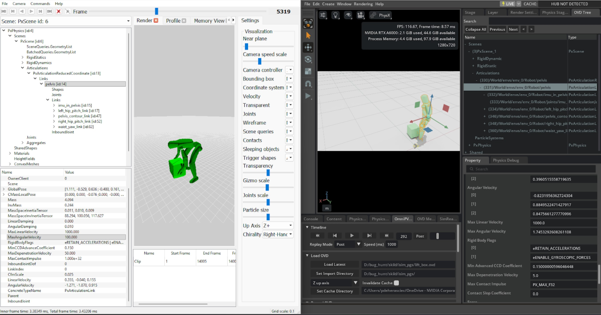

.. _migrating-from-isaacgymenvs-comparing-simulation:

在 Isaac Gym 与 Isaac Lab 之间比较仿真
=====================================================

将仿真从 Isaac Gym 迁移到 Isaac Lab 时，比较 Isaac Gym 与 Isaac Lab 中的仿真配置以找出两种设置之间的差异有时会有所帮助。
默认值的解释方式、导入器对某些刚体层级的处理方式以及数值的缩放方式都可能存在差异。要确定两个仿真
在 PhysX 眼中等价，唯一的方法是记录两种设置的仿真轨迹，并
通过并排检查来比较它们。这种方法之所以有效，是因为 PhysX 是 Isaac Gym 和 Isaac Lab 共同的底层
引擎，只是版本不同。

在 Isaac Gym Preview Release 中记录 PXD2
----------------------------------------------

Isaac Gym 中的仿真轨迹可以使用内置的 PhysX Visual Debugger（PVD）
文件输出功能来记录。将操作系统环境变量 ``GYM_PVD_FILE`` 设置为
所需的输出文件路径； ``.pxd2`` 文件扩展名会自动追加。

详细说明请参阅 Isaac Gym 附带的调优文档：

.. code-block:: text

    isaacgym/docs/_sources/programming/tuning.rst.txt

.. note::

    提供此文件引用是因为 Isaac Gym 的文档没有在线版本。

在 Isaac Lab 中记录 OVD
-----------------------------

要在 Isaac Lab 中记录 OVD 仿真轨迹文件，必须设置相应的 Isaac Sim Kit
参数。重要的是， ``omniPvdOvdRecordingDirectory`` 变量必须在 ``omniPvdOutputEnabled`` 被设置为 ``true`` **之前** 设置。

.. code-block:: bash

    ./isaaclab.sh -p scripts/benchmarks/benchmark_non_rl.py --task <task_name> \
        --kit_args="--/persistent/physics/omniPvdOvdRecordingDirectory=/tmp/myovds/ \
        --/physics/omniPvdOutputEnabled=true"

此示例会将一系列 OVD 文件输出到 ``/tmp/myovds/`` 目录。

如果 ``--kit_args`` 参数在你的特定设置中不起作用，可以通过
直接编辑 Isaac Sim 源代码中的以下文件来手动设置 Kit 参数：

.. code-block:: text

    source/extensions/isaacsim.simulation_app/isaacsim/simulation_app/simulation_app.py

在 ``args = []`` 代码块之后追加以下行：

.. code-block:: python

    args.append("--/persistent/physics/omniPvdOvdRecordingDirectory=/path/to/output/ovds/")
    args.append("--/physics/omniPvdOutputEnabled=true")

检查 PXD2 与 OVD 文件
-----------------------------

通过在 PVD 查看器中打开 PXD2 文件、在 OmniPVD（一个 Kit 扩展）中打开 OVD 文件，可以
手动比较两次仿真运行及其各自的参数。

**用于 PXD2 文件的 PhysX Visual Debugger（PVD）**

从 NVIDIA Developer Tools 页面下载 PVD 查看器：

    `<https://developer.nvidia.com/tools-downloads#?search=PVD>`_

PVD 查看器的版本 2 和版本 3 都与 PXD2 文件兼容。

**用于 OVD 文件的 OmniPVD**

要查看 OVD 文件，请在 Isaac Sim 应用程序中启用 OmniPVD 扩展。详细
说明请参阅 OmniPVD 开发者指南：

    https://docs.omniverse.nvidia.com/kit/docs/omni_physics/latest/extensions/ux/source/omni.physx.pvd/docs/dev_guide/physx_visual_debugger.html

**在 OmniPVD 中检查接触 Gizmo**

要检查物体之间的接触点，请在 OmniPVD 中启用接触 gizmo。确保在
OmniPVD 时间轴中将仿真帧设置为 **PRE** （每个仿真步的预仿真帧），
或将回放模式设置为 **PRE** 。这样可以在
求解器处理每一步之前可视化接触信息。

**比较 PVD 与 OVD 文件**

使用 PVD 查看器和 OmniPVD 扩展，现在可以并排
比较两个仿真以找出配置差异。左侧是用于检查 PXD2 的 PVD，右侧是加载用于检查 OVD 文件的 OmniPVD
扩展。

仿真比较期间需要验证的参数
-------------------------------------------------

对于 PhysX 关节体，检查每个属性都很有用，因为它揭示了连杆或形状
在接触、驱动和约束下的实际行为。下面将逐一展开每个属性，
说明它们对调试和调优仿真的重要性。

PxArticulationLink
^^^^^^^^^^^^^^^^^^

每个连杆的行为都类似于刚体，具有质量属性、阻尼、速度限制和接触求解
限制。检查这些属性有助于解释稳定性问题、抖动以及对力的异常响应。

质量属性
"""""""""""""""

**质量**
    决定连杆在力的作用下加速的强度，以及在碰撞
    和关节约束中如何分配冲量。

    *何时检查：* 理解为什么连杆看起来“太重”（被推时几乎不动）或“太轻”
    （被小冲量撞得四处飞），以及检测链条上不一致的质量分布，这种
    分布会导致不真实的运动或关节应力。

**质心（位姿）**
    控制力实际作用的位置以及连杆的平衡方式。

    *何时检查：* 角色或机构意外倾倒或感觉不平衡；质心偏移
    会导致相同接触下产生不真实的扭矩。

**惯性张量 / 惯性缩放**
    定义绕每个轴的旋转阻力。

    *何时检查：* 连杆相对于其质量来说旋转太容易或太难，这会影响关节
    驱动调优和碰撞响应。

阻尼属性
""""""""""""""""""

**线性阻尼**
    对平移运动建模与速度成正比的阻力；值越大，连杆线性速度衰减越快。

    *何时检查：* 连杆滑动太远（阻尼太低）或感觉像“在水中”（阻尼太高），或
    者当关节体的能量在没有明显接触的情况下消失时。

**角阻尼**
    对旋转运动建模阻力；值越大，旋转中的连杆减速越快。

    *何时检查：* 连杆在碰撞或电机驱动后持续旋转（太低），或关节感觉“粘滞”
    且无法在重力下自由摆动（太高）。

速度属性
"""""""""""""""""""

**线速度**
    连杆在世界空间中的瞬时平移速度。

    *何时检查：* 验证关节电机、重力或接触是否产生预期的运动，
    检测数值爆炸（巨大尖峰），并与 CCD 阈值和最大线速度限制相关联。

**角速度**
    世界空间中的瞬时旋转速度。

    *何时检查：* 验证关节驱动、碰撞或约束是否产生正确的旋转；
    在限制生效之前发现可能导致不稳定或穿透的失控旋转。

**最大线速度**
    PhysX 在求解前用于限制线速度的上界，旨在防止
    极高速运动导致的数值问题。

    *何时检查：* 物体开始穿透或仿真在高速下爆炸。太高时，连杆
    可以在一步中移动太远；太低时，它们可能看起来被不自然地限制，就像“限速”机器人一样。

**最大角速度**
    角速度的上界；PhysX 对角速度的限制方式与线速度类似。

    *何时检查：* 连杆在碰撞或驱动后旋转得不切实际地快（值太大），或
    旋转看起来被不自然地限制，尤其是对于应该快速旋转的轮子或旋翼（值太小）。

接触求解属性
"""""""""""""""""""""""""""""

**最大去穿透速度**
    限制求解器在一步中为解决接触处穿透而可以添加的校正速度。

    *何时检查：* 重叠的连杆在开始相互穿透后向外“爆炸”或抖动（太高），
    或嵌入的连杆分离太慢且看起来粘在一起（太低）。

**最大接触冲量**
    限制求解器在接触处可以施加的冲量；这是每个刚体的限制，实际的接触限制
    取两个刚体值中的较小者。

    *何时检查：* 接触感觉太软（刚体深度互穿或沉入环境）或
    太硬（尖锐冲量引起振铃或弹跳），或在调优橡胶或
    皮肤类表面的“软碰撞”时。

状态与行为标志
"""""""""""""""""""""""""

**运动学 vs 动力学标志 / 禁用重力**
    指示连杆是以运动学方式驱动还是完全仿真，以及重力是否影响它。

    *何时检查：* 部件看起来冻结、直接吸附到位姿或忽略重力，这会极大地
    改变关节体的行为。

**睡眠阈值（线性和角）与唤醒计数器**
    控制连杆何时可以进入睡眠并停止仿真。

    *何时检查：* 关节体过早睡眠（停止运动）或从不睡眠（浪费性能
    并导致低幅度抖动）。

PxArticulationJoint
^^^^^^^^^^^^^^^^^^^

入站关节定义了连杆与其父连杆之间的相对运动。检查运动和相关
参数可以解释限制、约束以及驱动如何塑造关节体的位姿和稳定性。

关节配置
"""""""""""""""""""""

**运动**
    按轴设置（锁定、受限、自由），定义关节允许哪些自由度以及
    范围是否受限。

    *何时检查：* 连杆向意外方向移动（轴被错误地设置为自由）、比预期更早或更晚
    撞到硬限位（受限 vs 锁定），或由于轴被错误地保持自由而显得不受约束。

**关节类型 / 轴定义**
    转动、滑动、球形等类型的选择，以及定义轴的局部关节坐标系。

    *何时检查：* “铰链”表现得更像球关节或意外滑动；错误的类型或
    坐标系对齐很容易产生奇怪的运动。

**限制（摆动、扭转、线性）**
    指定允许的角度或线性范围，通常还包括刚度/阻尼。

    *何时检查：* 关节过度伸展、穿透几何体或在边界处突然卡住；设置不当的
    限制会导致突跳和不稳定。

驱动属性
""""""""""""""""

**驱动目标位置（姿态）与目标速度**
    驱动关节体的期望相对位姿和相对速度，
    通常使用弹簧-阻尼模型。

    *何时检查：* 控制器太慢或超调并振荡——目标值和驱动参数
    必须与连杆质量和惯性相匹配。

**驱动刚度与阻尼（弹簧强度、切向阻尼）**
    控制关节尝试到达目标位姿的激进程度以及超调被阻尼的程度。

    *何时检查：* 关节在负载下嗡嗡作响或振荡（刚度高、阻尼低）或感觉无响应
    且“像橡胶一样”（刚度低）。

**关节摩擦 / 阻力（如果已配置）**
    即使驱动中没有显式阻尼也会增加阻力。

    *何时检查：* 被动关节摆动时间太长，或即使没有驱动也显得卡住。

PxShape
^^^^^^^

附着在连杆上的形状决定了碰撞表示和接触行为。即使它们在 OmniPhysics 中是内部的，
它们的属性对稳定性、接触时机和视觉对齐也有很大影响。

碰撞偏移
"""""""""""""""""

**静止偏移（Rest Offset）**
    两个形状彼此静止的距离；它们的静止偏移之和定义了它们“沉降”时的间距。

    *何时检查：* 图形和碰撞看起来未对齐（有间隙或可见的相交），或
    在网格上滑动不平滑。小的正偏移可以使滑动更平滑，而零偏移趋向于精确
    对齐但可能卡在几何体上。

**接触偏移（Contact Offset）**
    开始生成接触的距离；距离小于接触偏移之和的形状
    会生成接触。

    *何时检查：* 接触出现得“太早”（物体在视觉上接触之前似乎就发生了碰撞，增加
    接触数量）或“太晚”（穿透或抖动）。接触偏移与静止偏移之间的差异
    对于可预测、稳定的接触至关重要。

几何与材质
""""""""""""""""""""""

**几何类型与尺寸**
    盒体、球体、胶囊体、凸包、网格以及相关的尺寸参数。

    *何时检查：* 碰撞足迹与视觉网格不匹配——过大的形状会导致过早
    接触；过小的形状会允许视觉相交并改变接触处的力臂。

**材质：摩擦、恢复系数、柔顺性**
    摩擦系数和恢复系数定义了滑动和弹性。

    *何时检查：* 关节体的脚太容易打滑、粘在地面或意外弹跳。
    错误的材质会使机构不稳定或无响应。

形状标志
"""""""""""

**仿真 / 查询 / 触发器标志**
    形状是参与仿真接触、仅参与光线投射，还是参与触发事件。

    *何时检查：* 接触没有出现（形状被设置为仅查询），或触发器意外地产生
    物理碰撞。

**接触密度（CCD 标志，如果使用）**
    影响快速运动连杆处理方式的连续碰撞检测标志。

    *何时检查：* 快速运动的关节体部件穿透薄障碍物，或 CCD 过于激进并
    降低性能。

PxRigidDynamic
^^^^^^^^^^^^^^

``PxRigidDynamic`` 是 PhysX 中核心的仿真刚体类型，因此检查其属性至关重要，
这有助于理解场景中单个物体的行为、稳定性和性能。许多属性
与 ``PxArticulationLink`` 相同，但动态刚体不受关节体关节的约束，也可以
在运动学模式下使用。

质量及质量相关属性
""""""""""""""""""""""""""""""""

**质量**
    控制对力和冲量的平移响应；在相同冲量下，质量越小，速度变化越大。

    *何时检查：* 物体对碰撞几乎没有反应（质量太大）或被小力撞飞
    （质量太小），或相互作用的刚体之间的质量比导致某些刚体过于强势或容易被欺负。

**质心（COM）位姿**
    定义力实际作用的位置以及刚体绕哪个点旋转。

    *何时检查：* 物体意外倾倒、以不直观的方式翻滚或感觉“不平衡”。质心
    太高或偏离中心会导致小接触产生强扭矩。

**惯性张量 / 惯性缩放**
    决定在给定扭矩下绕每个轴的角加速度阻力。

    *何时检查：* 刚体旋转太容易或太难（例如大型物体因
    小的撞击而快速旋转），或需要各向异性行为时（例如轮子绕一个轴容易旋转但
    对其他轴有阻力）。

阻尼与速度限制
"""""""""""""""""""""""""""""

**线性阻尼**
    对平移运动添加与速度成正比的阻力。

    *何时检查：* 刚体滑动太远或时间太长（阻尼太低）或看起来像在粘稠
    流体中运动（阻尼太高），以及场景的能量损失比仅由摩擦引起的更快时。

**角阻尼**
    对旋转添加阻力，随时间降低角速度。

    *何时检查：* 旋转的物体从不静止或旋转时间长得不切实际（太低），或它们
    在碰撞或电机冲量后几乎立即停止旋转（太高）。

**线速度**
    积分器和求解器使用的当前平移速度。

    *何时检查：* 调试冲量、重力或施加的力，以查看刚体是否按预期
    加速；检测速度的尖峰或非物理跳变。

**角速度**
    绕每个轴的当前旋转速度。

    *何时检查：* 旋转看起来抖动、数值爆炸或对施加的扭矩没有响应。
    相对于时间步长和物体尺度的高值可能表明不稳定。

**最大线速度**
    求解前用于限制线速度的上界。

    *何时检查：* 速度极快的刚体导致穿透或仿真爆炸（值太高），或它们
    看起来被不自然地“限速”，尤其是高能量场景中的抛射物或碎片（值太低）。

**最大角速度**
    用于限制角速度的上界。

    *何时检查：* 薄或小的刚体旋转太快以致破坏场景稳定（值太高），或
    轮子、螺旋桨、碎片等旋转元素看起来被人为限制（值太低）。

接触求解与冲量
"""""""""""""""""""""""""""""""

**最大去穿透速度**
    限制求解器在一步中为解决互穿而引入的校正速度。

    *何时检查：* 相交的刚体在重叠后“爆炸”分开或剧烈抖动（太高），或
    分离非常缓慢并且在几帧内看起来卡住或互穿（太低）。

**最大接触冲量**
    限制涉及该刚体的接触处可以施加的冲量；有效限制取两个刚体之间的较小值，
    对于静态-动态接触则取动态刚体的值。

    *何时检查：* 创建更软的接触（更低限制）或非常坚硬、几乎不屈服的刚体（高或
    默认限制）；物体相互沉入或弹跳得不切实际。

睡眠与激活行为
"""""""""""""""""""""""""""""""

**睡眠阈值**
    质量归一化的动能，低于该值时刚体成为睡眠的候选。

    *何时检查：* 刚体在本应继续运动时过早入睡（阈值太高）或
    持续抖动且从不睡眠（阈值太低），这会损害性能。

**唤醒计数器 / isSleeping 标志**
    指示刚体是否处于活动状态的内部计时器和状态。

    *何时检查：* 刚体在交互时拒绝唤醒或太容易唤醒。不良的睡眠行为可以
    使场景感觉“死气沉沉”或过于嘈杂。

运动学模式与锁定
""""""""""""""""""""""""""

**运动学标志（PxRigidBodyFlag::eKINEMATIC）**
    设置后，刚体由 ``setKinematicTarget`` 移动并忽略力和重力，同时仍然
    影响它接触到的动态刚体。

    *何时检查：* 物体看起来具有无限质量（推动其他物体但不响应）或忽略
    重力和冲量。这里的预期不匹配通常导致角色、移动
    平台或门出现奇怪的行为。

**动态刚体锁定标志（PxRigidDynamicLockFlag）**
    按轴的线性和角度自由度锁定，无需关节即可有效约束运动。

    *何时检查：* 刚体意外地在被约束的方向上移动（未设置锁定）或无法在
    应该移动/旋转的地方移动/旋转（错误设置锁定），尤其是对于 2D 风格的运动或简单的
    受约束机构。

**禁用重力（PxActorFlag::eDISABLE_GRAVITY）**
    切换刚体是否受场景重力影响。

    *何时检查：* 物体悬浮在空中或意外下落。在
    包含一些无重力刚体的混合设置中，这是常见的困惑来源。

力与求解器覆盖
"""""""""""""""""""""""""""

**施加的力和扭矩（每步累加）**
    将被积分到速度中的净力/扭矩。

    *何时检查：* 调试游戏性力（推进器、角色推动、爆炸），以查看预期的
    输入是否实际到达刚体。

**每个刚体的求解器迭代次数（minPositionIters、minVelocityIters）**
    覆盖该刚体在约束和接触中获得的求解器迭代次数。

    *何时检查：* 某些刚体（例如角色、堆叠的箱子、易碎结构）需要更高的
    稳定性或更精确的堆叠。低迭代次数会导致抖动和穿透；太高则浪费
    性能。

形状相关方面
"""""""""""""""""""""""""

虽然不是 ``PxRigidDynamic`` 本身的属性，但附着在它上面的形状对行为有很大影响。

**所附形状的静止偏移与接触偏移**
    如前所述，控制预测性接触生成和视觉分离。

    *何时检查：* 动态刚体似乎碰撞得太早/太晚，或看起来悬浮在表面
    之上或在视觉上与表面相交。

**所附材质（摩擦、恢复系数）**
    定义该刚体接触的滑动和弹性。

    *何时检查：* 动态刚体以意想不到的方式打滑、粘住或弹跳。通常“行为问题”
    源于材质配置，而不是质量或阻尼。

总结：检查什么以及为什么
^^^^^^^^^^^^^^^^^^^^^^^^^^^^^^^^

下表总结了每个 PhysX 组件的关键检查领域：

.. list-table::
   :header-rows: 1
   :widths: 20 40 40

   * - 组件
     - 关键属性
     - 调试重点
   * - **连杆**
     - 质量、阻尼、速度、限制
     - 整体能量、稳定性以及对关节/接触的响应
   * - **关节**
     - 运动、限制、驱动
     - 关节体位姿如何演化；过度/不足约束的运动
   * - **形状**
     - 偏移、材质、几何
     - 接触时机、摩擦行为、视觉与物理对齐
   * - **动态刚体**
     - 质量、惯性、阻尼、速度限制、睡眠、运动学标志
     - 加速、沉降、极端运动、刚体状态

所有这些属性共同提供了全面的图景，说明关节体或刚体
为何表现出这样的行为，以及应该在何处调整参数以获得稳定性、真实感或控制性能。
