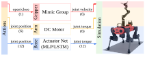
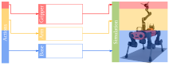

.. _overview-actuators:

执行器
=========

关节体（articulation）系统由被驱动的关节组成，这些关节也称为自由度（DOF）。
在物理系统中，驱动通常通过主动部件（例如电动或液压马达）或被动部件（例如弹簧）实现。这些部件
可能引入某些非线性特性，包括延迟或最大可产生的速度或力矩。

在仿真中，关节采用位置、速度或力矩控制。对于位置和速度控制，物理引擎内部实现了一个弹簧-阻尼（PD）
控制器，用于计算施加在被驱动关节上的力矩。在力矩控制中，指令被直接设置为关节 effort。
虽然这模拟了关节机构的理想行为，但它并未真实建模驱动装置在物理世界中的工作方式。因此，我们提供了一种
注入外部模型的机制，用于计算能够代表物理机器人行为的关节指令。

执行器模型
---------------

我们将执行器模型分为两种不同类型：

1. **implicit（隐式）**：对应理想的仿真机制（由物理引擎提供）。
2. **explicit（显式）**：对应外部驱动模型（由用户实现）。

显式执行器模型执行两个步骤：1）计算用于跟踪输入指令的期望关节力矩；2）根据电机能力对期望力矩进行裁剪。
裁剪后的力矩即被设置进仿真的期望驱动力（effort）。

作为理想显式执行器模型的一个示例，我们提供了 :class:`isaaclab.actuators.IdealPDActuator`
类，它实现了一个带前馈力（effort）的 PD 控制器，并基于配置的最大力（effort）进行简单裁剪：

.. math::

    \tau_{j, computed} & = k_p * (q_{des} - q) + k_d * (\dot{q}_{des} - \dot{q}) + \tau_{ff} \\
    \tau_{j, max} & = \gamma \times \tau_{motor, max} \\
    \tau_{j, applied} & = clip(\tau_{computed}, -\tau_{j, max}, \tau_{j, max})

其中，:math:`k_p` 和 :math:`k_d` 是关节刚度和阻尼增益，:math:`q` 和 :math:`\dot{q}`
是当前关节位置和速度，:math:`q_{des}`、:math:`\dot{q}_{des}` 和 :math:`\tau_{ff}`
是期望的关节位置、速度和力矩指令。参数 :math:`\gamma` 和
:math:`\tau_{motor, max}` 是变速箱减速比和电机可产生的最大力矩。

执行器组
---------------

执行器模型本身是计算模块，它以期望的关节指令作为输入，并输出要施加到仿真器中的关节指令。它们自身
并不包含任何关于其所作用关节的知识。这些信息由 :class:`isaaclab.assets.Articulation`
类处理，该类封装了物理引擎的关节体（articulation）类。

执行器组（actuator group）是关节体上使用同一执行器模型的一组被驱动关节的集合。
例如，四足机器人 ANYmal-C 的所有关节都使用串联弹性执行器 ANYdrive 3.0。这种
分组会为这些关节配置执行器模型，将输入指令转换为关节级指令，并返回要设置到仿真器中的关节体动作（action）。
如果机器人上还有一个使用不同执行器模型（例如直流电机）的机械臂，则需要配置另一个执行器组。

下图展示了一个腿式移动操作机器人的执行器组：

.. seealso::

    我们提供了多种显式执行器模型的实现。详见
    `isaaclab.actuators <../../api/lab/isaaclab.actuators.html>`_ 子包。

使用执行器时的注意事项
-----------------------------------

如前几节所述，执行器模型有两种主要类型：隐式和显式。隐式执行器模型由物理引擎提供。这意味着当用户设置
期望位置或期望速度时，物理引擎会在内部计算实现期望行为所需施加到关节上的力。在 PhysX 中，PD 控制器
会为期望的力添加数值阻尼，从而带来更稳定的行为。

显式执行器模型由用户提供。这意味着当用户设置期望位置或期望速度时，用户的模型会计算实现期望行为所需施加到
关节上的力。虽然这提供了更大的灵活性，但也可能导致数值不稳定。缓解该问题的一种方法是使用执行器模型的
``armature`` 参数，无论是在 USD 文件中还是在关节体配置中。该参数用于阻尼关节响应，有助于
提高仿真的数值稳定性。有关如何提高关节体稳定性的更多细节，可参阅
`OmniPhysics documentation <https://docs.omniverse.nvidia.com/kit/docs/omni_physics/latest/dev_guide/guides/articulation_stability_guide.html>`_。

这对用户意味着什么？它意味着使用隐式执行器训练的策略可能无法迁移到使用显式执行器的完全相同的机器人模型上。
如果你遇到此类问题，或者策略在使用显式执行器时不收敛而在隐式执行器下收敛，增大
``armature`` 参数或将该参数设置为更高的值可能会有所帮助。
