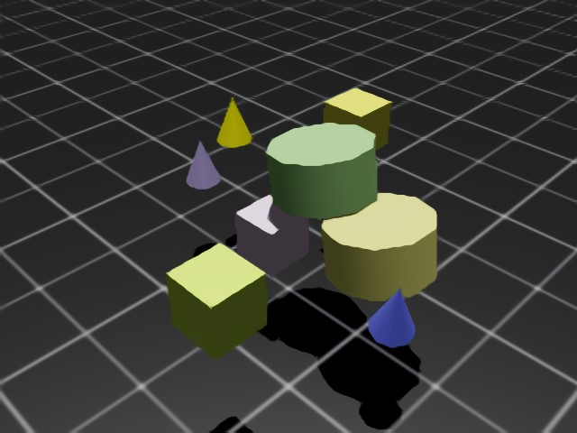
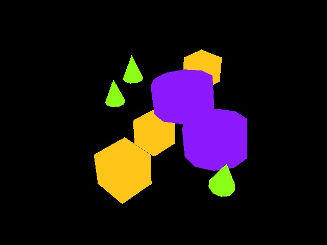
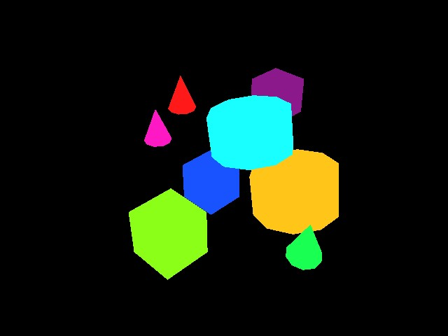

.. _overview_sensors_camera:

.. currentmodule:: isaaclab

相机
======

相机传感器通过 ``render_product`` 进行唯一定义，``render_product`` 是一种用于管理渲染流水线所生成数据（图像）的结构。Isaac Lab 让你能够完全控制这些渲染的生成方式：可以通过焦距、位姿、类型等相机参数进行控制，也可以通过 Annotators（标注器）控制要渲染的数据类型，使你不仅能记录 RGB，还能记录实例分割、物体位姿、物体 ID 等。

渲染图像在 Isaac Lab 支持的数据类型中比较特殊，因为移动这些数据对带宽的要求天然很高。一幅 800 x 600、32 位颜色（每像素一个浮点数）的图像接近 2 MB。如果以 60 fps 渲染并记录每一帧，该相机就需要 120 MB/s 的带宽。再乘以一个环境中的相机数量和一次仿真中的环境数量，你很快就能看到，对相机数据做朴素的向量化扩展会带来带宽方面的挑战。NVIDIA 的 Isaac Lab 利用了我们在 GPU 硬件方面的专长，提供了一个专门解决渲染流水线中这些扩展性挑战的 API。

平铺渲染
~~~~~~~~~~~~~~~

.. note::

    该功能仅在 Isaac Sim 4.2.0 及以上版本中可用。

    平铺渲染与图像处理网络结合使用时需要大量内存资源，尤其是在较大分辨率下。我们建议在 RTX 4090 GPU 或同等配置的 GPU 上运行场景中的 512 个相机。

平铺渲染 API 为从相机传感器收集数据提供了向量化接口。这对强化学习环境非常有用，因为可以利用并行化来加速数据收集，从而加速训练循环。平铺渲染的工作方式是：对场景中单个相机的**所有**克隆体只使用一个 ``render_product``。单幅图像的期望尺寸和环境数量被用来计算一个大得多的 ``render_product``，它由该相机各个克隆体的单独渲染图平铺而成。当所有相机都填充完自己的缓冲区后，渲染产品即"完成"，可以作为一个大的整体图像进行移动，从而显著降低了（例如）将数据从主机移动到设备时的开销。只需一次调用即可同步设备数据，而不是每个相机调用一次，这是平铺渲染 API 在处理视觉数据方面更高效的重要原因之一。

Isaac Lab 通过 :class:`~sensors.TiledCamera` 类为 RGB、深度以及其他标注器提供了平铺渲染 API。平铺渲染 API 的配置可通过 :class:`~sensors.TiledCameraCfg` 类定义，可指定诸如所有相机路径的正则表达式、相机的变换、期望的数据类型、添加到场景中的相机类型以及相机分辨率等参数。

.. code-block:: python

    tiled_camera: TiledCameraCfg = TiledCameraCfg(
        prim_path="/World/envs/env_.*/Camera",
        offset=TiledCameraCfg.OffsetCfg(pos=(-7.0, 0.0, 3.0), rot=(0.9945, 0.0, 0.1045, 0.0), convention="world"),
        data_types=["rgb"],
        spawn=sim_utils.PinholeCameraCfg(
            focal_length=24.0, focus_distance=400.0, horizontal_aperture=20.955, clipping_range=(0.1, 20.0)
        ),
        width=80,
        height=80,
    )

要访问平铺渲染接口，可以创建一个 :class:`~sensors.TiledCamera` 对象，并用它从相机检索数据。

.. code-block:: python

    tiled_camera = TiledCamera(cfg.tiled_camera)
    data_type = "rgb"
    data = tiled_camera.data.output[data_type]

返回的数据将被转换为 (num_cameras, height, width, num_channels) 的形状，可以直接用作强化学习的观测。

在使用渲染功能时，请确保在启动环境时添加 ``--enable_cameras`` 参数。例如：

.. code-block:: shell

    python scripts/reinforcement_learning/rl_games/train.py --task=Isaac-Cartpole-RGB-Camera-Direct-v0 --headless --enable_cameras

标注器
~~~~~~~~~~

:class:`~sensors.TiledCamera` 和 :class:`~sensors.Camera` 类都提供了从 replicator 检索各种类型标注器数据的 API：

* ``"rgb"``：3 通道的渲染彩色图像。
* ``"rgba"``：带 alpha 通道的 4 通道渲染彩色图像。
* ``"distance_to_camera"``：包含到相机光学中心距离的图像。
* ``"distance_to_image_plane"``：包含 3D 点沿相机 z 轴方向到相机平面距离的图像。
* ``"depth"``：与 ``"distance_to_image_plane"`` 相同。
* ``"normals"``：包含每个像素处局部表面法向量的图像。
* ``"motion_vectors"``：包含每个像素处运动向量数据的图像。
* ``"semantic_segmentation"``：语义分割数据。
* ``"instance_segmentation_fast"``：实例分割数据。
* ``"instance_id_segmentation_fast"``：实例 ID 分割数据。

RGB 和 RGBA
~~~~~~~~~~~~

``rgb`` 数据类型返回类型为 ``torch.uint8``、维度为 (B, H, W, 3) 的 3 通道 RGB 彩色图像。

``rgba`` 数据类型返回类型为 ``torch.uint8``、维度为 (B, H, W, 4) 的 4 通道 RGBA 彩色图像。

要将 ``torch.uint8`` 数据转换为 ``torch.float32``，请将缓冲区除以 255.0，即可获得数据范围为 0 到 1 的 ``torch.float32`` 缓冲区。

深度与距离
~~~~~~~~~~~~~~~~~~~

``distance_to_camera`` 返回包含到相机光学中心距离的单通道深度图。该标注器的维度为 (B, H, W, 1)，类型为 ``torch.float32``。

``distance_to_image_plane`` 返回包含 3D 点沿相机 Z 轴方向到相机平面距离的单通道深度图。该标注器的维度为 (B, H, W, 1)，类型为 ``torch.float32``。

``depth`` 是 ``distance_to_image_plane`` 的别名，返回与 ``distance_to_image_plane`` 标注器相同的数据，维度为 (B, H, W, 1)，类型为 ``torch.float32``。

法向量
~~~~~~~

``normals`` 返回包含每个像素处局部表面法向量的图像。缓冲区的维度为 (B, H, W, 3)，包含每个向量的 (x, y, z) 信息，数据类型为 ``torch.float32``。

运动向量
~~~~~~~~~~~~~~

``motion_vectors`` 返回图像空间中的逐像素运动向量，即一个由运动向量组成的 2D 数组，表示一个像素在相机视口中两帧之间的相对运动。缓冲区的维度为 (B, H, W, 2)，其中 x 表示水平轴（图像宽度）方向的运动距离，向图像左侧移动为正、向右侧移动为负；y 表示垂直轴（图像高度）方向的运动距离，向图像顶部移动为正、向底部移动为负。数据类型为 ``torch.float32``。

语义分割
~~~~~~~~~~~~~~~~~~~~~

``semantic_segmentation`` 输出相机视口中每个具有语义标签的实体的语义分割。除图像缓冲区外，还可以通过 ``tiled_camera.data.info['semantic_segmentation']`` 获取一个 ``info`` 字典，其中包含 ID 到标签的信息。

- 如果相机配置中 ``colorize_semantic_segmentation=True``，将返回维度为 (B, H, W, 4)、类型为 ``torch.uint8`` 的 4 通道 RGBA 图像。info 中的 ``idToLabels`` 字典将是从颜色到语义标签的映射。

- 如果 ``colorize_semantic_segmentation=False``，将返回维度为 (B, H, W, 1)、类型为 ``torch.int32`` 的缓冲区，其中包含每个像素的语义 ID。info 中的 ``idToLabels`` 字典将是从语义 ID 到语义标签的映射。

实例 ID 分割
~~~~~~~~~~~~~~~~~~~~~~~~

``instance_id_segmentation_fast`` 输出相机视口中每个实体的实例 ID 分割。实例 ID 对场景中路径不同的每个 prim 都是唯一的。除图像缓冲区外，还可以通过 ``tiled_camera.data.info['instance_id_segmentation_fast']`` 获取一个 ``info`` 字典，其中包含 ID 到标签的信息。

``instance_id_segmentation_fast`` 与 ``instance_segmentation_fast`` 的主要区别在于：实例分割标注器会沿层级向下追溯到具有语义标签的最低层 prim，而实例 ID 分割则始终追溯到叶子 prim。

- 如果相机配置中 ``colorize_instance_id_segmentation=True``，将返回维度为 (B, H, W, 4)、类型为 ``torch.uint8`` 的 4 通道 RGBA 图像。info 中的 ``idToLabels`` 字典将是从颜色到该实体 USD prim 路径的映射。

- 如果 ``colorize_instance_id_segmentation=False``，将返回维度为 (B, H, W, 1)、类型为 ``torch.int32`` 的缓冲区，其中包含每个像素的实例 ID。info 中的 ``idToLabels`` 字典将是从实例 ID 到该实体 USD prim 路径的映射。

实例分割
"""""""""""""""""""""

``instance_segmentation_fast`` 输出相机视口中每个实体的实例分割。除图像缓冲区外，还可以通过 ``tiled_camera.data.info['instance_segmentation_fast']`` 获取一个 ``info`` 字典，其中包含 ID 到标签以及 ID 到语义的信息。

- 如果相机配置中 ``colorize_instance_segmentation=True``，将返回维度为 (B, H, W, 4)、类型为 ``torch.uint8`` 的 4 通道 RGBA 图像。

- 如果 ``colorize_instance_segmentation=False``，将返回维度为 (B, H, W, 1)、类型为 ``torch.int32`` 的缓冲区，其中包含每个像素的实例 ID。

info 中的 ``idToLabels`` 字典将是从颜色到该语义实体 USD prim 路径的映射。info 中的 ``idToSemantics`` 字典将是从颜色到该语义实体语义标签的映射。
