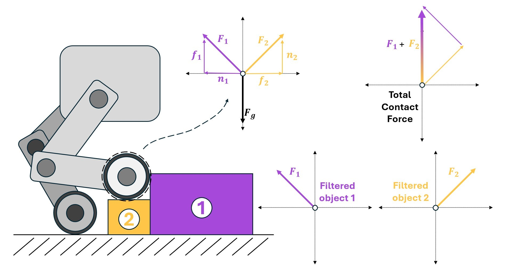
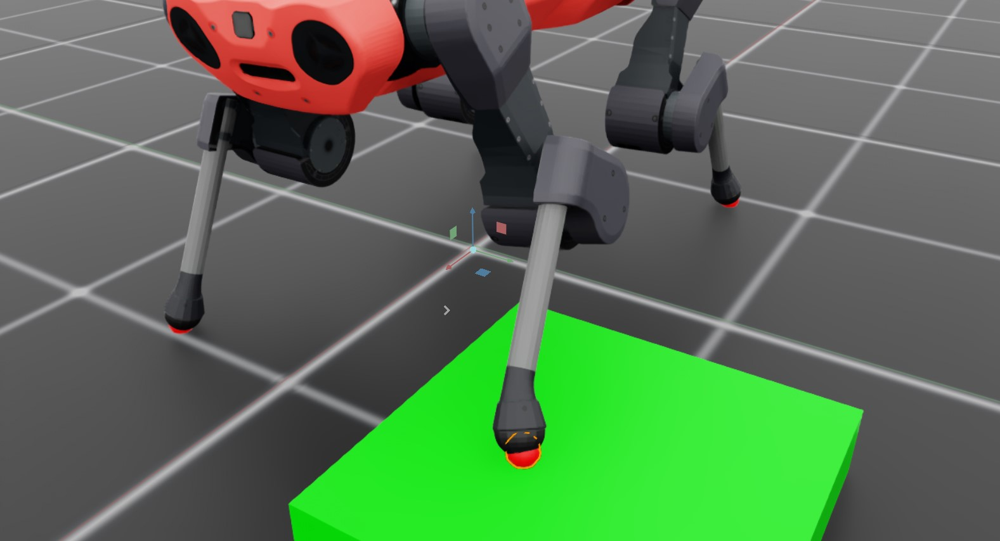

.. _overview_sensors_contact:

.. currentmodule:: isaaclab

接触传感器
==============

接触传感器用于返回作用在给定刚体上的净接触力。该传感器被设计为表现得像一个物理对象，因此接触传感器的"作用范围"仅限于定义它的刚体（或多个刚体）。根据你是否需要过滤来自接触的力，有多种方式可以定义这一范围。

默认情况下，报告的力是总的接触力，但你的应用可能只关心来自特定物体的接触力。从特定物体检索接触力需要进行过滤，而这只能以"多对一"的方式进行。一个需要对其足部进行可过滤接触信息采集的四足机器人，需要在环境中为每只脚定义一个传感器；而对于每个指尖上装有接触传感器的机械手，则可以用单个传感器来定义。

考虑一个包含 Anymal 四足机器人和一个立方块的简单环境

.. literalinclude:: ../../../../../scripts/demos/sensors/contact_sensor.py
    :language: python
    :lines: 40-90

我们以两种不同的方式在机器人足部定义传感器。前脚是独立的传感器（每只脚一个传感器刚体），"Cube" 被放置在左前脚下方。后脚则被定义为带有多个刚体的单个传感器。

然后我们运行场景并打印传感器的数据

.. code-block:: python

  def run_simulator(sim: sim_utils.SimulationContext, scene: InteractiveScene):
    .
    .
    .
    # Simulate physics
    while simulation_app.is_running():
      .
      .
      .
      # print information from the sensors
      print("-------------------------------")
      print(scene["contact_forces_LF"])
      print("Received force matrix of: ", scene["contact_forces_LF"].data.force_matrix_w)
      print("Received contact force of: ", scene["contact_forces_LF"].data.net_forces_w)
      print("-------------------------------")
      print(scene["contact_forces_RF"])
      print("Received force matrix of: ", scene["contact_forces_RF"].data.force_matrix_w)
      print("Received contact force of: ", scene["contact_forces_RF"].data.net_forces_w)
      print("-------------------------------")
      print(scene["contact_forces_H"])
      print("Received force matrix of: ", scene["contact_forces_H"].data.force_matrix_w)
      print("Received contact force of: ", scene["contact_forces_H"].data.net_forces_w)

这里，我们为场景中定义的每个接触传感器打印净接触力和过滤后的力矩阵。左前脚和右前脚报告的结果如下

.. code-block:: bash

  -------------------------------
  Contact sensor @ '/World/envs/env_.*/Robot/LF_FOOT':
          view type         : <class 'omni.physics.tensors.impl.api.RigidBodyView'>
          update period (s) : 0.0
          number of bodies  : 1
          body names        : ['LF_FOOT']

  Received force matrix of:  tensor([[[[-1.3923e-05,  1.5727e-04,  1.1032e+02]]]], device='cuda:0')
  Received contact force of:  tensor([[[-1.3923e-05,  1.5727e-04,  1.1032e+02]]], device='cuda:0')
  -------------------------------
  Contact sensor @ '/World/envs/env_.*/Robot/RF_FOOT':
          view type         : <class 'omni.physics.tensors.impl.api.RigidBodyView'>
          update period (s) : 0.0
          number of bodies  : 1
          body names        : ['RF_FOOT']

  Received force matrix of:  tensor([[[[0., 0., 0.]]]], device='cuda:0')
  Received contact force of:  tensor([[[1.3529e-05, 0.0000e+00, 1.0069e+02]]], device='cuda:0')

注意，即使启用了过滤，两个传感器报告的仍是作用在脚上的净接触力。然而，右脚的"力矩阵"为零，因为该脚没有与被过滤的物体 ``/World/envs/env_.*/Cube`` 发生接触。接下来，看看后脚的数据。

.. code-block:: bash

  -------------------------------
  Contact sensor @ '/World/envs/env_.*/Robot/.*H_FOOT':
          view type         : <class 'omni.physics.tensors.impl.api.RigidBodyView'>
          update period (s) : 0.0
          number of bodies  : 2
          body names        : ['LH_FOOT', 'RH_FOOT']

  Received force matrix of:  None
  Received contact force of:  tensor([[[9.7227e-06, 0.0000e+00, 7.2364e+01],
          [2.4322e-05, 0.0000e+00, 1.8102e+02]]], device='cuda:0')

在这个例子中，接触传感器有两个刚体：左后脚和右后脚。当查询力矩阵时，结果为 ``None``，因为这是一个多刚体传感器，而目前 Isaac Lab 仅支持"多对一"的接触力过滤。与单刚体接触传感器不同，报告的力张量有多个条目，每一"行"对应传感器中单个刚体上的接触力（与构造时的顺序一致）。

.. dropdown:: contact_sensor.py 的代码
   :icon: code

   .. literalinclude:: ../../../../../scripts/demos/sensors/contact_sensor.py
      :language: python
      :linenos:
