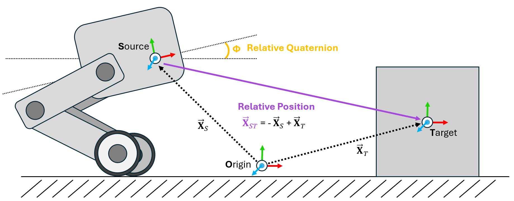

.. _overview_sensors_frame_transformer:

.. currentmodule:: isaaclab

坐标变换传感器（Frame Transformer）
====================================

..
  Do YOU want to know where things are relative to other things at a glance?  Then the frame transformer is the sensor for you!*

在物理仿真中需要执行的最常见操作之一就是坐标变换（frame transformation）：将向量或四元数重写到任意欧几里得坐标系的基下。在 Isaac 和 USD 中有很多方法可以做到这一点，但在 Isaac Lab 基于 GPU 的仿真和克隆环境中实现这些方法可能相当繁琐。为了缓解这一问题，我们设计了 Frame Transformer 传感器（坐标变换传感器），用于跟踪并计算场景中感兴趣的刚体之间的相对坐标变换。

该传感器最少由一个源坐标系（source frame）和一个目标坐标系列表定义。这些定义的形式是：一个 prim 路径（作为源），以及一个支持正则表达式的 prim 路径列表（作为目标），用于指定要跟踪的刚体。

.. literalinclude:: ../../../../../scripts/demos/sensors/frame_transformer_sensor.py
    :language: python
    :lines: 38-86

现在我们可以运行场景并向传感器查询数据

.. code-block:: python

  def run_simulator(sim: sim_utils.SimulationContext, scene: InteractiveScene):
    .
    .
    .
    # Simulate physics
    while simulation_app.is_running():
      .
      .
      .

      # print information from the sensors
      print("-------------------------------")
      print(scene["specific_transforms"])
      print("relative transforms:", scene["specific_transforms"].data.target_pos_source)
      print("relative orientations:", scene["specific_transforms"].data.target_quat_source)
      print("-------------------------------")
      print(scene["cube_transform"])
      print("relative transform:", scene["cube_transform"].data.target_pos_source)
      print("-------------------------------")
      print(scene["robot_transforms"])
      print("relative transforms:", scene["robot_transforms"].data.target_pos_source)

我们来看看跟踪特定物体的结果。首先，可以看一下来自足部传感器的数据

.. code-block:: bash

  -------------------------------
  FrameTransformer @ '/World/envs/env_.*/Robot/base':
          tracked body frames: ['base', 'LF_FOOT', 'RF_FOOT']
          number of envs: 1
          source body frame: base
          target frames (count: ['LF_FOOT', 'RF_FOOT']): 2

  relative transforms: tensor([[[ 0.4658,  0.3085, -0.4840],
          [ 0.4487, -0.2959, -0.4828]]], device='cuda:0')
  relative orientations: tensor([[[ 0.9623,  0.0072, -0.2717, -0.0020],
          [ 0.9639,  0.0052, -0.2663, -0.0014]]], device='cuda:0')

.. figure:: ../../../_static/overview/sensors/frame_transformer_visualizer.jpg
    :align: center
    :figwidth: 100%
    :alt: The frame transformer visualizer

通过激活可视化器，我们可以看到足部的坐标系被略微"向上"旋转了。我们还可以通过向传感器查询数据来查看显式的相对位置和旋转，返回值以列表形式给出，其顺序与被跟踪的坐标系一致。如果我们检查由正则表达式指定的坐标变换，这一点会体现得更加明显。

.. code-block:: bash

  -------------------------------
  FrameTransformer @ '/World/envs/env_.*/Robot/base':
          tracked body frames: ['base', 'LF_FOOT', 'LF_HIP', 'LF_SHANK', 'LF_THIGH', 'LH_FOOT', 'LH_HIP', 'LH_SHANK', 'LH_THIGH', 'RF_FOOT', 'RF_HIP', 'RF_SHANK', 'RF_THIGH', 'RH_FOOT', 'RH_HIP', 'RH_SHANK', 'RH_THIGH', 'base']
          number of envs: 1
          source body frame: base
          target frames (count: ['LF_FOOT', 'LF_HIP', 'LF_SHANK', 'LF_THIGH', 'LH_FOOT', 'LH_HIP', 'LH_SHANK', 'LH_THIGH', 'RF_FOOT', 'RF_HIP', 'RF_SHANK', 'RF_THIGH', 'RH_FOOT', 'RH_HIP', 'RH_SHANK', 'RH_THIGH', 'base']): 17

  relative transforms: tensor([[[ 4.6581e-01,  3.0846e-01, -4.8398e-01],
          [ 2.9990e-01,  1.0400e-01, -1.7062e-09],
          [ 2.1409e-01,  2.9177e-01, -2.4214e-01],
          [ 3.5980e-01,  1.8780e-01,  1.2608e-03],
          [-4.8813e-01,  3.0973e-01, -4.5927e-01],
          [-2.9990e-01,  1.0400e-01,  2.7044e-09],
          [-2.1495e-01,  2.9264e-01, -2.4198e-01],
          [-3.5980e-01,  1.8780e-01,  1.5582e-03],
          [ 4.4871e-01, -2.9593e-01, -4.8277e-01],
          [ 2.9990e-01, -1.0400e-01, -2.7057e-09],
          [ 1.9971e-01, -2.8554e-01, -2.3778e-01],
          [ 3.5980e-01, -1.8781e-01, -9.1049e-04],
          [-5.0090e-01, -2.9095e-01, -4.5746e-01],
          [-2.9990e-01, -1.0400e-01,  6.3592e-09],
          [-2.1860e-01, -2.8251e-01, -2.5163e-01],
          [-3.5980e-01, -1.8779e-01, -1.8792e-03],
          [ 0.0000e+00,  0.0000e+00,  0.0000e+00]]], device='cuda:0')

这里，传感器跟踪的是 ``Robot/base`` 的所有刚体子级，但该表达式是**包含性的**，也就是说源刚体本身也是一个目标。这一点既可以从源和目标列表中看出（``base`` 出现了两次），也可以从返回的数据中看出（传感器返回了它相对于自身的变换，即 (0, 0, 0)）。

.. dropdown:: frame_transformer_sensor.py 的代码
   :icon: code

   .. literalinclude:: ../../../../../scripts/demos/sensors/frame_transformer_sensor.py
      :language: python
      :linenos:
