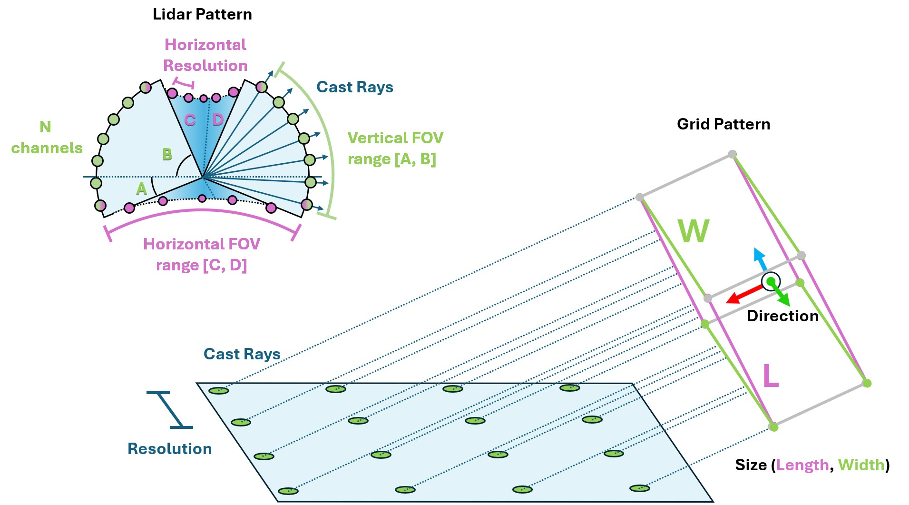
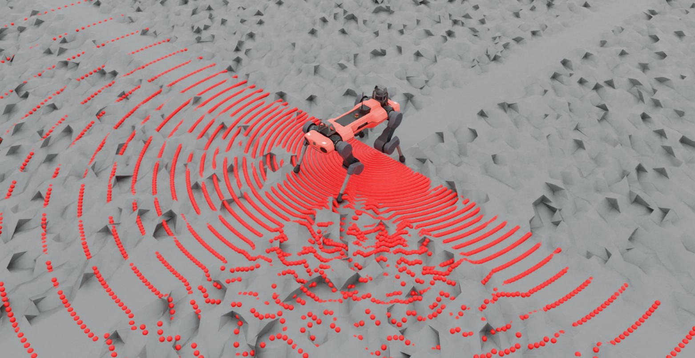

.. _overview_sensors_ray_caster:

.. currentmodule:: isaaclab

光线投射传感器
================

光线投射传感器（Ray Caster）与基于 RTX 的渲染类似，因为它们都涉及投射光线。区别在于，Ray Caster 传感器投射的光线沿投射方向只返回碰撞信息，并且每条光线的方向都可以指定。光线不会反弹，也不受材质或透明度等因素的影响。对于传感器指定的每条光线，系统会沿其路径追踪一条线，并返回与指定网格首次碰撞的位置。我们的一些四足机器人示例就是使用这种方法来测量局部高度场的。

为了在存在大量克隆环境时保持传感器的性能，线追踪是直接在 `Warp <https://nvidia.github.io/warp/>`_ 中完成的。这也是为什么需要指定用于投射的特定网格：在传感器初始化时，Warp 会将这些网格数据加载到设备上。因此，当前版本的传感器只适用于完全静态的网格（即 *未从其 USD 文件中指定的默认值做任何更改* 的网格）。这一限制将在未来的版本中移除。

使用光线投射传感器需要一个**模式（pattern）**和一个要挂载到的父级 xform。模式定义了光线的投射方式，而 prim 属性定义了传感器的朝向和位置（可以指定额外的偏移量以实现更精确的放置）。Isaac Lab 支持多种光线投射模式配置，包括通用的 LIDAR 模式和网格模式。

.. literalinclude:: ../../../../../scripts/demos/sensors/raycaster_sensor.py
    :language: python
    :lines: 40-71

注意，模式配置中的单位是角度（度）。此外，我们在这里启用了可视化，以便在渲染中显式展示该模式，但这并非必需，在进行性能调优时应将其禁用。

可以像其他传感器一样，在仿真运行时向传感器查询数据。

.. code-block:: python

  def run_simulator(sim: sim_utils.SimulationContext, scene: InteractiveScene):
    .
    .
    .
    # Simulate physics
    while simulation_app.is_running():
      .
      .
      .
      # print information from the sensors
        print("-------------------------------")
        print(scene["ray_caster"])
        print("Ray cast hit results: ", scene["ray_caster"].data.ray_hits_w)

.. code-block:: bash

    -------------------------------
    Ray-caster @ '/World/envs/env_.*/Robot/base/lidar_cage':
            view type            : <class 'isaacsim.core.prims.xform_prim.XFormPrim'>
            update period (s)    : 0.016666666666666666
            number of meshes     : 1
            number of sensors    : 1
            number of rays/sensor: 18000
            total number of rays : 18000
    Ray cast hit results:  tensor([[[-0.3698,  0.0357,  0.0000],
            [-0.3698,  0.0357,  0.0000],
            [-0.3698,  0.0357,  0.0000],
            ...,
            [    inf,     inf,     inf],
            [    inf,     inf,     inf],
            [    inf,     inf,     inf]]], device='cuda:0')
    -------------------------------

这里我们可以看到传感器自身返回的数据。首先注意开头和结尾各有 3 个连续的右方括号：这是因为返回的数据按传感器数量进行了分批（batch）。光线投射模式本身也被展平了，因此数组的维度为 ``[N, B, 3]``，其中 ``N`` 是传感器的数量，``B`` 是模式中投射光线的数量，3 是投射空间的维度。最后，注意投射模式中开头几个值是相同的：这是因为 LIDAR 模式是球形的，而我们指定的视场角（FOV）是半球形的，其中包含了极点。在这种配置下，"模式展平"的规律变得很明显：前 180 个条目是相同的，因为它们是该半球的底部极点，之所以有 180 个，是因为我们的水平视场角为 180 度、分辨率为 1 度。

你可以使用这个脚本试验不同的模式配置，并通过修改第 81 行的 ``triggered`` 变量来建立对数据存储方式的直观认识。

.. dropdown:: raycaster_sensor.py 的代码
   :icon: code

   .. literalinclude:: ../../../../../scripts/demos/sensors/raycaster_sensor.py
      :language: python
      :linenos:
