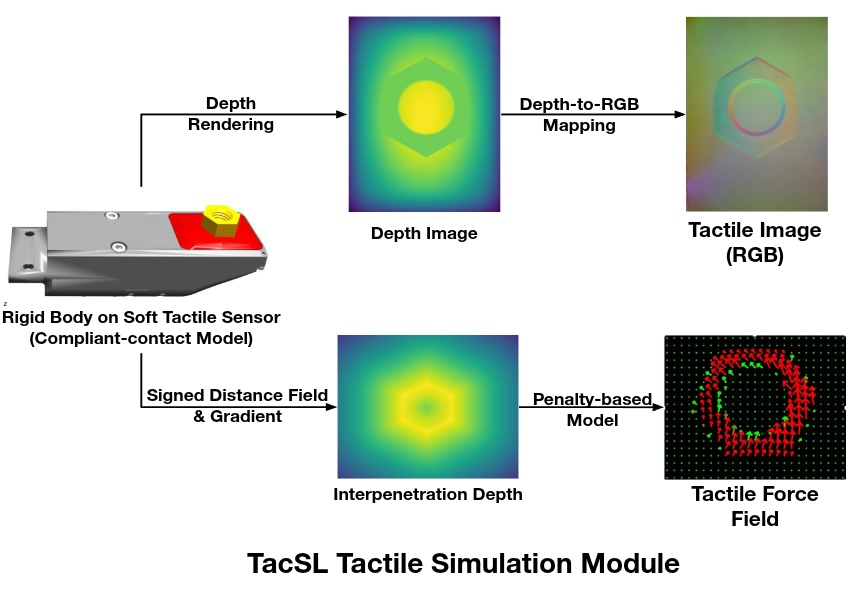
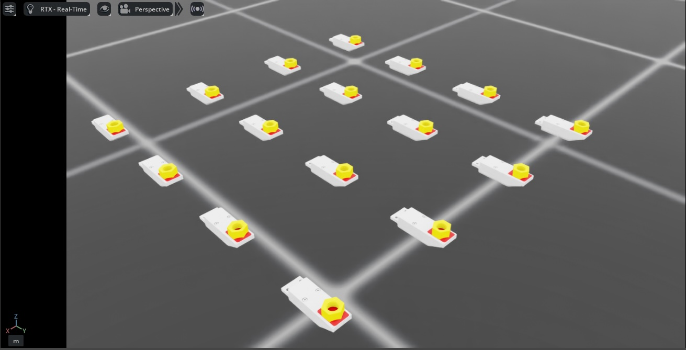

.. _overview_sensors_tactile:

.. currentmodule:: isaaclab

视触觉传感器
====================

Isaac Lab 中的视触觉传感器通过与 TacSL（Tactile Sensor Learning）[Akinola2025]_ 的集成，提供了逼真的触觉反馈。它旨在仿真高保真的触觉交互，生成与 GelSight 等真实触觉传感器相对应的视觉数据和力数据。该传感器可以提供触觉 RGB 图像、力场分布以及其他中间触觉测量值，这些对于需要精细触觉反馈的机器人操作任务至关重要。

配置
~~~~~~~~~~~~~

触觉传感器需要特定的配置参数来定义其行为和数据采集属性。传感器可以通过多种参数进行配置，包括传感器分辨率、力灵敏度和输出数据类型。

.. code-block:: python

    from isaaclab.sensors import TiledCameraCfg
    from isaaclab_assets.sensors import GELSIGHT_R15_CFG
    import isaaclab.sim as sim_utils

    from isaaclab_contrib.sensors.tacsl_sensor import VisuoTactileSensorCfg

    # Tactile sensor configuration
    tactile_sensor = VisuoTactileSensorCfg(
        prim_path="{ENV_REGEX_NS}/Robot/elastomer/tactile_sensor",
        ## Sensor configuration
        render_cfg=GELSIGHT_R15_CFG,
        enable_camera_tactile=True,
        enable_force_field=True,
        ## Elastomer configuration
        tactile_array_size=(20, 25),
        tactile_margin=0.003,
        ## Contact object configuration
        contact_object_prim_path_expr="{ENV_REGEX_NS}/contact_object",
        ## Force field physics parameters
        normal_contact_stiffness=1.0,
        friction_coefficient=2.0,
        tangential_stiffness=0.1,
        ## Camera configuration
        camera_cfg=TiledCameraCfg(
            prim_path="{ENV_REGEX_NS}/Robot/elastomer_tip/cam",
            update_period=1 / 60,  # 60 Hz
            height=320,
            width=240,
            data_types=["distance_to_image_plane"],
            spawn=None,  # camera already spawned in USD file
        ),
    )

该配置支持自定义以下内容：

* **渲染配置**：使用预定义配置指定 GelSight 传感器的渲染参数
  （例如 ``isaaclab_assets.sensors`` 中的 ``GELSIGHT_R15_CFG``、``GELSIGHT_MINI_CFG``）
* **触觉模态**：
    * ``enable_camera_tactile`` - 启用通过相机传感器进行的触觉 RGB 成像
    * ``enable_force_field`` - 启用力场计算与可视化
* **力场网格**：设置触觉网格尺寸（``tactile_array_size``）和边距，这会直接影响计算出的力场的空间分辨率
* **接触物体配置**：使用 prim 路径表达式定义交互物体的属性，以定位具有 SDF 碰撞网格的物体
* **物理参数**：控制传感器的力场计算：
    * ``normal_contact_stiffness``、``friction_coefficient``、``tangential_stiffness`` - 法向刚度、摩擦系数和切向刚度
* **相机设置**：配置分辨率、更新频率和数据类型，目前仅支持 ``distance_to_image_plane`` （``depth`` 的别名）。
    ``spawn`` 默认设置为 ``None``，表示相机已在 USD 文件中生成。
    如果你想自行生成相机并设置焦距等参数，可以将生成配置设置为一个有效的生成配置。

配置要求
~~~~~~~~~~~~~~~~~~~~~~~~~~

.. important::
   要使传感器正常工作，必须满足以下要求：

   **相机触觉成像**
      如果 ``enable_camera_tactile=True`` ，则必须提供带有合适相机参数的有效 ``camera_cfg`` （TiledCameraCfg）。

   **力场计算**
      如果 ``enable_force_field=True``，则需要以下参数：

      * ``contact_object_prim_path_expr`` - 用于定位具有 SDF 碰撞网格的接触物体的 prim 路径表达式

   **SDF 计算**
      当启用力场计算时，将使用有符号距离场（SDF）查询来计算基于惩罚的法向力和剪切力。为实现 GPU 加速：

      * 交互物体应具有 SDF 碰撞网格
      * 初始化时必须定义 SDFView，因此应在仿真开始前指定交互物体。

   **弹性体配置**
      传感器的 ``prim_path`` 必须配置为 USD 层级中弹性体（elastomer）prim 的子级。
      力场计算的查询点是从弹性体网格的表面计算的，该网格在弹性体的 prim 路径下搜索。

   **物理材质**
      传感器使用物理材质来配置弹性体的柔性接触属性。
      默认情况下，物理材质属性已在 USD 资产中预先配置。不过，你可以在生成机器人时，
      通过在 ``UsdFileWithCompliantContactCfg`` 中指定以下参数来覆盖这些属性：

      * ``compliant_contact_stiffness`` - 弹性体表面的接触刚度
      * ``compliant_contact_damping`` - 弹性体表面的接触阻尼
      * ``physics_material_prim_path`` - 应用物理材质的 prim 路径（通常为 ``"elastomer"``）

      如果任何参数被设置为 ``None``，则将保留 USD 资产中对应的属性。

使用示例
~~~~~~~~~~~~~

要在仿真环境中使用触觉传感器，运行以下演示：

.. code-block:: bash

    cd scripts/demos/sensors
    python tacsl_sensor.py --use_tactile_rgb --use_tactile_ff --tactile_compliance_stiffness 100.0 --tactile_compliant_damping 1.0 --contact_object_type nut --num_envs 16 --save_viz --enable_cameras

可用的命令行选项包括：

* ``--use_tactile_rgb``：启用基于相机的触觉感知
* ``--use_tactile_ff``：启用力场触觉感知
* ``--contact_object_type``：指定接触物体的类型（nut、cube 等）
* ``--num_envs``：并行环境的数量
* ``--save_viz``：保存可视化输出以供分析
* ``--tactile_compliance_stiffness``：覆盖柔性接触刚度（默认：使用 USD 资产中的值）
* ``--tactile_compliant_damping``：覆盖柔性接触阻尼（默认：使用 USD 资产中的值）
* ``--normal_contact_stiffness``：用于力场计算的法向接触刚度
* ``--tangential_stiffness``：用于剪切力的切向刚度
* ``--friction_coefficient``：用于剪切力的摩擦系数
* ``--debug_sdf_closest_pts``：可视化最近的 SDF 点以进行调试
* ``--debug_tactile_sensor_pts``：可视化触觉传感器点以进行调试
* ``--trimesh_vis_tactile_points``：启用基于 trimesh 的触觉点可视化

要查看可用选项的完整列表：

.. code-block:: bash

    python tacsl_sensor.py -h

.. note::
   该演示示例基于 Gelsight R1.5，这是一款现已停产的原型传感器。同样的流程也可适用于其他视触觉传感器。

触觉传感器支持多种数据模态，可提供有关接触交互的全面信息：

输出的触觉数据
~~~~~~~~~~~~~~~~~~~
**RGB 触觉图像**
    在物体与传感器表面接触时实时生成触觉 RGB 图像。这些图像所展示的形变模式和接触几何与基于凝胶的触觉传感器类似 [Si2022]_

**力场**
    传感器表面上详细的接触力场和压力分布，包括法向和切向分量。

.. list-table::
   :widths: 50 50
   :class: borderless

   * - .. figure:: ../../../_static/overview/sensors/tacsl_taxim_example.jpg
          :align: center
          :figwidth: 80%
          :alt: Tactile output with RGB visualization

     - .. figure:: ../../../_static/overview/sensors/tacsl_force_field_example.jpg
          :align: center
          :figwidth: 80%
          :alt: Tactile output with force field visualization

与学习框架的集成
~~~~~~~~~~~~~~~~~~~~~~~~~~~~~~~~~~~~

触觉传感器旨在与强化学习和模仿学习框架无缝集成。结构化的张量输出可以直接用作学习算法中的观测：

.. code-block:: python

    def get_tactile_observations(self):
        """Extract tactile observations for learning."""
        tactile_data = self.scene["tactile_sensor"].data

        # tactile RGB image
        tactile_rgb = tactile_data.tactile_rgb_image

        # tactile depth image
        tactile_depth = tactile_data.tactile_depth_image

        # force field
        tactile_normal_force = tactile_data.tactile_normal_force
        tactile_shear_force = tactile_data.tactile_shear_force

        return [tactile_rgb, tactile_depth, tactile_normal_force, tactile_shear_force]

参考文献
~~~~~~~~~~

.. [Akinola2025] Akinola, I., Xu, J., Carius, J., Fox, D., & Narang, Y. (2025). TacSL: A library for visuotactile sensor simulation and learning. *IEEE Transactions on Robotics*.
.. [Si2022] Si, Z., & Yuan, W. (2022). Taxim: An example-based simulation model for GelSight tactile sensors. *IEEE Robotics and Automation Letters*, 7(2), 2361-2368.
