.. _environments:

可用环境
======================

以下列表包含了 Isaac Lab 中当前可用的所有 RL 和 IL 任务实现。我们会尽力保持该列表的时效性，
但你始终可以通过运行以下命令获取最新的环境列表：

.. tab-set::
   :sync-group: os

   .. tab-item:: :icon:`fa-brands fa-linux` Linux
      :sync: linux

      .. note::
         可以使用 ``--keyword <search_term>`` （可选）按关键字筛选环境。

      .. code:: bash

         ./isaaclab.sh -p scripts/environments/list_envs.py --keyword <search_term>

   .. tab-item:: :icon:`fa-brands fa-windows` Windows
      :sync: windows

      .. note::
         可以使用 ``--keyword <search_term>`` （可选）按关键字筛选环境。

      .. code:: batch

         isaaclab.bat -p scripts\environments\list_envs.py --keyword <search_term>

我们正在积极地向该列表中添加更多环境。如果你有想要添加到 Isaac Lab 中的环境，
欢迎随时提交 pull request！

单智能体
------------

经典环境
~~~~~~~~

经典环境基于 IsaacGymEnvs 对 MuJoCo 风格环境的实现。

.. table::
    :widths: 33 37 30

    +------------------+-----------------------------+-------------------------------------------------------------------------+
    | 世界             | 环境 ID                     | 描述                                                                    |
    +==================+=============================+=========================================================================+
    | |humanoid|       | |humanoid-link|             | 使用 MuJoCo 人形机器人朝某个方向移动                                    |
    |                  |                             |                                                                         |
    |                  | |humanoid-direct-link|      |                                                                         |
    +------------------+-----------------------------+-------------------------------------------------------------------------+
    | |ant|            | |ant-link|                  | 使用 MuJoCo 蚂蚁机器人朝某个方向移动                                    |
    |                  |                             |                                                                         |
    |                  | |ant-direct-link|           |                                                                         |
    +------------------+-----------------------------+-------------------------------------------------------------------------+
    | |cartpole|       | |cartpole-link|             | 经典 cartpole 控制：移动小车使杆保持竖直向上                            |
    |                  |                             |                                                                         |
    |                  | |cartpole-direct-link|      |                                                                         |
    +------------------+-----------------------------+-------------------------------------------------------------------------+
    | |cartpole|       | |cartpole-rgb-link|         | 经典 cartpole 控制：移动小车使杆保持竖直向上，                          |
    |                  |                             | 并使用感知输入。需要以 ``--enable_cameras`` 运行。                      |
    |                  | |cartpole-depth-link|       |                                                                         |
    |                  |                             |                                                                         |
    |                  | |cartpole-rgb-direct-link|  |                                                                         |
    |                  |                             |                                                                         |
    |                  | |cartpole-depth-direct-link||                                                                         |
    +------------------+-----------------------------+-------------------------------------------------------------------------+
    | |cartpole|       | |cartpole-resnet-link|      | 经典 cartpole 控制：基于预训练冻结视觉编码器从感知                      |
    |                  |                             | 输入中提取的特征，移动小车使杆保持竖直向上。需要                        |
    |                  | |cartpole-theia-link|       | 以 ``--enable_cameras`` 运行。                                          |
    +------------------+-----------------------------+-------------------------------------------------------------------------+

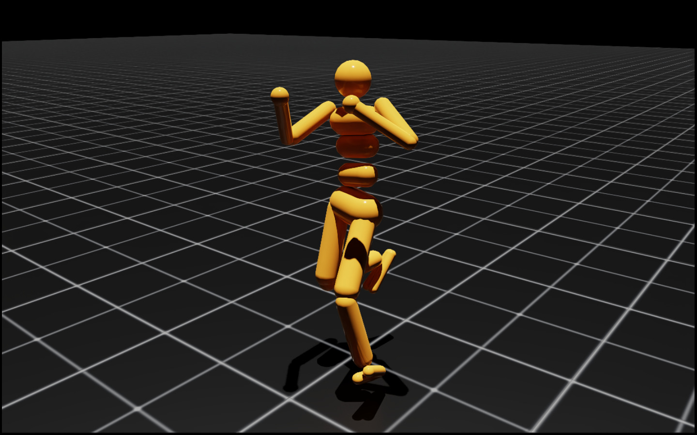
.. |ant| image:: ../_static/tasks/classic/ant.jpg
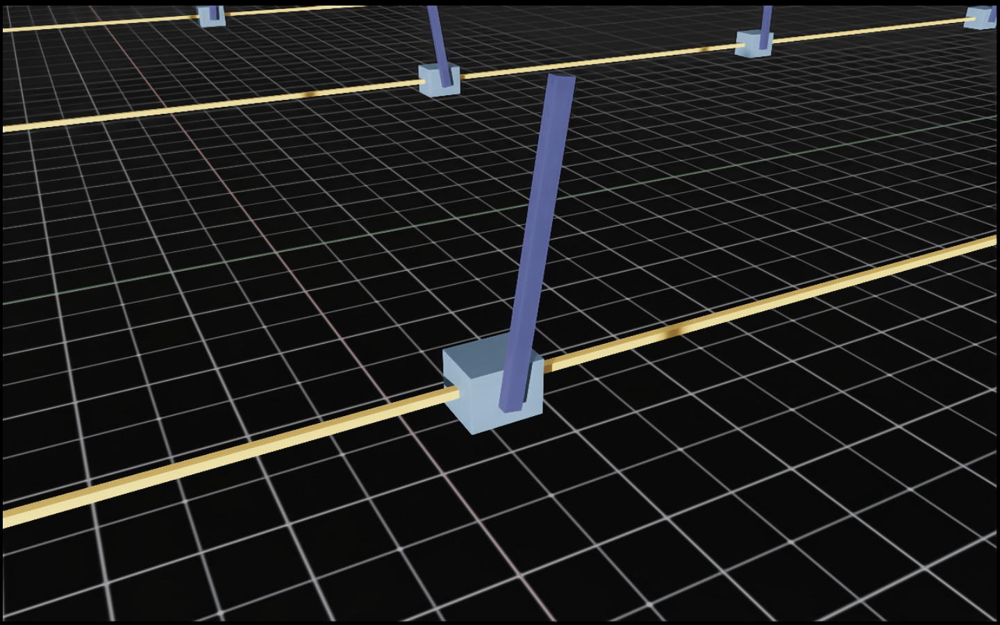

.. |humanoid-link| replace:: `Isaac-Humanoid-v0 <https://github.com/isaac-sim/IsaacLab/blob/main/source/isaaclab_tasks/isaaclab_tasks/manager_based/classic/humanoid/humanoid_env_cfg.py>`__
.. |ant-link| replace:: `Isaac-Ant-v0 <https://github.com/isaac-sim/IsaacLab/blob/main/source/isaaclab_tasks/isaaclab_tasks/manager_based/classic/ant/ant_env_cfg.py>`__
.. |cartpole-link| replace:: `Isaac-Cartpole-v0 <https://github.com/isaac-sim/IsaacLab/blob/main/source/isaaclab_tasks/isaaclab_tasks/manager_based/classic/cartpole/cartpole_env_cfg.py>`__
.. |cartpole-rgb-link| replace:: `Isaac-Cartpole-RGB-v0 <https://github.com/isaac-sim/IsaacLab/blob/main/source/isaaclab_tasks/isaaclab_tasks/manager_based/classic/cartpole/cartpole_camera_env_cfg.py>`__
.. |cartpole-depth-link| replace:: `Isaac-Cartpole-Depth-v0 <https://github.com/isaac-sim/IsaacLab/blob/main/source/isaaclab_tasks/isaaclab_tasks/manager_based/classic/cartpole/cartpole_camera_env_cfg.py>`__
.. |cartpole-resnet-link| replace:: `Isaac-Cartpole-RGB-ResNet18-v0 <https://github.com/isaac-sim/IsaacLab/blob/main/source/isaaclab_tasks/isaaclab_tasks/manager_based/classic/cartpole/cartpole_camera_env_cfg.py>`__
.. |cartpole-theia-link| replace:: `Isaac-Cartpole-RGB-TheiaTiny-v0 <https://github.com/isaac-sim/IsaacLab/blob/main/source/isaaclab_tasks/isaaclab_tasks/manager_based/classic/cartpole/cartpole_camera_env_cfg.py>`__

.. |humanoid-direct-link| replace:: `Isaac-Humanoid-Direct-v0 <https://github.com/isaac-sim/IsaacLab/blob/main/source/isaaclab_tasks/isaaclab_tasks/direct/humanoid/humanoid_env.py>`__
.. |ant-direct-link| replace:: `Isaac-Ant-Direct-v0 <https://github.com/isaac-sim/IsaacLab/blob/main/source/isaaclab_tasks/isaaclab_tasks/direct/ant/ant_env.py>`__
.. |cartpole-direct-link| replace:: `Isaac-Cartpole-Direct-v0 <https://github.com/isaac-sim/IsaacLab/blob/main/source/isaaclab_tasks/isaaclab_tasks/direct/cartpole/cartpole_env.py>`__
.. |cartpole-rgb-direct-link| replace:: `Isaac-Cartpole-RGB-Camera-Direct-v0 <https://github.com/isaac-sim/IsaacLab/blob/main/source/isaaclab_tasks/isaaclab_tasks/direct/cartpole/cartpole_camera_env.py>`__
.. |cartpole-depth-direct-link| replace:: `Isaac-Cartpole-Depth-Camera-Direct-v0 <https://github.com/isaac-sim/IsaacLab/blob/main/source/isaaclab_tasks/isaaclab_tasks/direct/cartpole/cartpole_camera_env.py>`__

机械臂操作
~~~~~~~~~~~~

基于固定基座机械臂操作任务的环境。

对于其中许多任务，我们提供了带有不同机械臂动作空间的配置。例如，
对于 lift-cube 环境：

* |lift-cube-link|：采用关节位置控制的 Franka 机械臂
* |lift-cube-ik-abs-link|：采用绝对 IK 控制的 Franka 机械臂
* |lift-cube-ik-rel-link|：采用相对 IK 控制的 Franka 机械臂

.. table::
    :widths: 33 37 30

    +-------------------------+------------------------------+-----------------------------------------------------------------------------+
    | 世界                    | 环境 ID                      | 描述                                                                        |
    +=========================+==============================+=============================================================================+
    | |reach-franka|          | |reach-franka-link|          | 使用 Franka 机器人将末端执行器移动到采样的目标位姿                          |
    +-------------------------+------------------------------+-----------------------------------------------------------------------------+
    | |reach-ur10|            | |reach-ur10-link|            | 使用 UR10 机器人将末端执行器移动到采样的目标位姿                            |
    +-------------------------+------------------------------+-----------------------------------------------------------------------------+
    | |deploy-reach-ur10e|    | |deploy-reach-ur10e-link|    | 使用 UR10e 机器人将末端执行器移动到采样的目标位姿                           |
    |                         |                              | 该策略已部署到真实机器人上                                                  |
    +-------------------------+------------------------------+-----------------------------------------------------------------------------+
    | |lift-cube|             | |lift-cube-link|             | 使用 Franka 机器人抓起立方体并将其移动到采样的目标位置                      |
    +-------------------------+------------------------------+-----------------------------------------------------------------------------+
    | |stack-cube|            | |stack-cube-link|            | 使用 Franka 机器人堆叠三个立方体（从下到上：蓝、红、绿）。                  |
    |                         |                              | 用于 NVIDIA Isaac GR00T 蓝图合成操作运动生成的蓝图环境                      |
    |                         | |stack-cube-bp-link|         |                                                                             |
    +-------------------------+------------------------------+-----------------------------------------------------------------------------+
    | |surface-gripper|       | |long-suction-link|          | 使用 UR10 机械臂和长面吸盘（long surface gripper）                          |
    |                         |                              | 或短面吸盘堆叠三个立方体（从下到上：蓝、红、绿）。                          |
    |                         | |short-suction-link|         |                                                                             |
    +-------------------------+------------------------------+-----------------------------------------------------------------------------+
    | |cabi-franka|           | |cabi-franka-link|           | 使用 Franka 机器人抓住柜子抽屉的把手并将其拉开                              |
    |                         |                              |                                                                             |
    |                         | |franka-direct-link|         |                                                                             |
    +-------------------------+------------------------------+-----------------------------------------------------------------------------+
    | |cube-allegro|          | |cube-allegro-link|          | 使用 Allegro 灵巧手在手中重新定向一个立方体                                 |
    |                         |                              |                                                                             |
    |                         | |allegro-direct-link|        |                                                                             |
    +-------------------------+------------------------------+-----------------------------------------------------------------------------+
    | |cube-shadow|           | |cube-shadow-link|           | 使用 Shadow 灵巧手在手中重新定向一个立方体                                  |
    |                         |                              |                                                                             |
    |                         | |cube-shadow-ff-link|        |                                                                             |
    |                         |                              |                                                                             |
    |                         | |cube-shadow-lstm-link|      |                                                                             |
    +-------------------------+------------------------------+-----------------------------------------------------------------------------+
    | |cube-shadow|           | |cube-shadow-vis-link|       | 使用 Shadow 灵巧手并基于感知输入在手中重新定向一个立方体。                  |
    |                         |                              | 需要以 ``--enable_cameras`` 运行。                                          |
    +-------------------------+------------------------------+-----------------------------------------------------------------------------+
    | |gr1_pick_place|        | |gr1_pick_place-link|        | 使用 GR-1 人形机器人将物体拾起并放入篮子中                                  |
    +-------------------------+------------------------------+-----------------------------------------------------------------------------+
    | |gr1_pp_waist|          | |gr1_pp_waist-link|          | 使用 GR-1 人形机器人将物体拾起并放入篮子中，                                |
    |                         |                              | 通过启用腰部自由度提供更大的可达空间。                                      |
    +-------------------------+------------------------------+-----------------------------------------------------------------------------+
    | |g1_pick_place|         | |g1_pick_place-link|         | 使用 Unitree G1 人形机器人将物体拾起并放入篮子中                            |
    +-------------------------+------------------------------+-----------------------------------------------------------------------------+
    | |g1_pick_place_fixed|   | |g1_pick_place_fixed-link|   | 使用 Unitree G1 人形机器人将物体拾起并放入篮子中，                          |
    |                         |                              | 该机器人配备三指灵巧手，基座被固定在原地。                                  |
    +-------------------------+------------------------------+-----------------------------------------------------------------------------+
    | |g1_pick_place_lm|      | |g1_pick_place_lm-link|      | 使用 Unitree G1 人形机器人将物体拾起并放入篮子中，                          |
    |                         |                              | 该机器人配备三指灵巧手，并启用了原位移动操作                                |
    |                         |                              | （locomanipulation）能力（即机器人下半身在原地保持平衡，                    |
    |                         |                              | 上半身通过逆运动学控制）。                                                  |
    +-------------------------+------------------------------+-----------------------------------------------------------------------------+
    | |kuka-allegro-lift|     | |kuka-allegro-lift-link|     | 拾起桌面上的基本形状物体并将其提升到目标位置                                |
    +-------------------------+------------------------------+-----------------------------------------------------------------------------+
    | |kuka-allegro-reorient| | |kuka-allegro-reorient-link| | 拾起桌面上的基本形状物体并将其调整到目标位姿                                |
    +-------------------------+------------------------------+-----------------------------------------------------------------------------+
    | |galbot_stack|          | |galbot_stack-link|          | 使用 Galbot 人形机器人的左臂堆叠三个立方体                                  |
    |                         |                              | （从下到上：蓝、红、绿）                                                    |
    +-------------------------+------------------------------+-----------------------------------------------------------------------------+
    | |agibot_place_mug|      | |agibot_place_mug-link|      | 使用 Agibot A2D 人形机器人将马克杯直立放置                                  |
    +-------------------------+------------------------------+-----------------------------------------------------------------------------+
    | |agibot_place_toy|      | |agibot_place_toy-link|      | 使用 Agibot A2D 人形机器人将物体拾起并放入盒子中                            |
    +-------------------------+------------------------------+-----------------------------------------------------------------------------+
    | |reach_openarm_bi|      | |reach_openarm_bi-link|      | 使用 OpenArm 机器人将末端执行器移动到多个采样的目标位姿                     |
    +-------------------------+------------------------------+-----------------------------------------------------------------------------+
    | |reach_openarm_uni|     | |reach_openarm_uni-link|     | 使用 OpenArm 机器人将末端执行器移动到采样的目标位姿                         |
    +-------------------------+------------------------------+-----------------------------------------------------------------------------+
    | |lift_openarm_uni|      | |lift_openarm_uni-link|      | 使用 OpenArm 机器人抓起立方体并将其移动到采样的目标位置                     |
    +-------------------------+------------------------------+-----------------------------------------------------------------------------+
    | |cabi_openarm_uni|      | |cabi_openarm_uni-link|      | 使用 OpenArm 机器人抓住柜子抽屉的把手并将其拉开                             |
    +-------------------------+------------------------------+-----------------------------------------------------------------------------+

.. |reach-franka| image:: ../_static/tasks/manipulation/franka_reach.jpg
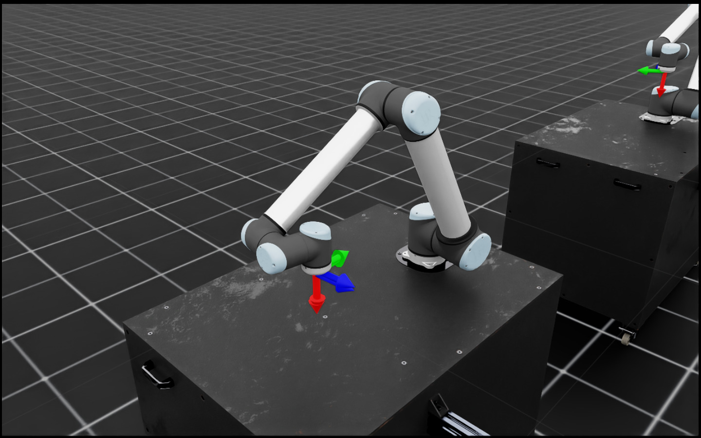
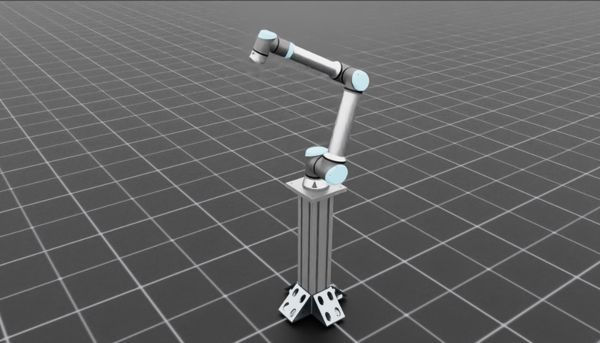
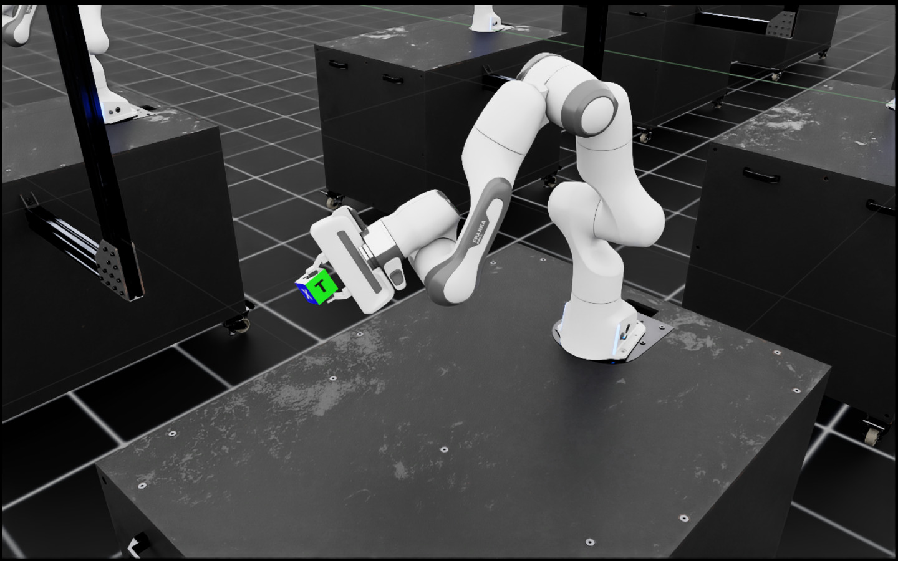
.. |cabi-franka| image:: ../_static/tasks/manipulation/franka_open_drawer.jpg
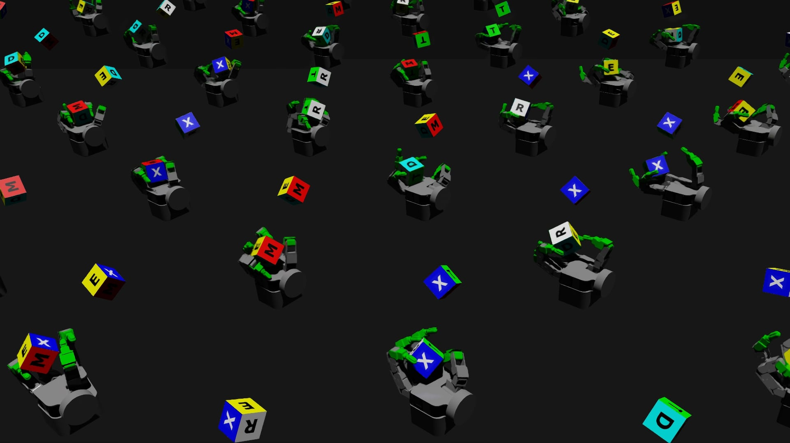
.. |cube-shadow| image:: ../_static/tasks/manipulation/shadow_cube.jpg
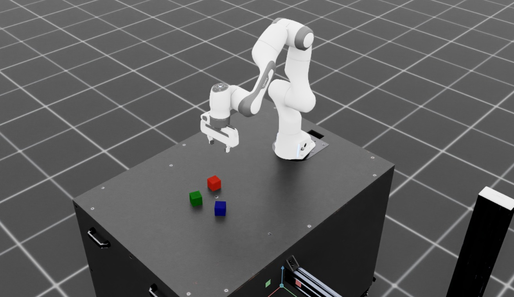
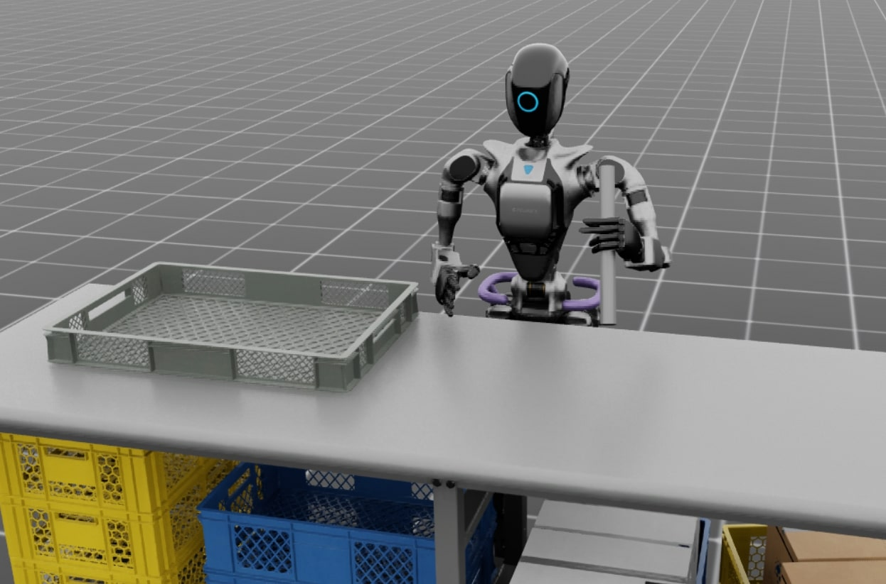
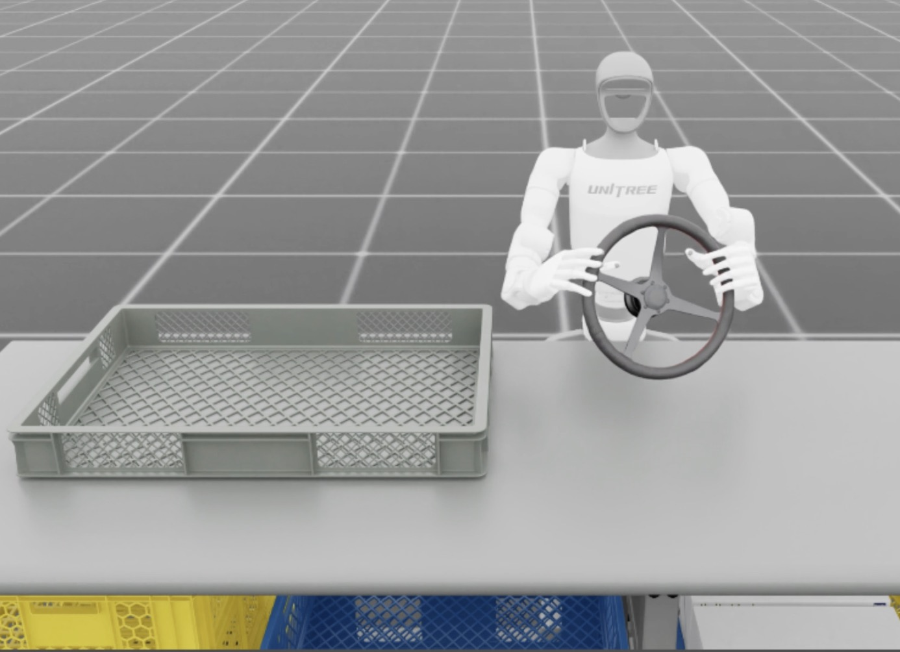
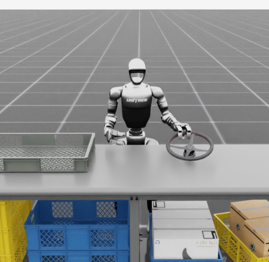
.. |g1_pick_place_lm| image:: ../_static/tasks/manipulation/g1_pick_place_locomanipulation.jpg
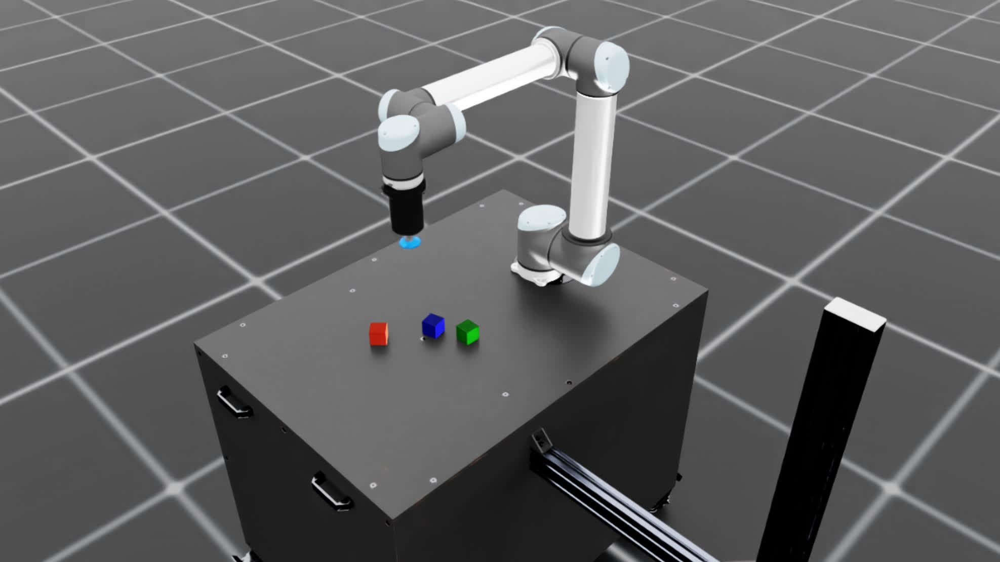
.. |gr1_pp_waist| image:: ../_static/tasks/manipulation/gr-1_pick_place_waist.jpg
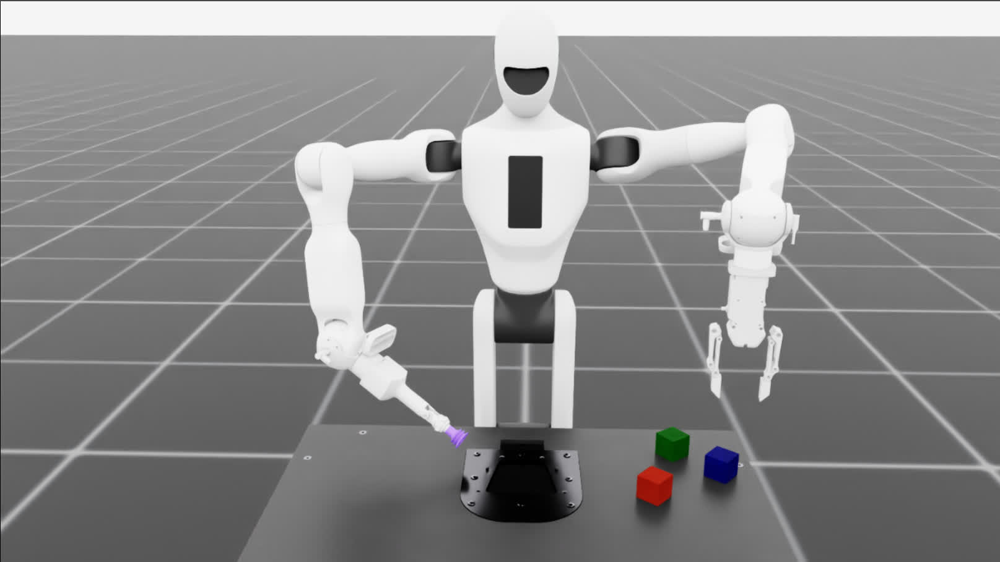
.. |agibot_place_mug| image:: ../_static/tasks/manipulation/agibot_place_mug.jpg
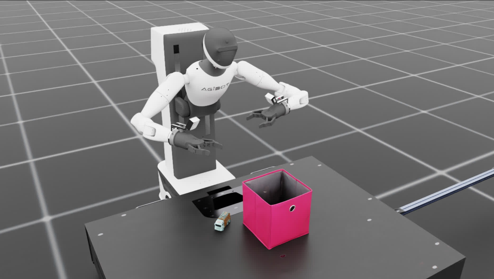
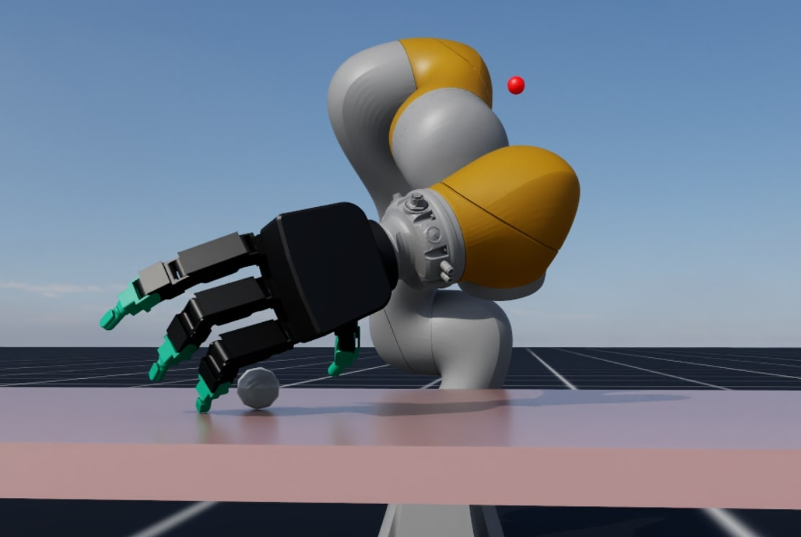
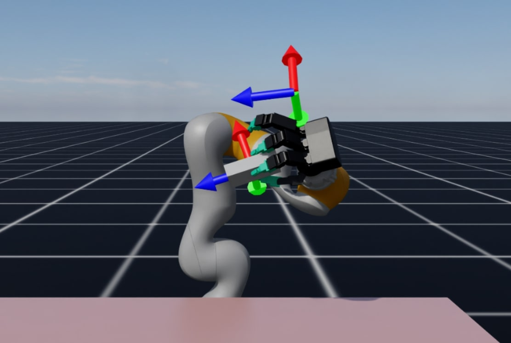
.. |reach_openarm_bi| image:: ../_static/tasks/manipulation/openarm_bi_reach.jpg
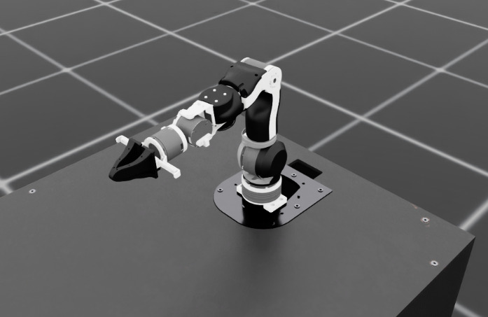
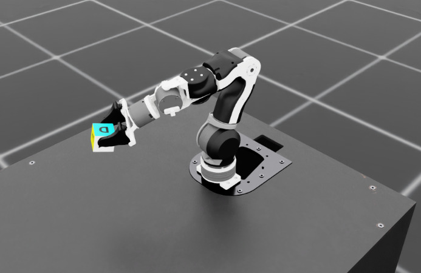
.. |cabi_openarm_uni| image:: ../_static/tasks/manipulation/openarm_uni_open_drawer.jpg

.. |reach-franka-link| replace:: `Isaac-Reach-Franka-v0 <https://github.com/isaac-sim/IsaacLab/blob/main/source/isaaclab_tasks/isaaclab_tasks/manager_based/manipulation/reach/config/franka/joint_pos_env_cfg.py>`__
.. |reach-ur10-link| replace:: `Isaac-Reach-UR10-v0 <https://github.com/isaac-sim/IsaacLab/blob/main/source/isaaclab_tasks/isaaclab_tasks/manager_based/manipulation/reach/config/ur_10/joint_pos_env_cfg.py>`__
.. |deploy-reach-ur10e-link| replace:: `Isaac-Deploy-Reach-UR10e-v0 <https://github.com/isaac-sim/IsaacLab/blob/main/source/isaaclab_tasks/isaaclab_tasks/manager_based/manipulation/deploy/reach/config/ur_10e/joint_pos_env_cfg.py>`__
.. |lift-cube-link| replace:: `Isaac-Lift-Cube-Franka-v0 <https://github.com/isaac-sim/IsaacLab/blob/main/source/isaaclab_tasks/isaaclab_tasks/manager_based/manipulation/lift/config/franka/joint_pos_env_cfg.py>`__
.. |lift-cube-ik-abs-link| replace:: `Isaac-Lift-Cube-Franka-IK-Abs-v0 <https://github.com/isaac-sim/IsaacLab/blob/main/source/isaaclab_tasks/isaaclab_tasks/manager_based/manipulation/lift/config/franka/ik_abs_env_cfg.py>`__
.. |lift-cube-ik-rel-link| replace:: `Isaac-Lift-Cube-Franka-IK-Rel-v0 <https://github.com/isaac-sim/IsaacLab/blob/main/source/isaaclab_tasks/isaaclab_tasks/manager_based/manipulation/lift/config/franka/ik_rel_env_cfg.py>`__
.. |cabi-franka-link| replace:: `Isaac-Open-Drawer-Franka-v0 <https://github.com/isaac-sim/IsaacLab/blob/main/source/isaaclab_tasks/isaaclab_tasks/manager_based/manipulation/cabinet/config/franka/joint_pos_env_cfg.py>`__
.. |franka-direct-link| replace:: `Isaac-Franka-Cabinet-Direct-v0 <https://github.com/isaac-sim/IsaacLab/blob/main/source/isaaclab_tasks/isaaclab_tasks/direct/franka_cabinet/franka_cabinet_env.py>`__
.. |cube-allegro-link| replace:: `Isaac-Repose-Cube-Allegro-v0 <https://github.com/isaac-sim/IsaacLab/blob/main/source/isaaclab_tasks/isaaclab_tasks/manager_based/manipulation/inhand/config/allegro_hand/allegro_env_cfg.py>`__
.. |allegro-direct-link| replace:: `Isaac-Repose-Cube-Allegro-Direct-v0 <https://github.com/isaac-sim/IsaacLab/blob/main/source/isaaclab_tasks/isaaclab_tasks/direct/allegro_hand/allegro_hand_env_cfg.py>`__
.. |stack-cube-link| replace:: `Isaac-Stack-Cube-Franka-v0 <https://github.com/isaac-sim/IsaacLab/blob/main/source/isaaclab_tasks/isaaclab_tasks/manager_based/manipulation/stack/config/franka/stack_joint_pos_env_cfg.py>`__
.. |stack-cube-bp-link| replace:: `Isaac-Stack-Cube-Franka-IK-Rel-Blueprint-v0 <https://github.com/isaac-sim/IsaacLab/blob/main/source/isaaclab_tasks/isaaclab_tasks/manager_based/manipulation/stack/config/franka/stack_ik_rel_blueprint_env_cfg.py>`__
.. |gr1_pick_place-link| replace:: `Isaac-PickPlace-GR1T2-Abs-v0 <https://github.com/isaac-sim/IsaacLab/blob/main/source/isaaclab_tasks/isaaclab_tasks/manager_based/manipulation/pick_place/pickplace_gr1t2_env_cfg.py>`__
.. |g1_pick_place-link| replace:: `Isaac-PickPlace-G1-InspireFTP-Abs-v0 <https://github.com/isaac-sim/IsaacLab/blob/main/source/isaaclab_tasks/isaaclab_tasks/manager_based/manipulation/pick_place/pickplace_unitree_g1_inspire_hand_env_cfg.py>`__
.. |g1_pick_place_fixed-link| replace:: `Isaac-PickPlace-FixedBaseUpperBodyIK-G1-Abs-v0 <https://github.com/isaac-sim/IsaacLab/blob/main/source/isaaclab_tasks/isaaclab_tasks/manager_based/locomanipulation/pick_place/fixed_base_upper_body_ik_g1_env_cfg.py>`__
.. |g1_pick_place_lm-link| replace:: `Isaac-PickPlace-Locomanipulation-G1-Abs-v0 <https://github.com/isaac-sim/IsaacLab/blob/main/source/isaaclab_tasks/isaaclab_tasks/manager_based/locomanipulation/pick_place/locomanipulation_g1_env_cfg.py>`__
.. |long-suction-link| replace:: `Isaac-Stack-Cube-UR10-Long-Suction-IK-Rel-v0 <https://github.com/isaac-sim/IsaacLab/blob/main/source/isaaclab_tasks/isaaclab_tasks/manager_based/manipulation/stack/config/ur10_gripper/stack_ik_rel_env_cfg.py>`__
.. |short-suction-link| replace:: `Isaac-Stack-Cube-UR10-Short-Suction-IK-Rel-v0 <https://github.com/isaac-sim/IsaacLab/blob/main/source/isaaclab_tasks/isaaclab_tasks/manager_based/manipulation/stack/config/ur10_gripper/stack_ik_rel_env_cfg.py>`__
.. |gr1_pp_waist-link| replace:: `Isaac-PickPlace-GR1T2-WaistEnabled-Abs-v0 <https://github.com/isaac-sim/IsaacLab/blob/main/source/isaaclab_tasks/isaaclab_tasks/manager_based/manipulation/pick_place/pickplace_gr1t2_waist_enabled_env_cfg.py>`__
.. |galbot_stack-link| replace:: `Isaac-Stack-Cube-Galbot-Left-Arm-Gripper-RmpFlow-v0 <https://github.com/isaac-sim/IsaacLab/blob/main/source/isaaclab_tasks/isaaclab_tasks/manager_based/manipulation/stack/config/galbot/stack_rmp_rel_env_cfg.py>`__
.. |kuka-allegro-lift-link| replace:: `Isaac-Dexsuite-Kuka-Allegro-Lift-v0 <https://github.com/isaac-sim/IsaacLab/blob/main/source/isaaclab_tasks/isaaclab_tasks/manager_based/manipulation/dexsuite/config/kuka_allegro/dexsuite_kuka_allegro_env_cfg.py>`__
.. |kuka-allegro-reorient-link| replace:: `Isaac-Dexsuite-Kuka-Allegro-Reorient-v0 <https://github.com/isaac-sim/IsaacLab/blob/main/source/isaaclab_tasks/isaaclab_tasks/manager_based/manipulation/dexsuite/config/kuka_allegro/dexsuite_kuka_allegro_env_cfg.py>`__
.. |cube-shadow-link| replace:: `Isaac-Repose-Cube-Shadow-Direct-v0 <https://github.com/isaac-sim/IsaacLab/blob/main/source/isaaclab_tasks/isaaclab_tasks/direct/shadow_hand/shadow_hand_env_cfg.py>`__
.. |cube-shadow-ff-link| replace:: `Isaac-Repose-Cube-Shadow-OpenAI-FF-Direct-v0 <https://github.com/isaac-sim/IsaacLab/blob/main/source/isaaclab_tasks/isaaclab_tasks/direct/shadow_hand/shadow_hand_env_cfg.py>`__
.. |cube-shadow-lstm-link| replace:: `Isaac-Repose-Cube-Shadow-OpenAI-LSTM-Direct-v0 <https://github.com/isaac-sim/IsaacLab/blob/main/source/isaaclab_tasks/isaaclab_tasks/direct/shadow_hand/shadow_hand_env_cfg.py>`__
.. |cube-shadow-vis-link| replace:: `Isaac-Repose-Cube-Shadow-Vision-Direct-v0 <https://github.com/isaac-sim/IsaacLab/blob/main/source/isaaclab_tasks/isaaclab_tasks/direct/shadow_hand/shadow_hand_vision_env.py>`__
.. |agibot_place_mug-link| replace:: `Isaac-Place-Mug-Agibot-Left-Arm-RmpFlow-v0 <https://github.com/isaac-sim/IsaacLab/blob/main/source/isaaclab_tasks/isaaclab_tasks/manager_based/manipulation/place/config/agibot/place_upright_mug_rmp_rel_env_cfg.py>`__
.. |agibot_place_toy-link| replace:: `Isaac-Place-Toy2Box-Agibot-Right-Arm-RmpFlow-v0 <https://github.com/isaac-sim/IsaacLab/blob/main/source/isaaclab_tasks/isaaclab_tasks/manager_based/manipulation/place/config/agibot/place_toy2box_rmp_rel_env_cfg.py>`__
.. |reach_openarm_bi-link| replace:: `Isaac-Reach-OpenArm-Bi-v0 <https://github.com/isaac-sim/IsaacLab/blob/main/source/isaaclab_tasks/isaaclab_tasks/manager_based/manipulation/reach/config/openarm/bimanual/joint_pos_env_cfg.py>`__
.. |reach_openarm_uni-link| replace:: `Isaac-Reach-OpenArm-v0 <https://github.com/isaac-sim/IsaacLab/blob/main/source/isaaclab_tasks/isaaclab_tasks/manager_based/manipulation/reach/config/openarm/unimanual/joint_pos_env_cfg.py>`__
.. |lift_openarm_uni-link| replace:: `Isaac-Lift-Cube-OpenArm-v0 <https://github.com/isaac-sim/IsaacLab/blob/main/source/isaaclab_tasks/isaaclab_tasks/manager_based/manipulation/lift/config/openarm/joint_pos_env_cfg.py>`__
.. |cabi_openarm_uni-link| replace:: `Isaac-Open-Drawer-OpenArm-v0 <https://github.com/isaac-sim/IsaacLab/blob/main/source/isaaclab_tasks/isaaclab_tasks/manager_based/manipulation/cabinet/config/openarm/joint_pos_env_cfg.py>`__

接触丰富型操作
~~~~~~~~~~~~~~~~~~~~~~~~~

基于接触丰富型操作任务的环境，例如销钉插入、齿轮啮合和螺母-螺栓紧固。

这些任务共享相同的任务配置和控制选项。你可以通过指定任务名称在它们之间切换。
例如：

* |factory-peg-link|：使用 Franka 机械臂进行销钉插入
* |factory-gear-link|：使用 Franka 机械臂进行齿轮啮合
* |factory-nut-link|：使用 Franka 机械臂进行螺母-螺栓紧固

.. table::
    :widths: 33 37 30

    +--------------------+-------------------------+-----------------------------------------------------------------------------+
    | 世界               | 环境 ID                 | 描述                                                                        |
    +====================+=========================+=============================================================================+
    | |factory-peg|      | |factory-peg-link|      | 使用 Franka 机器人将销钉插入插座中                                          |
    +--------------------+-------------------------+-----------------------------------------------------------------------------+
    | |factory-gear|     | |factory-gear-link|     | 使用 Franka 机器人将齿轮与其他齿轮啮合并装入底座                            |
    +--------------------+-------------------------+-----------------------------------------------------------------------------+
    | |factory-nut|      | |factory-nut-link|      | 使用 Franka 机器人将螺母拧到螺栓的前两圈螺纹上                              |
    +--------------------+-------------------------+-----------------------------------------------------------------------------+

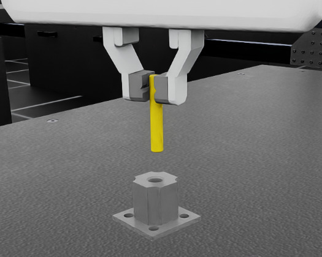
.. |factory-gear| image:: ../_static/tasks/factory/gear_mesh.jpg
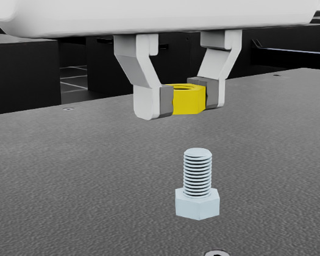

.. |factory-peg-link| replace:: `Isaac-Factory-PegInsert-Direct-v0 <https://github.com/isaac-sim/IsaacLab/blob/main/source/isaaclab_tasks/isaaclab_tasks/direct/factory/factory_env_cfg.py>`__
.. |factory-gear-link| replace:: `Isaac-Factory-GearMesh-Direct-v0 <https://github.com/isaac-sim/IsaacLab/blob/main/source/isaaclab_tasks/isaaclab_tasks/direct/factory/factory_env_cfg.py>`__
.. |factory-nut-link| replace:: `Isaac-Factory-NutThread-Direct-v0 <https://github.com/isaac-sim/IsaacLab/blob/main/source/isaaclab_tasks/isaaclab_tasks/direct/factory/factory_env_cfg.py>`__

AutoMate
~~~~~~~~

基于 100 个多样化装配任务的环境，每个任务都需要将插头插入插座。这些任务共享同一套配置，
仅因零件的几何形状和属性不同而有所差异。

你可以通过指定相应的资产 ID 在任务之间切换。可用的资产 ID 包括：

'00004', '00007', '00014', '00015', '00016', '00021', '00028', '00030', '00032', '00042', '00062', '00074', '00077', '00078', '00081', '00083', '00103', '00110', '00117', '00133', '00138', '00141', '00143', '00163', '00175', '00186', '00187', '00190', '00192', '00210', '00211', '00213', '00255', '00256', '00271', '00293', '00296', '00301', '00308', '00318', '00319', '00320', '00329', '00340', '00345', '00346', '00360', '00388', '00410', '00417', '00422', '00426', '00437', '00444', '00446', '00470', '00471', '00480', '00486', '00499', '00506', '00514', '00537', '00553', '00559', '00581', '00597', '00614', '00615', '00638', '00648', '00649', '00652', '00659', '00681', '00686', '00700', '00703', '00726', '00731', '00741', '00755', '00768', '00783', '00831', '00855', '00860', '00863', '01026', '01029', '01036', '01041', '01053', '01079', '01092', '01102', '01125', '01129', '01132', '01136'.

我们同时提供拆卸和装配环境。

.. attention::

  建议在使用 570 驱动运行 AutoMate 环境时搭配 CUDA。如果在 Linux x86_64 架构上使用 Nvidia 570 驱动，请按照以下步骤安装 CUDA 12.8。这样便可以使用 CUDA 计算 AutoMate 环境中的奖励。如果你使用其他操作系统或架构，请参阅 `CUDA 安装页面 <https://developer.nvidia.com/cuda-12-8-0-download-archive>`_ 获取更多说明。

  .. code-block:: bash

      wget https://developer.download.nvidia.com/compute/cuda/12.8.0/local_installers/cuda_12.8.0_570.86.10_linux.run
      sudo sh cuda_12.8.0_570.86.10_linux.run --toolkit

  使用 conda 时，可以通过以下命令安装 CUDA toolkit：

  .. code-block:: bash

      conda install cudatoolkit

  在 580 驱动和 CUDA 13 下，目前无法启用 CUDA 来计算奖励。代码会自动回退到 CPU，导致性能略有下降。

* |disassembly-link|：插头初始已插入插座中。低层控制器会将插头拔出并移动到随机位置。该过程完全是脚本化的，不涉及任何学习到的策略，因此不需要进行策略训练或评估。生成的轨迹将作为反向过程（即学习装配）的演示数据。要运行特定任务的拆卸，请使用命令 ``python source/isaaclab_tasks/isaaclab_tasks/direct/automate/run_disassembly_w_id.py --assembly_id=ASSEMBLY_ID --disassembly_dir=DISASSEMBLY_DIR``。所有生成的轨迹都会保存到本地目录 ``DISASSEMBLY_DIR`` 中。
* |assembly-link|：目标是将插头插入插座。你可以使用该环境通过强化学习训练策略，或评估预训练的检查点。

  * 要训练装配策略，我们运行命令 ``python source/isaaclab_tasks/isaaclab_tasks/direct/automate/run_w_id.py --assembly_id=ASSEMBLY_ID --train``。可以使用可选标志自定义训练过程：``--headless`` 在不打开 GUI 窗口的情况下运行，``--max_iterations=MAX_ITERATIONS`` 设置训练迭代次数，``--num_envs=NUM_ENVS`` 设置训练期间的并行环境数量，``--seed=SEED`` 指定随机种子。策略检查点会在训练过程中自动保存到目录 ``logs/rl_games/Assembly/test`` 中。
  * 要评估装配策略，我们运行命令 ``python source/isaaclab_tasks/isaaclab_tasks/direct/automate/run_w_id.py --assembly_id=ASSEMBLY_ID --checkpoint=CHECKPOINT --log_eval``。评估结果保存在 ``evaluation_{ASSEMBLY_ID}.h5`` 中。

.. table::
    :widths: 33 37 30

    +--------------------+-------------------------+-----------------------------------------------------------------------------+
    | 世界               | 环境 ID                 | 描述                                                                        |
    +====================+=========================+=============================================================================+
    | |disassembly|      | |disassembly-link|      | 使用 Franka 机器人将插头从插座中拔出                                        |
    +--------------------+-------------------------+-----------------------------------------------------------------------------+
    | |assembly|         | |assembly-link|         | 使用 Franka 机器人将插头插入对应的插座中                                    |
    +--------------------+-------------------------+-----------------------------------------------------------------------------+

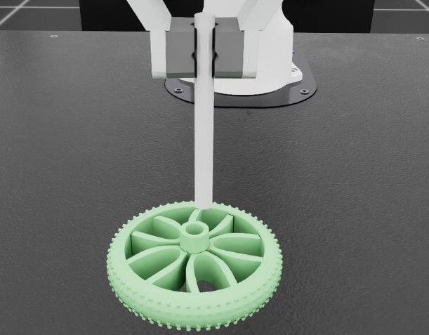
.. |disassembly| image:: ../_static/tasks/automate/01053_disassembly.jpg

.. |assembly-link| replace:: `Isaac-AutoMate-Assembly-Direct-v0 <https://github.com/isaac-sim/IsaacLab/blob/main/source/isaaclab_tasks/isaaclab_tasks/direct/automate/assembly_env_cfg.py>`__
.. |disassembly-link| replace:: `Isaac-AutoMate-Disassembly-Direct-v0 <https://github.com/isaac-sim/IsaacLab/blob/main/source/isaaclab_tasks/isaaclab_tasks/direct/automate/disassembly_env_cfg.py>`__

FORGE
~~~~~~~~

FORGE 环境在 Factory 环境的基础上扩展了以下功能：

* 力感知：添加末端执行器所受作用力的观测。
* 过大力惩罚：添加一个选项，用于对智能体产生过大的接触力进行惩罚。
* 动力学随机化：随机化控制器增益、资产属性（摩擦、质量）和死区。
* 成功预测：添加一个用于预测任务是否成功的额外动作。

这些任务共享相同的任务配置和控制选项。你可以通过指定任务名称在它们之间切换。

* |forge-peg-link|：使用 Franka 机械臂进行销钉插入
* |forge-gear-link|：使用 Franka 机械臂进行齿轮啮合
* |forge-nut-link|：使用 Franka 机械臂进行螺母-螺栓紧固

.. table::
    :widths: 33 37 30

    +--------------------+-------------------------+-----------------------------------------------------------------------------+
    | 世界               | 环境 ID                 | 描述                                                                        |
    +====================+=========================+=============================================================================+
    | |forge-peg|        | |forge-peg-link|        | 使用 Franka 机器人将销钉插入插座中                                          |
    +--------------------+-------------------------+-----------------------------------------------------------------------------+
    | |forge-gear|       | |forge-gear-link|       | 使用 Franka 机器人将齿轮与其他齿轮啮合并装入底座                            |
    +--------------------+-------------------------+-----------------------------------------------------------------------------+
    | |forge-nut|        | |forge-nut-link|        | 使用 Franka 机器人将螺母拧到螺栓的前两圈螺纹上                              |
    +--------------------+-------------------------+-----------------------------------------------------------------------------+

.. |forge-gear| image:: ../_static/tasks/factory/gear_mesh.jpg

.. |forge-peg-link| replace:: `Isaac-Forge-PegInsert-Direct-v0 <https://github.com/isaac-sim/IsaacLab/blob/main/source/isaaclab_tasks/isaaclab_tasks/direct/forge/forge_env_cfg.py>`__
.. |forge-gear-link| replace:: `Isaac-Forge-GearMesh-Direct-v0 <https://github.com/isaac-sim/IsaacLab/blob/main/source/isaaclab_tasks/isaaclab_tasks/direct/forge/forge_env_cfg.py>`__
.. |forge-nut-link| replace:: `Isaac-Forge-NutThread-Direct-v0 <https://github.com/isaac-sim/IsaacLab/blob/main/source/isaaclab_tasks/isaaclab_tasks/direct/forge/forge_env_cfg.py>`__

腿式运动（Locomotion）
~~~~~~~~~~~~~~~~~~~~~~~~~~~~

基于腿式运动任务的环境。

.. table::
    :widths: 33 37 30

    +------------------------------+----------------------------------------------+------------------------------------------------------------------------------+
    | 世界                         | 环境 ID                                      | 描述                                                                         |
    +==============================+==============================================+==============================================================================+
    | |velocity-flat-anymal-b|     | |velocity-flat-anymal-b-link|                | 使用 Anymal B 机器人在平坦地形上跟踪速度指令                                 |
    +------------------------------+----------------------------------------------+------------------------------------------------------------------------------+
    | |velocity-rough-anymal-b|    | |velocity-rough-anymal-b-link|               | 使用 Anymal B 机器人在粗糙地形上跟踪速度指令                                 |
    +------------------------------+----------------------------------------------+------------------------------------------------------------------------------+
    | |velocity-flat-anymal-c|     | |velocity-flat-anymal-c-link|                | 使用 Anymal C 机器人在平坦地形上跟踪速度指令                                 |
    |                              |                                              |                                                                              |
    |                              | |velocity-flat-anymal-c-direct-link|         |                                                                              |
    +------------------------------+----------------------------------------------+------------------------------------------------------------------------------+
    | |velocity-rough-anymal-c|    | |velocity-rough-anymal-c-link|               | 使用 Anymal C 机器人在粗糙地形上跟踪速度指令                                 |
    |                              |                                              |                                                                              |
    |                              | |velocity-rough-anymal-c-direct-link|        |                                                                              |
    +------------------------------+----------------------------------------------+------------------------------------------------------------------------------+
    | |velocity-flat-anymal-d|     | |velocity-flat-anymal-d-link|                | 使用 Anymal D 机器人在平坦地形上跟踪速度指令                                 |
    +------------------------------+----------------------------------------------+------------------------------------------------------------------------------+
    | |velocity-rough-anymal-d|    | |velocity-rough-anymal-d-link|               | 使用 Anymal D 机器人在粗糙地形上跟踪速度指令                                 |
    +------------------------------+----------------------------------------------+------------------------------------------------------------------------------+
    | |velocity-flat-unitree-a1|   | |velocity-flat-unitree-a1-link|              | 使用 Unitree A1 机器人在平坦地形上跟踪速度指令                               |
    +------------------------------+----------------------------------------------+------------------------------------------------------------------------------+
    | |velocity-rough-unitree-a1|  | |velocity-rough-unitree-a1-link|             | 使用 Unitree A1 机器人在粗糙地形上跟踪速度指令                               |
    +------------------------------+----------------------------------------------+------------------------------------------------------------------------------+
    | |velocity-flat-unitree-go1|  | |velocity-flat-unitree-go1-link|             | 使用 Unitree Go1 机器人在平坦地形上跟踪速度指令                              |
    +------------------------------+----------------------------------------------+------------------------------------------------------------------------------+
    | |velocity-rough-unitree-go1| | |velocity-rough-unitree-go1-link|            | 使用 Unitree Go1 机器人在粗糙地形上跟踪速度指令                              |
    +------------------------------+----------------------------------------------+------------------------------------------------------------------------------+
    | |velocity-flat-unitree-go2|  | |velocity-flat-unitree-go2-link|             | 使用 Unitree Go2 机器人在平坦地形上跟踪速度指令                              |
    +------------------------------+----------------------------------------------+------------------------------------------------------------------------------+
    | |velocity-rough-unitree-go2| | |velocity-rough-unitree-go2-link|            | 使用 Unitree Go2 机器人在粗糙地形上跟踪速度指令                              |
    +------------------------------+----------------------------------------------+------------------------------------------------------------------------------+
    | |velocity-flat-spot|         | |velocity-flat-spot-link|                    | 使用 Boston Dynamics Spot 机器人在平坦地形上跟踪速度指令                     |
    +------------------------------+----------------------------------------------+------------------------------------------------------------------------------+
    | |velocity-flat-h1|           | |velocity-flat-h1-link|                      | 使用 Unitree H1 机器人在平坦地形上跟踪速度指令                               |
    +------------------------------+----------------------------------------------+------------------------------------------------------------------------------+
    | |velocity-rough-h1|          | |velocity-rough-h1-link|                     | 使用 Unitree H1 机器人在粗糙地形上跟踪速度指令                               |
    +------------------------------+----------------------------------------------+------------------------------------------------------------------------------+
    | |velocity-flat-g1|           | |velocity-flat-g1-link|                      | 使用 Unitree G1 机器人在平坦地形上跟踪速度指令                               |
    +------------------------------+----------------------------------------------+------------------------------------------------------------------------------+
    | |velocity-rough-g1|          | |velocity-rough-g1-link|                     | 使用 Unitree G1 机器人在粗糙地形上跟踪速度指令                               |
    +------------------------------+----------------------------------------------+------------------------------------------------------------------------------+
    | |velocity-flat-digit|        | |velocity-flat-digit-link|                   | 使用 Agility Digit 机器人在平坦地形上跟踪速度指令                            |
    +------------------------------+----------------------------------------------+------------------------------------------------------------------------------+
    | |velocity-rough-digit|       | |velocity-rough-digit-link|                  | 使用 Agility Digit 机器人在粗糙地形上跟踪速度指令                            |
    +------------------------------+----------------------------------------------+------------------------------------------------------------------------------+
    | |tracking-loco-manip-digit|  | |tracking-loco-manip-digit-link|             | 使用 Agility Digit 机器人跟踪根部速度和手部位姿指令                          |
    +------------------------------+----------------------------------------------+------------------------------------------------------------------------------+

.. |velocity-flat-anymal-b-link| replace:: `Isaac-Velocity-Flat-Anymal-B-v0 <https://github.com/isaac-sim/IsaacLab/blob/main/source/isaaclab_tasks/isaaclab_tasks/manager_based/locomotion/velocity/config/anymal_b/flat_env_cfg.py>`__
.. |velocity-rough-anymal-b-link| replace:: `Isaac-Velocity-Rough-Anymal-B-v0 <https://github.com/isaac-sim/IsaacLab/blob/main/source/isaaclab_tasks/isaaclab_tasks/manager_based/locomotion/velocity/config/anymal_b/rough_env_cfg.py>`__

.. |velocity-flat-anymal-c-link| replace:: `Isaac-Velocity-Flat-Anymal-C-v0 <https://github.com/isaac-sim/IsaacLab/blob/main/source/isaaclab_tasks/isaaclab_tasks/manager_based/locomotion/velocity/config/anymal_c/flat_env_cfg.py>`__
.. |velocity-rough-anymal-c-link| replace:: `Isaac-Velocity-Rough-Anymal-C-v0 <https://github.com/isaac-sim/IsaacLab/blob/main/source/isaaclab_tasks/isaaclab_tasks/manager_based/locomotion/velocity/config/anymal_c/rough_env_cfg.py>`__

.. |velocity-flat-anymal-c-direct-link| replace:: `Isaac-Velocity-Flat-Anymal-C-Direct-v0 <https://github.com/isaac-sim/IsaacLab/blob/main/source/isaaclab_tasks/isaaclab_tasks/direct/anymal_c/anymal_c_env.py>`__
.. |velocity-rough-anymal-c-direct-link| replace:: `Isaac-Velocity-Rough-Anymal-C-Direct-v0 <https://github.com/isaac-sim/IsaacLab/blob/main/source/isaaclab_tasks/isaaclab_tasks/direct/anymal_c/anymal_c_env.py>`__

.. |velocity-flat-anymal-d-link| replace:: `Isaac-Velocity-Flat-Anymal-D-v0 <https://github.com/isaac-sim/IsaacLab/blob/main/source/isaaclab_tasks/isaaclab_tasks/manager_based/locomotion/velocity/config/anymal_d/flat_env_cfg.py>`__
.. |velocity-rough-anymal-d-link| replace:: `Isaac-Velocity-Rough-Anymal-D-v0 <https://github.com/isaac-sim/IsaacLab/blob/main/source/isaaclab_tasks/isaaclab_tasks/manager_based/locomotion/velocity/config/anymal_d/rough_env_cfg.py>`__

.. |velocity-flat-unitree-a1-link| replace:: `Isaac-Velocity-Flat-Unitree-A1-v0 <https://github.com/isaac-sim/IsaacLab/blob/main/source/isaaclab_tasks/isaaclab_tasks/manager_based/locomotion/velocity/config/a1/flat_env_cfg.py>`__
.. |velocity-rough-unitree-a1-link| replace:: `Isaac-Velocity-Rough-Unitree-A1-v0 <https://github.com/isaac-sim/IsaacLab/blob/main/source/isaaclab_tasks/isaaclab_tasks/manager_based/locomotion/velocity/config/a1/rough_env_cfg.py>`__

.. |velocity-flat-unitree-go1-link| replace:: `Isaac-Velocity-Flat-Unitree-Go1-v0 <https://github.com/isaac-sim/IsaacLab/blob/main/source/isaaclab_tasks/isaaclab_tasks/manager_based/locomotion/velocity/config/go1/flat_env_cfg.py>`__
.. |velocity-rough-unitree-go1-link| replace:: `Isaac-Velocity-Rough-Unitree-Go1-v0 <https://github.com/isaac-sim/IsaacLab/blob/main/source/isaaclab_tasks/isaaclab_tasks/manager_based/locomotion/velocity/config/go1/rough_env_cfg.py>`__

.. |velocity-flat-unitree-go2-link| replace:: `Isaac-Velocity-Flat-Unitree-Go2-v0 <https://github.com/isaac-sim/IsaacLab/blob/main/source/isaaclab_tasks/isaaclab_tasks/manager_based/locomotion/velocity/config/go2/flat_env_cfg.py>`__
.. |velocity-rough-unitree-go2-link| replace:: `Isaac-Velocity-Rough-Unitree-Go2-v0 <https://github.com/isaac-sim/IsaacLab/blob/main/source/isaaclab_tasks/isaaclab_tasks/manager_based/locomotion/velocity/config/go2/rough_env_cfg.py>`__

.. |velocity-flat-spot-link| replace:: `Isaac-Velocity-Flat-Spot-v0 <https://github.com/isaac-sim/IsaacLab/blob/main/source/isaaclab_tasks/isaaclab_tasks/manager_based/locomotion/velocity/config/spot/flat_env_cfg.py>`__

.. |velocity-flat-h1-link| replace:: `Isaac-Velocity-Flat-H1-v0 <https://github.com/isaac-sim/IsaacLab/blob/main/source/isaaclab_tasks/isaaclab_tasks/manager_based/locomotion/velocity/config/h1/flat_env_cfg.py>`__
.. |velocity-rough-h1-link| replace:: `Isaac-Velocity-Rough-H1-v0 <https://github.com/isaac-sim/IsaacLab/blob/main/source/isaaclab_tasks/isaaclab_tasks/manager_based/locomotion/velocity/config/h1/rough_env_cfg.py>`__

.. |velocity-flat-g1-link| replace:: `Isaac-Velocity-Flat-G1-v0 <https://github.com/isaac-sim/IsaacLab/blob/main/source/isaaclab_tasks/isaaclab_tasks/manager_based/locomotion/velocity/config/g1/flat_env_cfg.py>`__
.. |velocity-rough-g1-link| replace:: `Isaac-Velocity-Rough-G1-v0 <https://github.com/isaac-sim/IsaacLab/blob/main/source/isaaclab_tasks/isaaclab_tasks/manager_based/locomotion/velocity/config/g1/rough_env_cfg.py>`__

.. |velocity-flat-digit-link| replace:: `Isaac-Velocity-Flat-Digit-v0 <https://github.com/isaac-sim/IsaacLab/blob/main/source/isaaclab_tasks/isaaclab_tasks/manager_based/locomotion/velocity/config/digit/flat_env_cfg.py>`__
.. |velocity-rough-digit-link| replace:: `Isaac-Velocity-Rough-Digit-v0 <https://github.com/isaac-sim/IsaacLab/blob/main/source/isaaclab_tasks/isaaclab_tasks/manager_based/locomotion/velocity/config/digit/rough_env_cfg.py>`__
.. |tracking-loco-manip-digit-link| replace:: `Isaac-Tracking-LocoManip-Digit-v0 <https://github.com/isaac-sim/IsaacLab/blob/main/source/isaaclab_tasks/isaaclab_tasks/manager_based/locomanipulation/tracking/config/digit/loco_manip_env_cfg.py>`__

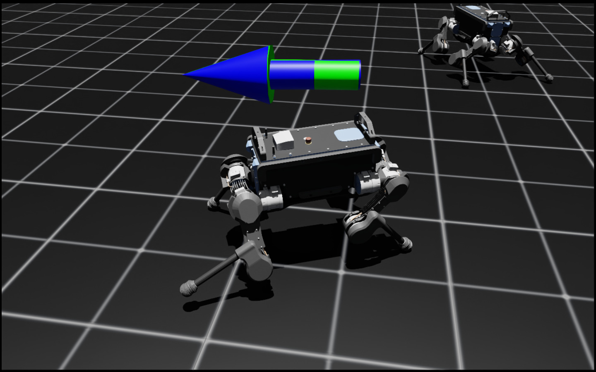
.. |velocity-rough-anymal-b| image:: ../_static/tasks/locomotion/anymal_b_rough.jpg
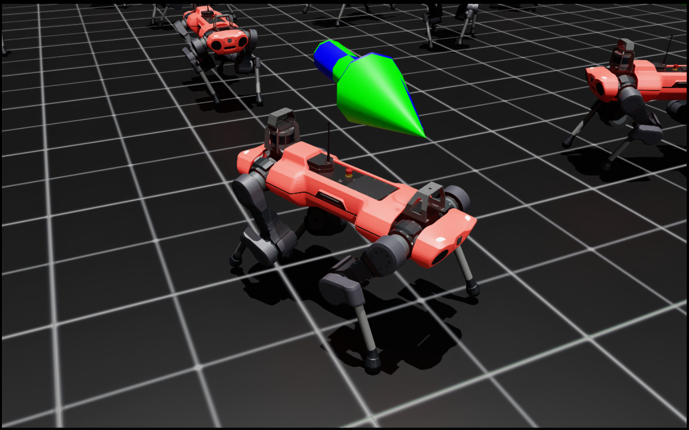
.. |velocity-rough-anymal-c| image:: ../_static/tasks/locomotion/anymal_c_rough.jpg
.. |velocity-flat-anymal-d| image:: ../_static/tasks/locomotion/anymal_d_flat.jpg
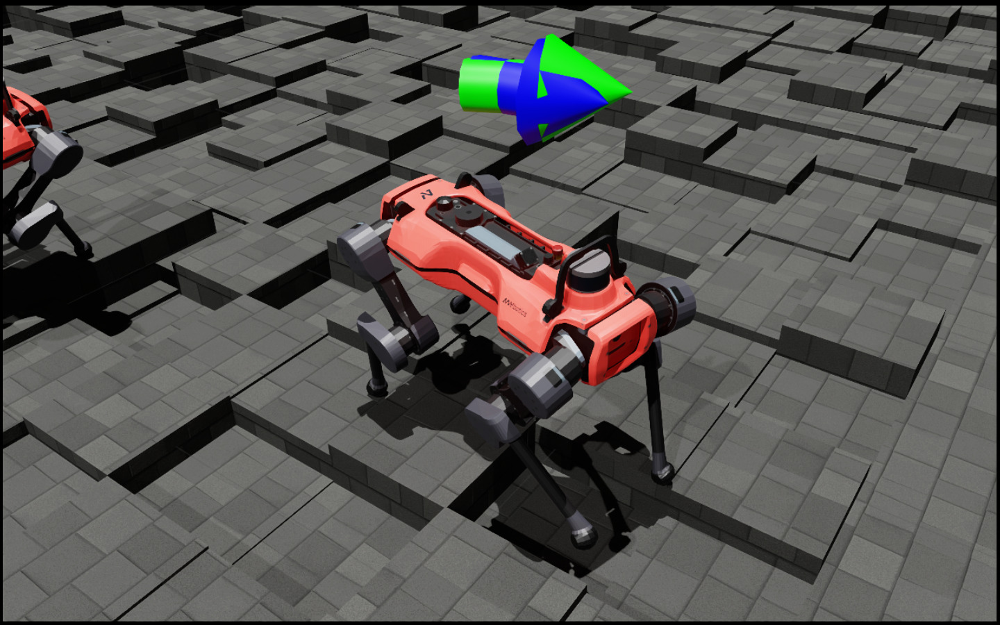
.. |velocity-flat-unitree-a1| image:: ../_static/tasks/locomotion/a1_flat.jpg
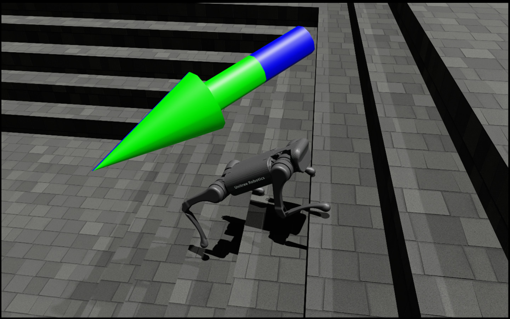
.. |velocity-flat-unitree-go1| image:: ../_static/tasks/locomotion/go1_flat.jpg
.. |velocity-rough-unitree-go1| image:: ../_static/tasks/locomotion/go1_rough.jpg
.. |velocity-flat-unitree-go2| image:: ../_static/tasks/locomotion/go2_flat.jpg
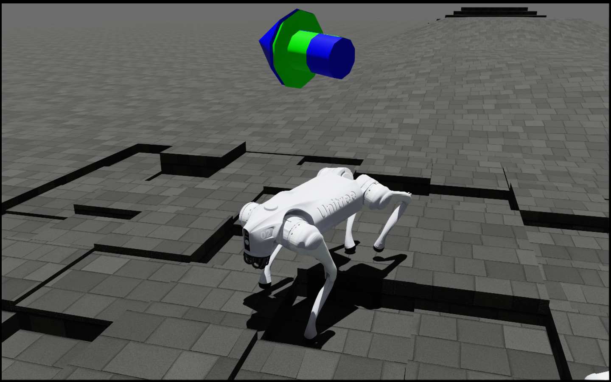
.. |velocity-flat-spot| image:: ../_static/tasks/locomotion/spot_flat.jpg
.. |velocity-flat-h1| image:: ../_static/tasks/locomotion/h1_flat.jpg
.. |velocity-rough-h1| image:: ../_static/tasks/locomotion/h1_rough.jpg
.. |velocity-flat-g1| image:: ../_static/tasks/locomotion/g1_flat.jpg
.. |velocity-rough-g1| image:: ../_static/tasks/locomotion/g1_rough.jpg
.. |velocity-flat-digit| image:: ../_static/tasks/locomotion/agility_digit_flat.jpg
.. |velocity-rough-digit| image:: ../_static/tasks/locomotion/agility_digit_rough.jpg
.. |tracking-loco-manip-digit| image:: ../_static/tasks/locomotion/agility_digit_loco_manip.jpg

导航
~~~~~~~~~~

.. table::
    :widths: 33 37 30

    +----------------+---------------------+-----------------------------------------------------------------------------+
    | 世界           | 环境 ID             | 描述                                                                        |
    +================+=====================+=============================================================================+
    | |anymal_c_nav| | |anymal_c_nav-link| | 使用 ANYmal C 机器人导航到目标的 x-y 位置和朝向。                           |
    +----------------+---------------------+-----------------------------------------------------------------------------+

.. |anymal_c_nav-link| replace:: `Isaac-Navigation-Flat-Anymal-C-v0 <https://github.com/isaac-sim/IsaacLab/blob/main/source/isaaclab_tasks/isaaclab_tasks/manager_based/navigation/config/anymal_c/navigation_env_cfg.py>`__

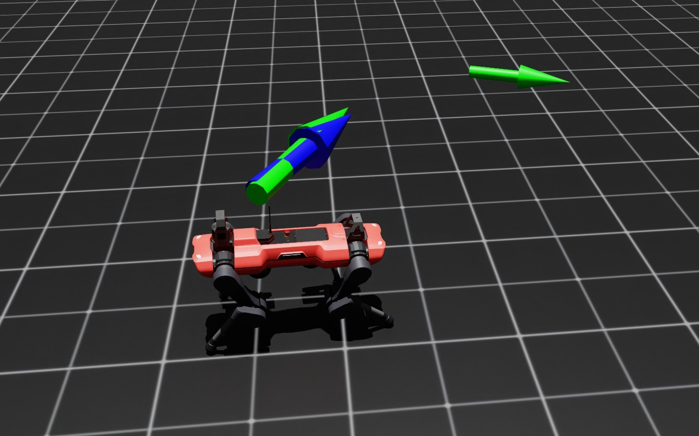

多旋翼
~~~~~~~~~~

.. note::
    多旋翼条目提供了一个用于飞行 ARL 机器人的环境配置。
    详情请参阅代码库中的 `drone_arl` 文件夹和 ARL 机器人配置
    （`ARL_ROBOT_1_CFG`）。

.. |arl_robot_track_position_state_based-link| replace:: `Isaac-TrackPositionNoObstacles-ARL-Robot-1-v0 <https://github.com/isaac-sim/IsaacLab/blob/main/source/isaaclab_tasks/isaaclab_tasks/manager_based/drone_arl/track_position_state_based/config/arl_robot_1/track_position_state_based_env_cfg.py>`__

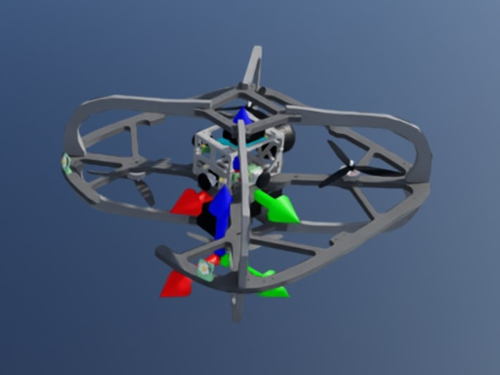

.. table::
    :widths: 33 37 30

    +----------------------------------------+---------------------------------------------+----------------------------------------------------------------------------------------+
    | 世界                                   | 环境 ID                                     | 描述                                                                                   |
    +========================================+=============================================+========================================================================================+
    | |arl_robot_track_position_state_based| | |arl_robot_track_position_state_based-link| | 使用 track_position_state_based 任务对 ARL 机器人进行设定值位置控制。                  |
    +----------------------------------------+---------------------------------------------+----------------------------------------------------------------------------------------+

其他
~~~~~~

.. note::

    对抗运动先验（Adversarial Motion Priors, AMP）训练仅支持 `skrl` 库，因为它是当前
    集成的库中唯一开箱即用支持该功能的库（对于其他库，需要自行实现相应的算法和网络结构）。
    更多信息请参阅 `skrl 的 AMP 文档 <https://skrl.readthedocs.io/en/latest/api/agents/amp.html>`_。
    可以通过在 train/play 脚本中添加命令行输入 ``--algorithm AMP`` 来启用 AMP 算法。

    在评估时，play 脚本的命令行输入 ``--real-time`` 可让环境与智能体之间的交互循环
    在可能的情况下实时运行。

.. table::
    :widths: 33 37 30

    +----------------+---------------------------+-----------------------------------------------------------------------------+
    | 世界           | 环境 ID                   | 描述                                                                        |
    +================+===========================+=============================================================================+
    | |quadcopter|   | |quadcopter-link|         | 通过施加推力，使 Crazyflie 无人机飞至目标点并悬停。                         |
    +----------------+---------------------------+-----------------------------------------------------------------------------+
    | |humanoid_amp| | |humanoid_amp_dance-link| | 通过模仿不同的预录制人类动画来驱使人形机器人运动                            |
    |                |                           | （对抗运动先验）。                                                          |
    |                | |humanoid_amp_run-link|   |                                                                             |
    |                |                           |                                                                             |
    |                | |humanoid_amp_walk-link|  |                                                                             |
    +----------------+---------------------------+-----------------------------------------------------------------------------+

.. |quadcopter-link| replace:: `Isaac-Quadcopter-Direct-v0 <https://github.com/isaac-sim/IsaacLab/blob/main/source/isaaclab_tasks/isaaclab_tasks/direct/quadcopter/quadcopter_env.py>`__
.. |humanoid_amp_dance-link| replace:: `Isaac-Humanoid-AMP-Dance-Direct-v0 <https://github.com/isaac-sim/IsaacLab/blob/main/source/isaaclab_tasks/isaaclab_tasks/direct/humanoid_amp/humanoid_amp_env_cfg.py>`__
.. |humanoid_amp_run-link| replace:: `Isaac-Humanoid-AMP-Run-Direct-v0 <https://github.com/isaac-sim/IsaacLab/blob/main/source/isaaclab_tasks/isaaclab_tasks/direct/humanoid_amp/humanoid_amp_env_cfg.py>`__
.. |humanoid_amp_walk-link| replace:: `Isaac-Humanoid-AMP-Walk-Direct-v0 <https://github.com/isaac-sim/IsaacLab/blob/main/source/isaaclab_tasks/isaaclab_tasks/direct/humanoid_amp/humanoid_amp_env_cfg.py>`__

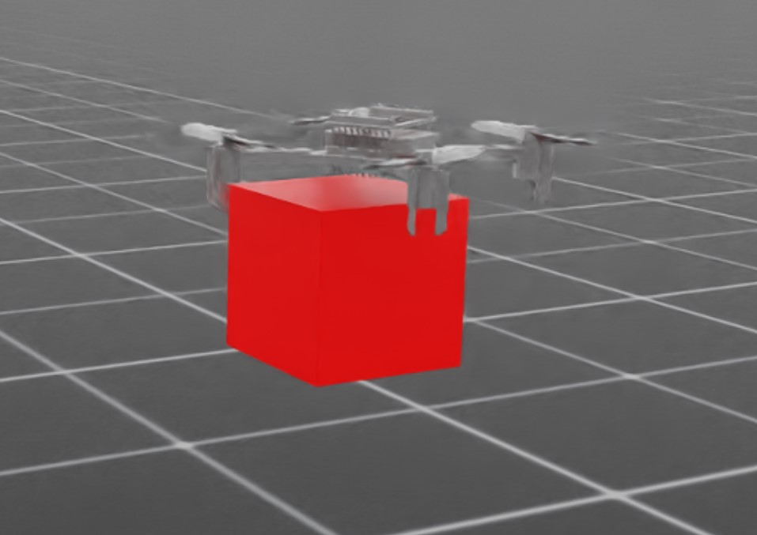
.. |humanoid_amp| image:: ../_static/tasks/others/humanoid_amp.jpg

空间展示
~~~~~~~~~~~~~~~

|cartpole_showcase| 文件夹包含一系列展示任务（基于 *Cartpole* 和 *Cartpole-Camera*
直接式工作流任务），用于定义和使用 Isaac Lab 支持的各种 Gymnasium 观测空间和动作空间。

.. |cartpole_showcase| replace:: `cartpole_showcase <https://github.com/isaac-sim/IsaacLab/tree/main/source/isaaclab_tasks/isaaclab_tasks/direct/cartpole_showcase>`__

.. note::

    目前，只有 Isaac Lab 的直接式工作流支持定义 ``Box`` 以外的观测空间和动作空间。
    更多细节请参阅直接式工作流的 :py:obj:`~isaaclab.envs.DirectRLEnvCfg.observation_space` / :py:obj:`~isaaclab.envs.DirectRLEnvCfg.action_space`
    文档。

下表总结了 *Cartpole* 和 *Cartpole-Camera* 任务中展示的各类观测空间与动作空间组合。
在用于训练和评估的任务名称中，将 ``<OBSERVATION>`` 和 ``<ACTION>`` 替换为想要探索的观测空间和动作空间。

.. raw:: html

    <table class="showcase-table">
    <caption>
      
Showcase spaces for the <strong>Cartpole</strong> task

      
<code>Isaac-Cartpole-Showcase-&lt;OBSERVATION&gt;-&lt;ACTION&gt;-Direct-v0</code>

    </caption>
    <tbody>
      <tr>
        <td colspan="2" rowspan="2"></td>
        <td colspan="5" class="center">action space</td>
      </tr>
      <tr>
        <td><strong>&nbsp;Box</strong></td>
        <td><strong>&nbsp;Discrete</strong></td>
        <td><strong>&nbsp;MultiDiscrete</strong></td>
      </tr>
      <tr>
        <td rowspan="5" class="rot90 center">
observation

space
</td>
        <td><strong>&nbsp;Box</strong></td>
        <td class="center">x</td>
        <td class="center">x</td>
        <td class="center">x</td>
      </tr>
      <tr>
        <td><strong>&nbsp;Discrete</strong></td>
        <td class="center">x</td>
        <td class="center">x</td>
        <td class="center">x</td>
      </tr>
      <tr>
        <td><strong>&nbsp;MultiDiscrete</strong></td>
        <td class="center">x</td>
        <td class="center">x</td>
        <td class="center">x</td>
      </tr>
      <tr>
        <td><strong>&nbsp;Dict</strong></td>
        <td class="center">x</td>
        <td class="center">x</td>
        <td class="center">x</td>
      </tr>
      <tr>
        <td><strong>&nbsp;Tuple</strong></td>
        <td class="center">x</td>
        <td class="center">x</td>
        <td class="center">x</td>
      </tr>
    </tbody>
    </table>
     
    <table class="showcase-table">
    <caption>
        
Showcase spaces for the <strong>Cartpole-Camera</strong> task

        
<code>Isaac-Cartpole-Camera-Showcase-&lt;OBSERVATION&gt;-&lt;ACTION&gt;-Direct-v0</code>

    </caption>
    <tbody>
      <tr>
        <td colspan="2" rowspan="2"></td>
        <td colspan="5" class="center">action space</td>
      </tr>
      <tr>
        <td><strong>&nbsp;Box</strong></td>
        <td><strong>&nbsp;Discrete</strong></td>
        <td><strong>&nbsp;MultiDiscrete</strong></td>
      </tr>
      <tr>
        <td rowspan="5" class="rot90 center">
observation

space
</td>
        <td><strong>&nbsp;Box</strong></td>
        <td class="center">x</td>
        <td class="center">x</td>
        <td class="center">x</td>
      </tr>
      <tr>
        <td><strong>&nbsp;Discrete</strong></td>
        <td class="center">-</td>
        <td class="center">-</td>
        <td class="center">-</td>
      </tr>
      <tr>
        <td><strong>&nbsp;MultiDiscrete</strong></td>
        <td class="center">-</td>
        <td class="center">-</td>
        <td class="center">-</td>
      </tr>
      <tr>
        <td><strong>&nbsp;Dict</strong></td>
        <td class="center">x</td>
        <td class="center">x</td>
        <td class="center">x</td>
      </tr>
      <tr>
        <td><strong>&nbsp;Tuple</strong></td>
        <td class="center">x</td>
        <td class="center">x</td>
        <td class="center">x</td>
      </tr>
    </tbody></table>

多智能体
------------

.. note::

    真正的多智能体训练仅支持 `skrl` 库，更多信息请参阅 `多智能体文档 <https://skrl.readthedocs.io/en/latest/api/multi_agents.html>`_。
    它支持 `IPPO` 和 `MAPPO` 算法，可以通过在 train/play 脚本中添加命令行输入 ``--algorithm IPPO``
    或 ``--algorithm MAPPO`` 来启用。如果这些环境在其他库下运行，或者未使用 `IPPO` 或 `MAPPO`
    标志，它们将在底层被转换为单智能体环境。

经典环境
~~~~~~~~

.. table::
    :widths: 33 37 30

    +------------------------+------------------------------------+-----------------------------------------------------------------------------------------------------------------------+
    | 世界                   | 环境 ID                            | 描述                                                                                                                  |
    +========================+====================================+=======================================================================================================================+
    | |cart-double-pendulum| | |cart-double-pendulum-direct-link| | 经典小车倒立双摆控制：移动小车和摆杆，使摆杆保持竖直向上                                                              |
    +------------------------+------------------------------------+-----------------------------------------------------------------------------------------------------------------------+

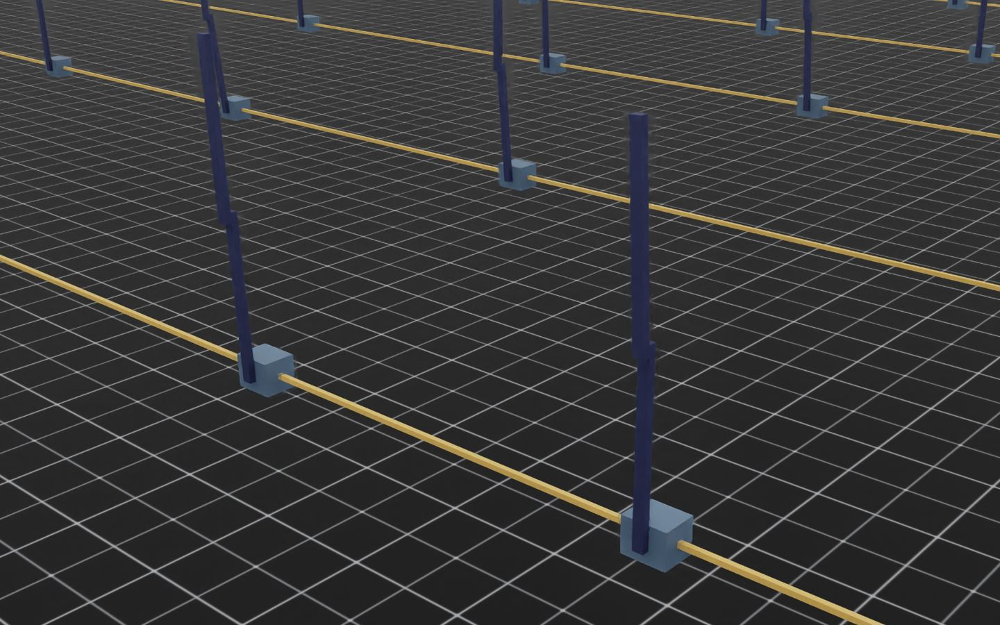

.. |cart-double-pendulum-direct-link| replace:: `Isaac-Cart-Double-Pendulum-Direct-v0 <https://github.com/isaac-sim/IsaacLab/blob/main/source/isaaclab_tasks/isaaclab_tasks/direct/cart_double_pendulum/cart_double_pendulum_env.py>`__

机械臂操作
~~~~~~~~~~~~

基于固定基座机械臂操作任务的环境。

.. table::
    :widths: 33 37 30

    +----------------------+--------------------------------+--------------------------------------------------------+
    | 世界                 | 环境 ID                        | 描述                                                   |
    +======================+================================+========================================================+
    | |shadow-hand-over|   | |shadow-hand-over-direct-link| | 将物体从一只手传递到另一只手                           |
    +----------------------+--------------------------------+--------------------------------------------------------+

.. |shadow-hand-over| image:: ../_static/tasks/manipulation/shadow_hand_over.jpg

.. |shadow-hand-over-direct-link| replace:: `Isaac-Shadow-Hand-Over-Direct-v0 <https://github.com/isaac-sim/IsaacLab/blob/main/source/isaaclab_tasks/isaaclab_tasks/direct/shadow_hand_over/shadow_hand_over_env.py>`__

|

环境完整列表
==================================

对于在 ``Inference Task Name`` 列下列出了不同任务名称的环境，请在运行 ``play.py``
或任何推理工作流时使用该推理任务名称。这些任务提供了更适合推理的配置，
包括读取已训练好的检查点，以及禁用训练时使用的运行时扰动。

.. list-table::
    :widths: 33 25 19 25

    * - **任务名称**
      - **推理任务名称**
      - **工作流**
      - **RL 库**
    * - Isaac-Ant-Direct-v0
      -
      - 直接式
      - **rl_games** (PPO), **rsl_rl** (PPO), **skrl** (PPO)
    * - Isaac-Ant-v0
      -
      - 管理器式
      - **rsl_rl** (PPO), **rl_games** (PPO), **skrl** (PPO), **sb3** (PPO)
    * - Isaac-Cart-Double-Pendulum-Direct-v0
      -
      - 直接式
      - **rl_games** (PPO), **skrl** (IPPO, PPO, MAPPO)
    * - Isaac-Cartpole-Camera-Showcase-Box-Box-Direct-v0 （需要以 ``--enable_cameras`` 运行）
      -
      - 直接式
      - **skrl** (PPO)
    * - Isaac-Cartpole-Camera-Showcase-Box-Discrete-Direct-v0 （需要以 ``--enable_cameras`` 运行）
      -
      - 直接式
      - **skrl** (PPO)
    * - Isaac-Cartpole-Camera-Showcase-Box-MultiDiscrete-Direct-v0 （需要以 ``--enable_cameras`` 运行）
      -
      - 直接式
      - **skrl** (PPO)
    * - Isaac-Cartpole-Camera-Showcase-Dict-Box-Direct-v0 （需要以 ``--enable_cameras`` 运行）
      -
      - 直接式
      - **skrl** (PPO)
    * - Isaac-Cartpole-Camera-Showcase-Dict-Discrete-Direct-v0 （需要以 ``--enable_cameras`` 运行）
      -
      - 直接式
      - **skrl** (PPO)
    * - Isaac-Cartpole-Camera-Showcase-Dict-MultiDiscrete-Direct-v0 （需要以 ``--enable_cameras`` 运行）
      -
      - 直接式
      - **skrl** (PPO)
    * - Isaac-Cartpole-Camera-Showcase-Tuple-Box-Direct-v0 （需要以 ``--enable_cameras`` 运行）
      -
      - 直接式
      - **skrl** (PPO)
    * - Isaac-Cartpole-Camera-Showcase-Tuple-Discrete-Direct-v0 （需要以 ``--enable_cameras`` 运行）
      -
      - 直接式
      - **skrl** (PPO)
    * - Isaac-Cartpole-Camera-Showcase-Tuple-MultiDiscrete-Direct-v0 （需要以 ``--enable_cameras`` 运行）
      -
      - 直接式
      - **skrl** (PPO)
    * - Isaac-Cartpole-Depth-Camera-Direct-v0 （需要以 ``--enable_cameras`` 运行）
      -
      - 直接式
      - **rl_games** (PPO), **skrl** (PPO)
    * - Isaac-Cartpole-Depth-v0 （需要以 ``--enable_cameras`` 运行）
      -
      - 管理器式
      - **rl_games** (PPO)
    * - Isaac-Cartpole-Direct-v0
      -
      - 直接式
      - **rl_games** (PPO), **rsl_rl** (PPO), **skrl** (PPO), **sb3** (PPO)
    * - Isaac-Cartpole-RGB-Camera-Direct-v0 （需要以 ``--enable_cameras`` 运行）
      -
      - 直接式
      - **rl_games** (PPO), **skrl** (PPO)
    * - Isaac-Cartpole-RGB-ResNet18-v0 （需要以 ``--enable_cameras`` 运行）
      -
      - 管理器式
      - **rl_games** (PPO)
    * - Isaac-Cartpole-RGB-TheiaTiny-v0 （需要以 ``--enable_cameras`` 运行）
      -
      - 管理器式
      - **rl_games** (PPO)
    * - Isaac-Cartpole-RGB-v0 （需要以 ``--enable_cameras`` 运行）
      -
      - 管理器式
      - **rl_games** (PPO)
    * - Isaac-Cartpole-Showcase-Box-Box-Direct-v0
      -
      - 直接式
      - **skrl** (PPO)
    * - Isaac-Cartpole-Showcase-Box-Discrete-Direct-v0
      -
      - 直接式
      - **skrl** (PPO)
    * - Isaac-Cartpole-Showcase-Box-MultiDiscrete-Direct-v0
      -
      - 直接式
      - **skrl** (PPO)
    * - Isaac-Cartpole-Showcase-Dict-Box-Direct-v0
      -
      - 直接式
      - **skrl** (PPO)
    * - Isaac-Cartpole-Showcase-Dict-Discrete-Direct-v0
      -
      - 直接式
      - **skrl** (PPO)
    * - Isaac-Cartpole-Showcase-Dict-MultiDiscrete-Direct-v0
      -
      - 直接式
      - **skrl** (PPO)
    * - Isaac-Cartpole-Showcase-Discrete-Box-Direct-v0
      -
      - 直接式
      - **skrl** (PPO)
    * - Isaac-Cartpole-Showcase-Discrete-Discrete-Direct-v0
      -
      - 直接式
      - **skrl** (PPO)
    * - Isaac-Cartpole-Showcase-Discrete-MultiDiscrete-Direct-v0
      -
      - 直接式
      - **skrl** (PPO)
    * - Isaac-Cartpole-Showcase-MultiDiscrete-Box-Direct-v0
      -
      - 直接式
      - **skrl** (PPO)
    * - Isaac-Cartpole-Showcase-MultiDiscrete-Discrete-Direct-v0
      -
      - 直接式
      - **skrl** (PPO)
    * - Isaac-Cartpole-Showcase-MultiDiscrete-MultiDiscrete-Direct-v0
      -
      - 直接式
      - **skrl** (PPO)
    * - Isaac-Cartpole-Showcase-Tuple-Box-Direct-v0
      -
      - 直接式
      - **skrl** (PPO)
    * - Isaac-Cartpole-Showcase-Tuple-Discrete-Direct-v0
      -
      - 直接式
      - **skrl** (PPO)
    * - Isaac-Cartpole-Showcase-Tuple-MultiDiscrete-Direct-v0
      -
      - 直接式
      - **skrl** (PPO)
    * - Isaac-Cartpole-v0
      -
      - 管理器式
      - **rl_games** (PPO), **rsl_rl** (PPO), **skrl** (PPO), **sb3** (PPO)
    * - Isaac-Factory-GearMesh-Direct-v0
      -
      - 直接式
      - **rl_games** (PPO)
    * - Isaac-Factory-NutThread-Direct-v0
      -
      - 直接式
      - **rl_games** (PPO)
    * - Isaac-Factory-PegInsert-Direct-v0
      -
      - 直接式
      - **rl_games** (PPO)
    * - Isaac-AutoMate-Assembly-Direct-v0
      -
      - 直接式
      - **rl_games** (PPO)
    * - Isaac-AutoMate-Disassembly-Direct-v0
      -
      - 直接式
      -
    * - Isaac-Forge-GearMesh-Direct-v0
      -
      - 直接式
      - **rl_games** (PPO)
    * - Isaac-Forge-NutThread-Direct-v0
      -
      - 直接式
      - **rl_games** (PPO)
    * - Isaac-Forge-PegInsert-Direct-v0
      -
      - 直接式
      - **rl_games** (PPO)
    * - Isaac-Franka-Cabinet-Direct-v0
      -
      - 直接式
      - **rl_games** (PPO), **rsl_rl** (PPO), **skrl** (PPO)
    * - Isaac-Humanoid-AMP-Dance-Direct-v0
      -
      - 直接式
      - **skrl** (AMP)
    * - Isaac-Humanoid-AMP-Run-Direct-v0
      -
      - 直接式
      - **skrl** (AMP)
    * - Isaac-Humanoid-AMP-Walk-Direct-v0
      -
      - 直接式
      - **skrl** (AMP)
    * - Isaac-Humanoid-Direct-v0
      -
      - 直接式
      - **rl_games** (PPO), **rsl_rl** (PPO), **skrl** (PPO)
    * - Isaac-Humanoid-v0
      -
      - 管理器式
      - **rsl_rl** (PPO), **rl_games** (PPO), **skrl** (PPO), **sb3** (PPO)
    * - Isaac-Lift-Cube-Franka-IK-Abs-v0
      -
      - 管理器式
      -
    * - Isaac-Lift-Cube-Franka-IK-Rel-v0
      -
      - 管理器式
      -
    * - Isaac-Lift-Cube-Franka-v0
      - Isaac-Lift-Cube-Franka-Play-v0
      - 管理器式
      - **rsl_rl** (PPO), **skrl** (PPO), **rl_games** (PPO), **sb3** (PPO)
    * - Isaac-Lift-Teddy-Bear-Franka-IK-Abs-v0
      -
      - 管理器式
      -
    * - Isaac-Tracking-LocoManip-Digit-v0
      - Isaac-Tracking-LocoManip-Digit-Play-v0
      - 管理器式
      - **rsl_rl** (PPO)
    * - Isaac-Navigation-Flat-Anymal-C-v0
      - Isaac-Navigation-Flat-Anymal-C-Play-v0
      - 管理器式
      - **rsl_rl** (PPO), **skrl** (PPO)
    * - Isaac-Open-Drawer-Franka-IK-Abs-v0
      -
      - 管理器式
      -
    * - Isaac-Open-Drawer-Franka-IK-Rel-v0
      -
      - 管理器式
      -
    * - Isaac-Open-Drawer-Franka-v0
      - Isaac-Open-Drawer-Franka-Play-v0
      - 管理器式
      - **rsl_rl** (PPO), **rl_games** (PPO), **skrl** (PPO)
    * - Isaac-Quadcopter-Direct-v0
      -
      - 直接式
      - **rl_games** (PPO), **rsl_rl** (PPO), **skrl** (PPO)
    * - Isaac-Reach-Franka-IK-Abs-v0
      -
      - 管理器式
      -
    * - Isaac-Reach-Franka-IK-Rel-v0
      -
      - 管理器式
      -
    * - Isaac-Reach-Franka-OSC-v0
      - Isaac-Reach-Franka-OSC-Play-v0
      - 管理器式
      - **rsl_rl** (PPO)
    * - Isaac-Reach-Franka-v0
      - Isaac-Reach-Franka-Play-v0
      - 管理器式
      - **rl_games** (PPO), **rsl_rl** (PPO), **skrl** (PPO)
    * - Isaac-Reach-UR10-v0
      - Isaac-Reach-UR10-Play-v0
      - 管理器式
      - **rl_games** (PPO), **rsl_rl** (PPO), **skrl** (PPO)
    * - Isaac-Deploy-Reach-UR10e-v0
      - Isaac-Deploy-Reach-UR10e-Play-v0
      - 管理器式
      - **rsl_rl** (PPO)
    * - Isaac-Repose-Cube-Allegro-Direct-v0
      -
      - 直接式
      - **rl_games** (PPO), **rsl_rl** (PPO), **skrl** (PPO)
    * - Isaac-Repose-Cube-Allegro-NoVelObs-v0
      - Isaac-Repose-Cube-Allegro-NoVelObs-Play-v0
      - 管理器式
      - **rsl_rl** (PPO), **rl_games** (PPO), **skrl** (PPO)
    * - Isaac-Repose-Cube-Allegro-v0
      - Isaac-Repose-Cube-Allegro-Play-v0
      - 管理器式
      - **rsl_rl** (PPO), **rl_games** (PPO), **skrl** (PPO)
    * - Isaac-Repose-Cube-Shadow-Direct-v0
      -
      - 直接式
      - **rl_games** (PPO), **rsl_rl** (PPO), **skrl** (PPO)
    * - Isaac-Repose-Cube-Shadow-OpenAI-FF-Direct-v0
      -
      - 直接式
      - **rl_games** (FF), **rsl_rl** (PPO), **skrl** (PPO)
    * - Isaac-Repose-Cube-Shadow-OpenAI-LSTM-Direct-v0
      -
      - 直接式
      - **rl_games** (LSTM)
    * - Isaac-Repose-Cube-Shadow-Vision-Direct-v0 （需要以 ``--enable_cameras`` 运行）
      - Isaac-Repose-Cube-Shadow-Vision-Direct-Play-v0 （需要以 ``--enable_cameras`` 运行）
      - 直接式
      - **rsl_rl** (PPO), **rl_games** (VISION)
    * - Isaac-Shadow-Hand-Over-Direct-v0
      -
      - 直接式
      - **rl_games** (PPO), **skrl** (IPPO, PPO, MAPPO)
    * - Isaac-Stack-Cube-Franka-IK-Rel-v0
      -
      - 管理器式
      -
    * - Isaac-Dexsuite-Kuka-Allegro-Lift-v0
      - Isaac-Dexsuite-Kuka-Allegro-Lift-Play-v0
      - 管理器式
      - **rl_games** (PPO), **rsl_rl** (PPO)
    * - Isaac-Dexsuite-Kuka-Allegro-Reorient-v0
      - Isaac-Dexsuite-Kuka-Allegro-Reorient-Play-v0
      - 管理器式
      - **rl_games** (PPO), **rsl_rl** (PPO)
    * - Isaac-Stack-Cube-Franka-v0
      -
      - 管理器式
      -
    * - Isaac-Stack-Cube-Instance-Randomize-Franka-IK-Rel-v0
      -
      - 管理器式
      -
    * - Isaac-Stack-Cube-Instance-Randomize-Franka-v0
      -
      - 管理器式
      -
    * - Isaac-PickPlace-G1-InspireFTP-Abs-v0
      -
      - 管理器式
      -
    * - Isaac-Stack-Cube-UR10-Long-Suction-IK-Rel-v0
      -
      - 管理器式
      -
    * - Isaac-Stack-Cube-UR10-Short-Suction-IK-Rel-v0
      -
      - 管理器式
      -
    * - Isaac-Stack-Cube-Galbot-Left-Arm-Gripper-RmpFlow-v0
      -
      - 管理器式
      -
    * - Isaac-Stack-Cube-Galbot-Right-Arm-Suction-RmpFlow-v0
      -
      - 管理器式
      -
    * - Isaac-Stack-Cube-Galbot-Left-Arm-Gripper-Visuomotor-v0
      - Isaac-Stack-Cube-Galbot-Left-Arm-Gripper-Visuomotor-Play-v0
      - 管理器式
      -
    * - Isaac-Place-Mug-Agibot-Left-Arm-RmpFlow-v0
      -
      - 管理器式
      -
    * - Isaac-Place-Toy2Box-Agibot-Right-Arm-RmpFlow-v0
      -
      - 管理器式
      -
    * - Isaac-Stack-Cube-Galbot-Left-Arm-Gripper-RmpFlow-v0
      -
      - 管理器式
      -
    * - Isaac-Stack-Cube-Galbot-Right-Arm-Suction-RmpFlow-v0
      -
      - 管理器式
      -
    * - Isaac-Stack-Cube-Galbot-Left-Arm-Gripper-Visuomotor-v0
      - Isaac-Stack-Cube-Galbot-Left-Arm-Gripper-Visuomotor-Play-v0
      - 管理器式
      -
    * - Isaac-Place-Mug-Agibot-Left-Arm-RmpFlow-v0
      -
      - 管理器式
      -
    * - Isaac-Place-Toy2Box-Agibot-Right-Arm-RmpFlow-v0
      -
      - 管理器式
      -

    * - Isaac-Velocity-Flat-Anymal-B-v0
      - Isaac-Velocity-Flat-Anymal-B-Play-v0
      - 管理器式
      - **rsl_rl** (PPO), **skrl** (PPO)
    * - Isaac-Velocity-Flat-Anymal-C-Direct-v0
      -
      - 直接式
      - **rl_games** (PPO), **rsl_rl** (PPO), **skrl** (PPO)
    * - Isaac-Velocity-Flat-Anymal-C-v0
      - Isaac-Velocity-Flat-Anymal-C-Play-v0
      - 管理器式
      - **rsl_rl** (PPO), **rl_games** (PPO), **skrl** (PPO)
    * - Isaac-Velocity-Flat-Anymal-D-v0
      - Isaac-Velocity-Flat-Anymal-D-Play-v0
      - 管理器式
      - **rsl_rl** (PPO), **skrl** (PPO)
    * - Isaac-Velocity-Flat-Cassie-v0
      - Isaac-Velocity-Flat-Cassie-Play-v0
      - 管理器式
      - **rsl_rl** (PPO), **skrl** (PPO)
    * - Isaac-Velocity-Flat-Digit-v0
      - Isaac-Velocity-Flat-Digit-Play-v0
      - 管理器式
      - **rsl_rl** (PPO)
    * - Isaac-Velocity-Flat-G1-v0
      - Isaac-Velocity-Flat-G1-Play-v0
      - 管理器式
      - **rsl_rl** (PPO), **skrl** (PPO)
    * - Isaac-Velocity-Flat-H1-v0
      - Isaac-Velocity-Flat-H1-Play-v0
      - 管理器式
      - **rsl_rl** (PPO), **skrl** (PPO)
    * - Isaac-Velocity-Flat-Spot-v0
      - Isaac-Velocity-Flat-Spot-Play-v0
      - 管理器式
      - **rsl_rl** (PPO), **skrl** (PPO)
    * - Isaac-Velocity-Flat-Unitree-A1-v0
      - Isaac-Velocity-Flat-Unitree-A1-Play-v0
      - 管理器式
      - **rsl_rl** (PPO), **skrl** (PPO), **sb3** (PPO)
    * - Isaac-Velocity-Flat-Unitree-Go1-v0
      - Isaac-Velocity-Flat-Unitree-Go1-Play-v0
      - 管理器式
      - **rsl_rl** (PPO), **skrl** (PPO)
    * - Isaac-Velocity-Flat-Unitree-Go2-v0
      - Isaac-Velocity-Flat-Unitree-Go2-Play-v0
      - 管理器式
      - **rsl_rl** (PPO), **skrl** (PPO)
    * - Isaac-Velocity-Rough-Anymal-B-v0
      - Isaac-Velocity-Rough-Anymal-B-Play-v0
      - 管理器式
      - **rsl_rl** (PPO), **skrl** (PPO)
    * - Isaac-Velocity-Rough-Anymal-C-Direct-v0
      -
      - 直接式
      - **rl_games** (PPO), **rsl_rl** (PPO), **skrl** (PPO)
    * - Isaac-Velocity-Rough-Anymal-C-v0
      - Isaac-Velocity-Rough-Anymal-C-Play-v0
      - 管理器式
      - **rl_games** (PPO), **rsl_rl** (PPO), **skrl** (PPO)
    * - Isaac-Velocity-Rough-Anymal-D-v0
      - Isaac-Velocity-Rough-Anymal-D-Play-v0
      - 管理器式
      - **rsl_rl** (PPO), **skrl** (PPO)
    * - Isaac-Velocity-Rough-Cassie-v0
      - Isaac-Velocity-Rough-Cassie-Play-v0
      - 管理器式
      - **rsl_rl** (PPO), **skrl** (PPO)
    * - Isaac-Velocity-Rough-Digit-v0
      - Isaac-Velocity-Rough-Digit-Play-v0
      - 管理器式
      - **rsl_rl** (PPO)
    * - Isaac-Velocity-Rough-G1-v0
      - Isaac-Velocity-Rough-G1-Play-v0
      - 管理器式
      - **rsl_rl** (PPO), **skrl** (PPO)
    * - Isaac-Velocity-Rough-H1-v0
      - Isaac-Velocity-Rough-H1-Play-v0
      - 管理器式
      - **rsl_rl** (PPO), **skrl** (PPO)
    * - Isaac-Velocity-Rough-Unitree-A1-v0
      - Isaac-Velocity-Rough-Unitree-A1-Play-v0
      - 管理器式
      - **rsl_rl** (PPO), **skrl** (PPO), **sb3** (PPO)
    * - Isaac-Velocity-Rough-Unitree-Go1-v0
      - Isaac-Velocity-Rough-Unitree-Go1-Play-v0
      - 管理器式
      - **rsl_rl** (PPO), **skrl** (PPO)
    * - Isaac-Velocity-Rough-Unitree-Go2-v0
      - Isaac-Velocity-Rough-Unitree-Go2-Play-v0
      - 管理器式
      - **rsl_rl** (PPO), **skrl** (PPO)
    * - Isaac-Reach-OpenArm-Bi-v0
      - Isaac-Reach-OpenArm-Bi-Play-v0
      - 管理器式
      - **rsl_rl** (PPO), **rl_games** (PPO)
    * - Isaac-Reach-OpenArm-v0
      - Isaac-Reach-OpenArm-Play-v0
      - 管理器式
      - **rsl_rl** (PPO), **skrl** (PPO), **rl_games** (PPO)
    * - Isaac-Lift-Cube-OpenArm-v0
      - Isaac-Lift-Cube-OpenArm-Play-v0
      - 管理器式
      - **rsl_rl** (PPO), **rl_games** (PPO)
    * - Isaac-Open-Drawer-OpenArm-v0
      - Isaac-Open-Drawer-OpenArm-Play-v0
      - 管理器式
      - **rsl_rl** (PPO), **rl_games** (PPO)
