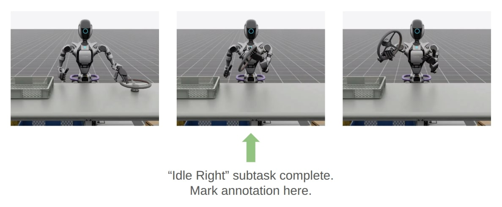

.. _teleoperation-imitation-learning:

使用 Isaac Lab Mimic 进行遥操作与模仿学习
=========================================================

遥操作
~~~~~~~~~~~~~

我们提供在 SE(2) 和 SE(3) 空间中给出命令以进行机器人控制的接口。对于 SE(2) 遥操作，返回的命令是线速度的 x-y 分量和偏航角速率；而对于 SE(3)，返回的命令是一个表示位姿变化的 6 维向量。

.. note::

   目前，Isaac Lab Mimic 仅支持 Linux。

要使用键盘设备进行逆运动学（IK）控制：

.. code:: bash

   ./isaaclab.sh -p scripts/environments/teleoperation/teleop_se3_agent.py --task Isaac-Stack-Cube-Franka-IK-Rel-v0 --num_envs 1 --teleop_device keyboard

为了获得更平滑的操作体验并支持离轴操作，我们建议使用 SpaceMouse 作为输入设备。提供更平滑的演示数据会让策略更容易克隆行为。要使用 SpaceMouse，只需相应地更改遥操作设备：

.. code:: bash

   ./isaaclab.sh -p scripts/environments/teleoperation/teleop_se3_agent.py --task Isaac-Stack-Cube-Franka-IK-Rel-v0 --num_envs 1 --teleop_device spacemouse

.. note::

   如果未检测到 SpaceMouse，您可能需要通过运行 ``sudo chmod 666 /dev/hidraw<#>`` 授予额外的用户权限，其中 ``<#>`` 对应已连接 SpaceMouse 的设备索引。

   要确定设备索引，请运行 ``ls -l /dev/hidraw*`` 列出所有 ``hidraw`` 设备。
   然后对上一步列出的每个设备运行 ``cat /sys/class/hidraw/hidraw<#>/device/uevent`` ，
   以识别对应 SpaceMouse 的设备。

   我们建议使用本地部署的 Isaac Lab 来使用 SpaceMouse。如果使用容器部署（ :ref:`deployment-docker` ），则必须通过在 ``docker-compose.yaml`` 文件中添加一个包含设备路径的 ``devices`` 属性，将 SpaceMouse 手动挂载到 ``isaac-lab-base`` 容器：

   .. code:: yaml

      devices:
         - /dev/hidraw<#>:/dev/hidraw<#>

   其中 ``<#>`` 是已连接 SpaceMouse 的设备索引。

   如果您使用的是 IsaacLab + CloudXR 容器部署（ :ref:`cloudxr-teleoperation` ），可以在 ``docker/docker-compose.cloudxr-runtime.patch.yaml`` 文件的 ``services -> isaac-lab-base`` 部分下添加 ``devices`` 属性。

   Isaac Lab 仅兼容 3Dconnexion 的 SpaceMouse Wireless 和 SpaceMouse Compact 型号。

对于受益于带手部追踪的扩展现实（XR）设备的任务，Isaac Lab 支持使用 NVIDIA CloudXR 将场景沉浸式地流式传输到兼容的 XR 设备上进行遥操作。请注意，使用手部追踪时，我们建议使用该任务的绝对（absolute）变体（ ``Isaac-Stack-Cube-Franka-IK-Abs-v0`` ），它需要 ``handtracking`` 设备：

.. code:: bash

   ./isaaclab.sh -p scripts/environments/teleoperation/teleop_se3_agent.py --task Isaac-Stack-Cube-Franka-IK-Abs-v0 --teleop_device handtracking --device cpu

.. note::

   请参见 :ref:`cloudxr-teleoperation` 了解如何使用 CloudXR 并体验 Isaac Lab 的遥操作。

该脚本会打印已配置的遥操作事件。对于键盘，这些事件如下：

.. code:: text

   Keyboard Controller for SE(3): Se3Keyboard
      Reset all commands: R
      Toggle gripper (open/close): K
      Move arm along x-axis: W/S
      Move arm along y-axis: A/D
      Move arm along z-axis: Q/E
      Rotate arm along x-axis: Z/X
      Rotate arm along y-axis: T/G
      Rotate arm along z-axis: C/V

对于 SpaceMouse，这些事件如下：

.. code:: text

   SpaceMouse Controller for SE(3): Se3SpaceMouse
      Reset all commands: Right click
      Toggle gripper (open/close): Click the left button on the SpaceMouse
      Move arm along x/y-axis: Tilt the SpaceMouse
      Move arm along z-axis: Push or pull the SpaceMouse
      Rotate arm: Twist the SpaceMouse

下一节介绍如何使用遥操作设备为模仿学习收集数据。

使用 Isaac Lab Mimic 进行模仿学习
~~~~~~~~~~~~~~~~~~~~~~~~~~~~~~~~~~~~~~~

使用遥操作设备，还可以收集用于从演示中学习（LfD, Learning from Demonstrations）的数据。为此，我们提供了将数据收集为开放 HDF5 格式的脚本。

收集演示数据
^^^^^^^^^^^^^^^^^^^^^^^^^

要通过遥操作为环境 ``Isaac-Stack-Cube-Franka-IK-Rel-v0`` 收集演示数据，请使用以下命令：

.. code:: bash

   # step a: create folder for datasets
   mkdir -p datasets
   # step b: collect data with a selected teleoperation device. Replace <teleop_device> with your preferred input device.
   # Available options: spacemouse, keyboard, handtracking
   ./isaaclab.sh -p scripts/tools/record_demos.py --task Isaac-Stack-Cube-Franka-IK-Rel-v0 --device cpu --teleop_device <teleop_device> --dataset_file ./datasets/dataset.hdf5 --num_demos 10
   # step a: replay the collected dataset
   ./isaaclab.sh -p scripts/tools/replay_demos.py --task Isaac-Stack-Cube-Franka-IK-Rel-v0 --device cpu --dataset_file ./datasets/dataset.hdf5

.. note::

   立方体的堆叠顺序应为蓝色（底部）、红色（中层）、绿色（顶部）。

.. tip::

   使用 XR 设备时，我们建议使用 ``Isaac-Stack-Cube-Frank-IK-Abs-v0`` 版本的任务并配合 ``--teleop_device handtracking`` 来收集演示数据，它使用手部的绝对位置来控制末端执行器。

大约需要 10 条成功的演示数据，后续步骤才能成功进行。

以下是一些有助于录制出能够成功训练策略的演示数据的技巧：

* 保持演示数据简短。较短的演示意味着策略需要做出的决策更少，训练也更容易。
* 走直接的路径。不要沿任意的轴运动，而是径直朝目标移动。
* 不要停顿。应执行平滑、连续的运动。策略并不清楚为何以及何时停顿，因此连续的运动更容易学习。

如果在执行演示数据时出现失误，或出于其他原因不希望录制当前演示数据，请按 ``R`` 键丢弃当前演示数据，并重置到新的起始位置。

.. note::
   在回放期间可能会观察到非确定性，因为使用 ``env.reset`` 时 IsaacLab 的物理仿真无法确定性地复现。

预录制的演示数据
^^^^^^^^^^^^^^^^^^^^^^^^^^^

我们提供了一个预录制的 ``dataset.hdf5`` ，其中包含针对 ``Isaac-Stack-Cube-Franka-IK-Rel-v0`` 的 10 条人类演示数据，位于此处： `[Franka Dataset] <https://omniverse-content-production.s3-us-west-2.amazonaws.com/Assets/Isaac/5.1/Isaac/IsaacLab/Mimic/franka_stack_datasets/dataset.hdf5>`__ 。
如果您不希望自己收集演示数据，可以下载该数据集并用于本教程的其余步骤。

.. note::
   使用预录制数据集是可选的。

.. _generating-additional-demonstrations:

使用 Isaac Lab Mimic 生成额外的演示数据
^^^^^^^^^^^^^^^^^^^^^^^^^^^^^^^^^^^^^^^^^^^^^^^^^^^^^

可以使用 Isaac Lab Mimic 生成额外的演示数据。

Isaac Lab Mimic 是 Isaac Lab 中的一项功能，它可以自动生成额外的演示数据，使得即使只有少量人工演示数据，策略也能成功学习。

在下面的示例中，我们将展示如何使用 Isaac Lab Mimic 生成额外的演示数据，这些数据可用于训练基于状态的策略
（使用 ``Isaac-Stack-Cube-Franka-IK-Rel-Mimic-v0`` 环境）或视觉运动策略（使用 ``Isaac-Stack-Cube-Franka-IK-Rel-Visuomotor-Mimic-v0`` 环境）。

.. note::
   以下命令使用 CPU 模式运行，因为只使用了少量环境，这些环境受 I/O 限制而非计算限制。

.. important::

   以下各节中的所有命令都必须保持策略类型一致。例如，如果选择使用基于状态的策略，那么使用的所有命令都应来自“基于状态的策略”选项卡。

要将 Isaac Lab Mimic 与录制的数据集结合使用，首先需要标注录制数据中的子任务：

.. tab-set::
   :sync-group: policy_type

   .. tab-item:: 基于状态的策略
      :sync: state

      .. code:: bash

         ./isaaclab.sh -p scripts/imitation_learning/isaaclab_mimic/annotate_demos.py \
         --device cpu --task Isaac-Stack-Cube-Franka-IK-Rel-Mimic-v0 --auto \
         --input_file ./datasets/dataset.hdf5 --output_file ./datasets/annotated_dataset.hdf5

   .. tab-item:: 视觉运动策略
      :sync: visuomotor

      .. code:: bash

         ./isaaclab.sh -p scripts/imitation_learning/isaaclab_mimic/annotate_demos.py \
         --device cpu --enable_cameras --task Isaac-Stack-Cube-Franka-IK-Rel-Visuomotor-Mimic-v0 --auto \
         --input_file ./datasets/dataset.hdf5 --output_file ./datasets/annotated_dataset.hdf5

然后，使用 Isaac Lab Mimic 生成一些额外的演示数据：

.. tab-set::
   :sync-group: policy_type

   .. tab-item:: 基于状态的策略
      :sync: state

      .. code:: bash

         ./isaaclab.sh -p scripts/imitation_learning/isaaclab_mimic/generate_dataset.py \
         --device cpu --num_envs 10 --generation_num_trials 10 \
         --input_file ./datasets/annotated_dataset.hdf5 --output_file ./datasets/generated_dataset_small.hdf5

   .. tab-item:: 视觉运动策略
      :sync: visuomotor

      .. code:: bash

         ./isaaclab.sh -p scripts/imitation_learning/isaaclab_mimic/generate_dataset.py \
         --device cpu --enable_cameras --num_envs 10 --generation_num_trials 10 \
         --input_file ./datasets/annotated_dataset.hdf5 --output_file ./datasets/generated_dataset_small.hdf5

.. note::

   ``annotate_demos.py`` 脚本的输出文件（ ``output_file`` ）是 ``generate_dataset.py`` 脚本的输入文件（ ``input_file`` ）

检查生成数据的输出（文件名： ``generated_dataset_small.hdf5`` ），如果满意，则生成完整数据集：

.. tab-set::
   :sync-group: policy_type

   .. tab-item:: 基于状态的策略
      :sync: state

      .. code:: bash

         ./isaaclab.sh -p scripts/imitation_learning/isaaclab_mimic/generate_dataset.py \
         --device cpu --headless --num_envs 10 --generation_num_trials 1000 \
         --input_file ./datasets/annotated_dataset.hdf5 --output_file ./datasets/generated_dataset.hdf5

   .. tab-item:: 视觉运动策略
      :sync: visuomotor

      .. code:: bash

         ./isaaclab.sh -p scripts/imitation_learning/isaaclab_mimic/generate_dataset.py \
         --device cpu --enable_cameras --headless --num_envs 10 --generation_num_trials 1000 \
         --input_file ./datasets/annotated_dataset.hdf5 --output_file ./datasets/generated_dataset.hdf5

可以增加或减少演示数据的数量，已有结果表明 1000 条演示数据能为该任务提供良好的训练效果。

此外，可以调整 ``--num_envs`` 参数中的环境数量以加快数据生成速度。
建议的 10 个环境数量可以在中等配置的笔记本 GPU 上运行。
在性能更强的台式机上，使用更多的环境数量可以显著加快此步骤的速度。

Robomimic 设置
^^^^^^^^^^^^^^^

作为示例，我们将训练一个由 `Robomimic <https://robomimic.github.io/>`__ 实现的 BC 智能体来训练策略。也可以使用任何其他框架或训练方法。

要安装 robomimic 框架，请使用以下命令：

.. code:: bash

   # install the dependencies
   sudo apt install cmake build-essential
   # install python module (for robomimic)
   ./isaaclab.sh -i robomimic

训练智能体
^^^^^^^^^^^^^^^^^

使用 Mimic 生成的数据，我们现在可以为 ``Isaac-Stack-Cube-Franka-IK-Rel-v0`` 训练基于状态的 BC 智能体，或为 ``Isaac-Stack-Cube-Franka-IK-Rel-Visuomotor-v0`` 训练视觉运动 BC 智能体：

.. tab-set::
   :sync-group: policy_type

   .. tab-item:: 基于状态的策略
      :sync: state

      .. code:: bash

         ./isaaclab.sh -p scripts/imitation_learning/robomimic/train.py \
         --task Isaac-Stack-Cube-Franka-IK-Rel-v0 --algo bc \
         --dataset ./datasets/generated_dataset.hdf5

   .. tab-item:: 视觉运动策略
      :sync: visuomotor

      .. code:: bash

         ./isaaclab.sh -p scripts/imitation_learning/robomimic/train.py \
         --task Isaac-Stack-Cube-Franka-IK-Rel-Visuomotor-v0 --algo bc \
         --dataset ./datasets/generated_dataset.hdf5

.. note::
   默认情况下，训练得到的模型和日志将保存到 ``IssacLab/logs/robomimic`` 。

结果可视化
^^^^^^^^^^^^^^^^^^^

.. tip::

   **重要提示：测试多个检查点周期**

   在评估策略性能时，不同的训练周期产生显著不同结果的情况很常见。
   如果未看到预期的性能， **请务必测试来自不同周期的策略** （而不仅仅是最终检查点），
   以找到表现最佳的模型。模型性能在训练过程中可能有较大波动，最后一个周期
   并不总是最优的。

通过使用生成的模型进行推理，我们可以可视化策略的结果：

.. tab-set::
   :sync-group: policy_type

   .. tab-item:: 基于状态的策略
      :sync: state

      .. code:: bash

         ./isaaclab.sh -p scripts/imitation_learning/robomimic/play.py \
         --device cpu --task Isaac-Stack-Cube-Franka-IK-Rel-v0 --num_rollouts 50 \
         --checkpoint /PATH/TO/desired_model_checkpoint.pth

   .. tab-item:: 视觉运动策略
      :sync: visuomotor

      .. code:: bash

         ./isaaclab.sh -p scripts/imitation_learning/robomimic/play.py \
         --device cpu --enable_cameras --task Isaac-Stack-Cube-Franka-IK-Rel-Visuomotor-v0 --num_rollouts 50 \
         --checkpoint /PATH/TO/desired_model_checkpoint.pth

.. tip::

   **如果您没有看到预期的性能结果：** 请测试来自多个检查点周期的策略，而不仅仅是最后一个。
   策略性能在不同训练周期之间可能有显著差异，中间的检查点通常优于最终模型。

.. note::

   **Franka 立方体堆叠任务的预期成功率与耗时**

   * 数据生成成功率：约 50%（基于状态和视觉运动均适用）
   * 数据生成时间：基于状态约 30 分钟，视觉运动约 4 小时（取决于用户运行的环境数量）
   * BC RNN 训练时间：1000 个周期 + 约 30 分钟（基于状态），600 个周期 + 约 6 小时（视觉运动）
   * BC RNN 策略成功率：约 40-60%（基于状态和视觉运动均适用）
   * **建议：** 在训练过程中评估来自不同周期的检查点，以找到表现最佳的模型

示例 1：人形机器人的数据生成与策略训练
~~~~~~~~~~~~~~~~~~~~~~~~~~~~~~~~~~~~~~~~~~~~~~~~~~~~~~~~~~~~~~~~

.. figure:: https://download.isaacsim.omniverse.nvidia.com/isaaclab/images/gr-1_steering_wheel_pick_place.gif
   :width: 100%
   :align: center
   :alt: GR-1 humanoid robot performing a pick and place task
   :figclass: align-center

Isaac Lab Mimic 支持为具有多个末端执行器的机器人生成数据。在下面的演示中，我们将展示如何生成数据，
以训练 Fourier GR-1 人形机器人执行抓取放置任务。

可选：收集并标注演示数据
^^^^^^^^^^^^^^^^^^^^^^^^^^^^^^^^^^^^^^^^^^^^^

收集人类演示数据
""""""""""""""""""""""""""""
.. note::

   为 GR-1 人形机器人环境收集数据需要使用 Apple Vision Pro 头显。如果您无法使用
   Apple Vision Pro，可以跳过此步骤并继续下一步： `生成数据集`_ 。
   下一步提供了预先录制好的标注数据集。

.. tip::
   GR1 场景使用来自 Apple Vision Pro（AVP）的手腕位姿作为差分 IK 控制器（Pink-IK）的设定点。
   差分 IK 控制器要求用户的手腕位姿接近机器人的初始或当前位姿，以获得最佳性能。
   用户手腕的快速运动可能导致其明显偏离目标状态，从而可能使 IK 控制器无法找到最优解。
   这可能导致用户的手腕与机器人的手腕之间出现不匹配。
   您可以提高 `Pink-IK controller's FrameTasks <https://github.com/isaac-sim/IsaacLab/blob/main/source/isaaclab_tasks/isaaclab_tasks/manager_based/manipulation/pick_place/pickplace_gr1t2_env_cfg.py>`__ 中所有任务的增益，以更低的延迟跟踪 AVP 手腕位姿。
   但这可能导致运动更加抖动。
   另外，机器人的手指关节使用 `dex-retargeting <https://github.com/dexsuite/dex-retargeting>`_ 库重定向到用户的手指关节。

按照 :ref:`cloudxr-teleoperation` 中的步骤设置 CloudXR Runtime 和 Apple Vision Pro 以进行遥操作。
以下步骤使用 CPU 仿真，以便在运行单个环境时获得更好的 XR 性能。

收集一组人类演示数据。
一条成功的演示数据要求物体被放置到料箱中，并且机器人的右臂收回至起始位置。

Isaac Lab Mimic Env 的 GR-1 人形机器人设置为左手有一个子任务，而右手有两个子任务。
第一个子任务是右手保持不动，同时左手拿起物体并将其移动到右手将抓取的位置。
这种设置使 Isaac Lab Mimic 能够利用物体的位姿准确插值右手的轨迹，尤其是在数据生成期间位姿被随机化的情况下。
因此，在左手拿起物体并将其带到稳定位置时，请避免移动右手。

.. |good_demo| image:: https://download.isaacsim.omniverse.nvidia.com/isaaclab/images/gr-1_steering_wheel_pick_place_good_demo.gif
   :width: 49%
   :alt: GR-1 humanoid robot performing a good pick and place demonstration

.. |bad_demo| image:: https://download.isaacsim.omniverse.nvidia.com/isaaclab/images/gr-1_steering_wheel_pick_place_bad_demo.gif
   :width: 49%
   :alt: GR-1 humanoid robot performing a bad pick and place demonstration

|good_demo| |bad_demo|

.. centered:: 左：动作平滑稳定的一条优秀人类演示数据。右：动作抖动且夸张的一条糟糕演示数据。

通过运行以下命令收集五条演示数据：

.. code:: bash

   ./isaaclab.sh -p scripts/tools/record_demos.py \
   --device cpu \
   --task Isaac-PickPlace-GR1T2-Abs-v0 \
   --teleop_device handtracking \
   --dataset_file ./datasets/dataset_gr1.hdf5 \
   --num_demos 5 --enable_pinocchio

.. note::
   我们还提供了启用腰部自由度的 GR-1 抓取放置任务 ``Isaac-PickPlace-GR1T2-WaistEnabled-Abs-v0`` （有关可用环境（包括 GR1 Waist Enabled 变体）的详细信息，请参见 :ref:`environments` ）。上述命令同样适用，只需将任务名称更改为 ``Isaac-PickPlace-GR1T2-WaistEnabled-Abs-v0`` 。

.. tip::
   如果某条演示数据在收集过程中失败，可以通过 Apple Vision Pro 上 XR 遥操作客户端中的遥操作控制面板重置环境，或通过语音控制说 "reset" 来重置。更多详情请参见 :ref:`teleoperate-apple-vision-pro` 。

   机器人使用简化的碰撞网格进行物理计算，这些网格与仿真中显示的精细视觉网格不同。由于这种差异，您可能会偶尔观察到机器人部分部位似乎穿透其他物体或其自身的视觉瑕疵，即使物理仿真中正在正确处理碰撞。

您可以通过运行以下命令回放收集到的演示数据：

.. code:: bash

   ./isaaclab.sh -p scripts/tools/replay_demos.py \
   --device cpu \
   --task Isaac-PickPlace-GR1T2-Abs-v0 \
   --dataset_file ./datasets/dataset_gr1.hdf5 --enable_pinocchio

.. note::
   在回放期间可能会观察到非确定性，因为使用 ``env.reset`` 时 IsaacLab 的物理仿真无法确定性地复现。

标注演示数据
"""""""""""""""""""""""""""

与之前的 Franka 堆叠任务不同，GR-1 抓取放置任务使用人工标注来定义子任务。

抓取放置任务中，左臂有一个子任务（抓取），右臂有两个子任务（保持不动、放置）。
标注表示子任务的结束。对于抓取放置任务，这意味着左臂没有标注，右臂有一个标注（最后一个子任务的结束总是隐式的）。

每条演示数据都需要在右臂的第一个和第二个子任务之间进行一次标注。该标注（按下 "S" 键）应在右机械臂完成“保持不动”（idle）子任务并开始
向目标物体移动时进行。正确标注的示例如下所示：

通过运行以下命令标注演示数据：

.. code:: bash

   ./isaaclab.sh -p scripts/imitation_learning/isaaclab_mimic/annotate_demos.py \
   --device cpu \
   --task Isaac-PickPlace-GR1T2-Abs-Mimic-v0 \
   --input_file ./datasets/dataset_gr1.hdf5 \
   --output_file ./datasets/dataset_annotated_gr1.hdf5 --enable_pinocchio

.. note::

   该脚本会打印用于人工标注的键盘命令以及当前正在标注的子任务：

   .. code:: text

      Annotating episode #0 (demo_0)
         Playing the episode for subtask annotations for eef "right".
         Subtask signals to annotate:
            - Termination:	['idle_right']

         Press "N" to begin.
         Press "B" to pause.
         Press "S" to annotate subtask signals.
         Press "Q" to skip the episode.

.. tip::

   如果在标注期间物体没有被放置到料箱中，您可以按 "N" 重新回放该回合并再次标注。或者按 "Q" 跳过该回合并标注下一条。

生成数据集
^^^^^^^^^^^^^^^^^^^^

如果您跳过了之前的收集和标注步骤，请从此处下载预先录制好的标注数据集 ``dataset_annotated_gr1.hdf5`` ：
`[Annotated GR1 Dataset] <https://omniverse-content-production.s3-us-west-2.amazonaws.com/Assets/Isaac/5.1/Isaac/IsaacLab/Mimic/pick_place_datasets/dataset_annotated_gr1.hdf5>`_ 。
将该文件放置在 ``IsaacLab/datasets`` 下，并运行以下命令以生成包含 1000 条演示数据的新数据集。

.. code:: bash

   ./isaaclab.sh -p scripts/imitation_learning/isaaclab_mimic/generate_dataset.py \
   --device cpu --headless --num_envs 20 --generation_num_trials 1000 --enable_pinocchio \
   --input_file ./datasets/dataset_annotated_gr1.hdf5 --output_file ./datasets/generated_dataset_gr1.hdf5

训练策略
^^^^^^^^^^^^^^

使用 `Robomimic <https://robomimic.github.io/>`__ 为生成的数据集训练策略。

.. code:: bash

   ./isaaclab.sh -p scripts/imitation_learning/robomimic/train.py \
   --task Isaac-PickPlace-GR1T2-Abs-v0 --algo bc \
   --normalize_training_actions \
   --dataset ./datasets/generated_dataset_gr1.hdf5

训练脚本会将数据集中的动作归一化到 [-1, 1] 范围。
归一化参数保存在模型目录下的 ``PATH_TO_MODEL_DIRECTORY/logs/normalization_params.txt`` 中。
请记录这些归一化参数，以便在后续的可视化步骤中使用。

.. note::
   默认情况下，训练得到的模型和日志将保存到 ``IssacLab/logs/robomimic`` 。

结果可视化
^^^^^^^^^^^^^^^^^^^^^

通过运行以下命令并使用上一步训练中记录的归一化参数，来可视化训练好的策略的结果：

.. code:: bash

   ./isaaclab.sh -p scripts/imitation_learning/robomimic/play.py \
   --device cpu \
   --enable_pinocchio \
   --task Isaac-PickPlace-GR1T2-Abs-v0 \
   --num_rollouts 50 \
   --horizon 400 \
   --norm_factor_min <NORM_FACTOR_MIN> \
   --norm_factor_max <NORM_FACTOR_MAX> \
   --checkpoint /PATH/TO/desired_model_checkpoint.pth

.. note::
   请将上述命令中的 ``NORM_FACTOR`` 替换为训练步骤中生成的值。

.. tip::

   **如果您没有看到预期的性能结果：** 测试来自不同检查点周期的策略至关重要。
   不同周期之间的性能可能有显著差异，表现最佳的检查点往往不是最后一个。

.. figure:: https://download.isaacsim.omniverse.nvidia.com/isaaclab/images/gr-1_steering_wheel_pick_place_policy.gif
   :width: 100%
   :align: center
   :alt: GR-1 humanoid robot performing a pick and place task
   :figclass: align-center

   训练好的策略在 Isaac Lab 中执行抓取放置任务。

.. note::

   **Pick and Place GR1T2 任务的预期成功率与耗时**

   * 数据生成的成功率取决于人类演示数据的质量（用户执行的熟练程度）和数据集标注质量。数据生成和下游策略的成功率都对这些因素敏感，可能表现出较大的方差。有关改进数据集的技巧，请参见 :ref:`生成数据的常见陷阱 <common-pitfalls-generating-data>` 。
   * 该任务在 1000 条演示数据上的数据生成成功率通常为 65-80%，耗时 18-40 分钟，取决于 GPU 硬件和成功率（RTX ADA 6000 上成功率为 80% 时需 19 分钟）。
   * 在 1000 条生成的演示数据上以 2000 个周期（默认值）训练时，行为克隆（BC）策略的成功率通常为 75-86%（基于 50 次 rollout 评估），具体取决于演示数据质量。在 RTX ADA 6000 上训练大约需要 29 分钟。
   * **建议：** 使用 1000 条生成的演示数据训练 2000 个周期，并 **评估在第 1000 到 2000 个周期之间保存的多个检查点** 以选择表现最佳的策略。测试不同周期对于找到最优性能至关重要。

示例 2：Unitree G1 人形机器人移动操作（Locomanipulation）的数据生成与策略训练
~~~~~~~~~~~~~~~~~~~~~~~~~~~~~~~~~~~~~~~~~~~~~~~~~~~~~~~~~~~~~~~~~~~~~~~~~~~~~~~~~~~~~~~~~~~~~~~~~

在本演示中，我们展示了在单个人形机器人系统中集成运动（locomotion）与操作（manipulation）能力。
该移动操作环境支持为结合导航与物体操作的复杂任务收集数据。
该演示遵循多步骤流程：首先，生成与示例 1 类似的抓取放置任务，然后引入一个导航组件，
使用专用脚本生成人形机器人必须从 A 点移动到 B 点的场景。
机器人在初始位置（A 点）拿起物体，并将其放置到目标目的地（B 点）。

.. figure:: https://download.isaacsim.omniverse.nvidia.com/isaaclab/images/locomanipulation-g-1_steering_wheel_pick_place.gif
   :width: 100%
   :align: center
   :alt: G1 humanoid robot with locomanipulation performing a pick and place task
   :figclass: align-center

.. note::
   **运动策略训练**

   本集成示例中使用的运动策略是使用 `AGILE <https://github.com/nvidia-isaac/WBC-AGILE>`__ 框架训练的。
   AGILE 是官方支持的人形机器人控制训练流水线，它利用了 Isaac Lab 中基于管理器的环境。它还将与
   Isaac 产品家族中的其他评估和部署工具无缝集成。这使得团队可以依赖单一且持续维护的技术栈，
   涵盖策略训练所需的所有基础设施和工具，并可轻松导出到真实世界部署。AGILE 仓库包含
   更新后的预训练策略，为提高灵活性，上半身与下半身策略相互独立。它们已在真实世界中得到验证，
   可以直接部署。用户也可以使用 AGILE 框架训练自己的运动或全身控制策略。

生成操作数据集
^^^^^^^^^^^^^^^^^^^^^^^^^^^^^^^^^^^

示例 1.0 中相同的数据生成和策略训练步骤也适用于具备移动操作能力的 G1 人形机器人。
本演示展示如何训练 G1 机器人执行结合全身运动与操作的抓取放置任务。

该流程遵循与示例 1.0 相同的工作流，但使用 ``Isaac-PickPlace-Locomanipulation-G1-Abs-v0`` 任务环境。

请按照示例 1.0 中演示的相同数据收集、标注和生成流程进行操作，但需针对 G1 移动操作任务进行调整。

.. hint::

   如果需要，可以使用与前面示例相同的命令进行数据收集和标注，以验证数据集。

   具备移动操作能力的 G1 机器人将全身运动与操作相结合，以执行抓取放置任务。

   **请注意，以下命令仅供您参考和验证数据集之用——本演示并不需要它们。**

   要收集演示数据：

   .. code:: bash

      ./isaaclab.sh -p scripts/tools/record_demos.py \
      --device cpu \
      --task Isaac-PickPlace-Locomanipulation-G1-Abs-v0 \
      --teleop_device handtracking \
      --dataset_file ./datasets/dataset_g1_locomanip.hdf5 \
      --num_demos 5 --enable_pinocchio

   .. note::

      根据 Apple Vision Pro 应用的初始化方式，操作者的手部相对于 G1 机器人的手部可能会非常高或非常低。如果出现这种情况，您可以点击 Isaac Lab 中 AR 选项卡里的 **Stop AR** ，并移动 AR Anchor Prim。将其向下调整可降低操作者的手部，向上调整可抬高。点击 **Start AR** 以恢复遥操作会话。在 Apple Vision Pro 中点击 **Play** 之前，请确保机器人手部已经对齐，否则初始时会产生不期望的较大作用力。

   您可以通过运行以下命令回放收集到的演示数据：

   .. code:: bash

      ./isaaclab.sh -p scripts/tools/replay_demos.py \
      --device cpu \
      --task Isaac-PickPlace-Locomanipulation-G1-Abs-v0 \
      --dataset_file ./datasets/dataset_g1_locomanip.hdf5 --enable_pinocchio

   要标注演示数据：

   .. code:: bash

      ./isaaclab.sh -p scripts/imitation_learning/isaaclab_mimic/annotate_demos.py \
      --device cpu \
      --task Isaac-Locomanipulation-G1-Abs-Mimic-v0 \
      --input_file ./datasets/dataset_g1_locomanip.hdf5 \
      --output_file ./datasets/dataset_annotated_g1_locomanip.hdf5 --enable_pinocchio

如果您跳过了之前的收集和标注步骤，请从此处下载预先录制好的标注数据集 ``dataset_annotated_g1_locomanip.hdf5`` ：
`[Annotated G1 Dataset] <https://omniverse-content-production.s3-us-west-2.amazonaws.com/Assets/Isaac/5.1/Isaac/IsaacLab/Mimic/pick_place_datasets/dataset_annotated_g1_locomanip.hdf5>`_ 。
将该文件放置在 ``IsaacLab/datasets`` 下，并运行以下命令以生成包含 1000 条演示数据的新数据集。

.. code:: bash

   ./isaaclab.sh -p scripts/imitation_learning/isaaclab_mimic/generate_dataset.py \
   --device cpu --headless --num_envs 20 --generation_num_trials 1000 --enable_pinocchio \
   --input_file ./datasets/dataset_annotated_g1_locomanip.hdf5 --output_file ./datasets/generated_dataset_g1_locomanip.hdf5

训练仅操作的策略
^^^^^^^^^^^^^^^^^^^^^^^^^^^^^^^^^

此时，您可以使用生成的数据集训练一个仅执行操作任务的策略：

.. code:: bash

   ./isaaclab.sh -p scripts/imitation_learning/robomimic/train.py \
   --task Isaac-PickPlace-Locomanipulation-G1-Abs-v0 --algo bc \
   --normalize_training_actions \
   --dataset ./datasets/generated_dataset_g1_locomanip.hdf5

结果可视化
^^^^^^^^^^^^^^^^^^^^^

可视化训练好的策略的性能：

.. code:: bash

   ./isaaclab.sh -p scripts/imitation_learning/robomimic/play.py \
   --device cpu \
   --enable_pinocchio \
   --task Isaac-PickPlace-Locomanipulation-G1-Abs-v0 \
   --num_rollouts 50 \
   --horizon 400 \
   --norm_factor_min <NORM_FACTOR_MIN> \
   --norm_factor_max <NORM_FACTOR_MAX> \
   --checkpoint /PATH/TO/desired_model_checkpoint.pth

.. note::
   请将上述命令中的 ``NORM_FACTOR`` 替换为训练步骤中生成的值。

.. tip::

   **如果您没有看到预期的性能结果：** 请务必测试来自不同检查点周期的策略。
   不同周期可能产生显著不同的结果，因此请评估多个检查点以找到最优模型。

.. figure:: https://download.isaacsim.omniverse.nvidia.com/isaaclab/images/locomanipulation-g-1_steering_wheel_pick_place.gif
   :width: 100%
   :align: center
   :alt: G1 humanoid robot performing a pick and place task
   :figclass: align-center

   训练好的策略在 Isaac Lab 中执行抓取放置任务。

.. note::

   **移动操作抓取放置任务的预期成功率与耗时**

   * 数据生成的成功率取决于人类演示数据的质量（用户执行的熟练程度）和数据集标注质量。数据生成和下游策略的成功率都对这些因素敏感，可能表现出较大的方差。有关改进数据集的技巧，请参见 :ref:`生成数据的常见陷阱 <common-pitfalls-generating-data>` 。
   * 该任务在 1000 条演示数据上的数据生成成功率通常为 65-82%，耗时 18-40 分钟，取决于 GPU 硬件和成功率（RTX ADA 6000 上成功率为 82% 时需 18 分钟）。
   * 在 1000 条生成的演示数据上以 2000 个周期（默认值）训练时，行为克隆（BC）策略的成功率通常为 75-85%（基于 50 次 rollout 评估），具体取决于演示数据质量。在 RTX ADA 6000 上训练大约需要 40 分钟。
   * **建议：** 使用 1000 条生成的演示数据训练 2000 个周期，并 **评估在第 1000 到 2000 个周期之间保存的多个检查点** 以选择表现最佳的策略。测试不同周期对于找到最优性能至关重要。

生成包含操作与点到点导航的数据集
^^^^^^^^^^^^^^^^^^^^^^^^^^^^^^^^^^^^^^^^^^^^^^^^^^^^^^^^^^^^^^^^

要创建一个同时结合操作与导航能力的综合移动操作数据集，您可以使用上一步生成的操作数据集作为输入来生成导航数据集。

.. figure:: https://download.isaacsim.omniverse.nvidia.com/isaaclab/images/disjoint_navigation.gif
   :width: 100%
   :align: center
   :alt: G1 humanoid robot combining navigation with locomanipulation
   :figclass: align-center

   G1 人形机器人执行具备导航能力的移动操作。

移动操作数据集生成过程会获取之前生成的操作数据集，并创建机器人必须在执行操作任务的同时从一个位置导航到另一个位置的场景。这会创建一个同时包含运动与操作行为的更复杂数据集。

要生成移动操作数据集，请使用以下命令：

.. code:: bash

   ./isaaclab.sh -p \
       scripts/imitation_learning/locomanipulation_sdg/generate_data.py \
       --device cpu \
       --kit_args="--enable isaacsim.replicator.mobility_gen" \
       --task="Isaac-G1-SteeringWheel-Locomanipulation" \
       --dataset ./datasets/generated_dataset_g1_locomanip.hdf5 \
       --num_runs 1 \
       --lift_step 60 \
       --navigate_step 130 \
       --enable_pinocchio \
       --output_file ./datasets/generated_dataset_g1_locomanipulation_sdg.hdf5 \
       --enable_cameras

.. note::

   输入数据集（ ``--dataset`` ）应为上一步生成的操作数据集。您可以使用 ``--output_file_name`` 参数指定任意输出文件名。

移动操作数据集生成的关键参数：

* ``--lift_step 70`` ：操作任务抬起阶段的步数。它应标记在机器人抓住物体之后紧接的时间点。
* ``--navigate_step 120`` ：位置之间导航阶段的步数。它应标记在机器人已抬起物体并准备行走的时间点。
* ``--output_file`` ：输出数据集文件的名称

此过程创建的数据集会让机器人在不同位置执行操作任务，要求它在保持所学操作行为的同时在各个点之间导航。生成的数据集可用于训练同时结合运动与操作能力的策略。

.. note::

   您可以使用以下脚本命令可视化机器人轨迹结果：

   .. code:: bash

      ./isaaclab.sh -p scripts/imitation_learning/locomanipulation_sdg/plot_navigation_trajectory.py --input_file datasets/generated_dataset_g1_locomanipulation_sdg.hdf5 --output_dir /PATH/TO/DESIRED_OUTPUT_DIR

此移动操作流水线生成的数据还可用于使用 GR00T N1.5 微调（finetune）模仿学习策略。为此，
您可以将生成的数据集转换为 GR00T N1.5 所期望的 LeRobot 格式，然后运行 GR00T N1.5 仓库中提供的
微调脚本。下面的视频展示了一个闭环策略 rollout 示例：

.. figure:: https://download.isaacsim.omniverse.nvidia.com/isaaclab/images/locomanipulation_sdg_disjoint_nav_groot_policy_4x.gif
   :width: 100%
   :align: center
   :alt: Simulation rollout of GR00T N1.5 policy finetuned for locomanipulation
   :figclass: align-center

   为移动操作微调的 GR00T N1.5 策略的仿真 rollout。

上面展示的策略使用相机图像、手部位姿、手部关节位置、物体位姿和基座目标位姿作为输入。
模型的输出是接下来若干个时间步的目标基座速度、手部位姿和手部关节位置。

示例 3：人形机器人的视觉运动策略
~~~~~~~~~~~~~~~~~~~~~~~~~~~~~~~~~~~~~~~~~~~~~~

.. figure:: https://download.isaacsim.omniverse.nvidia.com/isaaclab/images/gr-1_nut_pouring_policy.gif
   :width: 100%
   :align: center
   :alt: GR-1 humanoid robot performing a pouring task
   :figclass: align-center

下载数据集
^^^^^^^^^^^^^^^^^^^^

从 `此处 <https://download.isaacsim.omniverse.nvidia.com/isaaclab/dataset/generated_dataset_gr1_nut_pouring.hdf5>`__ 下载预生成的数据集，并将其放置在 ``IsaacLab/datasets/generated_dataset_gr1_nut_pouring.hdf5``
**（注意：数据集大小约为 12GB）** 。该数据集包含人形机器人执行倾倒/放置任务的 1000 条演示数据，这些数据是使用 Isaac Lab Mimic 针对 ``Isaac-NutPour-GR1T2-Pink-IK-Abs-Mimic-v0`` 任务生成的。

.. hint::

   如果需要，可以使用与前面示例相同的命令进行数据收集、标注和生成。

   机器人首先拿起红色烧杯，将其中的物体倒入黄色碗中。
   然后，它将红色烧杯放入蓝色料箱。最后，它将黄色碗放到白色秤上。
   有关该任务的直观演示，请参见下方 :ref:`visualize-results-demo-2` 一节中的视频。

   **该任务的成功标准要求红色烧杯被放入蓝色料箱、绿色螺母位于黄色碗中，
   并且黄色碗被放置在白色秤上。**

   .. attention::
      **以下命令仅供您参考，本演示并不需要它们。**

   要收集演示数据：

   .. code:: bash

      ./isaaclab.sh -p scripts/tools/record_demos.py \
      --device cpu \
      --task Isaac-NutPour-GR1T2-Pink-IK-Abs-v0 \
      --teleop_device handtracking \
      --dataset_file ./datasets/dataset_gr1_nut_pouring.hdf5 \
      --num_demos 5 --enable_pinocchio

   由于这是一个视觉运动环境，必须在标注和数据生成命令中添加 ``--enable_cameras`` 标志。

   要标注演示数据：

   .. code:: bash

      ./isaaclab.sh -p scripts/imitation_learning/isaaclab_mimic/annotate_demos.py \
      --device cpu \
      --enable_cameras \
      --rendering_mode balanced \
      --task Isaac-NutPour-GR1T2-Pink-IK-Abs-Mimic-v0 \
      --input_file ./datasets/dataset_gr1_nut_pouring.hdf5 \
      --output_file ./datasets/dataset_annotated_gr1_nut_pouring.hdf5 --enable_pinocchio

   .. warning::
      此任务有多个右末端执行器（right eef）标注。同一末端执行器的子任务标注不能具有相同的动作索引。
      请确保使用不同的动作索引标注右末端执行器的子任务。

   要生成数据集：

   .. code:: bash

      ./isaaclab.sh -p scripts/imitation_learning/isaaclab_mimic/generate_dataset.py \
      --device cpu \
      --headless \
      --enable_pinocchio \
      --enable_cameras \
      --rendering_mode balanced \
      --task Isaac-NutPour-GR1T2-Pink-IK-Abs-Mimic-v0 \
      --generation_num_trials 1000 \
      --num_envs 5 \
      --input_file ./datasets/dataset_annotated_gr1_nut_pouring.hdf5 \
      --output_file ./datasets/generated_dataset_gr1_nut_pouring.hdf5

训练策略
^^^^^^^^^^^^^^

使用 `Robomimic <https://robomimic.github.io/>`__ 为该任务训练视觉运动 BC 智能体。

.. code:: bash

   ./isaaclab.sh -p scripts/imitation_learning/robomimic/train.py \
   --task Isaac-NutPour-GR1T2-Pink-IK-Abs-v0 --algo bc \
   --normalize_training_actions \
   --dataset ./datasets/generated_dataset_gr1_nut_pouring.hdf5

训练脚本会将数据集中的动作归一化到 [-1, 1] 范围。
归一化参数保存在模型目录下的 ``PATH_TO_MODEL_DIRECTORY/logs/normalization_params.txt`` 中。
请记录这些归一化参数，以便在后续的可视化步骤中使用。

.. note::
   默认情况下，训练得到的模型和日志将保存到 ``IsaacLab/logs/robomimic`` 。

您还可以对 `GR00T <https://github.com/NVIDIA/Isaac-GR00T>`__ 基础模型进行后训练（post-train），以部署用于该任务的视觉-语言-动作（Vision-Language-Action）策略。

更多详情请参阅 `IsaacLabEvalTasks <https://github.com/isaac-sim/IsaacLabEvalTasks/>`__ 仓库。

.. _visualize-results-demo-2:

结果可视化
^^^^^^^^^^^^^^^^^^^^^

通过运行以下命令并使用上一步训练中记录的归一化参数，来可视化训练好的策略的结果：

.. code:: bash

   ./isaaclab.sh -p scripts/imitation_learning/robomimic/play.py \
   --device cpu \
   --enable_pinocchio \
   --enable_cameras \
   --rendering_mode balanced \
   --task Isaac-NutPour-GR1T2-Pink-IK-Abs-v0 \
   --num_rollouts 50 \
   --horizon 350 \
   --norm_factor_min <NORM_FACTOR_MIN> \
   --norm_factor_max <NORM_FACTOR_MAX> \
   --checkpoint /PATH/TO/desired_model_checkpoint.pth

.. note::
   请将上述命令中的 ``NORM_FACTOR`` 替换为训练步骤中生成的值。

.. tip::

   **如果您没有看到预期的性能结果：** 请测试来自不同检查点周期的策略，而不仅仅是最后一个。
   策略性能在训练过程中可能有较大波动，中间的检查点往往能产生更好的结果。

.. figure:: https://download.isaacsim.omniverse.nvidia.com/isaaclab/images/gr-1_nut_pouring_policy.gif
   :width: 100%
   :align: center
   :alt: GR-1 humanoid robot performing a pouring task
   :figclass: align-center

   训练好的视觉运动策略在 Isaac Lab 中执行倾倒任务。

.. note::

   **视觉运动螺母倾倒 GR1T2 任务的预期成功率与耗时**

   * 数据生成的成功率取决于人类演示数据的质量（用户执行的熟练程度）和数据集标注质量。数据生成和下游策略的成功率都对这些因素敏感，可能表现出较大的方差。有关改进数据集的技巧，请参见 :ref:`生成数据的常见陷阱 <common-pitfalls-generating-data>` 。
   * 在 RTX ADA 6000 上生成 1000 条演示数据大约需要 10 小时。
   * 在 1000 条生成的演示数据上以 600 个周期（默认值）训练时，行为克隆（BC）策略的成功率通常为 50-60%（基于 50 次 rollout 评估）。在 RTX ADA 6000 上训练大约需要 15 小时。
   * **建议：** 使用 1000 条生成的演示数据训练 600 个周期，并 **评估在第 300 到 600 个周期之间保存的多个检查点** 以选择表现最佳的策略。测试不同周期对于实现最优性能至关重要。

.. _common-pitfalls-generating-data:

生成数据的常见陷阱
~~~~~~~~~~~~~~~~~~~~~~~~~~~~~~~~~~~~

**演示数据过长：**

* 更长的时间跨度（time horizon）对策略来说更难学习
* 从靠近第一个物体的位置开始，并尽量减少动作

**演示数据不平滑：**

* 不规则的运动难以被策略解读
* 更好的遥操作设备能带来更好的数据（即 SpaceMouse 优于键盘）

**演示数据中的停顿：**

* 停顿难以学习
* 保持人类动作平滑流畅

**子任务数量过多：**

* 尽量减少为完成给定任务而定义的子任务数量
* 更少的子任务意味着更少的轨迹拼接，从而获得更高的数据生成成功率

**缺乏动作噪声：**

* 动作噪声能让策略更鲁棒

**录制结束得太急：**

* 如果录制在成功条件触发的帧上停止，回放时该条件可能不会再次触发
* 在录制结束时留出一些缓冲

**非确定性回放：**

* 使用 ``env.reset`` 时 IsaacLab 的物理仿真无法确定性地复现，因此演示数据在回放时可能失败
* 收集比所需更多的人类演示数据，使用在标注期间成功的那些
* Isaac Lab Mimic 生成的 HDF5 文件中的所有数据都代表一次成功的演示，可以用于训练（即使非确定性导致回放时失败）

创建您自己的 Isaac Lab Mimic 兼容环境
~~~~~~~~~~~~~~~~~~~~~~~~~~~~~~~~~~~~~~~~~~~~~~~~~~~~~~~~~

工作原理
^^^^^^^^^^^^

Isaac Lab Mimic 的工作方式是将输入的演示数据拆分为子任务。子任务是演示数据中由用户定义的、所有演示数据共有的片段。子任务的示例包括“抓取一个物体”、“将末端执行器移动到某个预定义位置”、“释放物体”等。请注意，大多数子任务都是相对于机器人与之交互的某个物体来定义的。

子任务需要被定义，然后针对每条输入演示数据进行标注。标注既可以通过为子任务检测定义启发式规则来算法化地完成（如上例所示），也可以人工完成。

在子任务被定义并标注之后，Isaac Lab Mimic 利用少量辅助方法来变换这些子任务片段，并通过将它们拼接在一起以匹配当前的新任务来生成新的演示数据。

对于每条如此生成的候选演示数据，Isaac Lab Mimic 使用布尔型成功标准来判断该演示数据是否成功完成了任务，如果成功，则将其添加到输出数据集中。候选演示数据的成功率在简单情况下可高达 70%，也可低至 <1%，具体取决于任务的难度和机器人本身的复杂程度。

配置与子任务定义
^^^^^^^^^^^^^^^^^^^^^^^^^^^^^^^^^^^^

子任务以及 Isaac Lab Mimic 的其他配置设置都在一个 Mimic 兼容的环境配置类中定义，该类通过在现有环境配置上添加 Mimic 所需的额外参数来创建。

所有 Mimic 所需的配置参数都在 :class:`~isaaclab.envs.MimicEnvCfg` 类中指定。

配置类 :class:`~isaaclab_mimic.envs.FrankaCubeStackIKRelMimicEnvCfg` 为上面示例中使用的 Franka 堆叠任务创建 Mimic 兼容环境配置类提供了一个示例。

``DataGenConfig`` 成员包含影响数据生成方式的各种参数。最初只需设置 ``name`` 参数即可，其余参数可以在之后再修改。

子任务是 :class:`~isaaclab.envs.SubTaskConfig` 对象的列表，其中最重要的成员包括：

* ``object_ref`` 是与之交互的物体。在数据生成期间，它将用于相对于该物体调整运动。如果当前子任务不涉及任何物体，可以为 ``None`` 。
* ``subtask_term_signal`` 是指示子任务是否处于活动状态的信号 ID。

对于多末端执行器环境，可以通过指定子任务约束来强制执行末端执行器之间的子任务顺序。这些约束定义在 :class:`~isaaclab.envs.SubTaskConstraintConfig` 类中。

子任务标注
^^^^^^^^^^^^^^^^^^

子任务定义完成后，需要在源数据中进行标注。标注源演示数据的子任务边界有两种方法：人工标注或使用启发式规则。

人工标注通常是最简单的方式，因为输入演示数据的数量通常很少。要进行人工标注，请使用不带 ``--auto`` 标志的 ``annotate_demos.py`` 脚本。然后按 ``B`` 暂停，按 ``N`` 继续，按 ``S`` 标注子任务边界。

为了获得更精确的边界，或为了加快针对某个任务的重复实验处理，可以实现启发式规则来完成相同的任务。启发式规则是环境中的观测量。有关如何添加子任务项的示例，请参见 ``source/isaaclab_tasks/isaaclab_tasks/manager_based/manipulation/stack/stack_env_cfg.py`` ，其中它们被添加为一个名为 ``SubtaskCfg`` 的观测组。该示例使用了预构建的启发式规则，但自定义启发式规则也很容易实现。

演示数据生成的辅助方法
^^^^^^^^^^^^^^^^^^^^^^^^^^^^^^^^^^^^

Isaac Lab Mimic 所需的辅助方法在环境中定义。所有要与 Isaac Lab Mimic 一起使用的任务都派生自 :class:`~isaaclab.envs.ManagerBasedRLMimicEnv` 基类，并且必须实现以下函数：

* ``get_robot_eef_pose`` ：返回当前机器人末端执行器位姿，使用与机器人末端执行器控制器相同的坐标系。

* ``target_eef_pose_to_action`` ：接收末端执行器控制器的目标位姿和夹爪动作，并返回一个能实现该目标位姿的动作。

* ``action_to_target_eef_pose`` ：接收一个动作，并返回末端执行器控制器的目标位姿。

* ``actions_to_gripper_actions`` ：接收一个动作序列，并返回其中夹爪驱动部分的动作。

* ``get_object_poses`` ：返回场景中每个用于数据生成的物体的位姿。

* ``get_subtask_term_signals`` ：返回一个字典，其中包含任务中每个子任务的二值标志。子任务完成时该标志为 true，否则为 false。

类 :class:`~isaaclab_mimic.envs.FrankaCubeStackIKRelMimicEnv` 展示了如何从现有的 Isaac Lab 环境创建 Mimic 兼容环境的示例。

注册环境
^^^^^^^^^^^^^^^^^^^^^^^^^^^

在 Mimic 兼容环境和环境配置类都创建完成之后，可以使用 ``gym.register`` 注册新的 Mimic 兼容环境。对于上面示例中的 Franka 堆叠任务，Mimic 环境注册为 ``Isaac-Stack-Cube-Franka-IK-Rel-Mimic-v0`` 。

注册的环境现在已可以与 Isaac Lab Mimic 一起使用。

使用 Isaac Lab Mimic 成功生成数据的技巧
~~~~~~~~~~~~~~~~~~~~~~~~~~~~~~~~~~~~~~~~~~~~~~~~~~~~~~~~

拆分子任务
^^^^^^^^^^^^^^^^^^

一个普遍的经验法则是，在仍能完成任务的前提下，将任务拆分为尽可能少的子任务。Isaac Lab Mimic 数据生成使用线性插值来桥接并拼接子任务片段。
更多的子任务意味着更多的轨迹拼接，这可能导致运动不够平滑和更多的失败演示数据。因此，通常最好在机器人运动不太可能与其他物体发生碰撞的位置标注子任务边界。

例如，在下面的场景中，机器人左臂抓住物体之后有一个子任务划分。左侧的子任务标注在抓取之后立即标记，而右侧的标注则在机器人抓住并抬起物体之后标记。
在左侧的情况下，插值导致机器人左臂与桌面发生碰撞且其运动滞后，而在右侧运动则连续平滑。

.. figure:: https://download.isaacsim.omniverse.nvidia.com/isaaclab/images/lagging_subtask.gif
   :width: 99%
   :align: center
   :alt: Subtask splitting example
   :figclass: align-center

.. centered:: 由不当的子任务拆分导致的运动滞后/碰撞（左）

选择插值步数
^^^^^^^^^^^^^^^^^^^^^^^^^^^^^^^^^^^^^^^

子任务片段之间的插值步数可以在 :class:`~isaaclab.envs.SubTaskConfig` 类中指定。变换之后，子任务片段的起点/终点不在同一位置，因此为了创建连续的运动，Isaac Lab Mimic
将在上一个子任务的最后一个点与下一个子任务的第一个点之间应用线性插值。

可以调整插值步数来控制此拼接过程中生成演示数据的平滑程度。
合适的插值步数取决于机器人的速度和任务的复杂程度。具有较大物体重置分布的复杂任务在子任务片段之间会有较大的间隔，需要更多插值步数才能创建平滑的运动。
相反，子任务片段之间间隔较小的任务应使用较少的插值步数，以避免过多步数造成不必要的运动滞后。

下面的示例展示了插值步数会如何影响生成的演示数据。
在该示例中，对机器人右臂应用插值，以桥接左臂抓取与右臂放置之间的间隔。使用 0 步时，右臂的运动会出现生硬的跳变；使用 20 步时，运动会出现滞后。使用 5 步时，运动
平滑自然。

.. |0_interp_steps| image:: https://download.isaacsim.omniverse.nvidia.com/isaaclab/images/0_interpolation_steps.gif
   :width: 32%
   :alt: GR-1 robot with 0 interpolation steps

.. |5_interp_steps| image:: https://download.isaacsim.omniverse.nvidia.com/isaaclab/images/5_interpolation_steps.gif
   :width: 32%
   :alt: GR-1 robot with 5 interpolation steps

.. |20_interp_steps| image:: https://download.isaacsim.omniverse.nvidia.com/isaaclab/images/20_interpolation_steps.gif
   :width: 32%
   :alt: GR-1 robot with 20 interpolation steps

|0_interp_steps| |5_interp_steps| |20_interp_steps|

.. centered:: 左：0 步。中：5 步。右：20 步。
