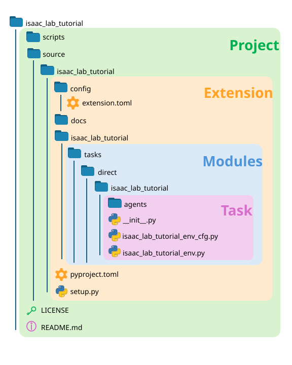

.. _project-structure:

项目结构
=================

在使用 Isaac Lab 模板项目进行直接式工作流开发时，你需要了解四个嵌套的结构：**项目（Project）**、**扩展（Extension）**、**模块（Modules）** 和 **任务（Task）**。

**项目** 是生成的模板的根目录。它包含 source 和 scripts 目录，以及一个 ``README.md`` 文件。我们在创建模板时将项目命名为 *IsaacLabTutorial*，这也定义了一个 git 仓库的根目录。如果显示隐藏文件并检查项目根目录，你会看到许多定义项目在 git 方面行为的文件。``scripts`` 目录包含用于在生成模板时所选择的各种 RL 库的 ``train.py`` 和 ``play.py`` 脚本，而 source 目录包含项目的 Python 包。

**扩展** 是我们通过 pip 安装的 Python 包的名称。默认情况下，模板生成一个只含单个扩展的项目，该扩展与项目同名。一个项目可以有多个扩展，因此它们被放在一个公共的 ``source`` 目录中。传统的 Python 包通过是否存在 ``pyproject.toml`` 文件来定义，该文件描述包的元数据；但使用 Isaac Lab 的包还必须是 Isaac Sim 扩展，因此需要一个 ``config`` 目录以及随附的 ``extension.toml`` 文件，用于描述 Isaac Sim 扩展管理器所需的元数据。最后，由于模板需要通过 pip 安装，它需要一个 ``setup.py`` 文件，利用 ``extension.toml`` 配置来完成安装过程。一个项目可以有多个扩展——Isaac Lab 仓库本身就是最好的例子！

**模块** 是 Isaac Lab 实际加载以运行训练的内容（代码的核心部分）。默认情况下，模板生成一个只含单个模块的扩展，该模块与项目同名。扩展中各个子模块的结构决定了 Isaac Lab 中环境的 ``entry_point``。这正是我们的模板项目需要先安装才能调用 ``train.py`` 的原因：运行该任务所需组件的路径需要暴露给 Python，Isaac Lab 才能找到它们。

最后，**任务** 是直接式工作流的核心。默认情况下，模板生成一个与项目同名的单一任务。环境和配置文件都存储在这里，其中还包括依赖于 RL 库的占位 ``agents`` 目录。至关重要的是，请注意 ``__init__.py`` 的内容！具体来说，在环境和任务能够配合 Isaac Lab 的 ``train.py`` 和 ``play.py`` 脚本使用之前，``gym.register`` 函数需要至少被调用一次。
该函数应包含在某个模块的 ``__init__.py`` 文件中，以便在安装时被调用。这个 init 文件的路径就是任务的入口点！

对于该模板，``gym.register`` 在 ``isaac_lab_tutorial/source/isaac_lab_tutorial/isaac_lab_tutorial/tasks/direct/isaac_lab_tutorial/__init__.py`` 中被调用。
重复的名称是模板需要默认名称的结果，但现在我们可以看清项目的结构：
**Project**/source/**Extension**/**Module**/tasks/direct/**Task**/__init__.py
