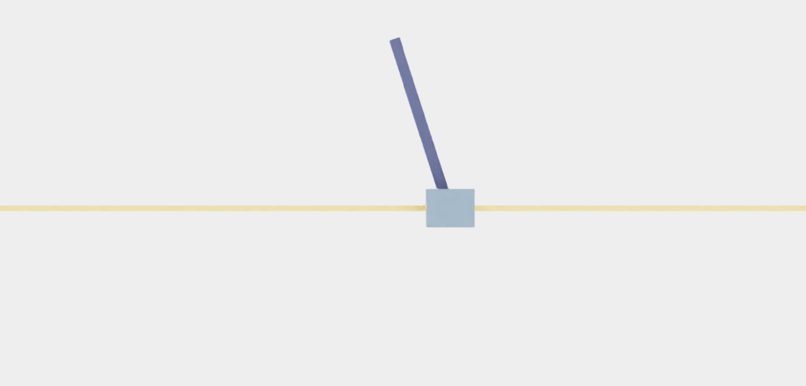
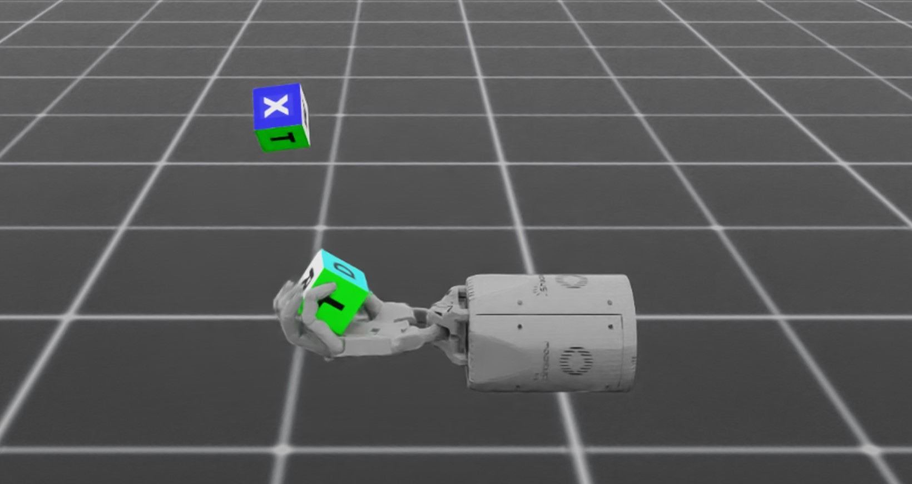

性能基准测试
======================

Isaac Lab 为强化学习工作流提供端到端的 GPU 训练，
支持在数千个环境上快速并行训练。
在本节中，我们提供了在各种 GPU 配置下对不同示例环境进行强化学习训练的
运行时性能基准测试结果。
同时还给出了多 GPU 和多节点训练的性能结果。

基准测试结果
-----------------

所有基准测试结果均是在 Ubuntu 22.04 上使用 RL Games 库并带有 ``--headless``
标志测得的。
``Isaac-Velocity-Rough-G1-v0`` 环境的基准测试结果则使用 RSL RL 库测得。

内存消耗
^^^^^^^^^^^^^^^^^^

+------------------------------------+----------------+-------------------+----------+-----------+
| 环境名称                           |                | 环境数量          | RAM (GB) | VRAM (GB) |
+====================================+================+===================+==========+===========+
| Isaac-Cartpole-Direct-v0           | |cartpole|     | 4096              | 3.7      | 3.3       |
+------------------------------------+----------------+-------------------+----------+-----------+
| Isaac-Cartpole-RGB-Camera-Direct-v0| |cartpole-cam| | 1024              | 7.5      | 16.7      |
+------------------------------------+----------------+-------------------+----------+-----------+
| Isaac-Velocity-Rough-G1-v0         | |g1|           | 4096              | 6.5      | 6.1       |
+------------------------------------+----------------+-------------------+----------+-----------+
| Isaac-Repose-Cube-Shadow-Direct-v0 | |shadow|       | 8192              | 6.7      | 6.4       |
+------------------------------------+----------------+-------------------+----------+-----------+

.. |cartpole| image:: ../../_static/benchmarks/cartpole.jpg
    :width: 80
    :height: 45

.. |g1| image:: ../../_static/benchmarks/g1_rough.jpg
    :width: 80
    :height: 45

单 GPU - RTX 4090
^^^^^^^^^^^^^^^^^

CPU：AMD Ryzen 9 7950X 16 核处理器

+-------------------------------------+-------------------+--------------+-------------------+--------------------+
| 环境名称                            | 环境数量          | 环境步进 FPS | 环境步进与推理    | 环境步进、推理     |
|                                     |                   |              | FPS               | 与训练 FPS         |
+=====================================+===================+==============+===================+====================+
| Isaac-Cartpole-Direct-v0            | 4096              | 1100000      | 910000            | 510000             |
+-------------------------------------+-------------------+--------------+-------------------+--------------------+
| Isaac-Cartpole-RGB-Camera-Direct-v0 | 1024              | 50000        | 45000             | 32000              |
+-------------------------------------+-------------------+--------------+-------------------+--------------------+
| Isaac-Velocity-Rough-G1-v0          | 4096              | 94000        | 88000             | 82000              |
+-------------------------------------+-------------------+--------------+-------------------+--------------------+
| Isaac-Repose-Cube-Shadow-Direct-v0  | 8192              | 200000       | 190000            | 170000             |
+-------------------------------------+-------------------+--------------+-------------------+--------------------+

单 GPU - L40
^^^^^^^^^^^^^^^^

CPU：Intel(R) Xeon(R) Platinum 8362 CPU @ 2.80GHz

+-------------------------------------+-------------------+--------------+-------------------+--------------------+
| 环境名称                            | 环境数量          | 环境步进 FPS | 环境步进与推理    | 环境步进、推理     |
|                                     |                   |              | FPS               | 与训练 FPS         |
+=====================================+===================+==============+===================+====================+
| Isaac-Cartpole-Direct-v0            | 4096              | 620000       | 490000            | 260000             |
+-------------------------------------+-------------------+--------------+-------------------+--------------------+
| Isaac-Cartpole-RGB-Camera-Direct-v0 | 1024              | 30000        | 28000             | 21000              |
+-------------------------------------+-------------------+--------------+-------------------+--------------------+
| Isaac-Velocity-Rough-G1-v0          | 4096              | 72000        | 64000             | 62000              |
+-------------------------------------+-------------------+--------------+-------------------+--------------------+
| Isaac-Repose-Cube-Shadow-Direct-v0  | 8192              | 170000       | 140000            | 120000             |
+-------------------------------------+-------------------+--------------+-------------------+--------------------+

单节点，4 x L40 GPU
^^^^^^^^^^^^^^^^^^^^^

CPU：Intel(R) Xeon(R) Platinum 8362 CPU @ 2.80GHz

+-------------------------------------+-------------------+--------------+-------------------+--------------------+
| 环境名称                            | 环境数量          | 环境步进 FPS | 环境步进与推理    | 环境步进、推理     |
|                                     |                   |              | FPS               | 与训练 FPS         |
+=====================================+===================+==============+===================+====================+
| Isaac-Cartpole-Direct-v0            | 4096              | 2700000      | 2100000           | 950000             |
+-------------------------------------+-------------------+--------------+-------------------+--------------------+
| Isaac-Cartpole-RGB-Camera-Direct-v0 | 1024              | 130000       | 120000            | 90000              |
+-------------------------------------+-------------------+--------------+-------------------+--------------------+
| Isaac-Velocity-Rough-G1-v0          | 4096              | 290000       | 270000            | 250000             |
+-------------------------------------+-------------------+--------------+-------------------+--------------------+
| Isaac-Repose-Cube-Shadow-Direct-v0  | 8192              | 440000       | 420000            | 390000             |
+-------------------------------------+-------------------+--------------+-------------------+--------------------+

4 个节点，每节点 4 x L40 GPU
^^^^^^^^^^^^^^^^^^^^^^^^^^^^^^

CPU：Intel(R) Xeon(R) Platinum 8362 CPU @ 2.80GHz

+-------------------------------------+-------------------+--------------+-------------------+--------------------+
| 环境名称                            | 环境数量          | 环境步进 FPS | 环境步进与推理    | 环境步进、推理     |
|                                     |                   |              | FPS               | 与训练 FPS         |
+=====================================+===================+==============+===================+====================+
| Isaac-Cartpole-Direct-v0            | 4096              | 10200000     | 8200000           | 3500000            |
+-------------------------------------+-------------------+--------------+-------------------+--------------------+
| Isaac-Cartpole-RGB-Camera-Direct-v0 | 1024              | 530000       | 490000            | 260000             |
+-------------------------------------+-------------------+--------------+-------------------+--------------------+
| Isaac-Velocity-Rough-G1-v0          | 4096              | 1200000      | 1100000           | 960000             |
+-------------------------------------+-------------------+--------------+-------------------+--------------------+
| Isaac-Repose-Cube-Shadow-Direct-v0  | 8192              | 2400000      | 2300000           | 1800000            |
+-------------------------------------+-------------------+--------------+-------------------+--------------------+

基准测试脚本
-----------------

为便于复现，我们在 ``scripts/benchmarks`` 中提供了基准测试脚本。
该文件夹包含与 RL-Games 和 RSL RL 的 ``train.py`` 脚本类似的独立基准测试脚本。
此外，我们还提供了一个仅运行环境实现、不使用任何强化学习库的基准测试脚本。

示例脚本的运行方式与训练脚本类似：

.. code-block:: bash

   # benchmark with RSL RL
   python scripts/benchmarks/benchmark_rsl_rl.py --task=Isaac-Cartpole-v0 --headless

   # benchmark with RL Games
   python scripts/benchmarks/benchmark_rlgames.py --task=Isaac-Cartpole-v0 --headless

   # benchmark without RL libraries
   python scripts/benchmarks/benchmark_non_rl.py --task=Isaac-Cartpole-v0 --headless

每个脚本在运行结束时都会生成一组 KPI 文件，其中包括启动时间、运行时统计信息
（例如每次仿真或渲染步骤所耗的时间），以及环境步进、rollout 期间执行推理
和训练时的整体环境 FPS 数据。
