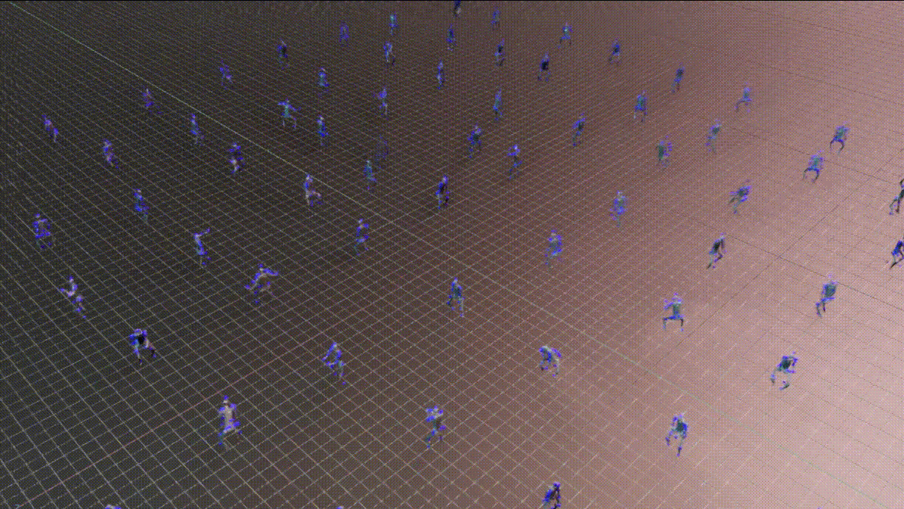
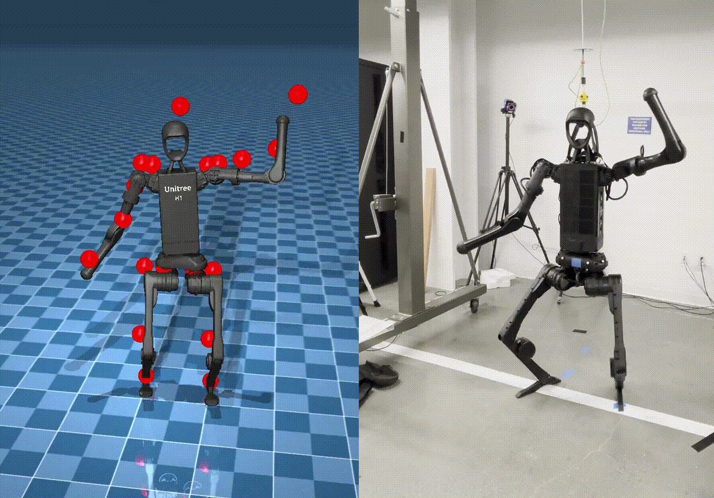

训练与部署 HOVER 策略
=================================

本教程演示了如何在 Isaac Lab 仿真环境中训练和部署 HOVER 的示例，HOVER 是一种面向人形机器人的全身控制（whole-body control，WBC）策略。
它使用 `HOVER`_ 代码仓库，该仓库提供了一个 Isaac Lab 扩展，用于训练人形机器人的神经全身控制策略，详见 `HOVER Paper`_ 和 `OMNIH2O Paper`_ 论文。
有关视频演示和该项目的更多细节，请访问 `HOVER Project Website`_ 和 `OMNIH2O Project Website`_。

安装
------------

.. note::

   本教程仅适用于 Linux。

   HOVER 支持 Isaac Lab 2.0 和 Isaac Sim 4.5。请确保已安装正确版本的 Isaac Lab 和 Isaac Sim，以便运行 HOVER 工作流。

1. 按照 `Isaac Lab Installation Guide`_ 中的说明安装 Isaac Lab。

2. 定义以下环境变量，以指定 Isaac Lab 的安装路径：

.. code-block:: bash

    # Set the ISAACLAB_PATH environment variable to point to your Isaac Lab installation directory
    export ISAACLAB_PATH=<your_isaac_lab_path>

3. 在工作区中克隆 `HOVER`_ 代码仓库及其子模块。

.. code-block:: bash

    git clone --recurse-submodules https://github.com/NVlabs/HOVER.git

4. 安装依赖项。

.. code-block:: bash

    cd HOVER
    ./install_deps.sh

训练策略
-------------------

数据集
~~~~~~~
有关获取和处理策略训练数据的步骤，请参阅 `HOVER Dataset`_ 代码仓库。

训练教师策略
~~~~~~~~~~~~~~~~~~~~~~~~~~~
在 ``HOVER`` 目录下执行以下命令来训练教师策略。

.. code-block:: bash

    ${ISAACLAB_PATH:?}/isaaclab.sh -p scripts/rsl_rl/train_teacher_policy.py \
        --num_envs 1024 \
        --reference_motion_path neural_wbc/data/data/motions/stable_punch.pkl \
        --headless

教师策略会训练 10000000 次迭代，或者直到用户中断训练为止。
得到的检查点存储在 ``neural_wbc/data/data/policy/h1:teacher/`` 中，文件名为 ``model_<iteration_number>.pt``。

训练学生策略
~~~~~~~~~~~~~~~~~~~~~~~~~~~
在 ``HOVER`` 目录下执行以下命令，使用教师策略检查点来训练学生策略。

.. code-block:: bash

    ${ISAACLAB_PATH:?}/isaaclab.sh -p scripts/rsl_rl/train_student_policy.py \
        --num_envs 1024 \
        --reference_motion_path neural_wbc/data/data/motions/stable_punch.pkl \
        --teacher_policy.resume_path neural_wbc/data/data/policy/h1:teacher \
        --teacher_policy.checkpoint model_<iteration_number>.pt \
        --headless

此步骤假定你已经训练过教师策略，因为仓库中没有提供现成的教师策略。

有关训练配置的更多细节，请参阅 HOVER 仓库中的以下章节：
    - `General Remarks for Training`_
    - `Generalist vs Specialist Policy`_

测试已训练的策略
--------------------------

播放教师策略
~~~~~~~~~~~~~~~~~~~
在 ``HOVER`` 目录下执行以下命令来运行已训练的教师策略检查点。

.. code-block:: bash

    ${ISAACLAB_PATH:?}/isaaclab.sh -p scripts/rsl_rl/play.py \
        --num_envs 10 \
        --reference_motion_path neural_wbc/data/data/motions/stable_punch.pkl \
        --teacher_policy.resume_path neural_wbc/data/data/policy/h1:teacher \
        --teacher_policy.checkpoint model_<iteration_number>.pt

播放学生策略
~~~~~~~~~~~~~~~~~~~
在 ``HOVER`` 目录下执行以下命令来运行已训练的学生策略检查点。

.. code-block:: bash

    ${ISAACLAB_PATH:?}/isaaclab.sh -p scripts/rsl_rl/play.py \
        --num_envs 10 \
        --reference_motion_path neural_wbc/data/data/motions/stable_punch.pkl \
        --student_player \
        --student_path neural_wbc/data/data/policy/h1:student \
        --student_checkpoint model_<iteration_number>.pt

评估已训练的策略
---------------------------
在 Isaac Lab 环境中评估已训练的策略检查点。
评估过程会遍历 ``--reference_motion_path`` 选项所指定数据集中的所有参考动作，并在所有动作评估完毕后退出。评估期间随机化处于关闭状态。

有关评估流水线及所用指标的更多细节，请参阅 `HOVER Evaluation`_ 代码仓库。

评估脚本 ``scripts/rsl_rl/eval.py`` 使用与运行脚本 ``scripts/rsl_rl/play.py`` 相同的参数。教师策略和学生策略都可以使用它。

.. code-block:: bash

    ${ISAACLAB_PATH}/isaaclab.sh -p scripts/rsl_rl/eval.py \
    --num_envs 10 \
    --teacher_policy.resume_path neural_wbc/data/data/policy/h1:teacher \
    --teacher_policy.checkpoint model_<iteration_number>.pt

策略的验证
------------------------
在 Isaac Lab 中训练的策略可以在另一个仿真环境或真实机器人上进行验证。

    Stable Wave - Mujoco（左）与真实机器人（右）

Sim-to-Sim 验证
~~~~~~~~~~~~~~~~~~~~~
使用提供的 `Mujoco Environment`_ 对已训练的策略进行 sim-to-sim 验证。要运行 Sim2Sim 的评估：

.. code-block:: bash

    ${ISAACLAB_PATH:?}/isaaclab.sh -p neural_wbc/inference_env/scripts/eval.py \
        --num_envs 1 \
        --headless \
        --student_path neural_wbc/data/data/policy/h1:student/ \
        --student_checkpoint model_<iteration_number>.pt

请注意，mujoco_wrapper 一次只支持一个环境。作为参考，评估 8k 条参考动作最多需要 5 小时。inference_env 的设计目标是具有最大的通用性。

Sim-to-Real 部署
~~~~~~~~~~~~~~~~~~~~~~
对于 sim-to-real 部署，我们为 `Unitree H1 Robot`_ 提供了一个 `Hardware Environment`_。
搭建 Sim-to-Real 部署工作流的详细步骤在 `README of Sim2Real deployment`_ 中有说明。

要在 H1 机器人上部署已训练的策略：

.. code-block:: bash

    ${ISAACLAB_PATH:?}/isaaclab.sh -p neural_wbc/inference_env/scripts/s2r_player.py \
        --student_path neural_wbc/data/data/policy/h1:student/ \
        --student_checkpoint model_<iteration_number>.pt \
        --reference_motion_path neural_wbc/data/data/motions/<motion_name>.pkl \
        --robot unitree_h1 \
        --max_iterations 5000 \
        --num_envs 1 \
        --headless

.. note::

    sim-to-real 部署 wrapper 目前仅支持 Unitree H1 机器人。可以通过实现相应的硬件 wrapper 接口将其扩展到其他机器人。

.. _Isaac Lab Installation Guide: https://isaac-sim.github.io/IsaacLab/v2.0.0/source/setup/installation/index.html
.. _HOVER: https://github.com/NVlabs/HOVER
.. _HOVER Dataset: https://github.com/NVlabs/HOVER/?tab=readme-ov-file#data-processing
.. _HOVER Evaluation: https://github.com/NVlabs/HOVER/?tab=readme-ov-file#evaluation
.. _General Remarks for Training: https://github.com/NVlabs/HOVER/?tab=readme-ov-file#general-remarks-for-training
.. _Generalist vs Specialist Policy: https://github.com/NVlabs/HOVER/?tab=readme-ov-file#generalist-vs-specialist-policy
.. _HOVER Paper: https://arxiv.org/abs/2410.21229
.. _HOVER Project Website: https://omni.human2humanoid.com/
.. _OMNIH2O Paper: https://arxiv.org/abs/2410.21229
.. _OMNIH2O Project Website: https://hover-versatile-humanoid.github.io/
.. _README of Sim2Real deployment: https://github.com/NVlabs/HOVER/blob/main/neural_wbc/hw_wrappers/README.md
.. _Hardware Environment: https://github.com/NVlabs/HOVER/blob/main/neural_wbc/hw_wrappers/README.md
.. _Mujoco Environment: https://github.com/NVlabs/HOVER/tree/main/neural_wbc/mujoco_wrapper
.. _Unitree H1 Robot: https://unitree.com/h1
