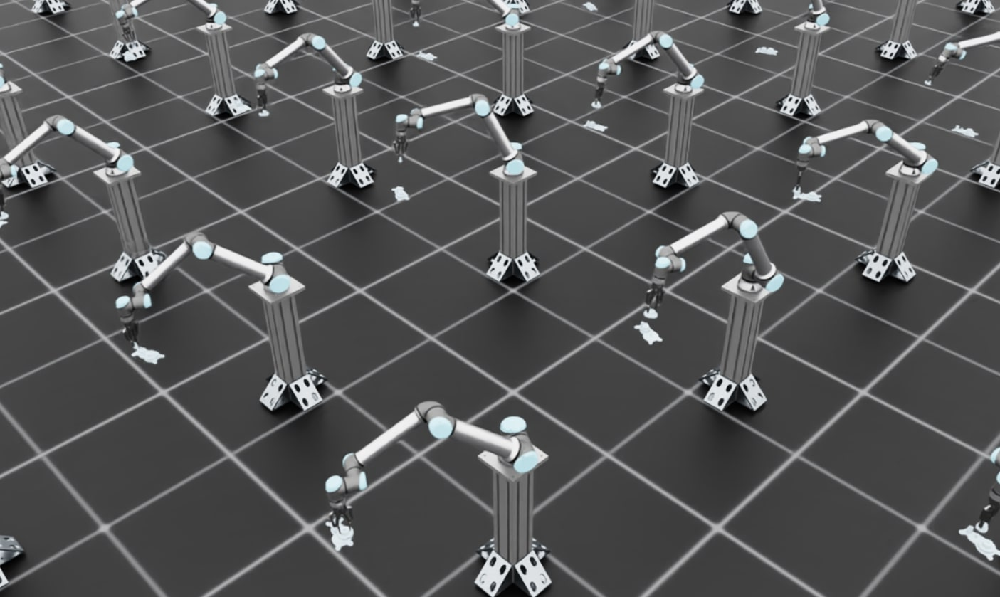

.. _walkthrough_sim_to_real:

训练齿轮装配策略并进行 ROS 部署
================================

本教程带你完整走一遍如何训练一个能从仿真迁移到真实机器人的齿轮插入装配强化学习（RL）策略。该工作流包含两个主要阶段：

1. **在 Isaac Lab 中进行仿真训练**：在高保真物理仿真中结合域随机化训练策略
2. **使用 Isaac ROS 在真实机器人上部署**：使用 Isaac ROS 和自定义 ROS 推理节点将训练好的策略部署到真实硬件

本分步演示以一个真实案例介绍使用 Isaac Lab 进行 sim-to-real 迁移的关键原则与最佳实践：

- 使用 Robotiq 2F-140 或 2F-85 夹爪的 UR10e 机器人齿轮装配任务

**任务细节：**

齿轮装配策略的工作方式如下：

1. **初始状态**：策略假定回合开始时齿轮已被夹爪夹住
2. **输入观测**：策略接收齿轮轴（齿轮应插入的位置）的位姿（位置和朝向），该位姿由单独的感知流水线获得
3. **策略输出**：策略输出增量关节位置（关节角度的增量变化）来控制机械臂完成插入
4. **泛化能力**：训练好的策略可泛化到 3 种不同的齿轮尺寸，无需为每种尺寸重新训练

.. figure:: ../../_static/policy_deployment/02_gear_assembly/gear_assembly_sim_real.webm
    :align: center
    :figwidth: 100%
    :alt: Comparison of gear assembly in simulation versus real hardware

    Sim-to-real 迁移：在 Isaac Lab 中训练的齿轮装配策略（左）成功部署到真实 UR10e 机器人（右）。

该环境已成功部署到真实 UR10e 机器人上，且不依赖 IsaacLab。

**本教程的范围：**

本教程只关注 sim-to-real 迁移工作流中在 Isaac Lab 内的**训练部分**。关于真实机器人的完整部署工作流（包括搭建视觉流水线、机器人接口以及运行所训练策略的 ROS 推理节点的具体步骤），请参阅 `Isaac ROS 文档 <https://nvidia-isaac-ros.github.io/reference_workflows/isaac_for_manipulation/packages/isaac_manipulator_ur_dnn_policy/index.html>`_。

概述
----

成功的 sim-to-real 迁移需要解决三个基本方面：

1. **输入一致性**：确保策略在仿真中接收的观测与真实机器人上可获得的观测一致
2. **系统响应一致性**：确保仿真中的机器人和环境对动作的响应与真实情况相同
3. **输出一致性**：确保在 Isaac Lab 中对策略输出所做的任何后处理在真实推理时同样被执行

当这三方面都得到妥善处理后，纯仿真训练的策略无需任何真实世界训练数据即可在真实硬件上获得稳健的性能。

**调试技巧**：当策略在真实机器人上失败时，最佳的调试方法是将真实机器人设置成与仿真相同的初始观测，然后比较控制器/系统的响应。这样可以区分问题出在观测不匹配（输入一致性）还是物理/控制器不匹配（系统响应一致性）。

第 1 部分：输入一致性
---------------------

策略接收的观测必须在仿真与现实之间保持一致。这意味着：

1. 观测空间应只包含真实传感器可获得的信息
2. 传感器噪声和延迟应被恰当建模

只使用真实机器人可获得的观测
~~~~~~~~~~~~~~~~~~~~~~~~~~~~

你的仿真环境应只使用真实机器人上可获得的观测，不使用部署时无法获得的"特权"信息。

观测规格：Isaac-Deploy-GearAssembly-UR10e-2F140-v0
^^^^^^^^^^^^^^^^^^^^^^^^^^^^^^^^^^^^^^^^^^^^^^^^^^

齿轮装配环境同时使用本体感知和外感知（视觉）观测：

.. list-table:: 齿轮装配环境观测
   :widths: 25 25 25 25
   :header-rows: 1

   * - 观测
     - 维度
     - 真实世界来源
     - 训练中的噪声
   * - ``joint_pos``
     - 6（UR10e 机械臂关节）
     - UR10e 控制器
     - 无（本体感知）
   * - ``joint_vel``
     - 6（UR10e 机械臂关节）
     - UR10e 控制器
     - 无（本体感知）
   * - ``gear_shaft_pos``
     - 3（x、y、z 位置）
     - FoundationPose + RealSense 深度
     - ±0.005 m（5mm，FoundationPose + RealSense 深度流水线的估计误差）
   * - ``gear_shaft_quat``
     - 4（四元数朝向）
     - FoundationPose + RealSense 深度
     - 每个分量 ±0.01（约 5° 角度误差，FoundationPose + RealSense 深度流水线的估计误差）

**实现：**

.. code-block:: python

    from isaaclab.utils.noise import AdditiveUniformNoiseCfg as Unoise

    @configclass
    class PolicyCfg(ObsGroup):
        """Observations for policy group."""

        # Robot joint states - NO noise for proprioceptive observations
        joint_pos = ObsTerm(
            func=mdp.joint_pos,
            params={"asset_cfg": SceneEntityCfg("robot", joint_names=["shoulder_pan_joint", ...])},
        )

        joint_vel = ObsTerm(
            func=mdp.joint_vel,
            params={"asset_cfg": SceneEntityCfg("robot", joint_names=["shoulder_pan_joint", ...])},
        )

        # Gear shaft pose from FoundationPose perception
        # ADD noise for exteroceptive (vision-based) observations
        # Calibrated to match FoundationPose + RealSense D435 error
        # Typical error: 3-8mm position, 3-7° orientation
        gear_shaft_pos = ObsTerm(
            func=mdp.gear_shaft_pos_w,
            params={"asset_cfg": SceneEntityCfg("factory_gear_base")},
            noise=Unoise(n_min=-0.005, n_max=0.005),  # ±5mm
        )

        # Quaternion noise: small uniform noise on each component
        # Results in ~5° orientation error
        gear_shaft_quat = ObsTerm(
            func=mdp.gear_shaft_quat_w,
            params={"asset_cfg": SceneEntityCfg("factory_gear_base")},
            noise=Unoise(n_min=-0.01, n_max=0.01),
        )

        def __post_init__(self):
            self.enable_corruption = True  # Enable for perception observations only
            self.concatenate_terms = True

**为什么本体感知观测不加噪声？**

根据经验，我们发现本体感知观测（关节位置和速度）不加噪声训练的策略可以很好地迁移到真实硬件。UR10e 控制器提供的关节状态反馈足够精确，对这些任务而言，建模传感器噪声并不能改善 sim-to-real 迁移。

第 2 部分：系统响应一致性
-------------------------

观测一致之后，你需要确保仿真中的机器人和环境对动作的响应与真实系统一致。在本用例中，这涉及三个主要方面：

1. 物理仿真参数（摩擦、接触属性）
2. 执行器建模（PD 控制器增益、力矩限制）
3. 域随机化

物理参数调优
~~~~~~~~~~~~

精确的物理仿真对接触丰富型任务至关重要。关键参数包括：

- 摩擦系数（静摩擦和动摩擦）
- 接触求解器参数
- 材料属性
- 刚体属性

**示例：齿轮装配物理配置**

齿轮装配任务要求对插入过程进行精确的接触建模。摩擦的配置方式如下：

.. code-block:: python

    # From joint_pos_env_cfg.py in Isaac-Deploy-GearAssembly-UR10e-2F140-v0

    @configclass
    class EventCfg:
        """Configuration for events including physics randomization."""

        # Randomize friction for gear objects
        small_gear_physics_material = EventTerm(
            func=mdp.randomize_rigid_body_material,
            mode="startup",
            params={
                "asset_cfg": SceneEntityCfg("factory_gear_small", body_names=".*"),
                "static_friction_range": (0.75, 0.75),   # Calibrated to real gear material
                "dynamic_friction_range": (0.75, 0.75),
                "restitution_range": (0.0, 0.0),         # No bounce
                "num_buckets": 16,
            },
        )

        # Similar configuration for gripper fingers
        robot_physics_material = EventTerm(
            func=mdp.randomize_rigid_body_material,
            mode="startup",
            params={
                "asset_cfg": SceneEntityCfg("robot", body_names=".*finger"),
                "static_friction_range": (0.75, 0.75),   # Calibrated to real gripper
                "dynamic_friction_range": (0.75, 0.75),
                "restitution_range": (0.0, 0.0),
                "num_buckets": 16,
            },
        )

这些摩擦值（0.75）是通过反复视觉对比确定的：

1. 录制真实硬件上齿轮被抓取和操作的视频
2. 在仿真中启动训练并观察实时仿真查看器
3. 留意物理问题（穿透、不真实的滑移、接触不良）
4. 调整摩擦系数和求解器参数后重试
5. 对比齿轮在夹爪中的行为，仿真与真实是否一致
6. 反复调整直到行为匹配（无需等待策略完整训练完成）
7. 物理效果确认无误后，以无头模式加录像进行训练：

   .. code-block:: bash

       python scripts/reinforcement_learning/rsl_rl/train.py \
           --task Isaac-Deploy-GearAssembly-UR10e-2F140-v0 \
           --headless \
           --video --video_length 800 --video_interval 5000

8. 查看录像并与真实硬件视频对比，验证物理行为

**接触求解器配置**

接触丰富型操作需要仔细调校求解器。这些参数通过与摩擦系数相同的迭代视觉对比流程校准：

.. code-block:: python

    # Robot rigid body properties
    rigid_props=sim_utils.RigidBodyPropertiesCfg(
        disable_gravity=True,                    # Robot is mounted, no gravity
        max_depenetration_velocity=5.0,          # Control interpenetration resolution
        linear_damping=0.0,                      # No artificial damping
        angular_damping=0.0,
        max_linear_velocity=1000.0,
        max_angular_velocity=3666.0,
        enable_gyroscopic_forces=True,           # Important for accurate dynamics
        solver_position_iteration_count=4,       # Balance accuracy vs performance
        solver_velocity_iteration_count=1,
        max_contact_impulse=1e32,               # Allow large contact forces
    ),

**重要**：``solver_position_iteration_count`` 是接触丰富型任务的关键参数。增大该值可以改善碰撞仿真稳定性并减少穿透问题，但也会增加仿真和训练时间。对于齿轮装配任务，我们使用 ``solver_position_iteration_count=4`` 来平衡物理精度与计算性能。如果观察到穿透或接触不稳定，可以尝试增大到 8 或 16，但训练会变慢。

.. code-block:: python

    # Articulation properties
    articulation_props=sim_utils.ArticulationRootPropertiesCfg(
        enabled_self_collisions=False,
        solver_position_iteration_count=4,
        solver_velocity_iteration_count=1,
    ),

    # Contact properties
    collision_props=sim_utils.CollisionPropertiesCfg(
        contact_offset=0.005,                    # 5mm contact detection distance
        rest_offset=0.0,                         # Objects touch at 0 distance
    ),

执行器建模
~~~~~~~~~~

精确的执行器建模确保仿真中的机器人像真实机器人一样运动。这包括：

- PD 控制器增益（刚度和阻尼）
- 力矩和速度限制
- 关节摩擦

**控制器选择：阻抗控制**

对于 UR10e 部署，我们使用阻抗控制器接口。与更复杂的控制器（如操作空间控制、混合力-位控制）相比，使用阻抗控制这类较简单的控制器可以降低仿真与现实之间的差异。简单的控制器：

- 在仿真与真实之间可能失配的参数更少
- 更容易在仿真中精确建模
- 行为更可预测，更容易复现
- 降低了控制器复杂度作为 sim-real 差距来源的可能性

**示例：UR10e 执行器配置**

.. code-block:: python

    # Default UR10e actuator configuration
    actuators = {
        "arm": ImplicitActuatorCfg(
            joint_names_expr=["shoulder_pan_joint", "shoulder_lift_joint",
                            "elbow_joint", "wrist_1_joint", "wrist_2_joint", "wrist_3_joint"],
            effort_limit=87.0,           # From UR10e specifications
            velocity_limit=2.0,          # From UR10e specifications
            stiffness=800.0,             # Calibrated to match real behavior
            damping=40.0,                # Calibrated to match real behavior
        ),
    }

**执行器参数的域随机化**

为了覆盖真实机器人行为的差异，在训练期间对执行器增益进行随机化：

.. code-block:: python

    # From EventCfg in the Gear Assembly environment
    robot_joint_stiffness_and_damping = EventTerm(
        func=mdp.randomize_actuator_gains,
        mode="reset",
        params={
            "asset_cfg": SceneEntityCfg("robot", joint_names=["shoulder_.*", "elbow_.*", "wrist_.*"]),
            "stiffness_distribution_params": (0.75, 1.5),    # 75% to 150% of nominal
            "damping_distribution_params": (0.3, 3.0),       # 30% to 300% of nominal
            "operation": "scale",
            "distribution": "log_uniform",
        },
    )

**关节摩擦随机化**

真实机器人的关节摩擦会随位置、速度和温度变化。对于使用阻抗控制器接口的 UR10e，我们观察到明显的静摩擦（stiction），导致控制器无法到达目标关节位置。

**表征真实机器人行为：**

为了量化该行为，我们绘制了真实机器人上阻抗控制器的阶跃响应，观察到与指令设定点相比存在约 0.25 度的接触偏移。这一稳态误差由阻碍控制器指令运动的关节摩擦引起。基于这些测量，我们在仿真中加入了关节摩擦建模来复现该行为：

.. code-block:: python

    joint_friction = EventTerm(
        func=mdp.randomize_joint_parameters,
        mode="reset",
        params={
            "asset_cfg": SceneEntityCfg("robot", joint_names=["shoulder_.*", "elbow_.*", "wrist_.*"]),
            "friction_distribution_params": (0.3, 0.7),     # Add 0.3 to 0.7 Nm friction
            "operation": "add",
            "distribution": "uniform",
        },
    )

**为什么关节摩擦很重要**：如果仿真中不建模关节摩擦，策略会默认指令的关节位置总能到达。而在真实机器人上，静摩擦会阻止微小运动并造成稳态误差。通过在训练中加入摩擦，策略学会将这些影响纳入考虑，并输出适当更大的动作来克服摩擦。

**通过动作缩放补偿静摩擦：**

为了帮助策略克服真实机器人上的静摩擦，我们还增大了输出动作缩放。Isaac ROS 文档指出，与 2F-85 夹爪相比，需要更高的动作缩放（0.0325 对 0.025）来克服更高的静摩擦（stiction）。增大的缩放确保策略指令大到足以克服阶跃响应分析中观察到的摩擦力。

动作空间设计
~~~~~~~~~~~~

你的动作空间应与真实机器人控制器能执行的内容匹配。对该任务，我们发现**增量关节位置控制**是最可靠的方式。

**示例：齿轮装配动作配置**

.. code-block:: python

    # For contact-rich manipulation, smaller action scale for more precise control
    self.joint_action_scale = 0.025  # ±2.5 degrees per step

    self.actions.arm_action = mdp.RelativeJointPositionActionCfg(
        asset_name="robot",
        joint_names=["shoulder_pan_joint", "shoulder_lift_joint", "elbow_joint",
                    "wrist_1_joint", "wrist_2_joint", "wrist_3_joint"],
        scale=self.joint_action_scale,
        use_zero_offset=True,
    )

动作缩放是需要根据以下因素调优的关键超参数：

- 任务精度要求（接触丰富型任务应更小）
- 控制频率（更高的频率允许更大的步长）

域随机化策略
~~~~~~~~~~~~

域随机化应覆盖你希望真实机器人运行的条件范围。增大随机化范围会让策略更难学习，但能容纳更大的输入和系统参数变化。关键在于平衡训练难度与鲁棒性：随机化到足以覆盖真实世界的变化，但不要大到策略无法有效学习。

**位姿随机化**

对于操作任务，随机化物体位姿以确保策略在整个工作空间内有效：

.. code-block:: python

    # From Gear Assembly environment
    randomize_gears_and_base_pose = EventTerm(
        func=gear_assembly_events.randomize_gears_and_base_pose,
        mode="reset",
        params={
            "pose_range": {
                "x": [-0.1, 0.1],                          # ±10cm
                "y": [-0.25, 0.25],                        # ±25cm
                "z": [-0.1, 0.1],                          # ±10cm
                "roll": [-math.pi/90, math.pi/90],         # ±2 degrees
                "pitch": [-math.pi/90, math.pi/90],        # ±2 degrees
                "yaw": [-math.pi/6, math.pi/6],            # ±30 degrees
            },
            "gear_pos_range": {
                "x": [-0.02, 0.02],                        # ±2cm relative to base
                "y": [-0.02, 0.02],
                "z": [0.0575, 0.0775],                     # 5.75-7.75cm above base
            },
            "rot_randomization_range": {
                "roll": [-math.pi/36, math.pi/36],         # ±5 degrees
                "pitch": [-math.pi/36, math.pi/36],
                "yaw": [-math.pi/36, math.pi/36],
            },
        },
    )

**初始状态随机化**

随机化机器人的初始构型有助于策略应对不同的起始条件：

.. code-block:: python

    set_robot_to_grasp_pose = EventTerm(
        func=gear_assembly_events.set_robot_to_grasp_pose,
        mode="reset",
        params={
            "robot_asset_cfg": SceneEntityCfg("robot"),
            "rot_offset": [0.0, math.sqrt(2)/2, math.sqrt(2)/2, 0.0],  # Base gripper orientation
            "pos_randomization_range": {
                "x": [-0.0, 0.0],
                "y": [-0.005, 0.005],                      # ±5mm variation
                "z": [-0.003, 0.003],                      # ±3mm variation
            },
            "gripper_type": "2f_140",
        },
    )

第 3 部分：在 Isaac Lab 中训练策略
----------------------------------

介绍完 sim-to-real 迁移的关键原则后，现在让我们在 Isaac Lab 中训练齿轮装配策略。

第 1 步：可视化环境
~~~~~~~~~~~~~~~~~~~

首先，以少量环境并开启可视化启动训练，验证环境搭建正确：

.. code-block:: bash

    # Launch training with visualization
    python scripts/reinforcement_learning/rsl_rl/train.py \
        --task Isaac-Deploy-GearAssembly-UR10e-2F140-v0 \
        --num_envs 4

.. note::

   对于 Robotiq 2F-85 夹爪，请改用 ``--task Isaac-Deploy-GearAssembly-UR10e-2F85-v0``。

这会打开 Isaac Sim 查看器，你可以在其中实时观察训练过程。

    训练可视化：多个并行环境中机器人夹持着齿轮。

**预期现象：**

训练早期阶段，你会看到机器人夹着齿轮四处移动，但还无法成功插入齿轮。这是正常现象，因为策略仍在学习。机器人会朝各个方向移动夹住的齿轮。确认环境正确后，停止训练（Ctrl+C）并开始全量训练。

第 2 步：带录像的全量训练
~~~~~~~~~~~~~~~~~~~~~~~~~

现在以更多并行环境、无头模式启动全量训练以获得更快的速度。我们同时开启录像来监控进度：

.. code-block:: bash

    # Full training with video recording
    python scripts/reinforcement_learning/rsl_rl/train.py \
        --task Isaac-Deploy-GearAssembly-UR10e-2F140-v0 \
        --headless \
        --num_envs 256 \
        --video --video_length 800 --video_interval 5000

该命令将：

- 运行 256 个并行环境以高效训练
- 以无头模式（无可视化）运行以获得最大性能
- 每 5000 步录制视频以监控训练进度
- 每段视频保存 800 帧

训练一个稳健的插入策略通常需要约 12-24 小时。视频将保存在 ``logs`` 目录中，可在训练期间查看以评估策略表现。

.. note::

    **GPU 显存注意事项**：默认配置使用 256 个并行环境，在大多数现代 GPU（如 RTX 3090、RTX 4090、A100）上均可运行。为了获得更好的 sim-to-real 迁移性能，你可以在 ``gear_assembly_env_cfg.py`` 和 ``joint_pos_env_cfg.py`` 中将 ``solver_position_iteration_count`` 从 4 增大到 196，以获得更真实的接触仿真，但这需要更大的 GPU（如显存 40GB+ 的 RTX PRO 6000）。更高的求解器迭代次数可减少穿透并改善接触稳定性，但会显著增加 GPU 显存占用。

**使用 TensorBoard 监控训练进度：**

你可以使用 TensorBoard 实时监控训练指标。打开一个新终端并运行：

.. code-block:: bash

    ./isaaclab.sh -p -m tensorboard.main --logdir <log_dir>

将 ``<log_dir>`` 替换为你的训练日志路径（例如 ``logs/rsl_rl/gear_assembly_ur10e/2025-11-19_19-31-01``）。TensorBoard 将显示奖励、回合长度等指标的曲线。请确认奖励随迭代递增，以确保策略学习正常。

第 3 步：部署到真实机器人
~~~~~~~~~~~~~~~~~~~~~~~~~

训练完成后，按照 `Isaac ROS 推理文档 <https://nvidia-isaac-ros.github.io/reference_workflows/isaac_for_manipulation/packages/isaac_manipulator_ur_dnn_policy/index.html>`_ 部署你的策略。

Isaac ROS 部署流水线直接使用训练得到的模型检查点（``.pt`` 文件）以及训练时生成的 ``agent.yaml`` 和 ``env.yaml`` 配置文件，无需额外的导出步骤。

部署流水线使用 Isaac ROS 和自定义 ROS 推理节点在真实硬件上运行策略。该流水线包括：

1. **感知**：基于相机的位姿估计（FoundationPose、Segment Anything）
2. **运动规划**：cuMotion 生成无碰撞轨迹
3. **策略推理**：你训练的策略在自定义 ROS 推理节点中以控制频率运行
4. **机器人控制**：底层控制器执行指令

故障排除
--------

本节介绍训练中可能遇到的常见错误及其解决方案。

PhysX 碰撞栈溢出
~~~~~~~~~~~~~~~~

**错误信息：**

.. code-block:: text

    PhysX error: PxGpuDynamicsMemoryConfig::collisionStackSize buffer overflow detected,
    please increase its size to at least 269452544 in the scene desc!
    Contacts have been dropped.

**原因**：当 GPU 碰撞检测缓冲区对于正在仿真的接触数量来说太小时，会出现该错误。这在齿轮装配这类接触丰富的环境中很常见。

**解决方案**：增大 ``gear_assembly_env_cfg.py`` 中的 ``gpu_collision_stack_size`` 参数：

.. code-block:: python

    # In GearAssemblyEnvCfg class
    sim: SimulationCfg = SimulationCfg(
        physx=PhysxCfg(
            gpu_collision_stack_size=2**31,  # Increase this value if you see overflow errors
            gpu_max_rigid_contact_count=2**23,
            gpu_max_rigid_patch_count=2**23,
        ),
    )

错误信息会给出建议的最小值。将 ``gpu_collision_stack_size`` 至少设为推荐值（例如错误提示"at least 269452544"时，设为 ``2**28`` 或 ``2**29``）。注意，增大该值会增加 GPU 显存占用。

CUDA 显存不足
~~~~~~~~~~~~~

**错误信息：**

.. code-block:: text

    torch.OutOfMemoryError: CUDA out of memory.

**原因**：GPU 没有足够显存以当前仿真参数运行所请求的并行环境数量。

**解决方案（按优先级排序）：**

1. **减少并行环境数量：**

   .. code-block:: bash

       python scripts/reinforcement_learning/rsl_rl/train.py \
           --task Isaac-Deploy-GearAssembly-UR10e-2F140-v0 \
           --headless \
           --num_envs 128  # Reduce from 256 to 128, 64, etc.

   **权衡**：更少的环境会降低每次训练迭代的样本多样性，可能减缓训练收敛。你可能需要训练更多迭代才能达到相同性能，但最终策略质量应当相近。

2. **如果使用了增大的求解器迭代次数** （高于默认值 4）：

   在 ``gear_assembly_env_cfg.py`` 和 ``joint_pos_env_cfg.py`` 中，将 ``solver_position_iteration_count`` 降回默认值 4，或使用 8、16 等中间值：

   .. code-block:: python

       rigid_props=sim_utils.RigidBodyPropertiesCfg(
           solver_position_iteration_count=4,  # Use default value
           # ... other parameters
       ),

       articulation_props=sim_utils.ArticulationRootPropertiesCfg(
           solver_position_iteration_count=4,  # Use default value
           # ... other parameters
       ),

   **权衡**：更低的求解器迭代次数可能导致接触动力学不够真实以及更多穿透问题。默认值 4 对大多数用例是较好的平衡。

3. **训练期间禁用录像：**

   移除 ``--video`` 相关标志以节省 GPU 显存：

   .. code-block:: bash

       python scripts/reinforcement_learning/rsl_rl/train.py \
           --task Isaac-Deploy-GearAssembly-UR10e-2F140-v0 \
           --headless \
           --num_envs 256

   你随时可以在训练后带可视化评估训好的策略。

延伸资源
--------

- `IndustReal: Transferring Contact-Rich Assembly Tasks from Simulation to Reality <https://arxiv.org/abs/2305.17110>`_
- `FORGE: Force-Guided Exploration for Robust Contact-Rich Manipulation under Uncertainty <https://arxiv.org/abs/2408.04587>`_
- 足式机器人全身控制器的 Sim-to-Real 策略迁移：:ref:`sim2real` —— 展示如何使用 Isaac Lab 和 Newton 后端训练并部署足式机器人的全身控制器
- `Isaac ROS Manipulation Documentation <https://nvidia-isaac-ros.github.io/reference_workflows/isaac_for_manipulation/index.html>`_
- `Isaac ROS Gear Assembly Tutorial <https://nvidia-isaac-ros.github.io/reference_workflows/isaac_for_manipulation/tutorials/tutorial_gear_assembly.html>`_
- RL 训练教程：:ref:`tutorial-run-rl-training`
