.. _ref_arch:

参考架构
========

本文档概述了使用 Isaac Lab 与 Isaac Sim 进行端到端机器人学习的整个过程。
文档通过一个参考架构来展示这一点，该架构突出了训练与部署工作流的主要构建模块。
它提供了一份全面、易懂的指南，涵盖从训练到将训练好的模型部署到真实世界的
完整应用开发流程，并包含指向演示、可运行示例和文档的链接。

本文档面向谁？
~~~~~~~~~~~~~~

本文档旨在帮助在机器人学习领域使用 NVIDIA Isaac Lab 的机器人开发者和研究人员，
包括研究实验室、原始设备制造商（OEM）、解决方案提供商、解决方案集成商（SI）
以及独立软件供应商（ISV）中的人员。它为利用 Isaac Lab 的机器人训练框架和工作流
提供了指导，可作为环境配置、任务设计以及策略训练与测试的基础起点。

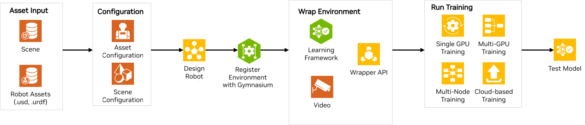

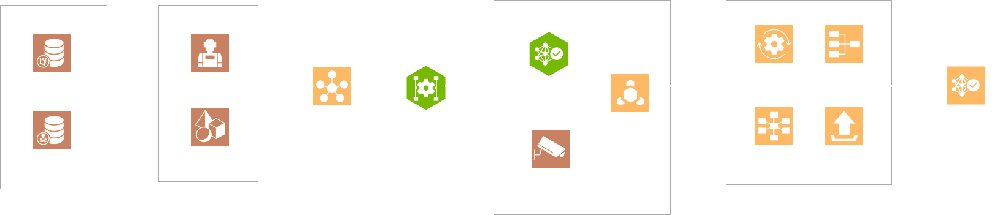

|

Isaac Lab 的参考架构包含以下组件：

1. :ref:`资产输入<ra-asset-input>`
2. :ref:`配置 - 资产与场景<ra-configuration>`
3. :ref:`机器人学习任务设计<ra-robot-learning-task-design>`
4. :ref:`注册到 Gymnasium<ra-register-gym>`
5. :ref:`环境封装<ra-env-wrap>`
6. :ref:`运行训练<ra-run-training>`
7. :ref:`运行测试<ra-run-testing>`

组件
~~~~
在本节中，我们将简要讨论在 Isaac Lab 中创建
示例参考应用的各个模块。

.. _ra-asset-input:

组件 1 - 资产输入
---------------------------
Isaac Lab 接受 URDF、MJCF XML 或 USD 文件作为资产。使用 Isaac Lab 进行训练的第一步，
是准备好你的资产的 USD 文件以及机器人的 USD 或 URDF 文件。这可以通过
以下方式实现：

1. 在 Isaac Sim 中设计你的资产或机器人，并导出 USD 文件。

2. 在你选择的任意软件中设计你的资产或机器人，并使用 Isaac Sim 转换器将其导出为 USD。Isaac Sim 支持多种向 USD 的转换器/导入器，例如 `CAD Converter`_、`URDF Importer`_、`MJCF Importer`_、`Onshape Importer`_ 等。更多细节参见 `Isaac Sim Reference Architecture`_ 中的 `Importing Assets section`_。

3. 如果你已经有机器人的 URDF 或 MJCF 文件，则无需转换为 USD，因为 Isaac Lab 可以直接读取 URDF 和 MJCF XML。

.. _ra-configuration:

组件 2 - 配置（资产与场景）
------------------------------------------------------

资产配置
^^^^^^^^^^^^^^^^^^^^^^^^

假设你已经有了机器人资产文件，以及根据任务所需的环境物体等其他资产文件，下一步就是将它们导入 Isaac Lab。Isaac Lab 使用资产配置类，通过 Python 将各种物体（或 prim）生成到场景中。第一步是编写一个配置类，为完成任务所需的资产定义属性。例如，一个移动机器人的简单 go-to-goal 任务会包含机器人资产、用于在视觉上表示目标位姿的方块等物体、灯光、地面等。Isaac Lab 通过配置类来理解这些资产。Isaac Lab 提供了多种可直接用于仿真的资产，例如
包含准确物理属性和行为的物理精确 3D 物体。它还提供连接的数据流，以在仿真数字世界中表示真实世界，例如 `机器人 <https://github.com/isaac-sim/IsaacLab/tree/main/source/isaaclab_assets/isaaclab_assets>`__
（如 ANYbotics Anymal、Unitree H1 Humanoid 等）以及 `传感器 <https://github.com/isaac-sim/IsaacLab/tree/main/source/isaaclab/isaaclab/sensors>`__。我们提供了这些资产的配置类。用户也可以使用配置类定义自己的资产。

请参考关于 `如何编写 Articulation 和 ArticulationCfg 类 <https://isaac-sim.github.io/IsaacLab/main/source/how-to/write_articulation_cfg.html>`__ 的教程。

场景配置
^^^^^^^^^^^^^^^^^^^^^^^^

有了各个资产的配置之后，下一步就是将所有资产组合到一个
场景中。场景配置是一个简单的配置类，用于初始化场景中
任务所需以及可视化所需的所有资产。以下是
`Cartpole 示例场景配置 <https://isaac-sim.github.io/IsaacLab/main/source/tutorials/02_scene/create_scene.html#scene-configuration>`__ 的示例，
其中包含 Cartpole、地面和穹顶光。

.. _ra-robot-learning-task-design:

组件 3 - 机器人学习任务设计
------------------------------------------------------
现在，我们已经有了任务场景，但还需要定义机器人学习任务。这里我们将重点关注
`强化学习（RL） <https://www.andrew.cmu.edu/course/10-703/textbook/BartoSutton.pdf>`__ 算法。我们定义智能体将要执行的 RL 任务。
RL 任务被定义为一个马尔可夫决策过程（MDP），
这是一个随机决策过程，其中智能体会结合其当前状态和所交互的环境
做出（可选的）决策。环境提供智能体的
当前状态或观测，并执行智能体给出的动作。
环境通过提供下一状态、采取该动作所获得的奖励、
完成标志以及当前回合的信息来回应智能体。因此，MDP 形式化表述（即环境）的不同组成部分
——状态、动作、奖励、重置、完成等——都必须
由用户定义，智能体才能执行给定任务。

在 Isaac Lab 中，我们提供两种不同的环境设计工作流。

管理器式
^^^^^^^^^^^^^^^^^
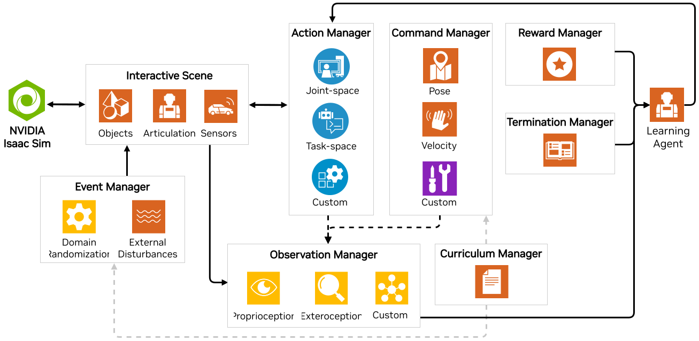

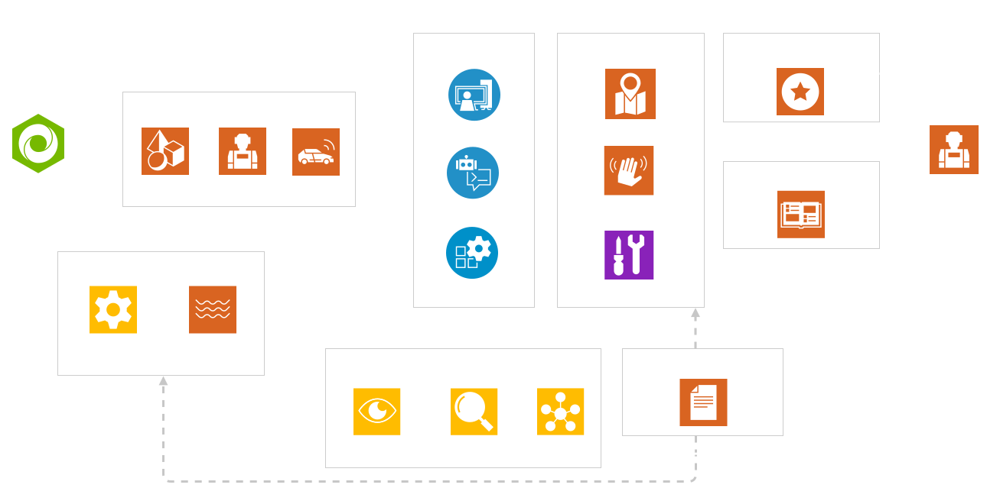

该工作流是模块化的，环境被分解为各个独立组件（即管理器），
由它们处理环境的不同方面，例如计算观测、
施加动作以及施加随机化。作为用户，你为每个组件定义不同的配置类。

- 一个 RL 任务应包含以下配置类：

  - Observations Config：定义智能体在该任务中的观测。
  - Actions Config：定义智能体的动作类型，即智能体的输出如何映射到
    机器人的控制输入。
  - Rewards Config：定义该任务的奖励函数
  - Terminations Config：定义回合终止或任务完成的条件。

- 你还可以添加其他可选配置类，例如 Event Config（定义针对智能体和环境的一组随机化与加噪）、面向需要 `curriculum learning`_ 的任务的 Curriculum Config，以及面向输入来自控制器/设定点控制（例如游戏手柄）的任务的 Commands Config。

.. tip::

  如需进一步了解如何设计你自己的管理器式环境，请参阅 :ref:`tutorial-create-manager-rl-env`。

直接式
^^^^^^^^
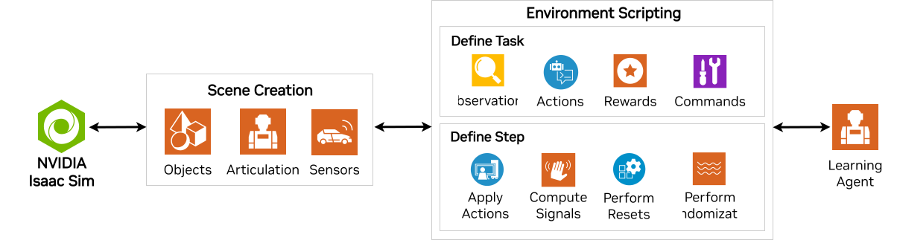

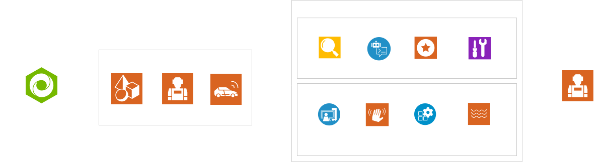

在该工作流中，你实现一个单独的类，由它负责计算观测、施加动作和计算奖励。该工作流允许直接控制环境逻辑。

.. tip::
  如需进一步了解如何设计你自己的直接式环境，请参阅 :ref:`tutorial-create-direct-rl-env`。

用户可以从 Isaac Lab 大量预配置的环境中进行选择，也可以
定义自己的环境。关于这两种工作流更技术性的信息，请参阅
`文档 <https://isaac-sim.github.io/IsaacLab/main/source/overview/core-concepts/task_workflows.html>`__。

除了设计 RL 任务之外，你还需要设计智能体的模型，即神经网络
策略和价值函数。要训练 RL 智能体解决该任务，你需要定义
训练所需的超参数，例如迭代轮数、学习率等，以及
策略/价值模型的架构。这些内容定义在与你想要使用的
RL 库相对应的训练配置文件中。在每个任务目录下的智能体文件夹中都有相应示例。
可参考 Anymal-B 的 `RSL-RL <https://github.com/isaac-sim/IsaacLab/blob/main/source/isaaclab_tasks/isaaclab_tasks/manager_based/locomotion/velocity/config/anymal_b/agents/rsl_rl_ppo_cfg.py>`__ 示例。

.. _ra-register-gym:

组件 4 - 注册到 Gymnasium
------------------------------------------------------

下一步是将环境注册到 gymnasium registry，以便你可以使用唯一的环境名称创建该环境。
注册是一种让环境可被不同
RL 算法和实验访问与复用的方式。这在 RL 社区中很常见。请参考
`注册环境 <https://isaac-sim.github.io/IsaacLab/main/source/tutorials/03_envs/register_rl_env_gym.html>`__ 教程，进一步了解如何注册你自己的环境。

.. _ra-env-wrap:

组件 5 - 环境封装
------------------------------------------------------
在运行 RL 任务时，你可能希望在不修改环境本身的情况下
改变环境的行为。例如，你可能想创建用于修改
观测或奖励、录制视频或强制执行时间限制的函数。Isaac Lab 利用
`gymnasium.Wrapper <https://gymnasium.farama.org/api/wrappers/table/>`__ 类中提供的 API 来创建面向仿真环境的接口。

一些可用的封装包括：

* `Video Wrappers <https://isaac-sim.github.io/IsaacLab/main/source/how-to/wrap_rl_env.html#wrapper-for-recording-videos>`__
* `RL Libraries Wrappers <https://isaac-sim.github.io/IsaacLab/main/source/how-to/wrap_rl_env.html#wrapper-for-learning-frameworks>`__

.. currentmodule:: isaaclab_rl

大多数 RL 库都期望各自不同形式的环境接口。这意味着
每个库所需的数据类型各不相同。Isaac Lab 提供了自己的封装，用于
将环境转换为你想要使用的 RL 库所期望的接口。这些封装
在 :class:`isaaclab_rl` 中定义

关于其他封装 API 的 `完整列表 <https://gymnasium.farama.org/api/wrappers/#gymnasium.Wrapper>`__，请参见此处。关于这些封装如何工作，
请参阅 `封装环境 <https://isaac-sim.github.io/IsaacLab/main/source/how-to/wrap_rl_env.html#how-to-env-wrappers>`__ 文档。

添加你自己的封装
^^^^^^^^^^^^^^^^^^^^^^^^

你可以通过将自己的封装添加到 Isaac Lab 的 utils 封装模块来定义它们。更多信息可参见 `关于封装环境的 GitHub 页面 <https://isaac-sim.github.io/IsaacLab/main/source/how-to/wrap_rl_env.html#adding-new-wrappers>`__。

.. _ra-run-training:

组件 6 - 运行训练
---------------------------

最后一步是运行 RL 智能体的训练。Isaac Lab 提供的脚本利用四个流行的 RL 库来训练模型（基于 GPU 的训练）：

* `StableBaselines3 <https://stable-baselines3.readthedocs.io/en/master/>`__
* `RSL-RL <https://github.com/leggedrobotics/rsl_rl>`__
* `RL-Games <https://github.com/Denys88/rl_games>`__
* `SKRL <https://skrl.readthedocs.io/en/latest/>`__

.. note::

  Isaac Lab 不提供这些 RL 库的实现。它们已由不同作者实现。我们为这些 RL 库提供环境和框架封装。

如果你想集成所提供算法的其他版本，或者集成你自己的学习库，可以遵循
`这些说明 <https://isaac-sim.github.io/IsaacLab/main/source/how-to/add_own_library.html>`__。

单 GPU 训练
^^^^^^^^^^^^^^^^^^^^^^^^
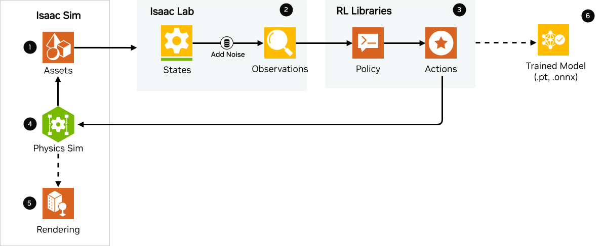

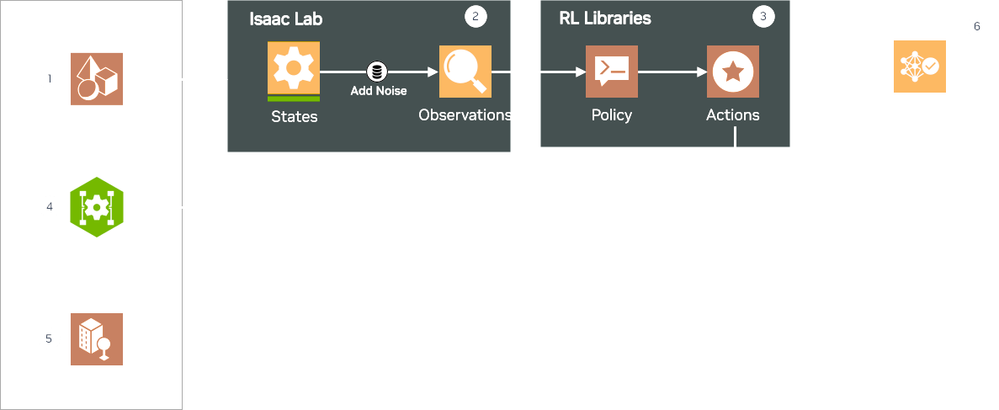

Isaac Lab 支持训练大规模并行环境，以加速 RL 训练并为模型提供丰富的数据。
对于单 GPU 训练，以下步骤展示了训练在 Isaac Sim 和 Isaac Lab 中是如何进行的：

1. **在 Isaac Sim 中**

* Isaac Sim 提供资产状态，例如机器人和传感器状态，其中包括在任务观测配置类中定义的观测。

2. **在 Isaac Lab 中**

* 在事件配置类中定义的状态上施加随机化，以获得该任务的观测。不过随机化是可选的。如果未定义，则状态即观测。
* 观测被计算为 PyTorch 张量，并且可以根据任务可选地包含训练好的模型所给出的动作。

3. **在 RL 库中**

* 观测被传递给策略。
* 策略使用 PPO、TRPO 等 RL 库算法进行训练，以输出适合机器人的正确动作。
* 根据任务的不同，这些动作既可作为控制器的设定点（由控制器生成给机器人的动作），也可直接作为给机器人的动作。
* 动作类型也各不相同，例如四足机器人的关节位置作为关节控制器的输入，在 cartpole 任务中用 1 或 0 的速度直接控制小车等。
* 此外，根据任务的定义方式，先前的动作也可以成为下一次发送的观测的一部分。

4. **在 Isaac Sim 中**

* 来自策略的动作被发送回 Isaac Sim，以控制正在学习的智能体（即机器人）。这就是物理仿真（sim）步进。它会在 Isaac Sim 中生成下一状态，并在 Isaac Lab 中计算奖励。

5. **渲染**

* 可以对场景进行渲染，以生成相机的图像。

随后，下一状态会继续在该流程中传递，直到训练达到指定的训练步数或迭代轮数。最终产物就是训练好的模型/智能体。

多 GPU 与多节点训练
^^^^^^^^^^^^^^^^^^^^^^^^^^^^^^^^^^^^^^^^^^^^^^^^
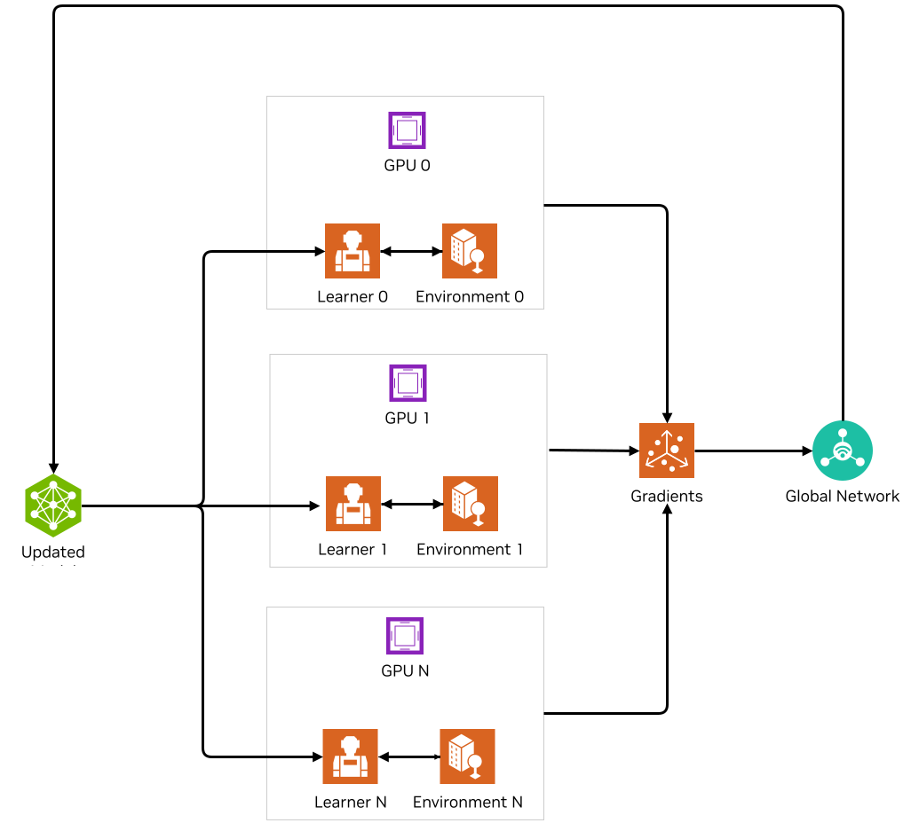

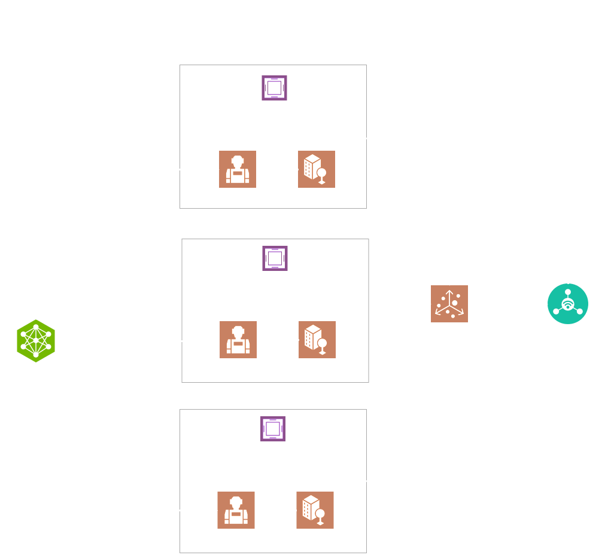

Isaac Lab 支持利用 Linux 上的多 GPU 和多节点训练来扩展训练规模。请参考 `多 GPU 训练 <https://isaac-sim.github.io/IsaacLab/main/source/features/multi_gpu.html#multi-gpu-training>`__ 和 `多节点训练 <https://isaac-sim.github.io/IsaacLab/main/source/features/multi_gpu.html#multi-node-training>`__ 教程开始使用。

云端训练
^^^^^^^^^^^^^^^^^^^^^^^^
Isaac Lab 可以借助 `Isaac Automator <https://github.com/isaac-sim/IsaacAutomator>`__ 与 Isaac Sim 一起部署到公有云上。目前支持 AWS、GCP、Azure 和阿里云。请参考 `如何在云端运行 Isaac Lab <https://isaac-sim.github.io/IsaacLab/main/source/setup/installation/cloud_installation.html>`__ 教程。

.. note::

  借助 `OSMO <https://developer.nvidia.com/osmo>`__（一个云原生编排平台，用于调度复杂的多阶段、多容器异构计算工作流），多 GPU 和多节点作业都可以轻松地跨异构环境扩展。Isaac Lab 还提供了在 Docker 中运行 RL 任务的工具。更多细节请参阅 `容器部署 <https://isaac-sim.github.io/IsaacLab/main/source/deployment/index.html>`__。

.. _ra-run-testing:

组件 7：运行测试
-----------------------------
Isaac Lab 提供了用于在环境中 `测试/运行训练好的策略 <https://isaac-sim.github.io/IsaacLab/main/source/tutorials/03_envs/run_rl_training.html#playing-the-trained-agent>`__ 的脚本，以及用于将训练好的模型从 .pt 转换为
.jit 和 .onnx 以便部署的函数。

部署到真实机器人
~~~~~~~~~~~~~~~~~~~~~~~~~~~~~~~~~

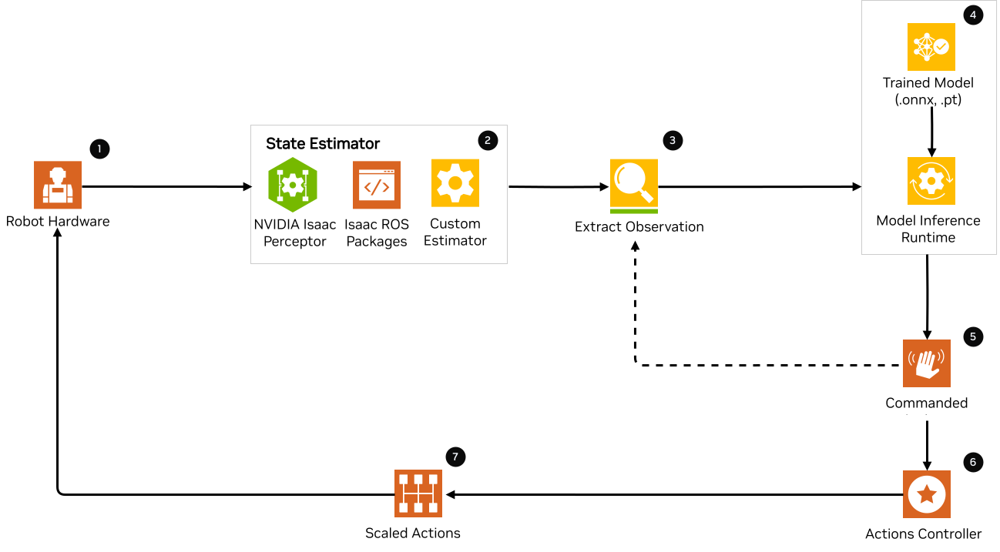

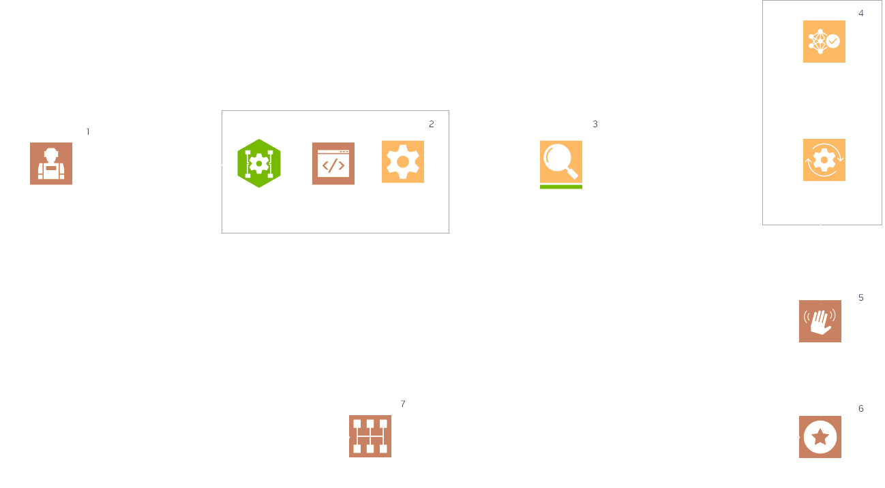

要将训练好的模型部署到真实机器人上，你需要流程图中展示的各个部分。注意，这是一个示例参考架构，因此可以根据不同的应用进行调整。
首先，你需要一台具备所需传感器和处理计算机（例如 `NVIDIA Jetson <https://www.nvidia.com/en-us/autonomous-machines/embedded-systems/>`__）的机器人作为部署目标。接下来，你需要为机器人准备一个状态估计器。该状态估计器应能给出训练时所用的那组观测。

一旦提取出观测，它们就会被送入模型，模型通过推理运行时给出动作。模型给出的指令动作作为动作控制器的设定点。动作控制器输出经过缩放的动作，然后用于控制机器人到达下一状态，如此持续进行，直到任务完成。

NVIDIA Isaac 平台提供了一些用于状态估计的工具，包括视觉 SLAM，以及 `TensorRT <https://developer.nvidia.com/tensorrt-getting-started#:~:text=NVIDIA%C2%AE%20TensorRT%E2%84%A2%20is,high%20throughput%20for%20production%20applications.>`__ 等推理引擎。其他推理运行时还包括 `OnnxRuntime <https://onnxruntime.ai/>`__、直接在 PyTorch 模型上进行推理等。

总结
~~~~~~~~~~~

本文档介绍了经过 SQA 测试的 Isaac Lab 参考架构。我们提供了一份易懂的指南，涵盖使用 Isaac Lab 和 Isaac Sim 从训练到真实世界部署的端到端机器人学习流程，其中包含演示、示例和文档链接。

如何开始
~~~~~~~~~~~~~~
查看我们关于使用 Isaac Lab 与你的机器人的资源。

查阅我们的文档与示例资源

* :ref:`Isaac Lab 教程 <tutorials>`
* `Fast-Track Robot Learning in Simulation Using NVIDIA Isaac Lab`_
* `Supercharge Robotics Workflows with AI and Simulation Using NVIDIA Isaac Sim 4.0 and NVIDIA Isaac Lab`_
* `Closing the Sim-to-Real Gap: Training Spot Quadruped Locomotion with NVIDIA Isaac Lab <https://developer.nvidia.com/blog/closing-the-sim-to-real-gap-training-spot-quadruped-locomotion-with-nvidia-isaac-lab/>`__
* `Additional Resources`_

进一步了解 NVIDIA 的特色解决方案

* `Scale AI-Enabled Robotics Development Workloads with NVIDIA OSMO`_
* `Parkour and More: How Simulation-Based RL Helps to Push the Boundaries in Legged Locomotion (GTC session) <https://www.nvidia.com/en-us/on-demand/session/gtc24-s63140/>`__
* `Isaac Perceptor`_
* `Isaac Manipulator`_

.. _curriculum learning: https://arxiv.org/abs/2109.11978
.. _CAD Converter: https://docs.omniverse.nvidia.com/extensions/latest/ext_cad-converter.html
.. _URDF Importer: https://docs.isaacsim.omniverse.nvidia.com/latest/importer_exporter/ext_isaacsim_asset_importer_urdf.html
.. _MJCF Importer: https://docs.isaacsim.omniverse.nvidia.com/latest/importer_exporter/ext_isaacsim_asset_importer_mjcf.html
.. _Onshape Importer: https://docs.omniverse.nvidia.com/extensions/latest/ext_onshape.html
.. _Isaac Sim Reference Architecture: https://docs.isaacsim.omniverse.nvidia.com/latest/introduction/reference_architecture.html
.. _Importing Assets section: https://docs.isaacsim.omniverse.nvidia.com/latest/importer_exporter/importers_exporters.html

.. _Scale AI-Enabled Robotics Development Workloads with NVIDIA OSMO: https://developer.nvidia.com/blog/scale-ai-enabled-robotics-development-workloads-with-nvidia-osmo/
.. _Isaac Perceptor: https://developer.nvidia.com/isaac/perceptor
.. _Isaac Manipulator: https://developer.nvidia.com/isaac/manipulator
.. _Additional Resources: https://isaac-sim.github.io/IsaacLab/main/source/refs/additional_resources.html
.. _Fast-Track Robot Learning in Simulation Using NVIDIA Isaac Lab: https://developer.nvidia.com/blog/fast-track-robot-learning-in-simulation-using-nvidia-isaac-lab/
.. _Supercharge Robotics Workflows with AI and Simulation Using NVIDIA Isaac Sim 4.0 and NVIDIA Isaac Lab: https://developer.nvidia.com/blog/supercharge-robotics-workflows-with-ai-and-simulation-using-nvidia-isaac-sim-4-0-and-nvidia-isaac-lab/
