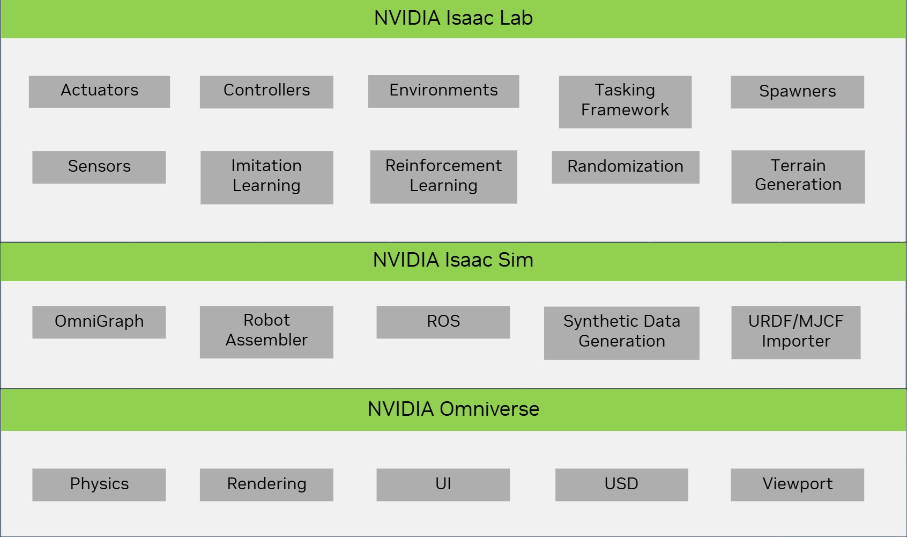
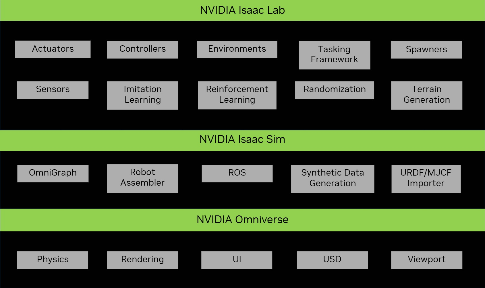

.. _isaac-lab-ecosystem:

Isaac Lab 生态系统
===================

Isaac Lab 构建在 Isaac Sim 之上，提供了一个统一且灵活的机器人学习框架，充分利用最新的仿真技术。它的设计是模块化、可扩展的，
旨在简化机器人研究中的常见工作流（例如强化学习（RL）、从演示数据中学习以及运动规划）。虽然它包含了一些预构建的环境、传感器和任务，
但其主要目标是提供一个开源、统一且易于使用的接口，用于开发和测试自定义环境与机器人学习算法。

使用 Isaac Lab 需要安装 Isaac Sim，它打包了 Isaac Lab 所依赖的核心机器人工具，包括 URDF 和 MJCF 导入器、仿真管理器以及
ROS 功能。Isaac Sim 同样构建在 NVIDIA Omniverse 平台之上，利用 PhysX 提供的先进物理仿真、照片级真实感渲染技术，以及用于
场景创建的 Universal Scene Description（USD）。

Isaac Lab 不仅继承了 Isaac Sim 的能力，还增加了许多与机器人学习研究相关的新特性。例如，在仿真中包含执行器动力学、
程序化地形生成，以及支持从人类演示数据中采集数据。

Isaac Lab 在 Isaac 生态系统中处于什么位置？
------------------------------------------------

多年来，NVIDIA 开发了许多面向机器人和 AI 的工具。这些工具利用 GPU 的强大能力，从速度和真实感两方面加速仿真。它们在仿真
技术领域展现出巨大的前景，并被世界各地的研究人员和公司广泛使用。

`Isaac Gym`_ :cite:`makoviychuk2021isaac` 为机器人学习提供了高性能的基于 GPU 的物理仿真。它构建在 `PhysX`_ 之上，
后者支持刚体的 GPU 加速仿真，并提供直接访问物理仿真数据的 Python API。通过端到端的 GPU 流水线，与基于 CPU 的物理引擎
相比，它可以实现更高的帧率。该工具已成功应用于多个研究项目，包括足式运动 :cite:`rudin2022learning`
:cite:`rudin2022advanced`、手内操控 :cite:`handa2022dextreme` :cite:`allshire2022transferring` 以及工业装配
:cite:`narang2022factory`。

尽管 Isaac Gym 取得了成功，但它并不是为机器人学设计的通用仿真器。例如，它不包含可变形物体与刚体之间的交互、高保真渲染，
以及对 ROS 的支持。该工具最初是作为一个预览版本设计的，用于展示底层物理引擎的能力。随着 `Isaac Sim`_ 的发布，NVIDIA 正在
构建面向机器人学的通用仿真器，并将 Isaac Gym 的功能集成到了 Isaac Sim 中。

`Isaac Sim`_ 是一个构建在 Omniverse 之上的机器人仿真工具包，而 Omniverse 是一个旨在统一复杂 3D 工作流的通用平台。
Isaac Sim 利用图形和物理仿真领域的最新进展，为机器人学提供高保真的仿真环境。它支持 ROS/ROS2、多种传感器仿真、
用于域随机化和合成数据创建的工具。Isaac Sim 中的分块渲染（tiled rendering）支持跨环境进行向量化渲染，并支持使用
`Isaac Automator`_ 在云端运行。总体而言，它是机器人研究者手中的强大工具，是机器人仿真领域的一大进步。

随着上述两个工具的发布，NVIDIA 还发布了一套开源的环境集合，即 `IsaacGymEnvs`_ 和 `OmniIsaacGymEnvs`_，
它们分别构建在 Isaac Gym 和 Isaac Sim 之上。这些环境旨在展示底层仿真器的能力，并为理解这些仿真器在机器人学习方面
可以实现的功能提供一个起点。这些环境可用于基准测试，但并非为开发和测试自定义环境与算法而设计。而这正是 Isaac Lab 的用武之地。

Isaac Lab 构建在 Isaac Sim 之上，提供了一个统一且灵活的机器人学习框架，充分利用最新的仿真技术。它的设计是模块化、可扩展的，
旨在简化机器人研究中的常见工作流（例如强化学习（RL）、从演示数据中学习以及运动规划）。虽然它包含了一些预构建的环境、传感器和任务，
但其主要目标是提供一个开源、统一且易于使用的接口，用于开发和测试自定义环境与机器人学习算法。它不仅继承了 Isaac Sim 的能力，
还增加了许多与机器人学习研究相关的新特性。例如，在仿真中包含执行器动力学、程序化地形生成，以及支持从人类演示数据中采集数据。

Isaac Lab 取代了先前的 `IsaacGymEnvs`_、`OmniIsaacGymEnvs`_ 和 `Orbit`_ 框架，并将成为 Isaac Sim 唯一的
机器人学习框架。先前发布的框架已被弃用，我们鼓励用户参照我们的迁移指南过渡到 Isaac Lab。

Isaac Lab 是一个仿真器吗？
------------------------------

人们想到仿真器时，通常会想到各种常见的引擎，例如 `MuJoCo`_、`Bullet`_ 和 `Flex`_。这些引擎功能强大，已被用于多个
研究项目。然而，它们并不是为机器人学设计的通用仿真器。更准确地说，它们主要是用于模拟刚体和可变形体动力学的物理引擎。
它们附带了一些基本的渲染能力，用于可视化仿真，并提供对不同场景描述格式的解析能力。

近期的一些工作将这些物理引擎与不同的渲染引擎相结合，以提供更完整的仿真环境。它们提供了允许读写物理引擎和渲染引擎的 API。
在某些情况下，它们还支持 ROS 和硬件在环仿真，以面向更多机器人特有的应用。这类工作的例子包括 `AirSim`_、`DoorGym`_、
`ManiSkill`_、`ThreeDWorld`_，最后还有 `Isaac Sim`_。

从本质上讲，Isaac Lab **不是** 一个机器人仿真器，而是一个用于在 Isaac Sim 之上构建机器人学习应用的框架。
这类框架的一个类似例子是 `RoboSuite`_，它构建在 `MuJoCo`_ 之上，且专用于固定基座机器人。其他例子还包括
`MuJoCo Playground`_ 和 `Isaac Gym`_，它们分别使用 `MJX`_ 和 `PhysX`_。它们包含许多预构建的任务，
并为单个任务提供了相互独立的独立实现。虽然这是一个很好的起点（而且往往很方便），但不同任务的实现之间会出现大量代码重复，
这会降低大型项目和团队中的代码复用率。

Isaac Lab 的主要目标是提供一个统一的机器人学习框架，其中包含机器人学习所需的各种工具和特性，同时保持易于使用和扩展。
它包含了一些设计模式，可简化机器人研究中的许多常见需求。其中包括以不同频率仿真传感器、连接不同的遥操作接口以采集数据、
为策略学习切换动作空间、使用 Hydra 进行配置管理，以及支持不同的学习库等。Isaac Lab 支持使用 *管理器式（模块化）*
和 *直接式（类似于 Isaac Gym 的单脚本）* 两种模式来设计任务，由用户根据自己的使用场景选择最佳方案。对于这两种模式，
Isaac Lab 都包含了许多可用于基准测试和研究的预构建任务。

为什么应该使用 Isaac Lab？
---------------------------

Isaac Lab 为社区提供了一个开源平台，通过整合各方力量共同推进基准测试和机器人学习系统的设计。这使我们能够复用现有的组件
和算法，并在彼此的工作之上进行构建。这样做不仅节省了时间和精力，还让我们能够专注于研究中更重要的方面。我们希望 Isaac Lab
能够成为机器人学习研究的事实标准平台，以及一个基于 Isaac Sim 的环境 *zoo* （环境集合）。随着该框架的不断成熟，我们预计它将
极大地受益于最新的仿真技术进展（作为 NVIDIA 内部及其合作伙伴开发工作的一部分）以及机器人学领域的研究成果。

我们已经在与各大学和研究机构的实验室合作，将他们的工作集成到 Isaac Lab 中，也希望社区中的其他人能加入到这项工作中来。
如果你有兴趣为 Isaac Lab 做出贡献，请与我们联系。

.. _PhysX: https://developer.nvidia.com/physx-sdk
.. _Isaac Sim: https://developer.nvidia.com/isaac-sim
.. _Isaac Gym: https://developer.nvidia.com/isaac-gym
.. _IsaacGymEnvs: https://github.com/isaac-sim/IsaacGymEnvs
.. _OmniIsaacGymEnvs: https://github.com/isaac-sim/OmniIsaacGymEnvs
.. _Orbit: https://isaac-orbit.github.io/
.. _Isaac Automator: https://github.com/isaac-sim/IsaacAutomator
.. _AirSim: https://microsoft.github.io/AirSim/
.. _DoorGym: https://github.com/PSVL/DoorGym/
.. _ManiSkill: https://github.com/haosulab/ManiSkill
.. _ThreeDWorld: https://www.threedworld.org/
.. _RoboSuite: https://robosuite.ai/
.. _MuJoCo: https://mujoco.org/
.. _MuJoCo Playground: https://playground.mujoco.org/
.. _MJX: https://mujoco.readthedocs.io/en/stable/mjx.html
.. _Bullet: https://github.com/bulletphysics/bullet3
.. _Flex: https://developer.nvidia.com/flex
