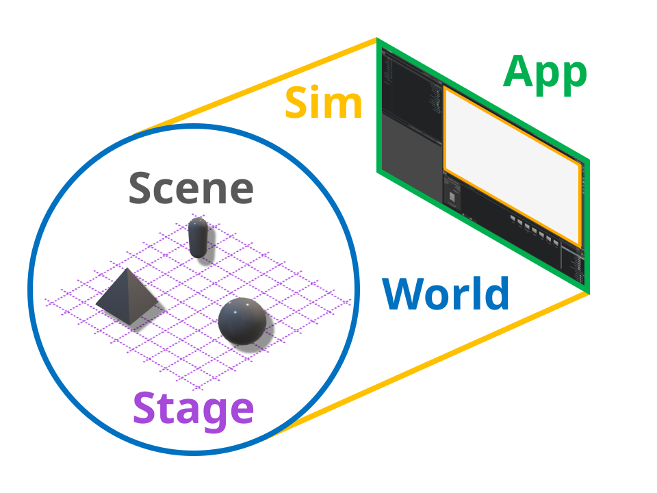
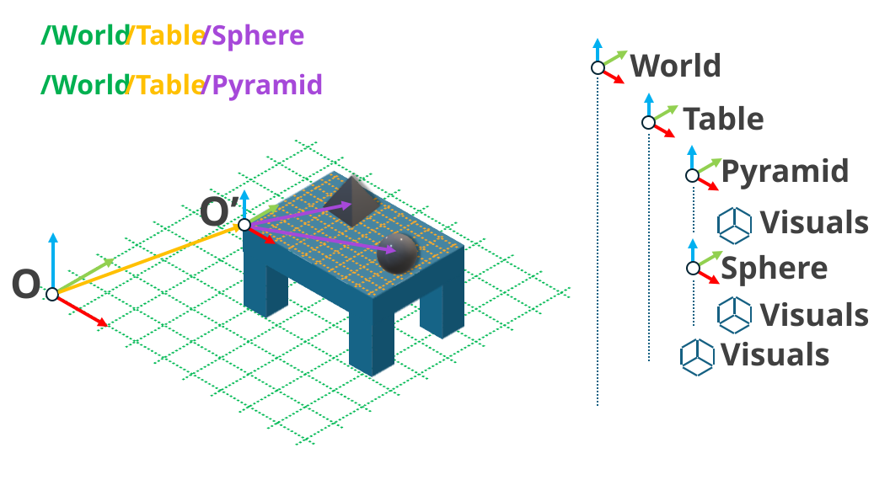

.. _walkthrough_concepts_env_design:

环境设计背景知识
==============================

项目安装完成后，我们就可以开始设计环境了。在强化学习（RL）问题的传统描述中，
环境负责使用智能体产生的动作来更新 "世界" 的状态，并最终计算和返回观测与奖励信号。然而，
在仿真本身的机制方面，Isaac Sim 和 Isaac Lab 还有一些额外的特有概念。
对强化学习问题的传统描述预设了一个 "世界" 的存在，但我们并没有这样的便利；我们必须自己定义
这个世界，而成败取决于我们是否理解如何构建这个世界，以及它如何融入仿真。

App、Sim、World、Stage 与 Scene
----------------------------------

**World（世界）** 由笛卡尔坐标系的原点和定义该坐标系的单位来定义。有多大或多小？多近或多远？
类似这些问题的答案只能 *相对于* 某个上下文参考系来定义，而这个参考系就定义了世界。

在结构上位于世界 "之上" 的是 **仿真（Simulation）** 和 **应用（Application）**。**应用（Application）**
是 "对其余一切负责的东西"：它管理所有的资源分配，并在我们使用完毕后启动和销毁仿真。
当我们 :ref:`使用模板启动训练时<template-generator>`，出现的那个显示 cartpole 训练视口（viewport）的
窗口就是应用窗口。不过，应用并不是由 GUI 定义的，即使在无头（headless）模式下运行，
每个仿真也都有一个管辖它的应用。

**仿真（Simulation）** 控制世界的 "规则"。它定义物理定律，例如时间和重力应如何运作，以及渲染的频率。
如果说应用承载着仿真，那么仿真承载着世界。仿真将时间上的单一步进划分为许多不同的子步（sub-step），
每个子步负责将世界更新到某个新状态的特定方面。Isaac Lab 中的许多 API 都是专门为挂接到这些不同的
子步而编写的，你会经常看到类似 ``_pre_XYZ_step`` 和 ``_post_XYZ_step`` 的函数命名，其中 ``XYZ_step``
是仿真的某个子步的名称，例如 ``physics_step`` 或 ``render_step``。

在结构上位于世界 "之下" 的是 **Stage** 和 **场景（Scene）**。如果说世界为仿真提供空间上下文，
那么 **Stage** 就为世界提供 *组合上下文*。假设我们想模拟一个房间中为用餐摆好的餐桌：
在这个例子中，房间是 "世界"，我们选择房间的某个角落作为世界的原点。桌子在房间中的位置
被定义为一个从世界原点指向桌子上某一点的向量，这一点被选为一个固定在桌子上 *新* 坐标系的原点。
对于我们 *智能体* 而言，相对于房间角落来谈论食物和餐具的位置并无用处：
更合适的是使用相对于桌子定义的坐标。然而，仿真需要知道这些全局坐标才能正确模拟下一个时间步，
因此我们必须定义这两个坐标系如何 *组合* 在一起。

这正是 Stage 所完成的：仿真中的一切都是一个
`USD primitive <https://openusd.org/release/glossary.html#usdglossary-prim>`_，
而 Stage 以树的形式表示这些 Prim 之间的关系，上下文由树中的相对路径定义。Stage 上的每个 Prim
都有名字，因此在树中有一条路径，例如 ``/room/table/food`` 或 ``room/table/utensils``。
关系由树中给定节点的 "父节点" 和 "子节点" 定义：``table`` 是 ``room`` 的子节点，
同时是 ``food`` 的父节点。父节点的组合属性会应用到它的所有子节点上，
但子 Prim 在必要时可以覆盖父节点的属性，材质处理中常常如此。

有了这些词汇，我们终于可以谈谈 **场景（Scene）** 了——它是理解 Isaac Lab 最关键的要素之一。
深度学习的各种形式都植根于对数据的分析。在机器人学习中也是如此，只是数据通过被训练机器人的
传感器来获取。设置机器人、采集数据、再重置机器人以采集更多数据所需的时间，
是用任何方法教机器人做 *任何事情* 的根本瓶颈。Isaac Sim 让我们无需真实的物理机器人就能使用机器人，
而 Isaac Lab 则为我们提供了 *向量化* 能力：可以高效地同时仿真训练流程的许多副本，
从而成倍提高数据生成速率，并相应地加速训练。场景负责管理 Stage 上与这一向量化过程相关的
那些 Prim，它们被称为 **仿真实体（simulation entities）**。

假设你之所以想模拟一张为用餐摆好的餐桌，是因为你想训练一个机器人替你摆放餐具！机器人、桌子
以及桌上所有的东西都可以注册到一个环境的场景中。然后我们可以指定需要多少个副本，场景会自动
在 Stage 上构建并运行这些副本。这些副本被放置在 Stage 上的新坐标处，定义了一个新的参考系，
观测和奖励可以在该参考系中计算。场景的每个副本都存在于 Stage 上，并由同一个世界进行仿真。
这比每个副本运行一个独立的仿真要高效得多，但它也带来了场景副本之间产生意外交互的可能性，
因此在调试时牢记这一点非常重要。

掌握了这些机制之后，我们来看看为我们的模板项目生成的代码吧！
