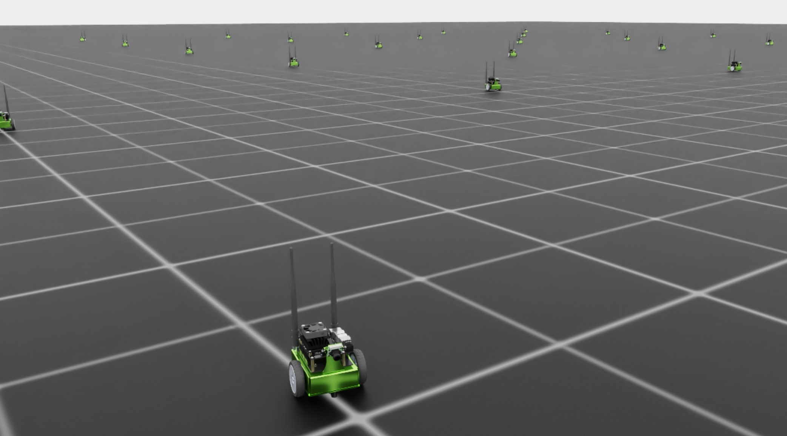

.. _walkthrough_technical_env_design:

环境设计
====================

在掌握了项目及其结构之后，我们就可以开始修改代码，以满足训练 Jetbot 的需求了。
我们的模板是为 **直接式** 工作流设置的，这意味着环境类将集中管理所有这些细节。
我们需要编写以下代码：

#. 定义机器人
#. 定义训练仿真并管理克隆
#. 将智能体的动作施加到机器人上
#. 计算并返回奖励与观测
#. 管理重置与终止状态

第一步，我们的目标是让环境的训练流水线能够加载并运行起来。
在本部分的分步演示中，我们将使用一个占位的奖励信号。
你可以在 `这里 <https://github.com/isaac-sim/IsaacLabTutorial/tree/jetbot-intro-1-1>`_ 找到这些修改对应的代码！

定义机器人
------------------

随着项目不断增长，我们可能有许多想要训练的机器人。为此，我们有意在教程 ``extension`` 中
新增一个名为 ``robots`` 的 ``module``，用于把机器人的定义保存在独立的 Python 脚本中。进入
``isaac_lab_tutorial/source/isaac_lab_tutorial/isaac_lab_tutorial``，创建一个名为 ``robots`` 的新文件夹。
在这个文件夹中创建两个文件：``__init__.py`` 和 ``jetbot.py``。``__init__.py`` 文件将这个目录标记为
Python 模块，之后我们就能以常规方式导入 ``jetbot.py`` 的内容了。

``jetbot.py`` 的内容相当精简

.. code-block:: python

  import isaaclab.sim as sim_utils
  from isaaclab.assets import ArticulationCfg
  from isaaclab.actuators import ImplicitActuatorCfg
  from isaaclab.utils.assets import ISAAC_NUCLEUS_DIR

  JETBOT_CONFIG = ArticulationCfg(
      spawn=sim_utils.UsdFileCfg(usd_path=f"{ISAAC_NUCLEUS_DIR}/Robots/NVIDIA/Jetbot/jetbot.usd"),
      actuators={"wheel_acts": ImplicitActuatorCfg(joint_names_expr=[".*"], damping=None, stiffness=None)},
  )

这个文件的唯一目的就是定义一个独特的作用域，用于保存我们的配置。机器人配置的细节可以在
:ref:`这个教程 <tutorial-add-new-robot>` 中深入了解，但对本次分步演示而言最值得注意的是
这个 ``ArticulationCfg`` 的 ``spawn`` 参数中的 ``usd_path``。Jetbot 资产通过一个托管的 Nucleus 服务器
向公众开放，该路径由 ``ISAAC_NUCLEUS_DIR`` 定义，不过任何指向 USD 文件的路径都是有效的，包括本地路径！

环境配置
---------------------------

进入环境配置文件 ``isaac_lab_tutorial/source/isaac_lab_tutorial/isaac_lab_tutorial/tasks/direct/isaac_lab_tutorial/isaac_lab_tutorial_env_cfg.py``，
并将其内容替换为以下内容

.. code-block:: python

  from isaac_lab_tutorial.robots.jetbot import JETBOT_CONFIG

  from isaaclab.assets import ArticulationCfg
  from isaaclab.envs import DirectRLEnvCfg
  from isaaclab.scene import InteractiveSceneCfg
  from isaaclab.sim import SimulationCfg
  from isaaclab.utils import configclass

  @configclass
  class IsaacLabTutorialEnvCfg(DirectRLEnvCfg):
      # env
      decimation = 2
      episode_length_s = 5.0
      # - spaces definition
      action_space = 2
      observation_space = 3
      state_space = 0
      # simulation
      sim: SimulationCfg = SimulationCfg(dt=1 / 120, render_interval=decimation)
      # robot(s)
      robot_cfg: ArticulationCfg = JETBOT_CONFIG.replace(prim_path="/World/envs/env_.*/Robot")
      # scene
      scene: InteractiveSceneCfg = InteractiveSceneCfg(num_envs=100, env_spacing=4.0, replicate_physics=True)
      dof_names = ["left_wheel_joint", "right_wheel_joint"]

这里我们实际上得到了与之前相同的环境配置，只是用 Jetbot 替换了 cartpole。
参数 ``decimation``、``episode_length_s``、``action_space``、``observation_space`` 和 ``state_space``
是基类 ``DirectRLEnvCfg`` 的成员，必须在每个 ``DirectRLEnv`` 中定义。空间参数被解释为
给定整数维度的向量，但它们也可以定义为 `gymnasium spaces <https://gymnasium.farama.org/api/spaces/>`_！

注意动作空间和观测空间的差异。作为环境的设计者，我们可以自由选择它们。对于 Jetbot，我们想
直接控制机器人的关节，其中只有两个关节被驱动（因此动作空间为 2）。观测空间被 *选择* 为
3，因为我们暂时只打算把 Jetbot 的线速度喂给智能体。随着环境的开发，我们稍后会修改这些值。我们的策略
不需要维护内部状态，因此状态空间为零。

克隆体的进攻
---------------------

配置定义完毕后，就该填写环境的具体细节了，从初始化和设置开始。
进入环境定义文件 ``isaac_lab_tutorial/source/isaac_lab_tutorial/isaac_lab_tutorial/tasks/direct/isaac_lab_tutorial/isaac_lab_tutorial_env.py``，
将 ``__init__`` 和 ``_setup_scene`` 方法的内容替换为以下内容。

.. code-block:: python

  class IsaacLabTutorialEnv(DirectRLEnv):
      cfg: IsaacLabTutorialEnvCfg

      def __init__(self, cfg: IsaacLabTutorialEnvCfg, render_mode: str | None = None, **kwargs):
          super().__init__(cfg, render_mode, **kwargs)

          self.dof_idx, _ = self.robot.find_joints(self.cfg.dof_names)

      def _setup_scene(self):
          self.robot = Articulation(self.cfg.robot_cfg)
          # add ground plane
          spawn_ground_plane(prim_path="/World/ground", cfg=GroundPlaneCfg())
          # clone and replicate
          self.scene.clone_environments(copy_from_source=False)
          # add articulation to scene
          self.scene.articulations["robot"] = self.robot
          # add lights
          light_cfg = sim_utils.DomeLightCfg(intensity=2000.0, color=(0.75, 0.75, 0.75))
          light_cfg.func("/World/Light", light_cfg)

注意 ``_setup_scene`` 方法没有变化，而 ``_init__`` 方法只是从机器人那里获取关节索引
（记住，setup 是在超类中调用的）。

环境接下来需要的是处理动作、观测和奖励的定义。首先，将 ``_pre_physics_step`` 和
``_apply_action`` 的内容替换为以下内容。

.. code-block:: python

    def _pre_physics_step(self, actions: torch.Tensor) -> None:
        self.actions = actions.clone()

    def _apply_action(self) -> None:
        self.robot.set_joint_velocity_target(self.actions, joint_ids=self.dof_idx)

这里，在环境中向机器人施加动作的行为被拆分为两个步骤：``_pre_physics_step`` 和 ``_apply_action``。
物理仿真的步进频率相对于查询策略的动作而言是被降采样（decimate）的，也就是说策略每执行一次动作，
可能会发生多个物理步。``_pre_physics_step`` 方法在仿真步发生之前被调用，让我们得以把
从被训练策略获取数据的过程与向物理仿真施加更新的过程分离开来。``_apply_action`` 方法
则是这些动作真正被施加到 Stage 上机器人的地方，之后仿真才会真正在时间上向前推进。

接下来是观测和奖励，目前只取决于 Jetbot 在机器人本体坐标系（body frame）下的线速度。
将 ``_get_observations`` 和 ``_get_rewards`` 的内容替换为以下内容。

.. code-block:: python

    def _get_observations(self) -> dict:
        self.velocity = self.robot.data.root_com_lin_vel_b
        observations = {"policy": self.velocity}
        return observations

    def _get_rewards(self) -> torch.Tensor:
        total_reward = torch.linalg.norm(self.velocity, dim=-1, keepdim=True)
        return total_reward

机器人在 Isaac Lab API 中以一个 Articulation 对象的形式存在。该对象携带一个数据类
``ArticulationData``，其中包含 Stage 上 **特定** 机器人的所有数据。
当我们谈论像机器人这样的场景实体时，可能是指广义上的机器人——即存在于每个场景中的实体，
也可能是在描述 Stage 上某个特定、单一的机器人克隆体。``ArticulationData`` 包含的是那些
单个克隆体的数据。这包括各种运动学向量（如 ``root_com_lin_vel_b``）和参考向量
（如 ``robot.data.FORWARD_VEC_B``）。

注意在 ``_apply_action`` 方法中，我们调用的是 ``self.robot`` 的一个方法，也就是 ``Articulation``
的方法。被施加的动作是一个形状为 ``[num_envs, num_actions]`` 的二维张量。
我们在一次性向 Stage 上 **所有** 机器人施加动作！同样，当我们需要获取观测时，我们需要 Stage 上
所有机器人的本体坐标系速度，因此访问 ``self.robot.data`` 来获取该信息。``root_com_lin_vel_b``
是 ``ArticulationData`` 的一个属性，它替我们完成了把质心线速度从世界坐标系转换到本体坐标系的工作。
最后，Isaac Lab 期望观测以字典的形式返回，其中 ``policy`` 定义策略模型使用的观测，
``critic`` 定义 critic 模型使用的观测（在非对称 actor-critic 训练的情况下）。
由于我们不进行非对称 actor-critic 训练，所以只需定义 ``policy``。

奖励则更直接。对场景的每个克隆体，我们需要计算一个奖励值，并以形状为 ``[num_envs, 1]`` 的张量返回。
作为占位符，我们把奖励设为 Jetbot 在本体坐标系下线速度的大小。在这个奖励和观测空间下，
智能体应当会学会向前或向后驱动 Jetbot，具体方向会在训练开始后不久随机确定。

最后，我们可以编写环境中处理终止和重置的部分。将 ``_get_dones`` 和 ``_reset_idx`` 的内容替换为以下内容。

.. code-block:: python

    def _get_dones(self) -> tuple[torch.Tensor, torch.Tensor]:
        time_out = self.episode_length_buf >= self.max_episode_length - 1

        return False, time_out

    def _reset_idx(self, env_ids: Sequence[int] | None):
        if env_ids is None:
            env_ids = self.robot._ALL_INDICES
        super()._reset_idx(env_ids)

        default_root_state = self.robot.data.default_root_state[env_ids]
        default_root_state[:, :3] += self.scene.env_origins[env_ids]

        self.robot.write_root_state_to_sim(default_root_state, env_ids)

与动作一样，终止和重置也分两部分处理。首先是 ``_get_dones`` 方法，它的目的仅仅是标记哪些环境
需要重置以及原因。按照强化学习的传统，一个 "回合" 以两种方式之一结束：要么智能体到达终止状态，
要么回合达到最大时长。Isaac Lab 在这方面对我们很友好，它在幕后管理着所有回合时长的跟踪。
配置参数 ``episode_length_s`` 以秒为单位定义了最大回合长度，参数 ``episode_length_buff`` 和
``max_episode_length`` 则包含各个场景已执行的步数（允许环境异步运行），以及由 ``episode_length_s``
换算而来的回合最大长度。计算 ``time_out`` 的布尔运算只是把当前缓冲区大小与最大值进行比较，
如果大于等于则返回 true，从而指示哪些场景达到了回合长度上限。由于我们当前的环境是占位用的，
我们没有定义终止状态，因此第一个张量直接返回 ``False`` （借助 PyTorch 的能力，它会自动
投影为正确的形状）。

最后，``_reset_idx`` 方法接收一个布尔张量，指示哪些场景需要重置，并对它们执行重置。注意这是
``DirectRLEnv`` 中唯一直接调用 ``super`` 的其他方法，在此处调用它是为了管理与回合长度相关的内部缓冲区。
对于 ``env_ids`` 指示的那些环境，我们获取根部的默认状态，把机器人重置到该状态，
同时根据对应场景的原点偏移每个机器人的位置。这是克隆流程的结果——克隆从一个单独的机器人
和一个在世界坐标系中定义的默认状态开始。在你自己的自定义环境中不要忘记这一步！

完成这些修改后，当你使用模板 ``train.py`` 脚本启动该任务时，应该会看到 Jetbot 慢慢学会向前开动。

