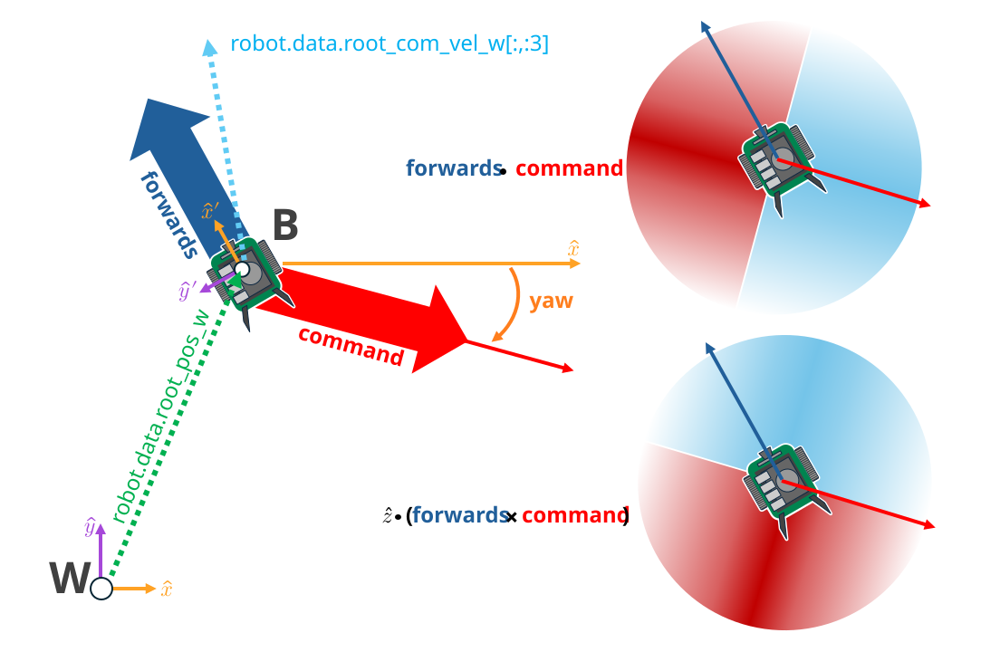
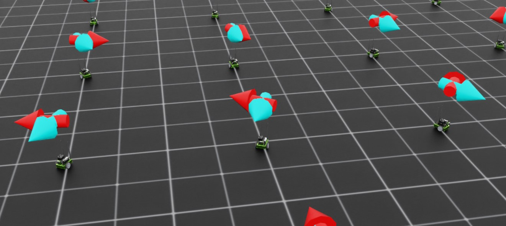

.. _walkthrough_training_jetbot_gt:

训练 Jetbot：真值
======================================

环境定义完成后，我们现在可以开始修改观测和奖励，以训练一个策略来充当 Jetbot 的控制器。
作为用户，我们希望能指定 Jetbot 期望的行驶方向，并让车轮转动，使机器人以尽可能快的速度沿
指定方向行驶。如何用强化学习（RL）实现这一点？如果你想直接跳到最后、查看本次分步演示这一阶段的结果，
请检出 `this branch of the tutorial repository <https://github.com/isaac-sim/IsaacLabTutorial/tree/jetbot-intro-1-2>`_！

扩展环境
--------------------------

我们需要做的第一件事是为 Stage 上的每台 Jetbot 创建设置指令（command）的逻辑。每条指令都是一个单位向量，
而 Stage 上机器人的每个克隆体都需要一条指令，这意味着需要一个形状为 ``[num_envs, 3]`` 的张量。
尽管 Jetbot 只在 2D 平面内导航，但使用 3D 向量可以让我们充分利用 Isaac Lab 提供的所有数学工具。

设置可视化也是个好主意，这样我们就能更容易地看出策略在训练和推理时在做什么。
在这里，我们将定义两个箭头 ``VisualizationMarkers``：一个表示机器人的 "前进" 方向，另一个表示
指令方向。当策略训练完成时，这两个箭头应当是对齐的！尽早准备好这些可视化，有助于我们避免
"静默 bug"：那些不会导致代码崩溃的问题。

首先，我们需要定义标记配置，然后用该配置实例化标记。将以下内容添加到 ``isaac_lab_tutorial_env.py`` 的全局作用域

.. code-block:: python

  from isaaclab.markers import VisualizationMarkers, VisualizationMarkersCfg
  from isaaclab.utils.assets import ISAAC_NUCLEUS_DIR
  import isaaclab.utils.math as math_utils

  def define_markers() -> VisualizationMarkers:
      """Define markers with various different shapes."""
      marker_cfg = VisualizationMarkersCfg(
          prim_path="/Visuals/myMarkers",
          markers={
                  "forward": sim_utils.UsdFileCfg(
                      usd_path=f"{ISAAC_NUCLEUS_DIR}/Props/UIElements/arrow_x.usd",
                      scale=(0.25, 0.25, 0.5),
                      visual_material=sim_utils.PreviewSurfaceCfg(diffuse_color=(0.0, 1.0, 1.0)),
                  ),
                  "command": sim_utils.UsdFileCfg(
                      usd_path=f"{ISAAC_NUCLEUS_DIR}/Props/UIElements/arrow_x.usd",
                      scale=(0.25, 0.25, 0.5),
                      visual_material=sim_utils.PreviewSurfaceCfg(diffuse_color=(1.0, 0.0, 0.0)),
                  ),
          },
      )
      return VisualizationMarkers(cfg=marker_cfg)

``VisualizationMarkersCfg`` 定义了用作 "标记" 的 USD Prim。任何 Prim 都可以，但一般来说你应尽量让
标记保持简单，因为标记的克隆发生在运行时的每个时间步上。这是因为这些标记的用途 *仅限于调试可视化*，
并不是仿真的一部分：用户对何时何地绘制多少标记拥有完全的控制权。NVIDIA 在位于 ``ISAAC_NUCLEUS_DIR``
的公共 Nucleus 服务器上提供了若干简单的网格（mesh），出于显而易见的原因我们选择使用 ``arrow_x.usd``。

如果想看使用 ``VisualizationMarkers`` 的更详细示例，请查看 ``markers.py`` 演示！

.. dropdown:: Code for the markers.py demo
   :icon: code

   .. literalinclude:: ../../../../scripts/demos/markers.py
      :language: python
      :linenos:

接下来，我们需要扩展初始化和设置步骤，以构造跟踪指令所需的以及标记位置和旋转所需的数据。将
``_setup_scene`` 的内容替换为以下内容

.. code-block:: python

    def _setup_scene(self):
        self.robot = Articulation(self.cfg.robot_cfg)
        # add ground plane
        spawn_ground_plane(prim_path="/World/ground", cfg=GroundPlaneCfg())
        # clone and replicate
        self.scene.clone_environments(copy_from_source=False)
        # add articulation to scene
        self.scene.articulations["robot"] = self.robot
        # add lights
        light_cfg = sim_utils.DomeLightCfg(intensity=2000.0, color=(0.75, 0.75, 0.75))
        light_cfg.func("/World/Light", light_cfg)

        self.visualization_markers = define_markers()

        # setting aside useful variables for later
        self.up_dir = torch.tensor([0.0, 0.0, 1.0]).cuda()
        self.yaws = torch.zeros((self.cfg.scene.num_envs, 1)).cuda()
        self.commands = torch.randn((self.cfg.scene.num_envs, 3)).cuda()
        self.commands[:,-1] = 0.0
        self.commands = self.commands/torch.linalg.norm(self.commands, dim=1, keepdim=True)

        # offsets to account for atan range and keep things on [-pi, pi]
        ratio = self.commands[:,1]/(self.commands[:,0]+1E-8)
        gzero = torch.where(self.commands > 0, True, False)
        lzero = torch.where(self.commands < 0, True, False)
        plus = lzero[:,0]*gzero[:,1]
        minus = lzero[:,0]*lzero[:,1]
        offsets = torch.pi*plus - torch.pi*minus
        self.yaws = torch.atan(ratio).reshape(-1,1) + offsets.reshape(-1,1)

        self.marker_locations = torch.zeros((self.cfg.scene.num_envs, 3)).cuda()
        self.marker_offset = torch.zeros((self.cfg.scene.num_envs, 3)).cuda()
        self.marker_offset[:,-1] = 0.5
        self.forward_marker_orientations = torch.zeros((self.cfg.scene.num_envs, 4)).cuda()
        self.command_marker_orientations = torch.zeros((self.cfg.scene.num_envs, 4)).cuda()

其中大部分内容是在为指令和标记建立簿记（book keeping），但指令的初始化和偏航角（yaw）的计算值得深入探讨。
指令通过 ``torch.randn`` 从多元正态分布中采样，其 z 分量固定为零，然后归一化为单位长度。为了把指令
标记指向这些向量，我们需要适当地旋转基础箭头网格。这意味着我们需要定义一个
`quaternion <https://en.wikipedia.org/wiki/Quaternion>`_，让它绕 z 轴把箭头 Prim 旋转某个由指令确定的角度。
按照惯例，绕 z 轴的旋转被称为 "偏航（yaw）" 旋转（与 roll、pitch 相对应）。

幸运的是，Isaac Lab 提供了根据旋转轴和角度生成四元数的工具：:func:`isaaclab.utils.math.quat_from_axis_angle`，
因此现在唯一棘手的部分就是确定那个角度。

偏航角是绕 z 轴定义的，偏航角为 0 时与 x 轴对齐，正角度逆时针展开。指令向量的 x 和 y 分量
定义了这个角的正切值，因此我们需要该比值的 *反正切* 来得到偏航角。

现在，考虑两条指令：指令 A 位于第 2 象限 (-x, y)，而指令 B 位于第 4 象限 (x, -y)。
A 和 B 的 y 分量与 x 分量之比完全相同。如果我们不处理这一点，那么部分指令箭头将
指向与指令相反的方向！本质上，我们的指令定义在 ``[-pi, pi]`` 上，但 ``arctangent``
只在 ``[-pi/2, pi/2]`` 上有定义。

为了解决这个问题，我们根据指令所在的象限，在偏航角上加上或减去 ``pi``。

.. code-block:: python

        ratio = self.commands[:,1]/(self.commands[:,0]+1E-8) #in case the x component is zero
        gzero = torch.where(self.commands > 0, True, False)
        lzero = torch.where(self.commands < 0, True, False)
        plus = lzero[:,0]*gzero[:,1]
        minus = lzero[:,0]*lzero[:,1]
        offsets = torch.pi*plus - torch.pi*minus
        self.yaws = torch.atan(ratio).reshape(-1,1) + offsets.reshape(-1,1)

涉及张量的布尔表达式可能存在歧义定义，PyTorch 会就此抛出错误。PyTorch 提供了
多种方法来明确这些定义。``torch.where`` 方法会生成一个与输入形状相同的张量，
输出的每个元素仅由该表达式在该元素上的求值结果决定。处理张量布尔运算的一种可靠方式，
是直接生成布尔索引张量，然后用代数方式表示该运算：``AND`` 用乘法表示，``OR`` 用加法表示，
这正是我们在上面所做的。这等价于如下伪代码：

.. code-block:: python

    yaws = torch.atan(ratio)
    yaws[commands[:,0] < 0 and commands[:,1] > 0] += torch.pi
    yaws[commands[:,0] < 0 and commands[:,1] < 0] -= torch.pi

接下来是真正对标记进行可视化的方法。记住，这些标记不是场景实体！我们必须在想看到它们时 "绘制" 它们。

.. code-block:: python

    def _visualize_markers(self):
        # get marker locations and orientations
        self.marker_locations = self.robot.data.root_pos_w
        self.forward_marker_orientations = self.robot.data.root_quat_w
        self.command_marker_orientations = math_utils.quat_from_angle_axis(self.yaws, self.up_dir).squeeze()

        # offset markers so they are above the jetbot
        loc = self.marker_locations + self.marker_offset
        loc = torch.vstack((loc, loc))
        rots = torch.vstack((self.forward_marker_orientations, self.command_marker_orientations))

        # render the markers
        all_envs = torch.arange(self.cfg.scene.num_envs)
        indices = torch.hstack((torch.zeros_like(all_envs), torch.ones_like(all_envs)))
        self.visualization_markers.visualize(loc, rots, marker_indices=indices)

``VisualizationMarkers`` 的 ``visualize`` 方法就相当于这个 "绘制" 函数。它接收表示标记空间
变换的张量，以及一个 ``marker_indices`` 张量，用于为每个标记指定使用哪个标记原型。
只要这些张量的第一维都匹配，该函数就会以指定的变换绘制那些标记。
这就是我们对位置、旋转和索引进行堆叠的原因。

现在，我们只需在物理步之前调用 ``_visualize_markers``，即可让这些箭头显示出来。将 ``_pre_physics_step`` 替换为以下内容

.. code-block:: python

      def _pre_physics_step(self, actions: torch.Tensor) -> None:
        self.actions = actions.clone()
        self._visualize_markers()

在深入 RL 训练之前的最后一项重大修改，是更新 ``_reset_idx`` 方法以处理指令和标记。每当我们重置一个环境时，
都需要生成一条新指令并重置标记。其中的逻辑上文已经介绍过。将 ``_reset_idx`` 的内容替换为以下内容：

.. code-block:: python

    def _reset_idx(self, env_ids: Sequence[int] | None):
        if env_ids is None:
            env_ids = self.robot._ALL_INDICES
        super()._reset_idx(env_ids)

        # pick new commands for reset envs
        self.commands[env_ids] = torch.randn((len(env_ids), 3)).cuda()
        self.commands[env_ids,-1] = 0.0
        self.commands[env_ids] = self.commands[env_ids]/torch.linalg.norm(self.commands[env_ids], dim=1, keepdim=True)

        # recalculate the orientations for the command markers with the new commands
        ratio = self.commands[env_ids][:,1]/(self.commands[env_ids][:,0]+1E-8)
        gzero = torch.where(self.commands[env_ids] > 0, True, False)
        lzero = torch.where(self.commands[env_ids]< 0, True, False)
        plus = lzero[:,0]*gzero[:,1]
        minus = lzero[:,0]*lzero[:,1]
        offsets = torch.pi*plus - torch.pi*minus
        self.yaws[env_ids] = torch.atan(ratio).reshape(-1,1) + offsets.reshape(-1,1)

        # set the root state for the reset envs
        default_root_state = self.robot.data.default_root_state[env_ids]
        default_root_state[:, :3] += self.scene.env_origins[env_ids]

        self.robot.write_root_state_to_sim(default_root_state, env_ids)
        self._visualize_markers()

就是这样！我们现在可以生成指令，并可视化 Jetbot 的朝向。接下来可以开始调整观测和奖励了。

