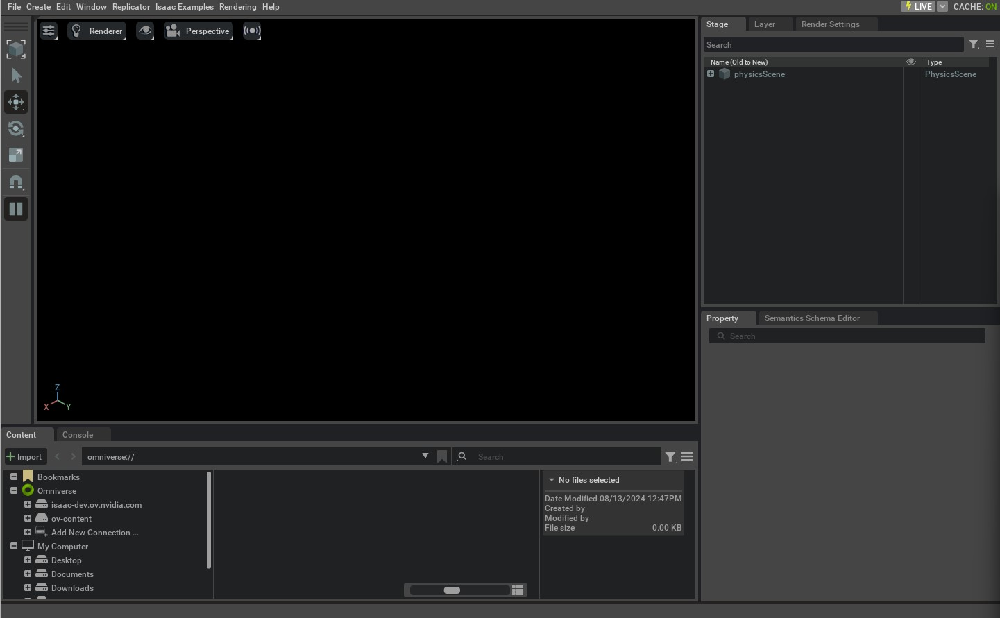

创建空场景
=======================

.. currentmodule:: isaaclab

本教程展示如何在独立 Python 脚本中启动和控制 Isaac Sim 仿真器。它会在 Isaac Lab 中搭建一个空场景，并介绍框架中使用的两个主要类：:class:`app.AppLauncher` 和
:class:`sim.SimulationContext`。

在开始本教程之前，请先阅读 `Isaac Sim Workflows`_ ，以便对使用仿真器有一个初步了解。

代码
~~~~~~~~

本教程对应 ``scripts/tutorials/00_sim`` 目录中的 ``create_empty.py`` 脚本。

.. dropdown:: Code for create_empty.py
   :icon: code

   .. literalinclude:: ../../../../scripts/tutorials/00_sim/create_empty.py
      :language: python
      :emphasize-lines: 18-30,34,40-44,46-47,51-54,60-61
      :linenos:

代码解析
~~~~~~~~~~~~~~~~~~

启动仿真器
-----------------------

使用独立 Python 脚本的第一步是启动仿真应用程序。由于 Isaac Sim 的各个依赖模块只有在仿真应用运行后才可用，
因此必须在开始时执行此操作。

这可以通过导入 :class:`app.AppLauncher` 类来完成。该工具类封装了
:class:`isaacsim.SimulationApp` 类以启动仿真器。它提供了通过命令行参数和环境变量配置
仿真器的机制。

在本教程中，我们主要介绍如何向用户自定义的
:class:`argparse.ArgumentParser` 添加命令行选项。这是通过将解析器实例传递给
:meth:`app.AppLauncher.add_app_launcher_args` 方法实现的，该方法会向其追加不同的参数。
这些参数包括以无界面（headless）方式启动应用、配置不同的 Livestream 选项，以及启用离屏渲染。

.. literalinclude:: ../../../../scripts/tutorials/00_sim/create_empty.py
   :language: python
   :start-at: import argparse
   :end-at: simulation_app = app_launcher.app

导入 Python 模块
------------------------

仿真应用运行起来之后，就可以从 Isaac Sim 和其他库导入不同的 Python 模块。这里我们导入以下模块：

* :mod:`isaaclab.sim`：Isaac Lab 中的一个子包，包含所有与仿真器核心相关的操作。

.. literalinclude:: ../../../../scripts/tutorials/00_sim/create_empty.py
   :language: python
   :start-at: from isaaclab.sim import SimulationCfg, SimulationContext
   :end-at: from isaaclab.sim import SimulationCfg, SimulationContext

配置仿真上下文
----------------------------------

从独立脚本启动仿真器时，用户可以完全控制仿真器的播放、暂停和步进。所有这些操作都通过 **仿真上下文（simulation
context）** 处理。它负责各种时间线事件，并为仿真配置 `physics scene`_ 。

在 Isaac Lab 中，:class:`sim.SimulationContext` 类继承自 Isaac Sim 的
:class:`isaacsim.core.api.simulation_context.SimulationContext`，以便通过 Python 的 ``dataclass`` 对象进行配置，
并处理仿真步进中的某些细节问题。

在本教程中，我们将物理时间步和渲染时间步设置为 0.01 秒。这是通过将这些数值传递给 :class:`sim.SimulationCfg` 完成的，
然后用它创建仿真上下文实例。

.. literalinclude:: ../../../../scripts/tutorials/00_sim/create_empty.py
   :language: python
   :start-at: # Initialize the simulation context
   :end-at: sim.set_camera_view([2.5, 2.5, 2.5], [0.0, 0.0, 0.0])

创建仿真上下文之后，我们只配置了作用于仿真场景的物理参数。这包括用于仿真的设备、重力向量以及其他高级求解器参数。
接下来运行仿真还剩两个主要步骤：

1. 设计仿真场景：添加传感器、机器人和其他仿真物体
2. 运行仿真循环：步进仿真器，并从仿真器设置和获取数据

在本教程中，我们先针对空场景执行第 2 步，以便先专注于仿真控制。在后续教程中，我们将介绍第 1 步以及使用仿真句柄与
仿真器交互。

运行仿真
----------------------

设置好仿真场景后，首先要调用 :meth:`sim.SimulationContext.reset`
方法。该方法会播放时间线并初始化仿真器中的物理句柄。在第一次步进仿真器之前必须始终先调用它。否则，仿真句柄将无法被
正确初始化。

.. note::

   :meth:`sim.SimulationContext.reset` 与 :meth:`sim.SimulationContext.play` 方法不同，后者
   只播放时间线，不会初始化物理句柄。

播放仿真时间线之后，我们建立一个简单的仿真循环，在仿真应用运行期间反复步进仿真器。:meth:`sim.SimulationContext.step` 方法接受 :attr:`render` 参数，
用于指示该步是否包含与渲染相关的事件更新。默认情况下，该标志
被设置为 True。

.. literalinclude:: ../../../../scripts/tutorials/00_sim/create_empty.py
   :language: python
   :start-at: # Play the simulator
   :end-at: sim.step()

退出仿真
----------------------

最后，通过调用
:meth:`isaacsim.SimulationApp.close` 方法停止仿真应用程序并关闭其窗口。

.. literalinclude:: ../../../../scripts/tutorials/00_sim/create_empty.py
   :language: python
   :start-at: # close sim app
   :end-at: simulation_app.close()

代码执行
~~~~~~~~~~~~~~~~~~

现在我们已经通读了代码，接下来运行脚本并查看结果：

.. code-block:: bash

   ./isaaclab.sh -p scripts/tutorials/00_sim/create_empty.py

仿真应当正在播放，Stage 应当正在渲染。要停止仿真，
你可以关闭窗口，或在终端中按 ``Ctrl+C``。

向上述脚本传入 ``--help`` 将显示之前由 :class:`app.AppLauncher` 类添加的
各个命令行参数。要以无界面方式运行脚本，可以执行以下命令：

.. code-block:: bash

   ./isaaclab.sh -p scripts/tutorials/00_sim/create_empty.py --headless

现在我们已经基本了解了如何运行仿真，接下来让我们进入
后面的教程，学习如何向 Stage 添加资产。

.. _`Isaac Sim Workflows`: https://docs.isaacsim.omniverse.nvidia.com/latest/introduction/workflows.html
.. _carb: https://docs.omniverse.nvidia.com/kit/docs/carbonite/latest/index.html
.. _`physics scene`: https://docs.omniverse.nvidia.com/prod_extensions/prod_extensions/ext_physics.html#physics-scene
