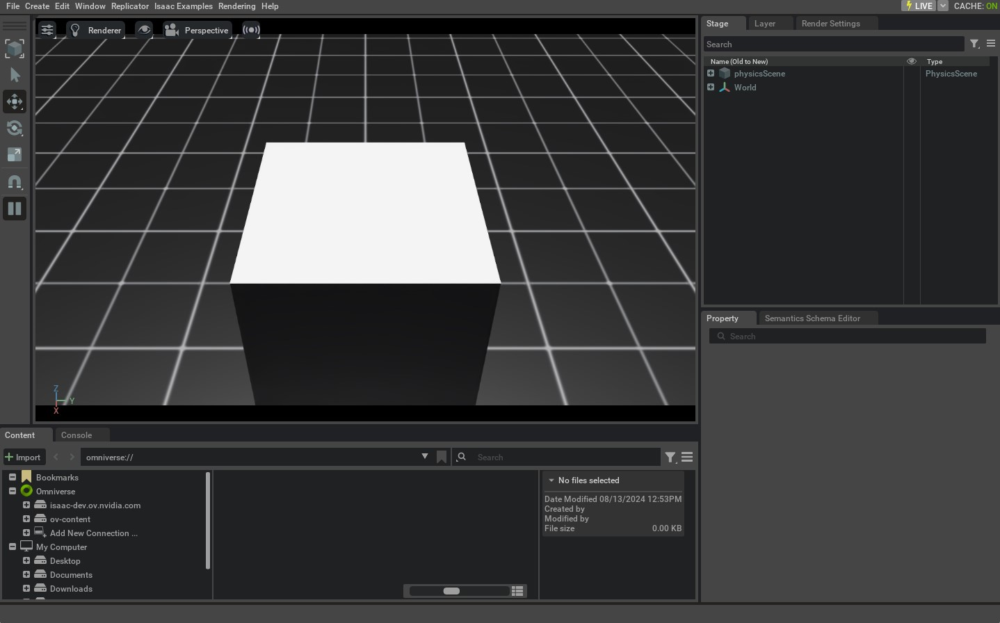

深入解析 AppLauncher
==========================

.. currentmodule:: isaaclab

在本教程中，我们将深入了解 :class:`app.AppLauncher` 类，学习如何使用
CLI 参数和环境变量（envars）配置仿真器。特别地，我们将演示如何使用
:class:`~app.AppLauncher` 启用直播串流（livestreaming），并配置它所封装的 :class:`isaacsim.simulation_app.SimulationApp`
实例，同时允许用户提供的自定义选项。

:class:`~app.AppLauncher` 是 :class:`~isaacsim.simulation_app.SimulationApp` 的封装，用于简化
其配置。:class:`~isaacsim.simulation_app.SimulationApp` 具有许多扩展，必须加载这些扩展才能启用不同的功能，其中一些扩展之间存在顺序依赖和相互依赖。
此外，还有一些启动选项（例如 ``headless``）必须在实例化时设置，
并且它们与某些扩展（例如直播串流扩展）之间存在隐含的关联。
:class:`~app.AppLauncher` 提供了一个接口，能够在各种使用场景中以可移植的方式处理这些扩展和启动
选项。为此，我们提供 CLI 和环境变量标志，它们可以与用户自定义的 CLI 参数合并，同时将用于
:class:`~isaacsim.simulation_app.SimulationApp` 的参数传递下去。

代码
--------

本教程对应
``scripts/tutorials/00_sim`` 目录中的 ``launch_app.py`` 脚本。

.. dropdown:: Code for launch_app.py
   :icon: code

   .. literalinclude:: ../../../../scripts/tutorials/00_sim/launch_app.py
      :language: python
      :emphasize-lines: 18-40
      :linenos:

代码解析
------------------

向参数解析器添加参数
^^^^^^^^^^^^^^^^^^^^^^^^^^^^^^^^^

:class:`~app.AppLauncher` 旨在与用户自己脚本所需的 CLI 参数兼容，
同时仍提供一个可移植的 CLI 接口。

在本教程中，我们实例化了一个标准的 :class:`argparse.ArgumentParser`，并为其添加了
脚本特有的 ``--size`` 参数，以及 ``--height`` 和 ``--width`` 参数。
后两者由 :class:`~isaacsim.simulation_app.SimulationApp` 处理。

参数 ``--size`` 并不会被 :class:`~app.AppLauncher` 使用，但会与 :class:`~app.AppLauncher` 接口
无缝合并。脚本内部的参数可以通过
:meth:`~app.AppLauncher.add_app_launcher_args` 方法与 :class:`~app.AppLauncher` 接口合并，
该方法会返回一个修改过的 :class:`~argparse.ArgumentParser`，其中追加了 :class:`~app.AppLauncher`
的参数。随后可以使用标准的 :meth:`argparse.ArgumentParser.parse_args` 方法将其解析为 :class:`argparse.Namespace`，并直接传递给
:class:`~app.AppLauncher` 进行实例化。

.. literalinclude::  ../../../../scripts/tutorials/00_sim/launch_app.py
   :language: python
   :start-at: import argparse
   :end-at: simulation_app = app_launcher.app

以上仅展示了向 :class:`~app.AppLauncher` 传递参数的多种方式中的一种。
请查阅其文档页面以了解更多选项。

理解 --help 的输出
^^^^^^^^^^^^^^^^^^^^^^^^^^^

在执行脚本时，我们可以传入 ``--help`` 参数，查看自定义参数与 :class:`~app.AppLauncher` 参数
合并后的输出。

.. code-block:: console

   ./isaaclab.sh -p scripts/tutorials/00_sim/launch_app.py --help

   [INFO] Using python from: /isaac-sim/python.sh
   [INFO][AppLauncher]: The argument 'width' will be used to configure the SimulationApp.
   [INFO][AppLauncher]: The argument 'height' will be used to configure the SimulationApp.
   usage: launch_app.py [-h] [--size SIZE] [--width WIDTH] [--height HEIGHT] [--headless] [--livestream {0,1,2}]
                        [--enable_cameras] [--verbose] [--experience EXPERIENCE]

   Tutorial on running IsaacSim via the AppLauncher.

   options:
   -h, --help            show this help message and exit
   --size SIZE           Side-length of cuboid
   --width WIDTH         Width of the viewport and generated images. Defaults to 1280
   --height HEIGHT       Height of the viewport and generated images. Defaults to 720

   app_launcher arguments:
   --headless            Force display off at all times.
   --livestream {0,1,2}
                         Force enable livestreaming. Mapping corresponds to that for the "LIVESTREAM" environment variable.
   --enable_cameras      Enable cameras when running without a GUI.
   --verbose             Enable verbose terminal logging from the SimulationApp.
   --experience EXPERIENCE
                         The experience file to load when launching the SimulationApp.

                         * If an empty string is provided, the experience file is determined based on the headless flag.
                         * If a relative path is provided, it is resolved relative to the `apps` folder in Isaac Sim and
                           Isaac Lab (in that order).

这段输出详细列出了脚本中直接定义的 ``--size``、``--height`` 和 ``--width`` 参数，
以及 :class:`~app.AppLauncher` 的参数。

帮助输出之前的 ``[INFO]`` 消息也指出了哪些参数将被解释为 :class:`~isaacsim.simulation_app.SimulationApp` 实例的参数，而该实例正是
:class:`~app.AppLauncher` 类所封装的对象。在本例中，它们是 ``--height`` 和 ``--width``。之所以
这样归类，是因为它们的名称和类型与 :class:`~isaacsim.simulation_app.SimulationApp` 可处理的参数相匹配。更多示例请参阅这些参数的 `specification`_ 。

使用环境变量
^^^^^^^^^^^^^^^^^^^^^^^^^^^

如帮助信息中所述，:class:`~app.AppLauncher` 的参数（``--livestream``、``--headless``）
也有对应的环境变量（envar）。这些在 :mod:`isaaclab.app`
文档中有详细说明。通过 CLI 提供这些参数，等效于在设置了相应环境变量的 shell 环境中运行脚本。

对 :class:`~app.AppLauncher` 环境变量的支持只是为了便于提供会话级持久化的
配置，可以将它们设置在用户的 ``${HOME}/.bashrc`` 中，以便在会话之间保持设置。如果这些参数是通过 CLI 提供的，
它们将覆盖对应的环境变量，本教程稍后将对此进行演示。

这些参数可以与任何使用 :class:`~app.AppLauncher` 启动仿真的脚本一起使用，
但有一个例外：``--enable_cameras``。该设置会将渲染管线切换为使用
离屏渲染器。然而，该设置只与 :class:`isaaclab.sim.SimulationContext` 兼容。
它不能与 Isaac Sim 的 :class:`isaacsim.core.api.simulation_context.SimulationContext` 类一起使用。
有关此标志的更多信息，请参阅 :class:`~app.AppLauncher` 的 API 文档。

代码执行
------------------

现在我们来运行示例脚本：

.. code-block:: console

   LIVESTREAM=2 ./isaaclab.sh -p scripts/tutorials/00_sim/launch_app.py --size 0.5

这将在仿真中生成一个 0.5 立方米的 cuboid（长方体）。不会出现 GUI，这等效于
传入 ``--headless`` 标志，因为我们的 ``LIVESTREAM``
环境变量隐含了无界面模式。如果需要可视化，我们可以通过 Isaac 的 `WebRTC Livestreaming`_ 获取。流式传输
是目前容器内唯一支持的可视化方式。可以在启动终端中按 ``Ctrl+C`` 终止该进程。

接下来，我们看看 :class:`~app.AppLauncher` 如何处理冲突的命令：

.. code-block:: console

   LIVESTREAM=0 ./isaaclab.sh -p scripts/tutorials/00_sim/launch_app.py --size 0.5 --livestream 2

这将产生与上一次运行相同的行为，因为虽然我们在环境变量中设置了 ``LIVESTREAM=0``，
但像 ``--livestream`` 这样的 CLI 参数在决定行为时具有更高优先级。可以在
启动终端中按 ``Ctrl+C`` 终止该进程。

最后，我们将研究如何通过 :class:`~app.AppLauncher` 向 :class:`~isaacsim.simulation_app.SimulationApp` 传递参数：

.. code-block:: console

   LIVESTREAM=2 ./isaaclab.sh -p scripts/tutorials/00_sim/launch_app.py --size 0.5 --width 1920 --height 1080

这将产生与之前相同的行为，但现在视口将以 1920x1080p 的分辨率渲染。
当我们想采集高分辨率视频时这会很有用；如果希望仿真具有更高性能，也可以指定更低的分辨率。可以在启动
终端中按 ``Ctrl+C`` 终止该进程。

.. _specification: https://docs.isaacsim.omniverse.nvidia.com/latest/py/source/extensions/isaacsim.simulation_app/docs/index.html#isaacsim.simulation_app.SimulationApp.DEFAULT_LAUNCHER_CONFIG
.. _WebRTC Livestreaming: https://docs.isaacsim.omniverse.nvidia.com/latest/installation/manual_livestream_clients.html#isaac-sim-short-webrtc-streaming-client
