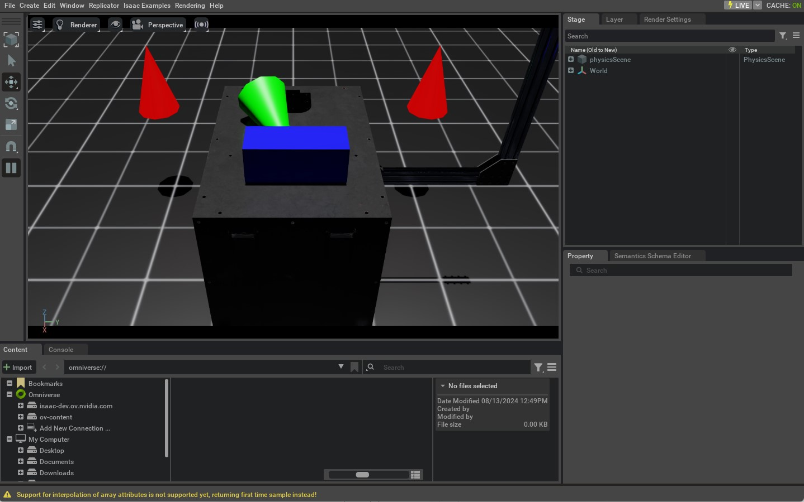

.. _tutorial-spawn-prims:

向场景中生成 Prim
=============================

.. currentmodule:: isaaclab

本教程探讨如何在 Isaac Lab 中通过 Python 向场景中生成各种物体（或 Prim）。
它建立在前一篇关于从独立脚本运行仿真器的教程之上，并演示如何从 USD 文件生成地面平面、灯光、基本体形状和网格（mesh）。

代码
~~~~~~~~

本教程对应 ``scripts/tutorials/00_sim`` 目录中的 ``spawn_prims.py`` 脚本。
让我们看一下这个 Python 脚本：

.. dropdown:: Code for spawn_prims.py
   :icon: code

   .. literalinclude:: ../../../../scripts/tutorials/00_sim/spawn_prims.py
      :language: python
      :emphasize-lines: 40-88, 100-101
      :linenos:

代码解析
~~~~~~~~~~~~~~~~~~

Omniverse 中的场景设计围绕一个名为 USD（Universal Scene Description）的软件系统和文件格式构建。
它允许以层级方式描述 3D 场景，类似于文件系统。由于 USD 是一个全面的框架，
我们建议阅读 `USD documentation`_ 以了解更多。

为完整起见，我们在本教程中介绍必须掌握的 USD 概念。

* **基本体（Prims）**：这些是 USD 场景的基本构建块。可以把它们看作场景
  图中的节点。每个节点可以是一个网格、一盏灯、一个相机或一个变换（transform）。它也可以是其下其他 prim 的分组。
* **属性（Attributes）**：这些是 prim 的属性。可以把它们看作键值对。例如，一个 prim 可以
  拥有名为 ``color``、值为 ``red`` 的属性。
* **关系（Relationships）**：这些是 prim 之间的连接。可以把它们看作指向其他 prim 的指针。例如，
  一个网格 prim 可以拥有指向材质 prim 的关系以进行着色。

这些 prim 及其属性和关系的集合被称为 **USD Stage**。可以把
它看作场景中所有 prim 的容器。当我们说正在设计场景时，实际上是在设计一个 USD Stage。

直接使用 USD API 提供了很大的灵活性，但学习和使用可能比较繁琐。为了让
场景设计更简单，Isaac Lab 在 USD API 之上构建，提供了一个配置驱动的接口来向场景
生成 prim。这些接口包含在 :mod:`sim.spawners` 模块中。

向场景生成 prim 时，每个 prim 都需要一个配置类实例，用于定义该 prim 的属性
和关系（通过材质和着色信息）。然后将该配置类传递给对应的
函数，并在其中指定 prim 名称和变换。该函数随后将 prim 生成到场景中。

从较高层面看，它的工作方式如下：

.. code-block:: python

   # Create a configuration class instance
   cfg = MyPrimCfg()
   prim_path = "/path/to/prim"

   # Spawn the prim into the scene using the corresponding spawner function
   spawn_my_prim(prim_path, cfg, translation=[0, 0, 0], orientation=[1, 0, 0, 0], scale=[1, 1, 1])
   # OR
   # Use the spawner function directly from the configuration class
   cfg.func(prim_path, cfg, translation=[0, 0, 0], orientation=[1, 0, 0, 0], scale=[1, 1, 1])

在本教程中，我们演示向场景生成各种不同 prim 的过程。有关可用 spawner 的
更多信息，请参阅 Isaac Lab 中的 :mod:`sim.spawners` 模块。

.. attention::

   所有场景设计都必须在仿真开始之前完成。仿真开始后，我们建议保持
   场景冻结，仅修改 prim 的属性。这对 GPU 仿真尤为重要，
   因为在仿真过程中添加新 prim 可能会改变 GPU 上的物理仿真缓冲区，从而导致意外的
   行为。

生成地面平面
-----------------------

:class:`~sim.spawners.from_files.GroundPlaneCfg` 用于配置网格状的地面平面，其外观和大小等
属性均可修改。

.. literalinclude:: ../../../../scripts/tutorials/00_sim/spawn_prims.py
   :language: python
   :start-at: # Ground-plane
   :end-at: cfg_ground.func("/World/defaultGroundPlane", cfg_ground)

生成灯光
---------------

可以向 Stage 中生成 `different light prims`_ 。这些包括远距离光（distant light）、球体光、圆盘光
和圆柱光。在本教程中，我们生成一个远距离光，它是一种距离场景无限远并沿单一方向照射的光源。

.. literalinclude:: ../../../../scripts/tutorials/00_sim/spawn_prims.py
   :language: python
   :start-at: # spawn distant light
   :end-at: cfg_light_distant.func("/World/lightDistant", cfg_light_distant, translation=(1, 0, 10))

生成基本体形状
-------------------------

在生成基本体形状之前，我们先介绍变换 prim（transform prim）或 Xform 的概念。变换 prim 是一种只包含变换属性的 prim。
它用于将其他 prim 分组到其下，并作为一个整体对它们进行变换。这里我们创建一个 Xform prim，将所有基本体形状分组到其下。

.. literalinclude:: ../../../../scripts/tutorials/00_sim/spawn_prims.py
   :language: python
   :start-at: # create a new xform prim for all objects to be spawned under
   :end-at: sim_utils.create_prim("/World/Objects", "Xform")

接下来，我们使用 :class:`~sim.spawners.shapes.ConeCfg` 类生成一个圆锥体。可以指定
圆锥体的半径、高度、物理属性和材质属性。默认情况下，物理和材质
属性是禁用的。

我们生成的前两个圆锥体 ``Cone1`` 和 ``Cone2`` 是视觉元素，没有启用物理。

.. literalinclude:: ../../../../scripts/tutorials/00_sim/spawn_prims.py
   :language: python
   :start-at: # spawn a red cone
   :end-at: cfg_cone.func("/World/Objects/Cone2", cfg_cone, translation=(-1.0, -1.0, 1.0))

对于第三个圆锥体 ``ConeRigid``，我们通过在配置
类中设置相应属性为它添加刚体物理。通过这些属性，我们可以指定圆锥体的质量、摩擦和恢复系数。如果未指定，
它们将默认使用 USD Physics 设置的默认值。

.. literalinclude:: ../../../../scripts/tutorials/00_sim/spawn_prims.py
   :language: python
   :start-at: # spawn a green cone with colliders and rigid body
   :end-before: # spawn a blue cuboid with deformable body

最后，我们生成一个包含可变形体（deformable body）物理属性的 cuboid ``CuboidDeformable``。与
刚体仿真不同，可变形体的顶点之间可以发生相对运动。这适用于模拟
布料、橡胶或果冻等软体。需要注意的是，可变形体仅在
GPU 仿真中受支持，并且需要生成带有可变形体物理属性的网格物体。

.. literalinclude:: ../../../../scripts/tutorials/00_sim/spawn_prims.py
   :language: python
   :start-at: # spawn a blue cuboid with deformable body
   :end-before: # spawn a usd file of a table into the scene

从其他文件生成
--------------------------

最后，可以从其他文件格式生成 prim，例如其他 USD、URDF 或 OBJ 文件。在本教程中，
我们向场景中生成一张桌子的 USD 文件。桌子是一个网格 prim，并且关联了一个材质 prim。
所有这些信息都存储在它的 USD 文件中。

.. literalinclude:: ../../../../scripts/tutorials/00_sim/spawn_prims.py
   :language: python
   :start-at: # spawn a usd file of a table into the scene
   :end-at: cfg.func("/World/Objects/Table", cfg, translation=(0.0, 0.0, 1.05))

上面的桌子是以引用的方式添加到场景中的。通俗地说，这意味着桌子本身并没有被真正添加
到场景中，而是添加了一个指向桌子资产的 ``pointer``。这使我们能够修改桌子资产，并让更改
以非破坏性的方式反映到场景中。例如，我们可以在不直接修改桌子资产底层文件的情况下
更改桌子的材质。只有更改会存储在 USD Stage 中。

执行脚本
~~~~~~~~~~~~~~~~~~~~

与前面的教程类似，要运行脚本，请执行以下命令：

.. code-block:: bash

  ./isaaclab.sh -p scripts/tutorials/00_sim/spawn_prims.py

仿真启动后，你应该会看到一个窗口，其中包含地面平面、一盏灯、几个圆锥体和一张桌子。
启用了刚体物理的绿色圆锥体应该会下落并与桌子和地面
平面发生碰撞。其他圆锥体是视觉元素，不应移动。要停止仿真，你可以关闭窗口，
或在终端中按 ``Ctrl+C``。

本教程为在 Isaac Lab 中向场景生成各种 prim 奠定了基础。虽然简单，但它
演示了 Isaac Lab 中场景设计的基本概念以及如何使用 spawner。在接下来的教程中，
我们将了解如何与场景和仿真进行交互。

.. _`USD documentation`: https://graphics.pixar.com/usd/docs/index.html
.. _`different light prims`: https://youtu.be/c7qyI8pZvF4?feature=shared
