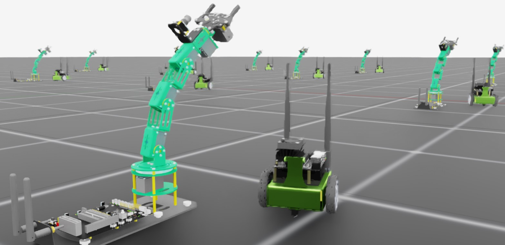

.. _tutorial-add-new-robot:

向 Isaac Lab 添加新机器人
===============================

.. currentmodule:: isaaclab

仿真和训练一个新机器人是一个多步骤的过程，首先要把机器人导入 Isaac Sim。
Isaac Sim 文档中的 `here <https://docs.isaacsim.omniverse.nvidia.com/latest/importer_exporter/importers_exporters.html>`_ 对此有深入介绍。
机器人导入并针对仿真调优之后，无论选择哪种工作流或训练框架，我们都必须定义必要的接口，以便跨多个环境克隆机器人、驱动其关节
并正确地重置它。

在本教程中，我们将研究如何向 Isaac Lab 添加新机器人。关键步骤是创建一个 ``AssetBaseCfg``，它定义了
机器人的 USD 关节体（articulation）与 Isaac Lab 提供的学习算法之间的接口。

代码
~~~~~~~~

本教程对应 ``scripts/tutorials/01_assets`` 目录中的 ``add_new_robot`` 脚本。

.. dropdown:: Code for add_new_robot.py
   :icon: code

   .. literalinclude:: ../../../../scripts/tutorials/01_assets/add_new_robot.py
      :language: python
      :linenos:

代码解析
~~~~~~~~~~~~~~~~~~

从根本上说，机器人就是一个带有关节驱动（joint drive）的关节体。要在仿真中移动机器人，我们必须向其驱动器施加
目标值，并让仿真在时间上向前步进。然而，严格通过关节驱动来控制机器人非常繁琐，尤其是当你想控制任何复杂的目标时，而如果你想跨多个环境克隆机器人，则更是难上加难。

为此，Isaac Lab 提供了一组 ``configuration`` 类，用于定义 USD 中哪些部分需要
被克隆、哪些部分是由智能体控制的执行器（actuator）、如何重置等等。你可以通过多种方式
为 Isaac Lab 配置同一个机器人资产，具体取决于该资产需要多少精细调优。为了演示，
教程脚本导入了两个机器人：第一个机器人 ``Jetbot`` 采用最简配置，而第二个机器人 ``Dofbot`` 则配置了额外的参数。

Jetbot 是一个简单的双轮差速底盘，顶部带有一个相机。该资产在 Isaac Sim 中被用于许多演示和
教程，所以我们知道它开箱即用！要把它引入 Isaac Lab，我们必须先定义上述配置之一。
由于机器人是一个带有关节驱动的关节体，我们定义一个 ``ArticulationCfg`` 来描述该机器人。

.. literalinclude:: ../../../../scripts/tutorials/01_assets/add_new_robot.py
    :language: python
    :lines: 27-38

这是 Isaac Lab 中机器人的最简配置。只有两个必需参数：``spawn`` 和 ``actuators``。

``spawn`` 参数需要一个 ``SpawnerCfg``，用于指定在仿真中定义机器人的 USD 资产。
Isaac Lab 的仿真工具 ``isaaclab.sim`` 为我们提供了 ``USDFileCfg`` 类，它接受我们 USD
资产的路径，并生成我们需要的 ``SpawnerCfg``。在本例中，``jetbot.usd`` 位于
`Isaac Assets <https://docs.isaacsim.omniverse.nvidia.com/latest/assets/usd_assets_overview.html>`_ 的 ``Robots/Jetbot/jetbot.usd`` 下。

``actuators`` 参数是一个执行器配置字典，定义了我们打算让智能体控制机器人的哪些部分。
将关节状态随时间更新到某个目标值有许多不同的方法。Isaac Lab 提供了一组执行器
类，可用于匹配常见的执行器模型，甚至可以实现你自己的模型！在本例中，我们使用 ``ImplicitActuatorCfg`` 类来指定
机器人的执行器，因为它们只是简单的轮子，使用默认值即可。

可以以不同的精细程度为该字典指定关节名称键。
Jetbot 只有少量关节，而我们只是打算使用 USD 资产中指定的默认值，因此可以使用简单的正则表达式 ``.*`` 来指定所有关节。
也可以使用其他正则表达式对关节及相关配置进行分组。

.. note::

      在隐式执行器（implicit actuator）中必须同时指定刚度和阻尼，但将其值设为 ``None`` 将使用 USD 资产中定义的默认值。

虽然这是最简配置，但我们还可以指定许多其他参数。

.. literalinclude:: ../../../../scripts/tutorials/01_assets/add_new_robot.py
    :language: python
    :lines: 39-82

该配置可用于将 Dofbot 添加到场景中，它包含了其中一些参数。
Dofbot 是一个具有多个关节的爱好者级机械臂，因此我们有更多的配置选项可用。
不过最显著的两个差异是新增了物理属性的配置以及机器人的初始状态 ``init_state``。

``USDFileCfg`` 为刚体和机器人等提供了专门的参数。``rigid_props`` 参数需要
一个 ``RigidBodyPropertiesCfg``，允许你指定被生成机器人的连杆（link）属性，涉及其作为仿真中
"物理对象" 的行为。而 ``articulation_props`` 管理与用于随时间步进关节的求解器相关的属性，因此需要配置一个 ``ArticulationRootPropertiesCfg``。
还有许多其他物理属性和参数可以通过 :class:`isaaclab.sim.schemas` 提供的配置来指定。

``ArticulationCfg`` 可以选择性地包含 ``init_state`` 参数，用于定义关节体的初始状态。
关节体的初始状态是一个特殊的、用户定义的状态，在 Isaac Lab 生成或重置机器人时使用。
初始关节状态 ``joint_pos`` 由一个浮点数字典指定，以 USD 关节名称为键（ **而不是** 执行器名称）。
这里还有一点值得注意：初始位置 ``pos`` 的坐标系是环境坐标系。
在本例中，通过指定位置 ``(0.25, -0.25, 0.0)``，我们是相对于 **环境原点** （而不是世界原点）偏移机器人的生成位置。

有了这些机器人的配置之后，我们现在可以将它们添加到场景，并按照直接式工作流的惯用方式
与它们交互：定义一个包含机器人关节体配置的 ``InteractiveSceneCfg`` ...

.. literalinclude:: ../../../../scripts/tutorials/01_assets/add_new_robot.py
    :language: python
    :lines: 85 - 99

...然后在适当地更新场景实体的同时步进仿真。

.. literalinclude:: ../../../../scripts/tutorials/01_assets/add_new_robot.py
    :language: python
    :lines: 101 - 158

.. note::

      你可能会看到一条警告，提示并非所有执行器都已配置！这是预期行为，因为我们在本教程中没有处理夹持器（gripper）。

