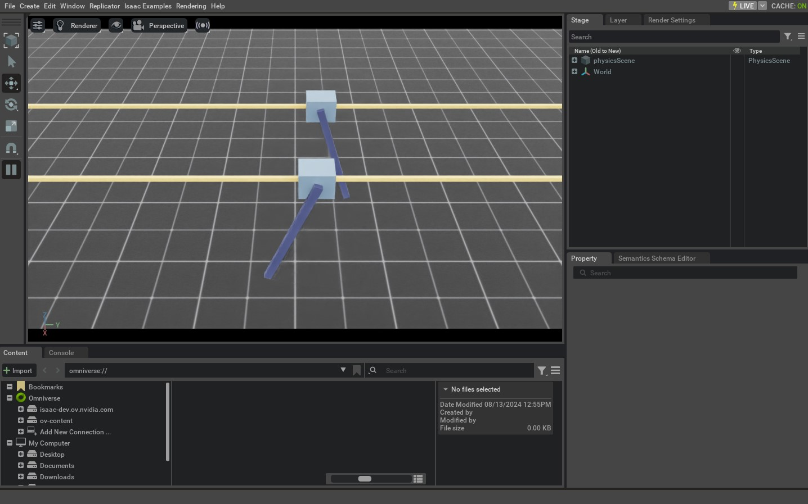

.. _tutorial-interact-articulation:

与关节体交互
================================

.. currentmodule:: isaaclab

本教程展示如何在仿真中与关节式机器人交互。它是
:ref:`tutorial-interact-rigid-object` 教程的延续，在那篇教程中我们学习了如何与刚体交互。
在设置根状态的基础上，我们还将了解如何设置关节状态并向关节式机器人
施加命令。

代码
~~~~~~~~

本教程对应 ``scripts/tutorials/01_assets``
目录中的 ``run_articulation.py`` 脚本。

.. dropdown:: Code for run_articulation.py
   :icon: code

   .. literalinclude:: ../../../../scripts/tutorials/01_assets/run_articulation.py
      :language: python
      :emphasize-lines: 58-69, 91-104, 108-111, 116-117
      :linenos:

代码解析
~~~~~~~~~~~~~~~~~~

设计场景
-------------------

与前面的教程类似，我们向场景中添加一个地面平面和一个远距离光。这次我们不
生成刚体，而是从其 USD 文件生成一个 cart-pole 关节体（articulation）。cart-pole 是一个简单的机器人，
由一个小车和一根连接在其上的杆组成。小车可以沿 x 轴自由移动，杆可以绕小车
自由旋转。cart-pole 的 USD 文件包含机器人的几何形状、关节和其他物理
属性。

对于 cart-pole，我们使用其预先定义的配置对象，它是
:class:`assets.ArticulationCfg` 类的实例。该类包含关节体的生成策略、
默认初始状态、不同关节的执行器模型以及其他元信息。关于如何
创建该配置对象的更深入介绍，请参阅 :ref:`how-to-write-articulation-config` 教程。

如前面的教程所示，我们可以以类似的方式将关节体生成到场景中：通过将配置对象传递给其构造函数来
创建 :class:`assets.Articulation` 类的实例。

.. literalinclude:: ../../../../scripts/tutorials/01_assets/run_articulation.py
   :language: python
   :start-at: # Create separate groups called "Origin1", "Origin2"
   :end-at: cartpole = Articulation(cfg=cartpole_cfg)

运行仿真循环
---------------------------

延续前面的教程，我们定期重置仿真、向关节体设置命令、
步进仿真，并更新关节体的内部缓冲区。

重置仿真
""""""""""""""""""""""""

与刚体类似，关节体也有一个根状态。该状态对应于
关节体树中的根刚体。除根状态外，关节体还有关节状态。这些状态对应于
关节位置和关节速度。

要重置关节体，我们首先通过调用 :meth:`Articulation.write_root_pose_to_sim` 和 :meth:`Articulation.write_root_velocity_to_sim`
方法设置根状态。类似地，我们通过调用 :meth:`Articulation.write_joint_state_to_sim` 方法设置关节状态。
最后，我们调用 :meth:`Articulation.reset` 方法来重置所有内部缓冲区和缓存。

.. literalinclude:: ../../../../scripts/tutorials/01_assets/run_articulation.py
   :language: python
   :start-at: # reset the scene entities
   :end-at: robot.reset()

步进仿真
"""""""""""""""""""""""

向关节体施加命令涉及两个步骤：

1. *设置关节目标*：这为关节体设置期望的关节位置、速度或力（effort）目标。
2. *将数据写入仿真*：根据关节体的配置，该步骤处理任何
   :ref:`actuation conversions <overview-actuators>`，并将转换后的值写入 PhysX 缓冲区。

在本教程中，我们使用关节力命令来控制关节体。为此，我们需要将
关节体的刚度和阻尼参数设置为零。这在 cart-pole 的预先定义的
配置对象中已提前完成。

在每一步中，我们随机采样关节力，并通过调用
:meth:`Articulation.set_joint_effort_target` 方法将它们设置给关节体。设置目标之后，我们调用
:meth:`Articulation.write_data_to_sim` 方法将数据写入 PhysX 缓冲区。最后，我们步进
仿真。

.. literalinclude:: ../../../../scripts/tutorials/01_assets/run_articulation.py
   :language: python
   :start-at: # Apply random action
   :end-at: robot.write_data_to_sim()

更新状态
""""""""""""""""""

每个关节体类都包含一个 :class:`assets.ArticulationData` 对象。它存储
关节体的状态。要更新缓冲区内的状态，我们调用 :meth:`assets.Articulation.update` 方法。

.. literalinclude:: ../../../../scripts/tutorials/01_assets/run_articulation.py
   :language: python
   :start-at: # Update buffers
   :end-at: robot.update(sim_dt)

代码执行
~~~~~~~~~~~~~~~~~~

要运行代码并查看结果，让我们从终端运行脚本：

.. code-block:: bash

   ./isaaclab.sh -p scripts/tutorials/01_assets/run_articulation.py

该命令应该会打开一个包含地面平面、灯光和两个随机移动的 cart-pole 的 Stage。
要停止仿真，你可以关闭窗口，或在终端中按 ``Ctrl+C``。

在本教程中，我们学习了如何创建简单的关节体并与之交互。我们了解了如何设置
关节体的状态（其根状态和关节状态）以及如何向它施加命令。我们还了解了如何更新其
缓冲区以从仿真中读取最新状态。

除了本教程之外，我们还提供了另外几个生成不同机器人的脚本。它们包含在
``scripts/demos`` 目录中。你可以这样运行这些脚本：

.. code-block:: bash

   # Spawn many different single-arm manipulators
   ./isaaclab.sh -p scripts/demos/arms.py

   # Spawn many different quadrupeds
   ./isaaclab.sh -p scripts/demos/quadrupeds.py
