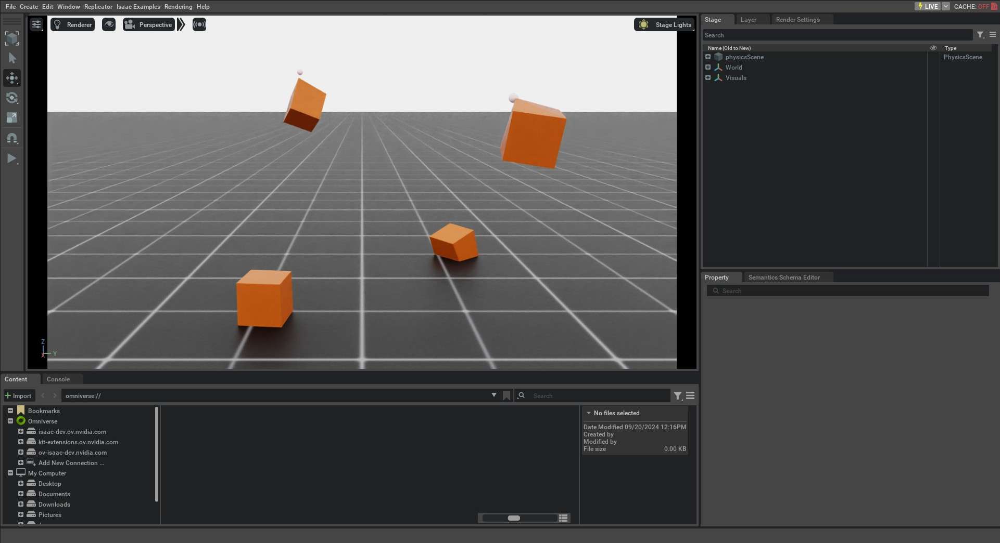

.. _tutorial-interact-deformable-object:

与可变形物体交互
====================================

.. currentmodule:: isaaclab

虽然可变形物体有时指更广泛的一类物体，例如布料、流体和软体，但在 PhysX 中，可变形物体在语法上对应于软体（soft body）。与刚体不同，软体可以在外力和碰撞作用下发生
形变。

软体在 PhysX 中使用有限元方法（FEM）进行仿真。软体由两个四面体
网格组成：仿真网格和碰撞网格。仿真网格用于模拟
软体的形变，而碰撞网格用于检测与场景中其他物体的碰撞。
更多细节请参阅 `PhysX documentation`_ 。

本教程展示如何在仿真中与可变形物体交互。我们将生成
一组软体立方体，并了解如何设置它们的节点位置和速度，以及如何向网格节点施加运动学
命令来移动软体。

代码
~~~~~~~~

本教程对应 ``scripts/tutorials/01_assets`` 目录中的 ``run_deformable_object.py`` 脚本。

.. dropdown:: Code for run_deformable_object.py
   :icon: code

   .. literalinclude:: ../../../../scripts/tutorials/01_assets/run_deformable_object.py
      :language: python
      :emphasize-lines: 61-73, 75-77, 102-110, 112-115, 117-118, 123-130, 132-133, 139-140
      :linenos:

代码解析
~~~~~~~~~~~~~~~~~~

设计场景
-------------------

与 :ref:`tutorial-interact-rigid-object` 教程类似，我们向场景中添加一个地面平面
和一个光源。此外，我们使用 :class:`assets.DeformableObject`
类向场景添加一个可变形物体。该类负责在输入路径处生成 prim 并初始化它们相应的
可变形体物理句柄。

在本教程中，我们使用与 :ref:`Spawn Objects <tutorial-spawn-prims>` 教程中可变形立方体类似的生成配置来创建一个立方形软体。唯一的区别是，现在我们将
生成配置封装进 :class:`assets.DeformableObjectCfg` 类。该类包含
资产的生成策略和默认初始状态信息。当该类被传递给
:class:`assets.DeformableObject` 类时，它会在仿真播放时生成物体并初始化相应的物理句柄。

.. note::
    可变形物体仅在 GPU 仿真中受支持，并且要求生成的网格物体带有
    可变形体物理属性。

如刚体教程所示，我们可以以类似的方式将可变形物体生成到场景中：通过将配置对象传递给其构造函数来
创建 :class:`assets.DeformableObject` 类的实例。

.. literalinclude:: ../../../../scripts/tutorials/01_assets/run_deformable_object.py
   :language: python
   :start-at: # Create separate groups called "Origin1", "Origin2", "Origin3"
   :end-at: cube_object = DeformableObject(cfg=cfg)

运行仿真循环
---------------------------

延续刚体教程，我们定期重置仿真、向可变形体施加运动学命令、
步进仿真，并更新可变形物体的内部缓冲区。

重置仿真状态
""""""""""""""""""""""""""""

与刚体和关节体不同，可变形物体具有不同的状态表示。可变形物体的状态由网格的节点位置和速度定义。
节点位置和速度定义在 **仿真世界坐标系** 中，并存储在 :attr:`assets.DeformableObject.data` 属性中。

我们使用 :attr:`assets.DeformableObject.data.default_nodal_state_w` 属性获取
已生成物体 prim 的默认节点状态。该默认状态可以通过 :attr:`assets.DeformableObjectCfg.init_state`
属性配置，在本教程中我们将其保留为单位状态。

.. attention::
   配置 :attr:`assets.DeformableObjectCfg` 中的初始状态指定了可变形物体
   在生成时的位姿。基于该初始状态，在第一次播放仿真时
   得到默认节点状态。

我们对节点位置施加变换，以随机化可变形物体的初始状态。

.. literalinclude:: ../../../../scripts/tutorials/01_assets/run_deformable_object.py
   :language: python
   :start-at: # reset the nodal state of the object
   :end-at: nodal_state[..., :3] = cube_object.transform_nodal_pos(nodal_state[..., :3], pos_w, quat_w)

要重置可变形物体，我们首先通过调用 :meth:`assets.DeformableObject.write_nodal_state_to_sim`
方法设置节点状态。该方法将可变形物体 prim 的节点状态写入仿真缓冲区。
此外，我们通过调用
:meth:`assets.DeformableObject.write_nodal_kinematic_target_to_sim` 方法释放上一步仿真中为节点设置的所有运动学目标。我们将在下一节解释
运动学目标。

最后，我们调用 :meth:`assets.DeformableObject.reset` 方法来重置所有内部缓冲区和缓存。

.. literalinclude:: ../../../../scripts/tutorials/01_assets/run_deformable_object.py
   :language: python
   :start-at: # write nodal state to simulation
   :end-at: cube_object.reset()

步进仿真
"""""""""""""""""""""""

可变形体支持用户驱动的运动学控制：用户可以为部分
网格节点指定位置目标，而其余节点则使用 FEM 求解器进行仿真。这种 `partial kinematic`_ 控制
适用于用户希望以受控方式与可变形物体交互的场景。

在本教程中，我们对场景中四个立方体中的两个施加运动学命令。我们将索引 0 处节点（左下角）的
位置目标设置为让立方体沿 z 轴移动。

在每一步中，我们将该节点的运动学位置目标增加一个小的增量。此外，
我们设置标志，以在仿真缓冲区中指示该目标是该节点的运动学目标。
这些通过调用 :meth:`assets.DeformableObject.write_nodal_kinematic_target_to_sim`
方法写入仿真缓冲区。

.. literalinclude:: ../../../../scripts/tutorials/01_assets/run_deformable_object.py
   :language: python
   :start-at: # update the kinematic target for cubes at index 0 and 3
   :end-at: cube_object.write_nodal_kinematic_target_to_sim(nodal_kinematic_target)

与刚体和关节体类似，我们在步进仿真之前执行 :meth:`assets.DeformableObject.write_data_to_sim` 方法。
对于可变形物体，该方法不会向物体施加任何外力。
但我们保留该方法以保证完整性和便于未来扩展。

.. literalinclude:: ../../../../scripts/tutorials/01_assets/run_deformable_object.py
   :language: python
   :start-at: # write internal data to simulation
   :end-at: cube_object.write_data_to_sim()

更新状态
""""""""""""""""""

步进仿真之后，我们更新可变形物体 prim 的内部缓冲区，以在 :class:`assets.DeformableObject.data` 属性中反映它们的新状态。
这通过 :meth:`assets.DeformableObject.update` 方法完成。

我们以固定间隔将可变形物体的根位置打印到终端。如前所述，
可变形物体没有根状态的概念。不过，我们将根位置计算为
网格中所有节点位置的平均值。

.. literalinclude:: ../../../../scripts/tutorials/01_assets/run_deformable_object.py
   :language: python
   :start-at: # update buffers
   :end-at: print(f"Root position (in world): {cube_object.data.root_pos_w[:, :3]}")

代码执行
~~~~~~~~~~~~~~~~~~

现在我们已经通读了代码，接下来运行脚本并查看结果：

.. code-block:: bash

   ./isaaclab.sh -p scripts/tutorials/01_assets/run_deformable_object.py

这应该会打开一个包含地面平面、灯光和几个绿色立方体的 Stage。四个立方体中有两个应从
某个高度下落并落到地面上。与此同时，另外两个立方体应沿 z 轴移动。你
应该会看到一个标记，显示立方体左下角节点的运动学目标位置。
要停止仿真，你可以关闭窗口，或在终端中按 ``Ctrl+C``。

本教程展示了如何生成可变形物体并将它们封装在 :class:`DeformableObject` 类中以初始化其
物理句柄，从而可以设置和获取它们的状态。我们还了解了如何向可变形物体施加运动学命令，以受控的方式移动网格节点。在下一篇教程中，我们将了解如何使用 :class:`InteractiveScene` 类创建
场景。

.. _PhysX documentation: https://nvidia-omniverse.github.io/PhysX/physx/5.4.1/docs/SoftBodies.html
.. _partial kinematic: https://nvidia-omniverse.github.io/PhysX/physx/5.4.1/docs/SoftBodies.html#kinematic-soft-bodies
