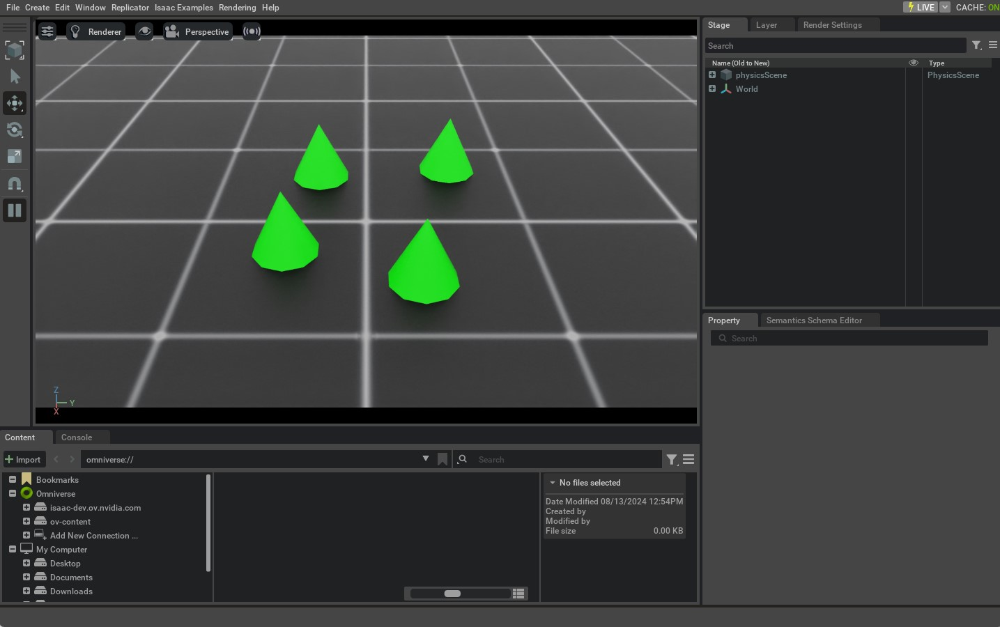

.. _tutorial-interact-rigid-object:

与刚体交互
===============================

.. currentmodule:: isaaclab

在前面的教程中，我们学习了独立脚本的基本工作原理，以及如何
向仿真中生成不同的物体（或 *prim*）。本教程展示如何创建一个刚体（rigid object）并与之交互。
为此，我们将使用 Isaac Lab 提供的 :class:`assets.RigidObject` 类。

代码
~~~~~~~~

本教程对应 ``scripts/tutorials/01_assets`` 目录中的 ``run_rigid_object.py`` 脚本。

.. dropdown:: Code for run_rigid_object.py
   :icon: code

   .. literalinclude:: ../../../../scripts/tutorials/01_assets/run_rigid_object.py
      :language: python
      :emphasize-lines: 55-74, 76-78, 98-108, 111-112, 118-119, 132-134, 139-140
      :linenos:

代码解析
~~~~~~~~~~~~~~~~~~

在这个脚本中，我们将 ``main`` 函数拆分为两个独立的函数，以突出在仿真器中搭建任何仿真的两个主要
步骤：

1. **设计场景**：顾名思义，这部分负责将所有 prim 添加到场景中。
2. **运行仿真**：这部分负责步进仿真器、与场景中的 prim 交互（例如更改它们的位姿）以及向它们施加命令。

需要区分这两个步骤，因为第二步只会在第一步完成并且仿真器重置之后才会发生。仿真器一旦重置（这会自动播放仿真），
就不应再向场景中添加新的（启用物理的）prim，因为这可能导致意外行为。不过，
仍然可以通过各自的句柄与这些 prim 交互。

设计场景
-------------------

与前面的教程类似，我们向场景中添加一个地面平面和一个光源。此外，
我们使用 :class:`assets.RigidObject` 类向场景添加一个刚体。该类负责
在输入路径处生成 prim，并初始化它们相应的刚体物理句柄。

在本教程中，我们使用与 :ref:`Spawn Objects <tutorial-spawn-prims>` 教程中刚体圆锥类似的生成配置来创建一个圆锥形刚体。唯一的区别是，现在我们将
生成配置封装进 :class:`assets.RigidObjectCfg` 类。该类包含了
资产生成策略、默认初始状态和其他元信息。当该类被传递给
:class:`assets.RigidObject` 类时，它会在仿真播放时生成物体并初始化相应的物理句柄。

作为多次生成刚体 prim 的示例，我们创建其父级 Xform prim，
``/World/Origin{i}``，对应不同的生成位置。当正则表达式
``/World/Origin.*/Cone`` 被传递给 :class:`assets.RigidObject` 类时，它会在
每个 ``/World/Origin{i}`` 位置生成刚体 prim。例如，如果场景中存在 ``/World/Origin1`` 和 ``/World/Origin2``，
则刚体 prim 会分别在 ``/World/Origin1/Cone`` 和
``/World/Origin2/Cone`` 位置生成。

.. literalinclude:: ../../../../scripts/tutorials/01_assets/run_rigid_object.py
   :language: python
   :start-at: # Create separate groups called "Origin1", "Origin2", "Origin3"
   :end-at: cone_object = RigidObject(cfg=cone_cfg)

由于我们想与该刚体交互，我们将该实体传回主函数。该实体
随后用于在仿真循环中与刚体交互。在后面的教程中，我们将看到使用 :class:`scene.InteractiveScene` 类
处理多个场景实体的更便捷方式。

.. literalinclude:: ../../../../scripts/tutorials/01_assets/run_rigid_object.py
   :language: python
   :start-at: # return the scene information
   :end-at: return scene_entities, origins

运行仿真循环
---------------------------

我们修改仿真循环以与刚体交互，使其包含三个步骤：以固定间隔重置
仿真状态、步进仿真，以及更新刚体的内部缓冲区。为了方便本教程，我们从场景
字典中提取刚体实体并存储在一个变量中。

重置仿真状态
""""""""""""""""""""""""""""

要重置已生成刚体 prim 的仿真状态，我们需要设置它们的位姿和速度。
二者共同定义了已生成刚体的根状态（root state）。需要注意的是，该状态
是在 **仿真世界坐标系** 中定义的，而不是其父级 Xform prim 的坐标系。这是因为物理
引擎只理解世界坐标系，而不理解父级 Xform prim 的坐标系。因此，我们需要在设置之前
将刚体 prim 的期望状态变换到世界坐标系。

我们使用 :attr:`assets.RigidObject.data.default_root_state` 属性获取
已生成刚体 prim 的默认根状态。该默认状态可以通过 :attr:`assets.RigidObjectCfg.init_state`
属性配置，在本教程中我们将其保留为单位状态。然后我们随机化根状态的平移分量，
并使用 :meth:`assets.RigidObject.write_root_pose_to_sim` 和 :meth:`assets.RigidObject.write_root_velocity_to_sim` 方法设置刚体 prim 的期望状态。
顾名思义，这些方法将刚体 prim 的根状态写入仿真缓冲区。

.. literalinclude:: ../../../../scripts/tutorials/01_assets/run_rigid_object.py
   :language: python
   :start-at: # reset root state
   :end-at: cone_object.reset()

步进仿真
""""""""""""""""""""""""

在步进仿真之前，我们执行 :meth:`assets.RigidObject.write_data_to_sim` 方法。该方法
将其他数据（例如外力）写入仿真缓冲区。在本教程中，我们没有对刚体施加任何
外力，因此该方法并非必需。但为了完整性我们仍将其包含在内。

.. literalinclude:: ../../../../scripts/tutorials/01_assets/run_rigid_object.py
   :language: python
   :start-at: # apply sim data
   :end-at: cone_object.write_data_to_sim()

更新状态
""""""""""""""""""""""

步进仿真之后，我们更新刚体 prim 的内部缓冲区，以在 :class:`assets.RigidObject.data` 属性中反映它们的新状态。
这通过 :meth:`assets.RigidObject.update` 方法完成。

.. literalinclude:: ../../../../scripts/tutorials/01_assets/run_rigid_object.py
   :language: python
   :start-at: # update buffers
   :end-at: cone_object.update(sim_dt)

代码执行
~~~~~~~~~~~~~~~~~~

现在我们已经通读了代码，接下来运行脚本并查看结果：

.. code-block:: bash

   ./isaaclab.sh -p scripts/tutorials/01_assets/run_rigid_object.py

这应该会打开一个包含地面平面、灯光和几个绿色圆锥体的 Stage。圆锥体应从
随机高度下落并落到地面上。要停止仿真，你可以关闭窗口、按
UI 中的 ``STOP`` 按钮，或在终端中按 ``Ctrl+C``。

本教程展示了如何生成刚体并将它们封装在 :class:`RigidObject` 类中以初始化其
物理句柄，从而可以设置和获取它们的状态。在下一篇教程中，我们将了解如何与关节体（articulation）交互——它是由关节连接起来的刚体的集合。
