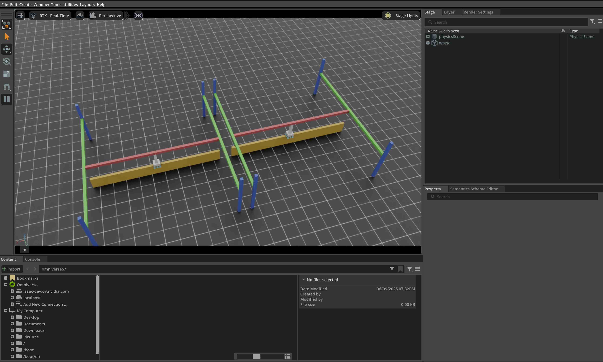

.. _tutorial-interact-surface-gripper:

与表面吸盘（surface gripper）交互
==================================

.. currentmodule:: isaaclab

本教程展示如何在仿真中与末端执行器上装有表面吸盘（surface gripper）的关节式机器人交互。
它是 :ref:`tutorial-interact-articulation` 教程的延续，在那篇教程中我们学习了如何
与关节式机器人交互。注意，自 IsaacSim 5.0 起，表面吸盘仅在 CPU
后端受支持。

代码
~~~~~~~~

本教程对应 ``scripts/tutorials/01_assets``
目录中的 ``run_surface_gripper.py`` 脚本。

.. dropdown:: Code for run_surface_gripper.py
   :icon: code

   .. literalinclude:: ../../../../scripts/tutorials/01_assets/run_surface_gripper.py
      :language: python
      :emphasize-lines: 61-85, 124-125, 128-142, 147-150
      :linenos:

代码解析
~~~~~~~~~~~~~~~~~~

设计场景
-------------------

与前面的教程类似，我们向场景中添加一个地面平面和一个远距离光。然后，我们从 USD 文件生成
一个关节体。这次生成的是一个抓放（pick-and-place）机器人。抓放机器人是一个简单的
机器人，带有 3 个驱动轴，其龙门架允许它沿 x 轴和 y 轴移动，以及沿 z 轴上下移动。
此外，机器人末端执行器上装有一个表面吸盘。
抓放机器人的 USD 文件包含机器人的几何形状、关节和其他物理属性，
以及表面吸盘。在你自己的机器人上实现类似吸盘之前，我们建议
先查看 Isaac Lab Nucleus 上该吸盘的 USD 文件。

对于抓放机器人，我们使用其预先定义的配置对象，你可以在
:ref:`how-to-write-articulation-config` 教程中了解更多。对于表面吸盘，我们还需要创建一个配置
对象。这是通过实例化一个 :class:`assets.SurfaceGripperCfg` 对象并传入相关
参数来完成的。

可用参数包括：

- ``max_grip_distance``：吸盘能够抓取物体的最大距离。
- ``shear_force_limit``：吸盘在垂直于其轴线的方向上能够施加的最大力。
- ``coaxial_force_limit``：吸盘沿其轴线方向能够施加的最大力。
- ``retry_interval``：吸盘保持抓取状态的时间。

如前面的教程所示，我们可以以类似的方式将关节体生成到场景中：通过将配置对象传递给其构造函数来
创建 :class:`assets.Articulation` 类的实例。同样的
原则也适用于表面吸盘。通过将配置对象传递给 :class:`assets.SurfaceGripper`
构造函数，表面吸盘被创建并可以添加到场景中。实际上，该对象只会在
按下播放按钮时被初始化。

.. literalinclude:: ../../../../scripts/tutorials/01_assets/run_surface_gripper.py
   :language: python
   :start-at: # Create separate groups called "Origin1", "Origin2"
   :end-at: surface_gripper = SurfaceGripper(cfg=surface_gripper_cfg)

运行仿真循环
---------------------------

延续前面的教程，我们定期重置仿真、向关节体设置命令、
步进仿真，并更新关节体的内部缓冲区。

重置仿真
""""""""""""""""""""""""

要重置表面吸盘，我们只需调用 :meth:`SurfaceGripper.reset` 方法，它会重置
内部缓冲区和缓存。

.. literalinclude:: ../../../../scripts/tutorials/01_assets/run_surface_gripper.py
   :language: python
   :start-at: # Opens the gripper and makes sure the gripper is in the open state
   :end-at: surface_gripper.reset()

步进仿真
"""""""""""""""""""""""

向表面吸盘施加命令涉及两个步骤：

1. *设置期望的命令*：这设置期望的吸盘命令（Open、Close 或 Idle）。
2. *将数据写入仿真*：根据表面吸盘的配置，该步骤将转换后的值写入 PhysX 缓冲区。

在本教程中，我们使用随机命令设置吸盘的命令。吸盘的行为如下：

- -1 < command < -0.3 --> 吸盘正在打开
- -0.3 < command < 0.3 --> 吸盘处于空闲
- 0.3 < command < 1 --> 吸盘正在闭合

在每一步中，我们随机采样命令，并通过调用
:meth:`SurfaceGripper.set_grippers_command` 方法将它们设置给吸盘。设置命令之后，我们调用
:meth:`SurfaceGripper.write_data_to_sim` 方法将数据写入 PhysX 缓冲区。最后，我们步进
仿真。

.. literalinclude:: ../../../../scripts/tutorials/01_assets/run_surface_gripper.py
   :language: python
   :start-at: # Sample a random command between -1 and 1.
   :end-at: surface_gripper.write_data_to_sim()

更新状态
""""""""""""""""""

要了解表面吸盘的当前状态，我们可以查询 :meth:`assets.SurfaceGripper.state` 属性。
该属性返回一个大小为 ``[num_envs]`` 的张量，其中每个元素为 ``-1``、``0`` 或 ``1``，
对应吸盘的状态。该属性在每次调用 :meth:`assets.SurfaceGripper.update` 方法时
更新。

- ``-1`` --> 吸盘处于打开状态
- ``0`` --> 吸盘正在闭合
- ``1`` --> 吸盘处于闭合状态

.. literalinclude:: ../../../../scripts/tutorials/01_assets/run_surface_gripper.py
   :language: python
   :start-at: # Read the gripper state from the simulation
   :end-at: surface_gripper_state = surface_gripper.state

代码执行
~~~~~~~~~~~~~~~~~~

要运行代码并查看结果，让我们从终端运行脚本：

.. code-block:: bash

   ./isaaclab.sh -p scripts/tutorials/01_assets/run_surface_gripper.py --device cpu

该命令应该会打开一个包含地面平面、灯光和两个抓放机器人的 Stage。
在终端中，你应该会看到吸盘状态和命令被打印出来。
要停止仿真，你可以关闭窗口，或在终端中按 ``Ctrl+C``。

在本教程中，我们学习了如何创建表面吸盘并与之交互。我们了解了如何设置命令以及
查询吸盘状态。我们还了解了如何更新其缓冲区以从仿真中读取最新状态。

除了本教程之外，我们还提供了另外几个生成不同机器人的脚本。它们包含在
``scripts/demos`` 目录中。你可以这样运行这些脚本：

.. code-block:: bash

   # Spawn many pick-and-place robots and perform a pick-and-place task
   ./isaaclab.sh -p scripts/demos/pick_and_place.py

注意，在实际使用中，用户应当将 :class:`assets.SurfaceGripper` 实例注册到
:class:`isaaclab.InteractiveScene` 对象中，后者会自动处理对
:meth:`assets.SurfaceGripper.write_data_to_sim` 和 :meth:`assets.SurfaceGripper.update` 方法的调用。

.. code-block:: python

   # Create a scene
   scene = InteractiveScene()

   # Register the surface gripper
   scene.surface_grippers["gripper"] = surface_gripper
