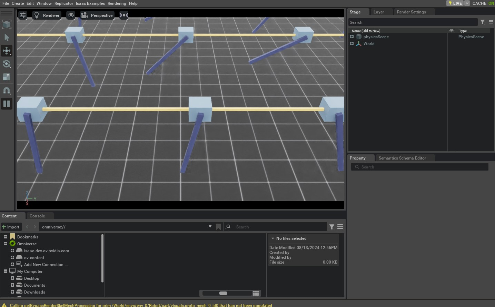

.. _tutorial-interactive-scene:

使用交互式场景
===========================

.. currentmodule:: isaaclab

到目前为止的教程中，我们都是手动将资产生成到仿真中，并创建
对象实例来与它们交互。然而，随着场景复杂度的
增加，手动执行这些任务会变得非常繁琐。在本教程中，
我们将介绍 :class:`scene.InteractiveScene` 类，它提供了一个便捷的
接口，用于在仿真中生成 prim 并管理它们。

从较高层面看，交互式场景是场景实体的集合。每个实体
可以是非交互式 prim（例如地面平面、光源）、交互式
prim（例如关节体、刚体），或传感器（例如相机、激光雷达）。交互式
场景为在仿真中生成这些实体并管理它们提供了便捷的
接口。

与手动方式相比，它提供以下好处：

* 减轻了用户需要逐个生成资产的负担，因为这是隐式处理的。
* 支持以用户友好的方式克隆场景 prim 以用于多个环境。
* 将所有场景实体收集到单个对象中，使它们更易于管理。

在本教程中，我们采用 :ref:`tutorial-interact-articulation`
教程中的 cartpole 示例，并将 ``design_scene`` 函数替换为 :class:`scene.InteractiveScene` 对象。
虽然在这个简单示例中使用交互式场景可能显得有些小题大做，但随着更多资产和传感器被添加到场景中，
它将在未来变得更有用。

代码
~~~~~~~~

本教程对应
``scripts/tutorials/02_scene`` 中的 ``create_scene.py`` 脚本。

.. dropdown:: Code for create_scene.py
   :icon: code

   .. literalinclude:: ../../../../scripts/tutorials/02_scene/create_scene.py
      :language: python
      :emphasize-lines: 50-63, 68-70, 91-92, 99-100, 105-106, 116-118
      :linenos:

代码解析
~~~~~~~~~~~~~~~~~~

虽然代码与前面的教程类似，但有几个关键区别
我们将详细介绍。

场景配置
-------------------

场景由一组实体组成，每个实体都有自己的配置。
这些配置在一个继承自 :class:`scene.InteractiveSceneCfg` 的配置类中指定。
然后将该配置类传递给 :class:`scene.InteractiveScene` 构造函数
来创建场景。

对于 cartpole 示例，我们指定与前面教程相同的场景，但现在将它们
列在配置类 :class:`CartpoleSceneCfg` 中，而不是手动生成。

.. literalinclude:: ../../../../scripts/tutorials/02_scene/create_scene.py
   :language: python
   :pyobject: CartpoleSceneCfg

配置类中的变量名用作键，用于从 :class:`scene.InteractiveScene` 对象访问相应的
实体。例如，可以通过 ``scene["cartpole"]`` 访问 cartpole。不过，我们稍后会讲到这一点。首先，让我们
看看各个场景实体是如何配置的。

与前面教程中配置刚体和关节体的方式类似，
这些配置使用配置类来指定。但地面平面和光源的
配置与
cartpole 的配置之间存在一个关键区别。地面平面和光源是非交互式
prim，而 cartpole 是交互式 prim。这一区别反映在用于指定它们的
配置类中。地面平面和
光源的配置使用 :class:`assets.AssetBaseCfg` 类的实例来指定，而 cartpole 则使用 :class:`assets.ArticulationCfg` 的实例进行配置。
任何不是交互式 prim 的东西（即既不是资产也不是传感器）在仿真步进中都不会被场景
*处理*。

需要注意的另一个关键区别是不同 prim 的 prim 路径的
指定方式：

* Ground plane: ``/World/defaultGroundPlane``
* Light source: ``/World/Light``
* Cartpole: ``{ENV_REGEX_NS}/Robot``

正如我们之前了解到的，Omniverse 会在 USD Stage 中创建一个 prim 图。prim
路径用于指定 prim 在该图中的位置。地面平面和
光源使用绝对路径指定，而 cartpole 使用
相对路径指定。相对路径使用 ``ENV_REGEX_NS`` 变量指定，
它是一个特殊变量，在场景创建期间会被替换为环境名称。
任何 prim 路径中包含 ``ENV_REGEX_NS`` 变量的实体都会为每个
环境进行克隆。场景对象会将该路径替换为 ``/World/envs/env_{i}``，其中
``i`` 是环境索引。

场景实例化
-------------------

与之前调用 ``design_scene`` 函数创建场景不同，我们现在
创建 :class:`scene.InteractiveScene` 类的一个实例，并将配置
对象传递给其构造函数。在创建 ``CartpoleSceneCfg`` 的配置实例时，
我们使用 ``num_envs`` 参数指定要创建多少个环境副本。
它将用于为每个环境克隆场景。

.. literalinclude:: ../../../../scripts/tutorials/02_scene/create_scene.py
   :language: python
   :start-at: # Design scene
   :end-at: scene = InteractiveScene(scene_cfg)

访问场景元素
------------------------

与前面教程中从字典访问实体的方式类似，可以使用
``[]`` 运算符从 :class:`InteractiveScene` 对象访问场景元素。该运算符接受一个字符串键并返回相应的
实体。键是在配置类中为每个实体指定的。例如，
cartpole 在配置类中使用键 ``"cartpole"`` 指定。

.. literalinclude:: ../../../../scripts/tutorials/02_scene/create_scene.py
   :language: python
   :start-at: # Extract scene entities
   :end-at: robot = scene["cartpole"]

运行仿真循环
---------------------------

脚本的其余部分看起来与之前与 :class:`assets.Articulation` 交互的脚本类似，
只是调用的方法有几点小差异：

* :meth:`assets.Articulation.reset` ⟶ :meth:`scene.InteractiveScene.reset`
* :meth:`assets.Articulation.write_data_to_sim` ⟶ :meth:`scene.InteractiveScene.write_data_to_sim`
* :meth:`assets.Articulation.update` ⟶ :meth:`scene.InteractiveScene.update`

在底层，:class:`scene.InteractiveScene` 的方法会调用场景中实体对应的
方法。

代码执行
~~~~~~~~~~~~~~~~~~

让我们运行脚本，在场景中仿真 32 个 cartpole。我们可以通过向脚本传递
``--num_envs`` 参数来做到这一点。

.. code-block:: bash

   ./isaaclab.sh -p scripts/tutorials/02_scene/create_scene.py --num_envs 32

这应该会打开一个包含 32 个随机摆动的 cartpole 的 Stage。你可以使用
鼠标旋转相机，使用方向键在场景中移动。

在本教程中，我们了解了如何使用 :class:`scene.InteractiveScene` 创建一个
包含多个资产的场景。我们还了解了如何使用 ``num_envs`` 参数
为多个环境克隆场景。

在 ``isaaclab_tasks`` 扩展下的任务中，还有更多 :class:`scene.InteractiveSceneCfg` 的使用示例。请查看源代码，
了解它们如何用于更复杂的场景。
