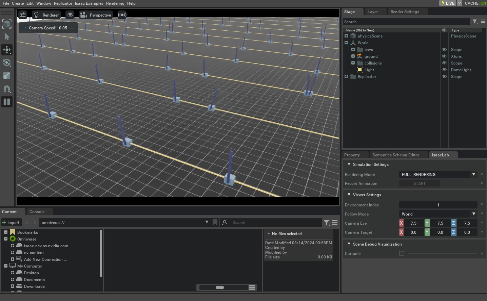

.. _tutorial-create-direct-rl-env:

创建直接式工作流强化学习环境
=========================================

.. currentmodule:: isaaclab

除了鼓励使用配置类来构建更模块化环境的 :class:`envs.ManagerBasedRLEnv` 类之外，
:class:`~isaaclab.envs.DirectRLEnv` 类还允许在编写环境脚本时进行更直接的
控制。

直接式工作流任务不使用管理器类来定义奖励和观测，而是
在任务脚本中直接实现完整的奖励和观测函数。
这为方法实现提供了更多控制（例如使用 PyTorch JIT
特性），并提供了一个抽象程度更低的框架，使用户更容易找到
各种代码片段。

在本教程中，我们将使用直接式工作流实现来配置 cartpole 环境，创建一个将杆保持直立平衡的任务。
我们将学习如何通过实现场景创建、动作、重置、奖励和观测的函数
来指定任务。

代码
~~~~~~~~

在本教程中，我们使用 ``isaaclab_tasks.direct.cartpole`` 模块中定义的 cartpole 环境。

.. dropdown:: Code for cartpole_env.py
   :icon: code

   .. literalinclude:: ../../../../source/isaaclab_tasks/isaaclab_tasks/direct/cartpole/cartpole_env.py
      :language: python
      :linenos:

代码解析
~~~~~~~~~~~~~~~~~~

与管理器式环境类似，需要为任务定义一个配置类，用于保存仿真参数、场景、执行体（actor）和任务的
设置。在直接式工作流实现中，
使用 :class:`envs.DirectRLEnvCfg` 类作为配置的基类。
由于直接式工作流实现不使用动作和观测管理器，任务
配置应定义环境的动作和观测数量。

.. code-block:: python

   @configclass
   class CartpoleEnvCfg(DirectRLEnvCfg):
      ...
      action_space = 1
      observation_space = 4
      state_space = 0

配置类还可以用于定义任务专属的属性，例如奖励项的缩放系数
和重置条件的阈值。

.. code-block:: python

   @configclass
   class CartpoleEnvCfg(DirectRLEnvCfg):
      ...
      # reset
      max_cart_pos = 3.0
      initial_pole_angle_range = [-0.25, 0.25]

      # reward scales
      rew_scale_alive = 1.0
      rew_scale_terminated = -2.0
      rew_scale_pole_pos = -1.0
      rew_scale_cart_vel = -0.01
      rew_scale_pole_vel = -0.005

创建新环境时，代码应定义一个继承自 :class:`~isaaclab.envs.DirectRLEnv` 的新类。

.. code-block:: python

   class CartpoleEnv(DirectRLEnv):
      cfg: CartpoleEnvCfg

      def __init__(self, cfg: CartpoleEnvCfg, render_mode: str | None = None, **kwargs):
        super().__init__(cfg, render_mode, **kwargs)

该类还可以持有可被类中所有函数访问的类变量，
包括施加动作、计算重置、奖励和观测的函数。

场景创建
--------------

与管理器式环境（场景创建由框架负责）不同，
直接式工作流实现为用户提供了实现自己的场景创建
函数的灵活性。这包括将执行体添加到 Stage、克隆环境、过滤
环境之间的碰撞、将执行体添加到场景，以及向场景添加任何额外的道具，
例如地面平面和灯光。这些操作应在
``_setup_scene(self)`` 方法中实现。

.. literalinclude:: ../../../../source/isaaclab_tasks/isaaclab_tasks/direct/cartpole/cartpole_env.py
   :language: python
   :pyobject: CartpoleEnv._setup_scene

定义奖励
----------------

奖励函数应在 ``_get_rewards(self)`` API 中定义，它将奖励
缓冲区作为返回值返回。在该函数中，任务可以自由实现
奖励函数的逻辑。在本示例中，我们实现了一个 PyTorch JIT 函数来计算
奖励函数的各个分量。

.. code-block:: python

   def _get_rewards(self) -> torch.Tensor:
        total_reward = compute_rewards(
            self.cfg.rew_scale_alive,
            self.cfg.rew_scale_terminated,
            self.cfg.rew_scale_pole_pos,
            self.cfg.rew_scale_cart_vel,
            self.cfg.rew_scale_pole_vel,
            self.joint_pos[:, self._pole_dof_idx[0]],
            self.joint_vel[:, self._pole_dof_idx[0]],
            self.joint_pos[:, self._cart_dof_idx[0]],
            self.joint_vel[:, self._cart_dof_idx[0]],
            self.reset_terminated,
        )
        return total_reward

   @torch.jit.script
   def compute_rewards(
       rew_scale_alive: float,
       rew_scale_terminated: float,
       rew_scale_pole_pos: float,
       rew_scale_cart_vel: float,
       rew_scale_pole_vel: float,
       pole_pos: torch.Tensor,
       pole_vel: torch.Tensor,
       cart_pos: torch.Tensor,
       cart_vel: torch.Tensor,
       reset_terminated: torch.Tensor,
   ):
       rew_alive = rew_scale_alive * (1.0 - reset_terminated.float())
       rew_termination = rew_scale_terminated * reset_terminated.float()
       rew_pole_pos = rew_scale_pole_pos * torch.sum(torch.square(pole_pos), dim=-1)
       rew_cart_vel = rew_scale_cart_vel * torch.sum(torch.abs(cart_vel), dim=-1)
       rew_pole_vel = rew_scale_pole_vel * torch.sum(torch.abs(pole_vel), dim=-1)
       total_reward = rew_alive + rew_termination + rew_pole_pos + rew_cart_vel + rew_pole_vel
       return total_reward

定义观测
---------------------

观测缓冲区应在 ``_get_observations(self)`` 函数中计算，
该函数为环境构建观测缓冲区。在此 API 的末尾，应返回一个字典，其中包含
键 ``policy``，以及作为值的完整观测缓冲区。对于非对称策略，该字典还应
包含键 ``critic``，以及作为值的状态缓冲区。

.. literalinclude:: ../../../../source/isaaclab_tasks/isaaclab_tasks/direct/cartpole/cartpole_env.py
   :language: python
   :pyobject: CartpoleEnv._get_observations

计算 Dones 并执行重置
-------------------------------------

填充 ``dones`` 缓冲区应在 ``_get_dones(self)`` 方法中完成。
该方法可以自由实现计算哪些环境需要重置以及哪些环境已达到回合长度上限的逻辑。
两个结果都应由 ``_get_dones(self)`` 函数以布尔张量元组的形式
返回。

.. literalinclude:: ../../../../source/isaaclab_tasks/isaaclab_tasks/direct/cartpole/cartpole_env.py
   :language: python
   :pyobject: CartpoleEnv._get_dones

在计算出需要重置的环境索引之后，``_reset_idx(self, env_ids)``
函数对这些环境执行重置操作。在该函数中，需要重置的环境的新状态应直接
写入仿真。

.. literalinclude:: ../../../../source/isaaclab_tasks/isaaclab_tasks/direct/cartpole/cartpole_env.py
   :language: python
   :pyobject: CartpoleEnv._reset_idx

施加动作
----------------

有两个专为处理动作设计的 API。``_pre_physics_step(self, actions)`` 接受来自策略的
动作作为参数，并在执行任何物理步进之前每个 RL 步调用一次。该函数可用于
处理来自策略的动作缓冲区，并将数据缓存到环境的类变量中。

.. literalinclude:: ../../../../source/isaaclab_tasks/isaaclab_tasks/direct/cartpole/cartpole_env.py
   :language: python
   :pyobject: CartpoleEnv._pre_physics_step

``_apply_action(self)`` API 在每个 RL 步中、每次物理步进之前被调用 ``decimation`` 次。
这为需要在每个物理步上
施加动作的环境提供了更多灵活性。

.. literalinclude:: ../../../../source/isaaclab_tasks/isaaclab_tasks/direct/cartpole/cartpole_env.py
   :language: python
   :pyobject: CartpoleEnv._apply_action

代码执行
~~~~~~~~~~~~~~~~~~

要运行为直接式工作流 Cartpole 环境进行训练，可以使用以下命令：

.. code-block:: bash

   ./isaaclab.sh -p scripts/reinforcement_learning/rl_games/train.py --task=Isaac-Cartpole-Direct-v0

所有直接式工作流任务的名称末尾都添加了后缀 ``-Direct``，以区分实现风格。

域随机化
~~~~~~~~~~~~~~~~~~~~

在直接式工作流中，域随机化配置使用 :class:`~isaaclab.utils.configclass` 模块
指定一个由 :class:`~managers.EventTermCfg` 变量组成的配置类。

下面是一个域随机化配置类的示例：

.. code-block:: python

  @configclass
  class EventCfg:
    robot_physics_material = EventTerm(
        func=mdp.randomize_rigid_body_material,
        mode="reset",
        params={
            "asset_cfg": SceneEntityCfg("robot", body_names=".*"),
            "static_friction_range": (0.7, 1.3),
            "dynamic_friction_range": (1.0, 1.0),
            "restitution_range": (1.0, 1.0),
            "num_buckets": 250,
        },
    )
    robot_joint_stiffness_and_damping = EventTerm(
        func=mdp.randomize_actuator_gains,
        mode="reset",
        params={
            "asset_cfg": SceneEntityCfg("robot", joint_names=".*"),
            "stiffness_distribution_params": (0.75, 1.5),
            "damping_distribution_params": (0.3, 3.0),
            "operation": "scale",
            "distribution": "log_uniform",
        },
    )
    reset_gravity = EventTerm(
        func=mdp.randomize_physics_scene_gravity,
        mode="interval",
        is_global_time=True,
        interval_range_s=(36.0, 36.0),  # time_s = num_steps * (decimation * dt)
        params={
            "gravity_distribution_params": ([0.0, 0.0, 0.0], [0.0, 0.0, 0.4]),
            "operation": "add",
            "distribution": "gaussian",
        },
    )

每个 ``EventTerm`` 对象都属于 :class:`~managers.EventTermCfg` 类，接受一个 ``func`` 参数
用于指定随机化期间要调用的函数，以及一个 ``mode`` 参数，它可以是 ``startup``、
``reset`` 或 ``interval``。``params`` 字典应提供 ``func`` 参数中指定的
函数所需的参数。
可以在 :class:`~envs.mdp.events` 模块中找到作为 ``EventTerm`` 的 ``func`` 指定的函数。

注意，在 ``"asset_cfg": SceneEntityCfg("robot", body_names=".*")`` 参数中，提供了
执行体名称 ``"robot"``，以及以正则表达式形式指定的刚体或关节名称，
这些将是应用随机化的执行体和刚体/关节。

设置好随机化项的 ``configclass`` 之后，必须将该类
添加到任务的基础配置类中，并赋值给变量 ``events``。

.. code-block:: python

  @configclass
  class MyTaskConfig:
    events: EventCfg = EventCfg()

动作与观测噪声
----------------------------

也可以使用 :class:`~utils.configclass` 模块添加动作和观测噪声。
动作和观测噪声配置必须使用
``action_noise_model`` 和 ``observation_noise_model`` 变量添加到主任务配置中：

.. code-block:: python

  @configclass
  class MyTaskConfig:

      # at every time-step add gaussian noise + bias. The bias is a gaussian sampled at reset
      action_noise_model: NoiseModelWithAdditiveBiasCfg = NoiseModelWithAdditiveBiasCfg(
        noise_cfg=GaussianNoiseCfg(mean=0.0, std=0.05, operation="add"),
        bias_noise_cfg=GaussianNoiseCfg(mean=0.0, std=0.015, operation="abs"),
      )

      # at every time-step add gaussian noise + bias. The bias is a gaussian sampled at reset
      observation_noise_model: NoiseModelWithAdditiveBiasCfg = NoiseModelWithAdditiveBiasCfg(
        noise_cfg=GaussianNoiseCfg(mean=0.0, std=0.002, operation="add"),
        bias_noise_cfg=GaussianNoiseCfg(mean=0.0, std=0.0001, operation="abs"),
      )

:class:`~.utils.noise.NoiseModelWithAdditiveBiasCfg` 既可用于采样每步独立的
非相关噪声，也可用于在重置时重新采样的相关噪声。

``noise_cfg`` 项指定高斯分布，它将在每一步为所有环境采样。
该噪声将在每一步被添加到相应的动作和
观测缓冲区中。

``bias_noise_cfg`` 项指定相关噪声的高斯分布，
它将在重置时为被重置的环境采样。相同的噪声
将在该回合剩余部分中每一步应用于这些环境，并在下一次重置时重新采样。

如果只需要每步噪声，可以使用 :class:`~utils.noise.GaussianNoiseCfg`
指定一个加性高斯分布，将采样得到的噪声加到输入缓冲区。

.. code-block:: python

  @configclass
  class MyTaskConfig:
    action_noise_model: GaussianNoiseCfg = GaussianNoiseCfg(mean=0.0, std=0.05, operation="add")

在本教程中，我们学习了如何为强化学习创建直接式工作流任务环境。我们通过
扩展基础环境来加入场景搭建、动作、dones、重置、奖励和观测函数来完成这一工作。

虽然可以手动为期望的任务创建 :class:`~isaaclab.envs.DirectRLEnv` 类的实例，
但这不具备可扩展性，因为它需要为每个任务编写专门的脚本。因此，我们利用
:meth:`gymnasium.make` 函数通过 gym 接口创建环境。我们将在下一篇教程中学习
如何做到这一点。
