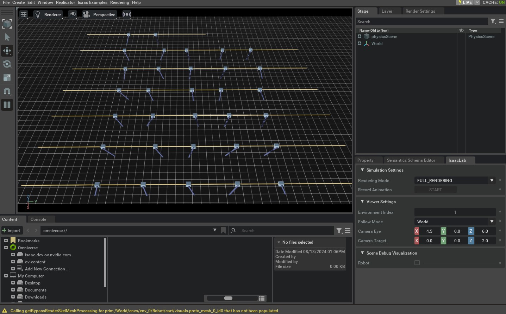

.. _tutorial-create-manager-base-env:

创建管理器式基础环境
=========================================

.. currentmodule:: isaaclab

环境将仿真的不同方面（例如
场景、观测与动作空间、重置事件等）整合在一起，为各种应用提供一个
连贯的接口。在 Isaac Lab 中，管理器式环境通过 :class:`envs.ManagerBasedEnv` 和 :class:`envs.ManagerBasedRLEnv` 类实现。
这两个类非常相似，但 :class:`envs.ManagerBasedRLEnv` 适用于
强化学习任务，包含奖励、终止、课程
和命令生成。:class:`envs.ManagerBasedEnv` 类适用于
传统机器人控制，不包含奖励和终止。

在本教程中，我们将介绍管理器式工作流的基类 :class:`envs.ManagerBasedEnv` 及其
对应的配置类 :class:`envs.ManagerBasedEnvCfg`。
我们将使用
之前的 cartpole 环境来说明创建新 :class:`envs.ManagerBasedEnv` 环境的各个组成部分。

代码
~~~~~~~~

本教程对应 ``scripts/tutorials/03_envs``
目录中的 ``create_cartpole_base_env`` 脚本。

.. dropdown:: Code for create_cartpole_base_env.py
   :icon: code

   .. literalinclude:: ../../../../scripts/tutorials/03_envs/create_cartpole_base_env.py
      :language: python
      :emphasize-lines: 47-51, 54-71, 74-108, 111-130, 135-139, 144, 148, 153-154, 160-161
      :linenos:

代码解析
~~~~~~~~~~~~~~~~~~

基类 :class:`envs.ManagerBasedEnv` 封装了仿真交互中的许多复杂细节，
为用户运行仿真并与之交互提供了简单的接口。它
由以下组件构成：

* :class:`scene.InteractiveScene` - 用于仿真的场景。
* :class:`managers.ActionManager` - 处理动作的管理器。
* :class:`managers.ObservationManager` - 处理观测的管理器。
* :class:`managers.EventManager` - 在指定的仿真事件（例如启动时、重置时或周期性间隔）调度操作（例如域随机化）的管理器。

通过配置这些组件，用户可以用最少的努力创建同一环境的不同变体。在本教程中，我们将遍历
:class:`envs.ManagerBasedEnv` 类的各个组件，以及如何配置它们来创建新环境。

设计场景
-------------------

创建新环境的第一步是配置其场景。对于 cartpole
环境，我们将使用前面教程中的场景。因此，这里省略
场景配置。有关如何配置场景的更多细节，请参阅
:ref:`tutorial-interactive-scene`。

定义动作
----------------

在前面的教程中，我们通过
:meth:`assets.Articulation.set_joint_effort_target` 方法直接将动作输入 cartpole。在本教程中，我们将
使用 :class:`managers.ActionManager` 来处理动作。

动作管理器可以由多个 :class:`managers.ActionTerm` 组成。每个动作项负责对环境的特定方面施加 *控制*。例如，
对于机械臂，我们可以有两个动作项——一个用于控制机械臂的关节，
另一个用于控制夹持器。这种组合方式允许用户为环境的不同方面定义
不同的控制方案。

在 cartpole 环境中，我们想控制施加到小车上的力来平衡杆。
因此，我们将创建一个动作项来控制施加到小车上的力。

.. literalinclude:: ../../../../scripts/tutorials/03_envs/create_cartpole_base_env.py
   :language: python
   :pyobject: ActionsCfg

定义观测
---------------------

场景定义了环境的状态，而观测则定义了智能体可观察到的状态。智能体使用这些观测来决定
采取什么动作。在 Isaac Lab 中，观测由
:class:`managers.ObservationManager` 类计算。

与动作管理器类似，观测管理器可以由多个观测项组成。
这些观测项进一步分组成观测组（observation group），用于为环境定义不同的观测
空间。例如，对于分层控制，我们可能想定义
两个观测组——一个用于底层控制器，另一个用于高层
控制器。假定同一组中的所有观测项具有相同的维度。

在本教程中，我们只定义一个名为 ``"policy"`` 的观测组。虽然并非硬性规定，
但该组是 Isaac Lab 中各种 wrapper 的必要要求。
我们通过继承 :class:`managers.ObservationGroupCfg` 类来定义一个组。该类
收集不同的观测项，并帮助为该组定义公共属性，例如
启用噪声污染或将观测拼接成单个张量。

各个观测项通过继承 :class:`managers.ObservationTermCfg` 类来定义。
该类接受 :attr:`managers.ObservationTermCfg.func`，用于指定为该项计算观测的函数或
可调用类。它还包括用于定义噪声模型、裁剪、缩放等的其他参数。但在本教程中，我们将这些参数保持为
默认值。

.. literalinclude:: ../../../../scripts/tutorials/03_envs/create_cartpole_base_env.py
   :language: python
   :pyobject: ObservationsCfg

定义事件
---------------

至此，我们已经为 cartpole 环境定义了场景、动作和观测。
所有这些组件的通用思路都是定义配置类，然后
将它们传递给相应的管理器。事件管理器也不例外。

:class:`managers.EventManager` 类负责与仿真状态变化对应的
事件。这包括重置（或随机化）场景、随机化物理
属性（例如质量、摩擦等）以及改变视觉属性（例如颜色、纹理等）。
每一项都通过 :class:`managers.EventTermCfg` 类指定，该类
接受 :attr:`managers.EventTermCfg.func`，用于指定执行该事件的函数或可调用
类。

此外，它还需要事件的 **模式（mode）**。模式指定事件项应在何时应用。
你可以指定自己的模式。为此，你需要修改 :class:`~envs.ManagerBasedEnv` 类。
不过，开箱即用，Isaac Lab 提供了三种常用模式：

* ``"startup"`` - 仅在环境启动时发生一次的事件。
* ``"reset"`` - 在环境终止和重置时发生的事件。
* ``"interval"`` - 以给定间隔执行的事件，即在一定步数之后周期性执行。

在本示例中，我们定义在启动时随机化杆质量的事件。这只执行一次，因为该
操作开销较大，我们不想在每次重置时都执行。我们还创建了一个在每次重置时随机化
cartpole 初始关节状态和杆初始状态的事件。

.. literalinclude:: ../../../../scripts/tutorials/03_envs/create_cartpole_base_env.py
   :language: python
   :pyobject: EventCfg

整合在一起
---------------------

定义好场景和管理器配置之后，我们现在可以通过 :class:`envs.ManagerBasedEnvCfg` 类定义环境配置。
该类接受场景、动作、观测和
事件配置。

除此之外，它还接受 :attr:`envs.ManagerBasedEnvCfg.sim`，用于定义仿真
参数（例如时间步、重力等）。它被初始化为默认值，但可以
根据需要修改。我们建议通过在
:class:`envs.ManagerBasedEnvCfg` 类中定义 :meth:`__post_init__` 方法来实现，该方法在配置初始化之后被调用。

.. literalinclude:: ../../../../scripts/tutorials/03_envs/create_cartpole_base_env.py
   :language: python
   :pyobject: CartpoleEnvCfg

运行仿真
----------------------

最后，我们重新审视仿真执行循环。现在这简单多了，因为我们已经
将大部分细节抽象到了环境配置中。我们只需
调用 :meth:`envs.ManagerBasedEnv.reset` 方法来重置环境，调用 :meth:`envs.ManagerBasedEnv.step`
方法来步进环境。这两个函数都返回观测和一个 info 字典，
后者可能包含环境提供的附加信息。智能体可以利用它们
进行决策。

:class:`envs.ManagerBasedEnv` 类没有任何终止概念，因为该概念是回合型任务特有的。
因此，用户需要自行定义环境的终止条件。在本教程中，我们定期重置仿真。

.. literalinclude:: ../../../../scripts/tutorials/03_envs/create_cartpole_base_env.py
   :language: python
   :pyobject: main

上面需要注意的一个重要事项是，整个仿真循环被包裹在
:meth:`torch.inference_mode` 上下文管理器中。这是因为环境在底层使用 PyTorch
操作，我们要确保仿真不会因 PyTorch 自动求导引擎的开销而变慢，并且不会为仿真
操作计算梯度。

代码执行
~~~~~~~~~~~~~~~~~~

要运行本教程创建的基础环境，可以使用以下命令：

.. code-block:: bash

   ./isaaclab.sh -p scripts/tutorials/03_envs/create_cartpole_base_env.py --num_envs 32

这应该会打开一个包含地面平面、光源和 cartpole 的 Stage。仿真应当
正在以随机动作驱动 cartpole。此外，它还会在屏幕右下角打开一个名为 ``"Isaac Lab"`` 的 UI 窗口。
该窗口包含不同的 UI 元素，
可用于调试和可视化。

要停止仿真，你可以关闭窗口，或在启动仿真的
终端中按 ``Ctrl+C``。

在本教程中，我们学习了帮助定义基础环境的各种管理器。我们在
``scripts/tutorials/03_envs``
目录中包含更多定义基础环境的示例。为完整起见，可以使用以下命令运行它们：

.. code-block:: bash

   # Floating cube environment with custom action term for PD control
   ./isaaclab.sh -p scripts/tutorials/03_envs/create_cube_base_env.py --num_envs 32

   # Quadrupedal locomotion environment with a policy that interacts with the environment
   ./isaaclab.sh -p scripts/tutorials/03_envs/create_quadruped_base_env.py --num_envs 32

在下一篇教程中，我们将介绍 :class:`envs.ManagerBasedRLEnv` 类，以及如何使用它
创建马尔可夫决策过程（MDP）。
