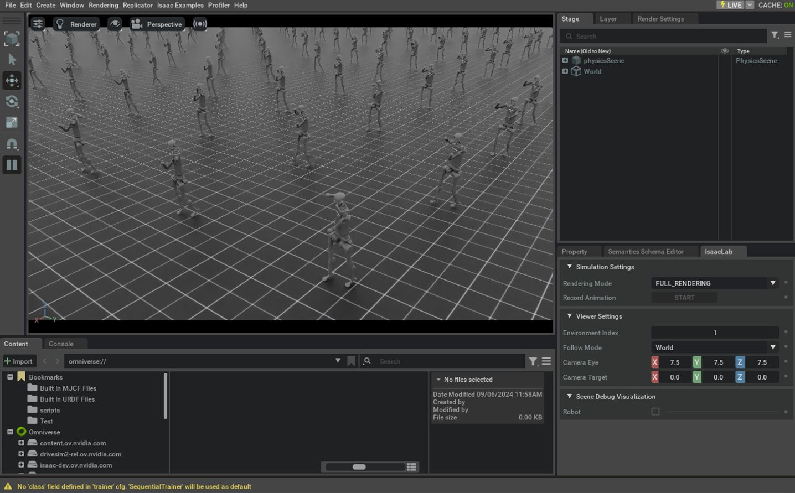

.. _tutorial-modify-direct-rl-env:

修改现有的直接式强化学习环境
===========================================

.. currentmodule:: isaaclab

在 :ref:`tutorial-create-direct-rl-env` 中学习了如何创建任务、在 :ref:`tutorial-register-rl-env-gym` 中注册任务，
以及在 :ref:`tutorial-run-rl-training` 中训练任务之后，我们现在来看看如何对现有任务进行少量修改。

有时，由于复杂程度或与现有示例的差异，必须从零开始创建任务。然而，在某些情况下，
可以从现有代码出发，逐一引入少量修改，按照我们的需求对它们进行改造。

在本教程中，我们将对直接式工作流的 Humanoid 任务进行少量修改，在不影响原始代码的情况下
将简单的人形模型更换为 Unitree H1 人形机器人。

基础代码
~~~~~~~~~~~~~

在本教程中，我们从 ``isaaclab_tasks.direct.humanoid`` 模块中定义的直接式工作流 Humanoid 环境出发。

.. dropdown:: Code for humanoid_env.py
   :icon: code

   .. literalinclude:: ../../../../source/isaaclab_tasks/isaaclab_tasks/direct/humanoid/humanoid_env.py
      :language: python
      :linenos:

修改说明
~~~~~~~~~~~~~~~~~~~~~

复制文件并注册新任务
-----------------------------------------------

为避免修改现有任务的代码，我们将复制包含 Python
代码的文件，并在副本上进行修改。然后，在 Isaac Lab 项目
``source/isaaclab_tasks/isaaclab_tasks/direct/humanoid``
文件夹中，我们复制 ``humanoid_env.py`` 文件并将其重命名为 ``h1_env.py``。

在代码编辑器中打开 ``h1_env.py`` 文件，将所有人形任务名称（``HumanoidEnv``）及其配置
（``HumanoidEnvCfg``）实例分别替换为 ``H1Env`` 和 ``H1EnvCfg``。
这样做是为了避免在注册环境导入时发生名称冲突。

完成名称修改后，我们接着添加一个新条目，以名称 ``Isaac-H1-Direct-v0`` 注册任务。
为此，我们修改同一工作文件夹中的 ``__init__.py`` 文件，并添加以下条目。
有关环境注册的更多细节，请参阅 :ref:`tutorial-register-rl-env-gym` 教程。

.. hint::

   如果对任务的改动很小，很可能相同的强化学习库智能体配置就能成功地训练它。
   否则，建议创建新的配置文件（并在注册时于 ``kwargs`` 参数下调整其名称），
   以避免改动原始配置。

.. literalinclude:: ../../refs/snippets/tutorial_modify_direct_rl_env.py
   :language: python
   :start-after: [start-init-import]
   :end-before: [end-init-import]

.. literalinclude:: ../../refs/snippets/tutorial_modify_direct_rl_env.py
   :language: python
   :start-after: [start-init-register]
   :end-before: [end-init-register]

更换机器人
------------------

``H1EnvCfg`` 类（在新创建的 ``h1_env.py`` 文件中）封装了环境的配置值，
包括要实例化的资产。特别是在本示例中，``robot`` 属性保存目标关节体的配置。

由于 Unitree H1 机器人包含在 Isaac Lab 资产扩展（``isaaclab_assets``）中，我们可以直接导入它
并进行替换（在 ``H1EnvCfg.robot`` 属性下），如下所示。注意，我们还需要修改
``joint_gears`` 属性，因为它保存了机器人专属的配置值。

.. |franka-direct-link| replace:: `Isaac-Franka-Cabinet-Direct-v0 <https://github.com/isaac-sim/IsaacLab/blob/main/source/isaaclab_tasks/isaaclab_tasks/direct/franka_cabinet/franka_cabinet_env.py>`__

.. hint::

   如果目标机器人未包含在 Isaac Lab 资产扩展中，则可以通过 USD 文件加载并配置它，
   使用 :class:`~isaaclab.assets.ArticulationCfg` 类即可。

   * 加载和配置来自 USD 文件的机器人的示例，请参阅 |franka-direct-link| 的源代码。
   * 有关如何从 URDF 或 MJCF 文件及其他格式导入资产的详细信息，请参阅 `Importing a New Asset <../../how-to/import_new_asset.html>`_ 教程。

.. literalinclude:: ../../refs/snippets/tutorial_modify_direct_rl_env.py
   :language: python
   :start-after: [start-h1_env-import]
   :end-before: [end-h1_env-import]

.. literalinclude:: ../../refs/snippets/tutorial_modify_direct_rl_env.py
   :language: python
   :start-after: [start-h1_env-robot]
   :end-before: [end-h1_env-robot]

机器人更换之后，随之改变的还有需要控制的关节数量或组成关节体的刚体数量等。
因此，还需要调整环境配置中依赖机器人特性的其他数值，
例如观测空间和动作空间中的元素数量。

.. literalinclude:: ../../refs/snippets/tutorial_modify_direct_rl_env.py
   :language: python
   :start-after: [start-h1_env-spaces]
   :end-before: [end-h1_env-spaces]

代码执行
~~~~~~~~~~~~~~~~~~

完成少量修改之后，与前一篇教程类似，我们可以使用该任务可用的某种强化学习工作流进行训练。

.. code-block:: bash

  ./isaaclab.sh -p scripts/reinforcement_learning/rl_games/train.py --task Isaac-H1-Direct-v0 --headless

训练完成后，我们可以使用以下命令可视化结果。
要停止仿真，你可以关闭窗口，或在启动仿真的终端中
按 ``Ctrl+C``。

.. code-block:: bash

  ./isaaclab.sh -p scripts/reinforcement_learning/rl_games/play.py --task Isaac-H1-Direct-v0 --num_envs 64

在本教程中，我们学习了如何在不影响原始代码的情况下对现有环境进行少量修改。

不过需要注意的是，虽然要做的改动可能很小，但它们不一定能在第一次尝试时奏效，
因为被修改的环境中可能存在对原始资产的更深层次的依赖。
在这些情况下，建议仔细分析可用示例的代码，以便做出适当的调整。
