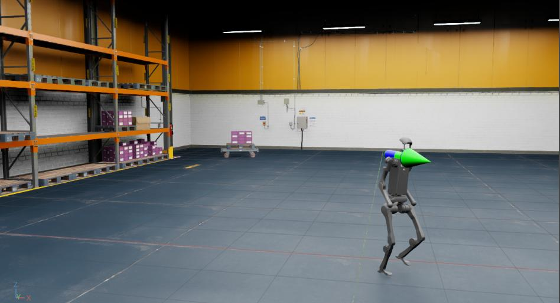

.. _tutorial-policy-inference-in-usd:

在 USD 环境中运行策略推理
===================================

.. currentmodule:: isaaclab

在 :ref:`tutorial-modify-direct-rl-env` 中学习了如何修改任务之后，我们现在来看看如何在预构建的 USD 场景中运行训练好的策略。

在本教程中，我们将使用 RSL RL 库以及 Humanoid Rough Terrain ``Isaac-Velocity-Rough-H1-v0`` 任务中训练好的策略，在一个简单的仓库 USD 场景中运行。

教程代码
~~~~~~~~~~~~~~~~~

在本教程中，我们使用以 jit 格式导出的训练好的策略检查点（jit 是策略的离线版本）。

``H1RoughEnvCfg_PLAY`` 配置封装了推理环境的配置值，包括要
实例化的资产。

为了使用预构建的 USD 环境而不是指定的地形生成器，我们在将配置传递给 ``ManagerBasedRLEnv`` 之前对配置进行
以下修改。

.. dropdown:: Code for policy_inference_in_usd.py
   :icon: code

   .. literalinclude:: ../../../../scripts/tutorials/03_envs/policy_inference_in_usd.py
      :language: python
      :linenos:
      :emphasize-lines: 60-69

注意，我们将设备设置为 ``CPU`` 并禁用了 Fabric 以进行推理。
这是因为当仿真少量环境时，CPU 仿真通常比 GPU 仿真运行得更快。

代码执行
~~~~~~~~~~~~~~~~~~

首先，我们需要通过运行以下命令来训练 ``Isaac-Velocity-Rough-H1-v0`` 任务：

.. code-block:: bash

  ./isaaclab.sh -p scripts/reinforcement_learning/rsl_rl/train.py --task Isaac-Velocity-Rough-H1-v0 --headless

训练完成后，我们可以使用以下命令可视化结果。
要停止仿真，你可以关闭窗口，或在启动仿真的终端中
按 ``Ctrl+C``。

.. code-block:: bash

  ./isaaclab.sh -p scripts/reinforcement_learning/rsl_rl/play.py --task Isaac-Velocity-Rough-H1-v0 --num_envs 64 --checkpoint logs/rsl_rl/h1_rough/EXPERIMENT_NAME/POLICY_FILE.pt

运行 play 脚本之后，策略将被导出为实验日志目录下的 jit 和 onnx 文件。
注意，并非所有学习库都支持将策略导出为 jit 或 onnx 文件。
对于目前不支持此功能的库，请参阅该库对应的 ``play.py`` 脚本
以了解如何初始化策略。

然后，我们就可以加载仓库资产，并使用导出的 jit 策略
（``exported/`` 目录中的 ``policy.pt`` 文件）在 H1 机器人上运行推理。

.. code-block:: bash

  ./isaaclab.sh -p scripts/tutorials/03_envs/policy_inference_in_usd.py --checkpoint logs/rsl_rl/h1_rough/EXPERIMENT_NAME/exported/policy.pt

在本教程中，我们学习了如何对现有环境配置进行少量修改，以便在预构建的 USD 环境中运行策略推理。
