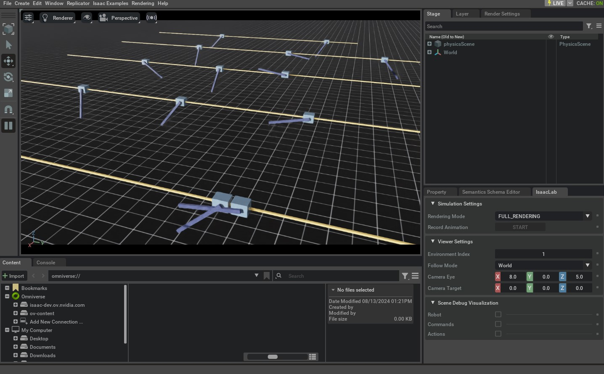

.. _tutorial-register-rl-env-gym:

注册环境
==========================

.. currentmodule:: isaaclab

在前一篇教程中，我们学习了如何创建自定义的 cartpole 环境。我们手动
导入了环境类及其配置类来创建环境的实例。

.. dropdown:: Environment creation in the previous tutorial
   :icon: code

   .. literalinclude:: ../../../../scripts/tutorials/03_envs/run_cartpole_rl_env.py
      :language: python
      :start-at: # create environment configuration
      :end-at: env = ManagerBasedRLEnv(cfg=env_cfg)

虽然这种方式很直接，但由于我们有大量的环境，它并不具备可扩展性。
在本教程中，我们将展示如何使用 :meth:`gymnasium.register` 方法将
环境注册到 ``gymnasium`` 注册表中。这使我们能够通过
:meth:`gymnasium.make` 函数创建环境。

.. dropdown:: Environment creation in this tutorial
   :icon: code

   .. literalinclude:: ../../../../scripts/environments/random_agent.py
      :language: python
      :lines: 36-47

代码
~~~~~~~~

本教程对应 ``scripts/environments`` 目录中的 ``random_agent.py`` 脚本。

.. dropdown:: Code for random_agent.py
   :icon: code

   .. literalinclude:: ../../../../scripts/environments/random_agent.py
      :language: python
      :emphasize-lines: 36-37, 42-47
      :linenos:

代码解析
~~~~~~~~~~~~~~~~~~

:class:`envs.ManagerBasedRLEnv` 类继承自 :class:`gymnasium.Env` 类，以遵循
标准接口。然而，与传统的 Gym 环境不同，:class:`envs.ManagerBasedRLEnv`
实现的是一个 *向量化* 环境。这意味着多个环境实例
在同一进程中同时运行，并且所有数据都以批处理
方式返回。

类似地，直接式工作流的 :class:`envs.DirectRLEnv` 类也继承自 :class:`gymnasium.Env` 类。
对于 :class:`envs.DirectMARLEnv`，虽然它不继承自 Gymnasium，
但也可以以相同的方式注册和创建。

使用 gym 注册表
----------------------

要注册环境，我们使用 :meth:`gymnasium.register` 方法。该方法接受
环境名称、环境类的入口点，以及
环境配置类的入口点。

.. note::
    :mod:`gymnasium` 注册表是一个全局注册表。因此，必须确保
    环境名称是唯一的。否则，注册表在注册
    环境时会抛出错误。

管理器式环境
^^^^^^^^^^^^^^^^^^^^^^^^^^

对于管理器式环境，下面展示了 ``isaaclab_tasks.manager_based.classic.cartpole`` 子包中
cartpole 环境的注册
调用：

.. literalinclude:: ../../../../source/isaaclab_tasks/isaaclab_tasks/manager_based/classic/cartpole/__init__.py
   :language: python
   :lines: 10-
   :emphasize-lines: 4, 11, 12, 15

``id`` 参数是环境的名称。按照惯例，我们为所有环境添加前缀 ``Isaac-``，以便更容易在注册表中搜索。环境
名称之后通常是任务名称，然后是机器人名称。
例如，对于在平坦地形上使用 ANYmal C 的足式运动，环境被命名为
``Isaac-Velocity-Flat-Anymal-C-v0``。版本号 ``v<N>`` 通常用于区分同一环境的不同
变体。否则，环境名称可能变得过长
而难以阅读。

``entry_point`` 参数是环境类的入口点。入口点是 ``<module>:<class>`` 形式的
字符串。对于 cartpole 环境，入口点是
``isaaclab.envs:ManagerBasedRLEnv``。入口点用于在创建环境实例时
导入环境类。

``env_cfg_entry_point`` 参数指定环境的默认配置。默认
配置使用 :meth:`isaaclab_tasks.utils.parse_env_cfg` 函数加载。
然后将其传递给 :meth:`gymnasium.make` 函数以创建环境实例。
配置入口点可以是 YAML 文件，也可以是 Python 配置类。

直接式环境
^^^^^^^^^^^^^^^^^^^

对于直接式环境，环境注册遵循类似的模式。我们不把环境的入口点注册为 :class:`~isaaclab.envs.ManagerBasedRLEnv` 类，
而是将环境的入口点注册为该环境的实现类。
此外，我们在环境名称中添加后缀 ``-Direct``，以将其与
管理器式环境区分开。

例如，下面展示了
``isaaclab_tasks.direct.cartpole`` 子包中 cartpole 环境的注册调用：

.. literalinclude:: ../../../../source/isaaclab_tasks/isaaclab_tasks/direct/cartpole/__init__.py
   :language: python
   :lines: 10-31
   :emphasize-lines: 5, 12, 13, 16

创建环境
------------------------

为了让 ``gym`` 注册表获得 ``isaaclab_tasks``
扩展提供的所有环境，我们必须在脚本开头导入该模块。这会执行 ``__init__.py``
文件，它遍历所有子包并注册它们各自的环境。

.. literalinclude:: ../../../../scripts/environments/random_agent.py
   :language: python
   :start-at: import isaaclab_tasks  # noqa: F401
   :end-at: import isaaclab_tasks  # noqa: F401

在本教程中，任务名称从命令行读取。任务名称用于解析
默认配置以及创建环境实例。此外，其他
解析得到的命令行参数（例如环境数量、仿真设备
以及是否渲染）用于覆盖默认配置。

.. literalinclude:: ../../../../scripts/environments/random_agent.py
   :language: python
   :start-at: # create environment configuration
   :end-at: env = gym.make(args_cli.task, cfg=env_cfg)

创建环境之后，其余执行过程遵循标准的重置和步进流程。

代码执行
~~~~~~~~~~~~~~~~~~

现在我们已经通读了代码，接下来运行脚本并查看结果：

.. code-block:: bash

   ./isaaclab.sh -p scripts/environments/random_agent.py --task Isaac-Cartpole-v0 --num_envs 32

这应该会打开一个场景，其内容与 :ref:`tutorial-create-manager-rl-env` 教程中类似。
要停止仿真，你可以关闭窗口，或在终端中按 ``Ctrl+C``。

此外，你还可以通过显式设置 ``--device`` 标志的值，将仿真设备从 GPU 更改为 CPU：

.. code-block:: bash

   ./isaaclab.sh -p scripts/environments/random_agent.py --task Isaac-Cartpole-v0 --num_envs 32 --device cpu

使用 ``--device cpu`` 标志时，仿真将在 CPU 上运行。这对调试仿真很有用。
不过，仿真运行速度会比在 GPU 上慢得多。
