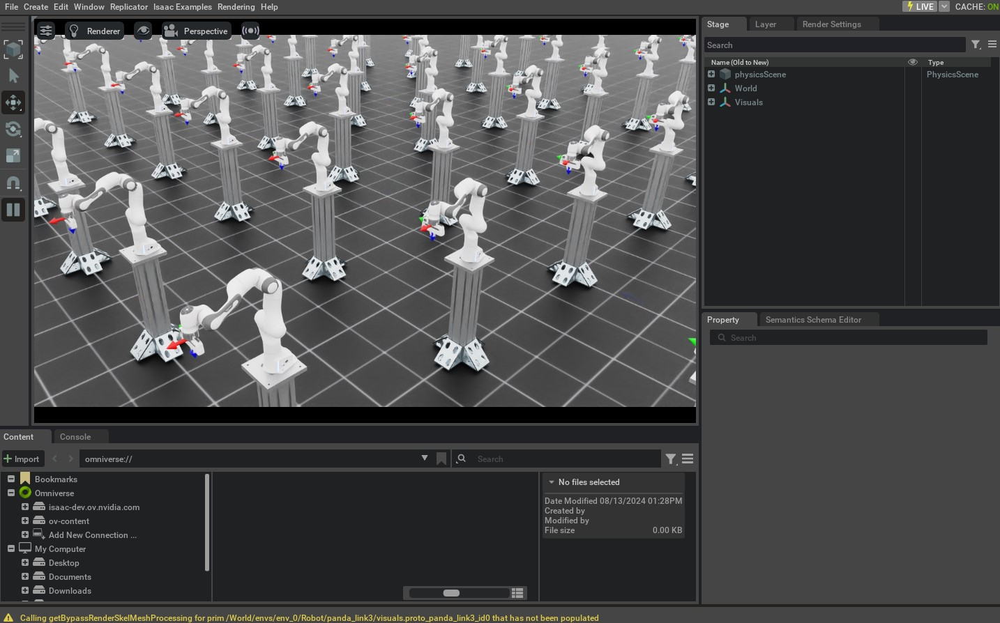

使用任务空间控制器
=============================

.. currentmodule:: isaaclab

在前面的教程中，我们使用关节空间控制器来控制机器人。然而，在许多
情况下，使用任务空间控制器控制机器人更加直观。例如，如果我们
想遥操作机器人，指定期望的末端执行器位姿比指定
期望的关节位置更容易。

在本教程中，我们将学习如何使用任务空间控制器来控制机器人。
我们将使用 :class:`controllers.DifferentialIKController` 类来跟踪期望的
末端执行器位姿命令。

代码
~~~~~~~~

本教程对应
``scripts/tutorials/05_controllers`` 目录中的 ``run_diff_ik.py`` 脚本。

.. dropdown:: Code for run_diff_ik.py
   :icon: code

   .. literalinclude:: ../../../../scripts/tutorials/05_controllers/run_diff_ik.py
      :language: python
      :emphasize-lines: 98-100, 121-136, 155-157, 161-171
      :linenos:

代码解析
~~~~~~~~~~~~~~~~~~

使用任何任务空间控制器时，必须确保所提供的量位于正确的坐标系中。当并行化环境实例时，它们
都存在于同一个唯一的仿真世界坐标系中。然而，通常我们希望每个
环境本身拥有自己的局部坐标系。该坐标系可以通过
:attr:`scene.InteractiveScene.env_origins` 属性访问。

在我们的 API 中，我们对坐标系使用以下记号：

- 仿真世界坐标系（记为 ``w``），即整个仿真的坐标系。
- 局部环境坐标系（记为 ``e``），即局部环境的坐标系。
- 机器人的基座坐标系（记为 ``b``），即机器人基座连杆的坐标系。

由于资产实例并不「感知」局部环境坐标系，它们
以仿真世界坐标系返回自己的状态。因此，我们需要将获得的
量转换到局部环境坐标系。这是通过从获得的量中减去局部环境
原点来完成的。

创建 IK 控制器
-------------------------

:class:`~controllers.DifferentialIKController` 类计算机器人为达到期望末端执行器位姿所需的期望关节
位置。其内置实现
以批量格式执行计算，并使用 PyTorch 操作。它支持
不同类型的逆运动学求解器，包括阻尼最小二乘法
和伪逆法。这些求解器可以使用
:attr:`~controllers.DifferentialIKControllerCfg.ik_method` 参数指定。
此外，该控制器可以同时处理相对位姿和绝对位姿形式的命令。

在本教程中，我们将使用阻尼最小二乘法来计算期望的
关节位置。此外，由于我们想跟踪期望的末端执行器位姿，我们将
使用绝对位姿命令模式。

.. literalinclude:: ../../../../scripts/tutorials/05_controllers/run_diff_ik.py
   :language: python
   :start-at: # Create controller
   :end-at: diff_ik_controller = DifferentialIKController(diff_ik_cfg, num_envs=scene.num_envs, device=sim.device)

获取机器人的关节和刚体索引
--------------------------------------------

IK 控制器的实现是一个只做计算的类。因此，它要求
用户提供关于机器人的必要信息。这包括机器人的
关节位置、当前末端执行器位姿以及雅可比矩阵。

虽然 :attr:`assets.ArticulationData.joint_pos` 属性提供了关节位置，
但我们只想要机器人机械臂的关节位置，而不是夹持器的。类似地，虽然
:attr:`assets.ArticulationData.body_state_w` 属性提供了机器人所有
刚体的状态，但我们只想要机器人末端执行器的状态。因此，我们需要
对这些数组进行索引以获得所需的量。

为此，关节体类提供了 :meth:`~assets.Articulation.find_joints`
和 :meth:`~assets.Articulation.find_bodies` 方法。这些方法接受关节
和刚体的名称，并返回它们对应的索引。

虽然你可以直接使用这些方法获取索引，但我们建议使用
:attr:`~managers.SceneEntityCfg` 类来解析索引。该类在 API 的许多
地方用于从场景实体中提取特定信息。它在内部
调用上述方法来获取索引，但还会执行一些额外的
检查以确保提供的名称有效。因此，使用
该类是更安全的选择。

.. literalinclude:: ../../../../scripts/tutorials/05_controllers/run_diff_ik.py
   :language: python
   :start-at: # Specify robot-specific parameters
   :end-before: # Define simulation stepping

计算机器人命令
-----------------------

IK 控制器将设置期望命令与
计算期望关节位置的操作分离开来。这样做是为了允许用户
以不同于机器人控制频率的频率运行 IK 控制器。

:meth:`~controllers.DifferentialIKController.set_command` 方法接受
期望的末端执行器位姿作为单个批量数组。位姿在
机器人的基座坐标系中指定。

.. literalinclude:: ../../../../scripts/tutorials/05_controllers/run_diff_ik.py
   :language: python
   :start-at: # reset controller
   :end-at: diff_ik_controller.set_command(ik_commands)

然后，我们可以使用
:meth:`~controllers.DifferentialIKController.compute` 方法计算期望的关节位置。
该方法接受当前末端执行器位姿（在基座坐标系中）、雅可比矩阵以及
当前关节位置。我们从机器人的数据中读取雅可比矩阵，它使用
物理引擎计算出的值。

.. literalinclude:: ../../../../scripts/tutorials/05_controllers/run_diff_ik.py
   :language: python
   :start-at: # obtain quantities from simulation
   :end-at: joint_pos_des = diff_ik_controller.compute(ee_pos_b, ee_quat_b, jacobian, joint_pos)

计算得到的关节位置目标随后可以施加到机器人上，与
前面教程中的做法一样。

.. literalinclude:: ../../../../scripts/tutorials/05_controllers/run_diff_ik.py
   :language: python
   :start-at: # apply actions
   :end-at: scene.write_data_to_sim()

代码执行
~~~~~~~~~~~~~~~~~~

现在我们已经通读了代码，接下来运行脚本并查看结果：

.. code-block:: bash

   ./isaaclab.sh -p scripts/tutorials/05_controllers/run_diff_ik.py --robot franka_panda --num_envs 128

该脚本将启动一个包含 128 个机器人的仿真。机器人将使用 IK 控制器进行控制。
当前和期望的末端执行器位姿应通过坐标系标记显示。当机器人到达
期望位姿时，命令应循环切换到脚本中指定的下一个位姿。

要停止仿真，你可以关闭窗口，或在终端中按 ``Ctrl+C``。
