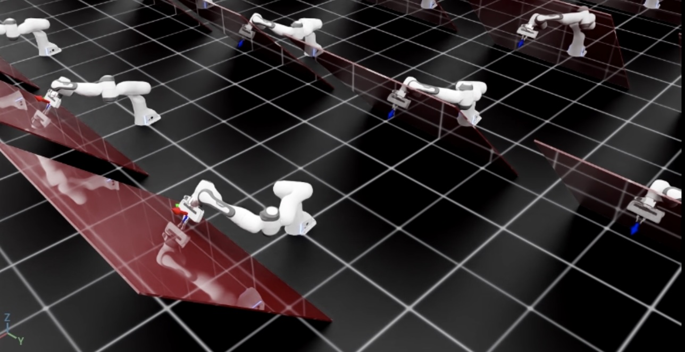

使用操作空间控制器
=====================================

.. currentmodule:: isaaclab

有时，使用差分 IK 控制器控制机器人的末端执行器位姿并不足够。
例如，我们可能想在任务空间中施加非常特定的位姿跟踪误差动态、使用关节力/力矩命令驱动机器人，
或者在控制其他方向运动的同时沿特定方向施加接触力（例如，用抹布擦拭桌面）。在这类任务中，我们可以使用
操作空间控制器（operational space controller，OSC）。

.. rubric:: References for the operational space control:

1. O Khatib. A unified approach for motion and force control of robot manipulators:
   The operational space formulation. IEEE Journal of Robotics and Automation, 3(1):43–53, 1987. URL http://dx.doi.org/10.1109/JRA.1987.1087068.

2. Robot Dynamics Lecture Notes by Marco Hutter (ETH Zurich). URL https://ethz.ch/content/dam/ethz/special-interest/mavt/robotics-n-intelligent-systems/rsl-dam/documents/RobotDynamics2017/RD_HS2017script.pdf

在本教程中，我们将学习如何使用 OSC 控制机器人。
我们将使用 :class:`controllers.OperationalSpaceController` 类在跟踪所有其他方向期望末端执行器位姿的同时，对倾斜的墙面施加一个垂直于它的恒力。

代码
~~~~~~~~

本教程对应
``scripts/tutorials/05_controllers`` 目录中的 ``run_osc.py`` 脚本。

.. dropdown:: Code for run_osc.py
   :icon: code

   .. literalinclude:: ../../../../scripts/tutorials/05_controllers/run_osc.py
      :language: python
      :linenos:

创建操作空间控制器
----------------------------------------

:class:`~controllers.OperationalSpaceController` 类计算机器人在任务空间中同时进行运动控制和力控制所需的关节
力/力矩。

该任务空间的参考坐标系可以是欧几里得空间中的任意坐标系。默认情况下，
它是机器人的基座坐标系。然而，在某些情况下，相对于不同的坐标系定义目标坐标可能更容易。在这种情况下，该任务参考坐标系相对于机器人基座坐标系的位姿应
在 ``set_command`` 方法的 ``current_task_frame_pose_b`` 参数中提供。例如，在本教程中，相对于一个与墙面平行的坐标系定义目标命令是合理的，因为力控制
方向在该坐标系的 z 轴上才是唯一非零的。目标位姿被设置为与墙面具有相同的朝向，它正是这样一个候选，并作为本教程中的任务坐标系。因此，
:class:`~controllers.OperationalSpaceControllerCfg` 的所有参数都应
围绕该任务参考坐标系来设置。

对于运动控制，任务空间目标可以以绝对形式给出（即相对于机器人基座定义，
``target_types: "pose_abs"``），或相对于末端执行器当前位姿给出（即 ``target_types: "pose_rel"``）。
对于力控制，任务空间目标可以以绝对形式给出（即相对于机器人基座定义，
``target_types: "force_abs"``）。如果希望同时施加位姿控制和力控制，``target_types``
应为形如 ``["pose_abs", "wrench_abs"]`` 或 ``["pose_rel", "wrench_abs"]`` 的列表。

可以分别使用 ``motion_control_axes_task`` 和
``force_control_axes_task`` 参数指定施加运动控制和力控制的轴。这些列表应对所有六个轴（位置和旋转）由 0/1 组成，并且彼此互补（例如，对于 x 轴，如果 ``motion_control_axes_task`` 为 ``0``，
则 ``force_control_axes_task`` 应为 ``1``）。

对于运动控制轴，可以使用
``motion_control_stiffness`` 和 ``motion_damping_ratio_task`` 参数指定期望的刚度和阻尼比，它们可以是标量（所有轴取相同值）
或由六个标量组成的列表，每个值对应一个轴。如果需要，刚度和阻尼比
值可以作为一个命令参数（例如，使用强化学习学习这些值或在运行中更改它们）。为此，
``impedance_mode`` 应设为 ``"variable_kp"`` （在命令中包含刚度值）或
``"variable"`` （同时包含刚度和阻尼比值）。在这些情况下，还应设置 ``motion_stiffness_limits_task``
和 ``motion_damping_limits_task``，它们为刚度和阻尼比值设定界限。

对于接触力控制，可以通过不设置
``contact_wrench_stiffness_task`` 来施加开环力控制，或通过 ``contact_wrench_stiffness_task`` 参数设置期望的刚度值来施加（带前馈项的）闭环力控制，该参数可以是标量或由
六个标量组成的列表。请注意，目前闭环控制中只考虑接触螺旋力（wrench）的线性部分（即 ``contact_wrench_stiffness_task`` 的前三个
元素），因为旋转部分无法用接触传感器测量。

对于运动控制，应将 ``inertial_dynamics_decoupling`` 设置为 ``True``，以使用机器人的惯性矩阵
解耦任务空间中的期望加速度。这对保证运动控制的准确性非常重要，
尤其对于快速运动。这种惯性解耦考虑了所有六个运动轴之间的耦合。
如果需要，可以通过将
``partial_inertial_dynamics_decoupling`` 设置为 ``True`` 来忽略平移轴和旋转轴之间的惯性耦合。

如果希望在操作空间命令中包含重力补偿，应将 ``gravity_compensation``
设置为 ``True``。

关于操作空间控制的最后一个考虑是，如何处理冗余机器人的零空间（null-space）。
零空间是关节空间中不影响任务空间坐标的子空间。如果不采取任何措施
控制零空间，机器人的关节将自由漂浮而不移动末端执行器。这可能不是所期望的（例如，
机器人关节可能会接近其限位），因此人们可能希望在其
零空间内控制机器人的行为。一种方法是将 ``nullspace_control`` 设置为 ``"position"`` （默认值为 ``"none"``），
它集成一个零空间 PD 控制器，在不影响任务
空间的情况下将机器人关节吸引到期望目标。该零空间控制器的行为可以使用 ``nullspace_stiffness`` 和
``nullspace_damping_ratio`` 参数定义。请注意，只有在 ``inertial_dynamics_decoupling`` 设置为 ``True`` 且
``partial_inertial_dynamics_decoupling`` 设置为 ``False`` 时，零空间与任务空间加速度的理论解耦才可能实现。

内置的 OSC 实现以批量格式执行计算，并使用 PyTorch 操作。

在本教程中，我们将使用 ``"pose_abs"`` 控制除 z 轴之外所有轴的运动，
使用 ``"wrench_abs"`` 控制 z 轴上的力。此外，我们将在运动控制中包含完整的惯性解耦，
而不包含重力补偿，因为机器人配置中已禁用重力。
我们将阻抗模式设置为 ``"variable_kp"``，以动态改变刚度值
（``motion_damping_ratio_task`` 设置为 ``1``：kd 值根据 kp 值自适应调整，以保持临界阻尼
响应）。最后，``nullspace_control`` 设置为使用 ``"position"``，其中提供的关节设定点
为关节位置限位的中心。

.. literalinclude:: ../../../../scripts/tutorials/05_controllers/run_osc.py
   :language: python
   :start-at: # Create the OSC
   :end-at: osc = OperationalSpaceController(osc_cfg, num_envs=scene.num_envs, device=sim.device)

更新机器人的状态
--------------------------------------------

OSC 的实现是一个只做计算的类。因此，它要求用户提供关于机器人的必要信息。
这包括机器人的雅可比矩阵、质量/惯性矩阵、末端执行器位姿、速度、接触
力（均在根坐标系中），最后还有关节位置和关节速度。此外，如果需要，用户还应提供
重力补偿向量和零空间关节位置目标。

.. literalinclude:: ../../../../scripts/tutorials/05_controllers/run_osc.py
   :language: python
   :start-at: # Update robot states
   :end-before: # Update the target commands

计算机器人命令
-----------------------

OSC 将设置期望命令与计算期望关节位置的操作分离开来。
要设置期望命令，用户应提供命令向量，其中包括目标命令
（即按它们在 OSC 配置的 ``target_types`` 参数中出现的顺序排列），
以及当 impedance_mode 设置为 ``"variable_kp"`` 或 ``"variable"`` 时期望的刚度和阻尼比值。
它们都应与任务坐标系位于同一坐标系中（例如，用 ``_task`` 下标表示）并
拼接在一起。

在本教程中，期望的螺旋力（wrench）已经相对于任务坐标系定义，期望的位姿则按如下方式
变换到任务坐标系：

.. literalinclude:: ../../../../scripts/tutorials/05_controllers/run_osc.py
   :language: python
   :start-at: # Convert the target commands to the task frame
   :end-at: return command, task_frame_pose_b

OSC 命令按如下方式设置：任务坐标系中的命令向量、基座坐标系中的末端执行器位姿，以及
基座坐标系中的任务（参考）坐标系位姿。需要这些信息，因为内部
计算是在基座坐标系中完成的。

.. literalinclude:: ../../../../scripts/tutorials/05_controllers/run_osc.py
   :language: python
   :start-at: # set the osc command
   :end-at: osc.set_command(command=command, current_ee_pose_b=ee_pose_b, current_task_frame_pose_b=task_frame_pose_b)

关节力/力矩值使用提供的机器人状态和期望命令按如下方式计算：

.. literalinclude:: ../../../../scripts/tutorials/05_controllers/run_osc.py
   :language: python
   :start-at: # compute the joint commands
   :end-at: )

计算得到的关节力/力矩目标随后可以施加到机器人上。

.. literalinclude:: ../../../../scripts/tutorials/05_controllers/run_osc.py
   :language: python
   :start-at: # apply actions
   :end-at: robot.write_data_to_sim()

代码执行
~~~~~~~~~~~~~~~~~~

你现在可以运行脚本并查看结果：

.. code-block:: bash

   ./isaaclab.sh -p scripts/tutorials/05_controllers/run_osc.py --num_envs 128

该脚本将启动一个包含 128 个机器人的仿真。机器人将使用 OSC 进行控制。
除了红色的倾斜墙之外，当前和期望的末端执行器位姿应通过坐标系标记显示。
你应该会看到机器人到达期望位姿，同时施加一个垂直于墙面
的恒力。

要停止仿真，你可以关闭窗口或在终端中按 ``Ctrl+C``。
