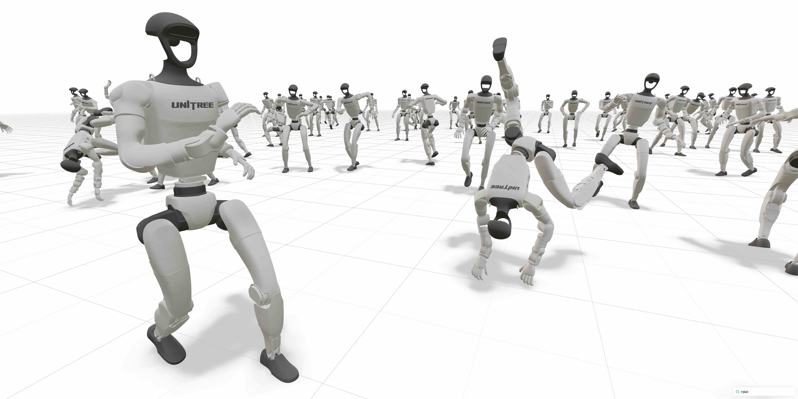

欢迎使用 mjlab！
================

mjlab 是一个轻量级的开源机器人学习框架，它将 GPU 加速仿真与可组合的环境和极低的上手成本结合在一起。它采用了
`Isaac Lab <https://github.com/isaac-sim/IsaacLab>`_ 提出的基于管理器的 API——用户以模块化积木的方式组合观测、奖励和事件等组件——并将其与
`MuJoCo Warp <https://github.com/google-deepmind/mujoco_warp>`_ 结合，实现 GPU 加速的物理仿真。最终得到的框架只需一条命令即可安装，依赖极少，并可直接访问 `MuJoCo <https://github.com/google-deepmind/mujoco>`_ 原生的数据结构。

**主要特性：**

- **可组合的环境：** 用户可以将观测、奖励、终止及其他 MDP 项定义为模块化的积木组件
- **极少的依赖：** 通过 ``uv`` 一条命令即可安装，启动延迟低
- **直接使用 MuJoCo 数据结构：** 原生访问 ``MjModel``/``MjData`` ，没有任何中间转换层
- **原生 PyTorch：** 观测、奖励和动作都是 PyTorch 张量，由零拷贝的 GPU 内存共享支撑

有关 mjlab 背后设计决策的更多内容，请参阅 :doc:`source/motivation` 。

**立即试用** （无需安装）：

.. code-block:: bash

   uvx --from mjlab --refresh demo

目录
----

.. toctree::
   :maxdepth: 1
   :caption: 用户指南

   source/installation
   source/tutorials
   source/contributing

.. toctree::
   :maxdepth: 1
   :caption: 核心概念

   source/architecture_overview
   source/entity/index
   source/actuators
   source/sensors/index
   source/scene
   source/terrain

.. toctree::
   :maxdepth: 1
   :caption: 管理器层

   source/environment_config
   source/observations
   source/actions
   source/rewards
   source/terminations
   source/commands
   source/events
   source/randomization
   source/curriculum
   source/metrics
   source/recorders

.. toctree::
   :maxdepth: 1
   :caption: 训练与调试

   source/training/rsl_rl
   source/viewers
   source/training/distributed_training
   source/training/cloud
   source/debugging/nan_guard
   source/debugging/export_scene

API 参考
--------

本收集库只发布指南与教程。需要由上游 Python 包生成的 API 参考文档，请查看官方站点：

`mjlab API 参考 <https://mujocolab.github.io/mjlab/source/api/index.html>`_

.. toctree::
   :maxdepth: 1
   :caption: 延伸阅读

   source/motivation
   source/migration_isaac_lab
   source/faq
   source/research
   source/changelog

许可证与引用
------------

mjlab 基于 Apache License, Version 2.0 许可证发布。
详情请参阅 `LICENSE 文件 <https://github.com/mujocolab/mjlab/blob/main/LICENSE/>`_ 。

如果您在研究中使用了 mjlab，我们将不胜感激您引用以下文献：

.. code-block:: bibtex

    @article{Zakka_mjlab_A_Lightweight_2026,
        author = {Zakka, Kevin and Liao, Qiayuan and Yi, Brent and Le Lay, Louis and Sreenath, Koushil and Abbeel, Pieter},
        title = {{mjlab: A Lightweight Framework for GPU-Accelerated Robot Learning}},
        url = {https://arxiv.org/abs/2601.22074},
        year = {2026}
    }

致谢
----

mjlab 离不开 Isaac Lab 团队的出色工作，mjlab 正是构建在他们的 API 设计与抽象之上。

同时感谢 MuJoCo Warp 团队——尤其是 Erik Frey 和 Taylor Howell——他们无数次回答我们的问题、提供有益的反馈，并根据我们的需求实现新特性。
