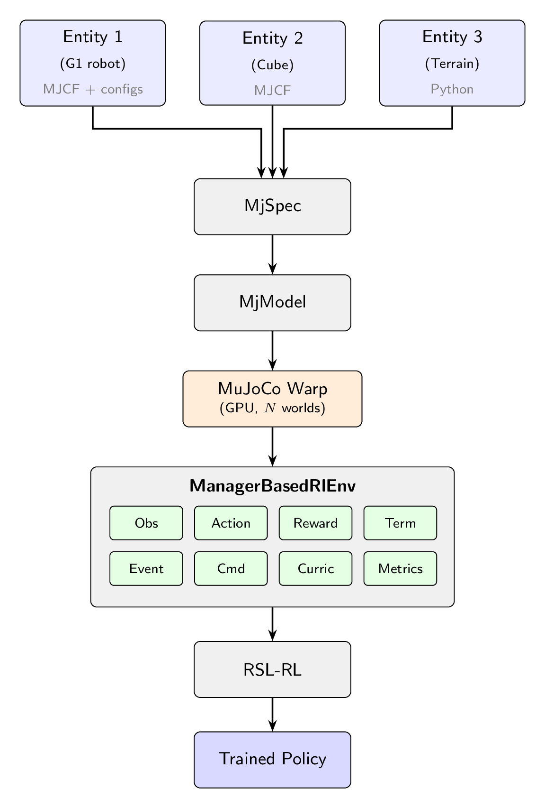

.. _architecture_overview:

架构总览
========

mjlab 分为两层：一层是 **仿真层** (simulation layer)，负责建模机器人与世界；另一层是 **管理器层** (manager layer)，在其之上定义强化学习问题。理解这一分层设计，是快速建立系统全局认知的最佳途径。

   各实体被组合为一个 MjSpec，编译后传输到 MuJoCo Warp 进行 GPU 仿真。ManagerBasedRlEnv 负责编排 MDP，训练由 RSL-RL 完成。

仿真层
------

**场景流水线。**
mjlab 构建场景的方式，是把各个实体的描述组合成单个 `MjSpec <https://mujoco.readthedocs.io/en/stable/programming/modeledit.html>`_ 对象。每个实体都从一个
`MJCF <https://mujoco.readthedocs.io/en/latest/modeling.html>`_ 文件起步，通过 ``MjSpec.from_file()`` 加载。完全用 XML 定义一切的用户可以直接使用这种方式。如果需要更多控制权，则可以用 Python dataclass 来扩展或覆盖已加载 spec 上的属性：执行器、碰撞规则、材质、传感器以及初始状态。这种混合方式让用户能够从现成的 MuJoCo 模型出发，在其上叠加任务特定的配置，而无需修改原始 XML。组合后的 spec 会在 CPU 上编译为 ``MjModel``，随后通过
`MuJoCo Warp <https://mujoco.readthedocs.io/en/stable/mjwarp/index.html>`_
传输到 GPU，后者构建于 `NVIDIA Warp <https://nvidia.github.io/warp/>`_ 之上。

**MuJoCo Warp。**
MuJoCo Warp 是 MuJoCo 的 GPU 加速后端。它保留了 MuJoCo 的 ``MjModel``/``MjData`` 范式，但增加了一个前导的 *world* 维度：单个 ``MjData`` 对象并行保存 N 个独立仿真实例的状态，从而可以同时推进数千个环境。模型参数默认在所有 world 之间共享；当域随机化有需求时，可以把个别字段展开为每个 world 独立取值。mjlab 将仿真步进捕获为
`CUDA 图 <https://developer.nvidia.com/blog/cuda-graphs>`_ ：内核执行序列只记录一次，后续调用直接重放，从而消除 CPU 侧的派发开销。

.. note::

   CUDA 图捕获是环境启动时的一次性开销。每回合的重置与域随机化事件以普通 Python 代码的形式运行在图重放之间，不会破坏捕获。

**组件。**
仿真层提供四个核心组件，每个组件都有独立的文档页面：

- :ref:`entity`: 实体，即机器人、被操作的对象，或诸如 :ref:`terrain <terrain>` 这样的静态对象，由 MJCF 描述加上可选的 Python 配置（执行器、碰撞规则、初始状态）定义。
- :ref:`actuators`: 实体的控制方式。用户既可以包装 MJCF 中已定义的执行器，也可以通过 Python 配置创建新的执行器。
- :ref:`sensors`: 观测世界的方式。既包括 MuJoCo 原生传感器，也包括 RGB-D 相机、光线投射器等自定义传感器。
- :ref:`scene`: 场景组合与环境摆放。

管理器层
--------

在仿真层之上，mjlab 采用了 Isaac Lab 提出的基于管理器 (manager-based) 的环境设计。用户通过组合小型、自包含的 *项* (term)——奖励函数、观测计算、域随机化事件——来定义自己的环境，并把它们注册到相应的管理器。每个管理器负责自己各项的生命周期：在仿真循环中的正确时机调用它们、汇总它们的输出，并对外提供诊断信息。

项既可以是适用于无状态计算的普通函数，也可以是继承自 ``ManagerTermBase`` 的类——当某个项需要缓存开销较大的初始化结果（例如在初始化时把正则模式解析为关节索引），或需要通过 ``reset()`` 钩子维护回合级状态时，就应使用类。

环境通过 ``ManagerBasedRlEnvCfg`` 进行配置。它是一个普通 dataclass，保存着每个管理器的项配置字典。

.. code-block:: python

    from mjlab.envs import ManagerBasedRlEnvCfg

    cfg = ManagerBasedRlEnvCfg(
        decimation=4,           # 4 physics steps per policy step
        episode_length_s=20.0,
        scene=...,              # SceneCfg: terrain, entities, sensors
        sim=...,                # SimulationCfg: timestep, solver, integrator
        observations={...},     # ObservationManager terms
        actions={...},          # ActionManager terms
        rewards={...},          # RewardManager terms
        terminations={...},     # TerminationManager terms
        events={...},           # EventManager terms (resets, DR)
        commands={...},         # CommandManager terms (velocity targets, etc.)
        curriculum={...},       # CurriculumManager terms
        metrics={...},          # MetricsManager terms
    )

.. rubric:: 八大管理器

- **ObservationManager**: 组装观测组，处理方式可配置（裁剪、噪声、延迟、历史），支持非对称 actor-critic。详见 :ref:`observations` 一节。
- **ActionManager**: 把策略的输出张量路由到实体执行器，并处理缩放与偏移。详见 :ref:`actions` 一节。
- **RewardManager**: 计算各奖励项的加权和，并按步长时长缩放以保证频率无关性。详见 :ref:`rewards` 一节。
- **TerminationManager**: 判断停止条件，区分终止重置与超时。详见 :ref:`terminations` 一节。
- **EventManager**: 在生命周期节点（启动、重置、间隔）触发各项。域随机化就是通过事件项实现的。参见 :ref:`events` 与 :ref:`domain_randomization` 两节。
- **CommandManager**: 生成并重采样目标信号（速度目标、位姿目标）。详见 :ref:`commands` 一节。
- **CurriculumManager**: 根据策略表现调整训练条件。详见 :ref:`curriculum` 一节。
- **MetricsManager**: 以回合平均值的形式记录自定义的每步数值。详见 :ref:`metrics` 一节。

有关涵盖所有管理器的完整配置参考，见 :ref:`environment_config` 一节。

环境生命周期
------------

每个环境实例都会经历四个阶段。

1. **构建。** ``Scene`` 通过 ``MjSpec`` 组合各实体的 MJCF 文件，并在 CPU 上编译出 ``MjModel``。``Simulation`` 通过 MuJoCo Warp 把模型上传到 GPU，分配一个包含 N 个并行 world 的 ``MjData``。``step``、``forward``、``reset`` 和 ``sense`` 的 CUDA 图都在此捕获。

2. **初始化。** 各管理器根据项配置字典构造完成。正则模式会匹配到关节、body 和 geom 的索引。观测历史与延迟缓冲区在此分配。域随机化项所需的模型字段从共享存储展开为每 world 独立存储，并重建 CUDA 图以反映新的布局。startup 事件触发一次。

3. **重置。** 在训练开始时以及环境终止或超时时调用。``EventManager`` 触发 ``reset`` 项，把场景恢复到初始状态（可选随机化）。指令目标被重采样。观测历史缓冲区被清空。

4. **步进。** 策略动作由 ``ActionManager`` 处理。物理仿真推进 ``decimation`` 次，每个子步都会应用执行器命令并更新实体状态。decimation 循环结束后，``TerminationManager`` 检查停止条件，``RewardManager`` 计算奖励信号，已终止的环境被重置。随后由一次 ``forward()`` 调用刷新所有环境的派生量。``CommandManager`` 推进或重采样目标。若到达调度时间，interval 事件触发。传感器更新。最后由 ``ObservationManager`` 组装出下一次策略查询所需的观测。

步进过程的执行顺序如下：

.. code-block:: text

    action_manager.process_action(action)
    for _ in range(decimation):
        action_manager.apply_action()
        sim.step()
        scene.update()
    termination_manager.compute()
    reward_manager.compute()
    metrics_manager.compute()
    [reset terminated envs]
    sim.forward()
    command_manager.compute()
    event_manager.apply(mode="interval")
    sim.sense()
    observation_manager.compute()

有了这个心智模型之后，"核心概念"各页面会详细介绍仿真层的每个组件，"管理器层"各页面则会逐一讲解每个管理器的配置与内置项。如果你来自 Isaac Lab，:ref:`migration_isaac_lab` 描述了其中的关键 API 差异。
