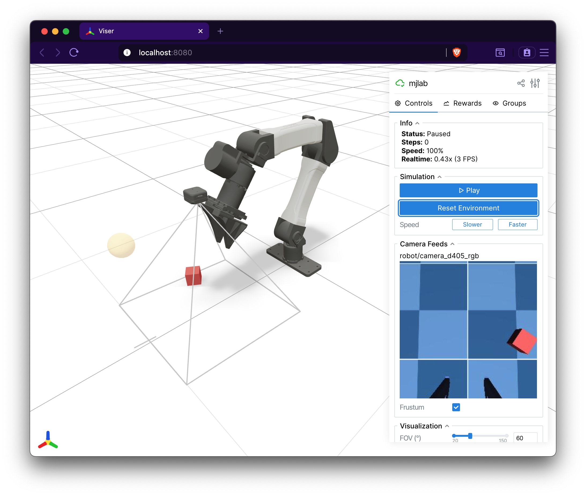

.. _rgbd_camera:

RGB-D 相机
==========

``CameraSensor`` 使用 MuJoCo Warp 的光线追踪渲染管线在 GPU 上渲染 RGB 和
深度图像。它既可以封装 XML 中已定义的现有 MuJoCo 相机，也可以通过编程方式
创建一个新相机。

快速上手
-----------

.. code-block:: python

    from mjlab.sensor import CameraSensorCfg

    # Wrap an existing MuJoCo camera from the robot's XML.
    cam = CameraSensorCfg(
        name="wrist_cam",
        camera_name="robot/wrist_camera",
        data_types=("rgb", "depth"),
        width=160,
        height=120,
    )

    scene_cfg = SceneCfg(
        entities={"robot": robot_cfg},
        sensors=(cam,),
    )

    # Access at runtime.
    data = env.scene["wrist_cam"].data
    data.rgb      # [B, 120, 160, 3] uint8
    data.depth    # [B, 120, 160, 1] float32

创建相机还是封装相机
-----------------------------

设置相机传感器有两种方式。

**封装现有相机。** 如果你的 MJCF 模型中已经定义了相机，可以通过
``camera_name`` 传入其名称。传感器会使用模型中该相机的位置、朝向和视场。
你也可以选择性地覆盖 ``fovy``，或切换为正交投影。

.. code-block:: python

    # Wrap the camera named "front_cam" in the robot's XML.
    CameraSensorCfg(
        name="front",
        camera_name="robot/front_cam",
        data_types=("rgb",),
    )

**创建新相机。** 当 ``camera_name`` 为默认值 ``None`` 时，传感器会在场景
构建期间向 MjSpec 添加一个新相机。通过 ``pos``、``quat`` 以及可选的
``fovy`` 来指定它的摆放位置。

.. code-block:: python

    # Fixed overhead camera on the worldbody.
    CameraSensorCfg(
        name="overhead",
        pos=(0.0, 0.0, 2.0),
        quat=(0.0, 0.707, 0.707, 0.0),
        fovy=60.0,
        width=320,
        height=240,
        data_types=("rgb", "depth"),
    )

相机参数化
-----------------------

MuJoCo 支持两种定义相机投影的方式，两者都适用于 ``CameraSensor``。完整
细节参见 `MuJoCo 相机文档
<https://mujoco.readthedocs.io/en/stable/XMLreference.html#body-camera>`_ 。

**基于 FOV。** 更简单的方式。投影由单个 ``fovy`` 与图像分辨率共同确定，
其中 ``fovy`` 是以度为单位的垂直视场。这是通过 ``CameraSensorCfg`` 以
编程方式创建相机时的默认方式。

**基于内参。** 为了匹配真实的相机硬件，MuJoCo 相机可以通过
``sensorsize``、``focal`` （或 ``focalpixel``）和 ``principal`` （或
``principalpixel``）进行参数化。这些字段在 MJCF XML 中设置，可直接控制
内参矩阵。当存在内参时，MuJoCo 会忽略 ``fovy``。

封装现有相机时，传感器会沿用 XML 中定义的那种参数化方式。创建新相机时，
传感器使用 ``fovy``。如果要为新相机使用内参，请在 XML 中定义该相机，然后
通过 ``camera_name`` 封装它。

.. note::

   如果打算通过域随机化来随机化视场，请对基于 FOV 的相机使用
   ``dr.cam_fovy``，对基于内参的相机使用 ``dr.cam_intrinsic``。随机化
   ``cam_fovy`` 对使用内参的相机没有效果。

挂载在 body 上的相机
--------------------

设置 ``parent_body`` 可以把新相机附加到某个指定的 body 上，而不是
worldbody。此时 ``pos`` 和 ``quat`` 相对于父 body 的坐标系，因此相机会
随 body 一起运动。

.. code-block:: python

    # Camera mounted on the robot's end-effector.
    CameraSensorCfg(
        name="ee_cam",
        parent_body="robot/link_6",
        pos=(0.0, 0.0, 0.05),
        quat=(1.0, 0.0, 0.0, 0.0),
        fovy=45.0,
        width=160,
        height=120,
        data_types=("rgb", "depth"),
    )

数据类型
----------

``data_types`` 元组选择要渲染哪些图像模态。只有请求的类型会被分配内存；
``CameraSensorData`` 上的其余字段为 ``None``。

.. list-table::
   :header-rows: 1
   :widths: 15 20 65

   * - 类型
     - 形状
     - 说明
   * - ``"rgb"``
     - ``[B, H, W, 3]`` uint8
     - 彩色图像。MuJoCo Warp 以打包的 ABGR uint32 格式渲染，随后在 GPU
       上解包为 RGB 通道。
   * - ``"depth"``
     - ``[B, H, W, 1]`` float32
     - 深度图像。数值表示到相机平面的距离。
   * - ``"segmentation"``
     - ``[B, H, W, 2]`` int32
     - 类型化分割。通道 0 存储对象 ID，通道 1 存储 MuJoCo 对象类型。背景
       像素为 ``(-1, -1)``。

渲染设置
---------------

同一场景中的所有相机传感器必须在 ``use_textures``、``use_shadows`` 和
``enabled_geom_groups`` 上取相同的值。这是底层 MuJoCo Warp 渲染系统的
约束，它为所有相机使用单个 ``RenderContext``。设置不一致会在场景构建时
抛出 ``ValueError``。

.. code-block:: python

    # These two cameras must agree on render settings.
    cam_a = CameraSensorCfg(
        name="cam_a",
        camera_name="robot/front_cam",
        use_textures=True,
        use_shadows=False,
        enabled_geom_groups=(0, 1, 2),
        data_types=("rgb",),
    )
    cam_b = CameraSensorCfg(
        name="cam_b",
        camera_name="robot/wrist_cam",
        use_textures=True,       # Must match cam_a
        use_shadows=False,       # Must match cam_a
        enabled_geom_groups=(0, 1, 2),  # Must match cam_a
        data_types=("depth",),
    )

输出
------

``CameraSensorData`` 是一个 dataclass，每种数据类型对应一个字段。

.. code-block:: python

    @dataclass
    class CameraSensorData:
        rgb: Tensor | None      # [B, H, W, 3] uint8
        depth: Tensor | None    # [B, H, W, 1] float32
        segmentation: Tensor | None  # [B, H, W, 2] int32

默认情况下，返回的张量是渲染缓冲区的零拷贝视图。如果你会就地修改这些
张量，请在配置中设置 ``clone_data=True``，以避免破坏共享缓冲区。

在 Viser 中可视化
----------------------

Viser 查看器会自动发现场景中的所有 ``CameraSensor`` 实例，并在 GUI
侧边栏中以实时图像面板的形式显示它们的 RGB 和深度输出。3D 视口中会渲染
出相机视锥体（frustum），展示相机的位置、朝向和视场。深度图像还带有一个
交互式刻度滑块，用于调整可视化的距离范围。

