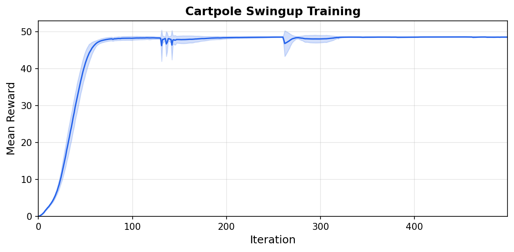

.. _tutorial-cartpole:

Cartpole：构建你的第一个环境
=============================

本教程将带你从零开始构建一个 cartpole 摆起 (swingup) 任务。小车沿导轨滑动，杆通过铰链连接在小车上。智能体对小车施加力，把杆摆起来并保持平衡。

.. raw:: html

   <video style="width:80%; display:block; margin:0 auto;" autoplay loop muted playsinline>
     <source src="../../_static/tutorials/cartpole_swingup.mp4" type="video/mp4">
   </video>
   

     A trained agent performing the swingup task.
   

整个任务只包含两个文件：一个 XML 模型和一个 Python 模块。我们会逐块搭建它们，最后再拼装到一起。

XML 模型
--------

每个环境都始于一个定义物理系统的 MuJoCo XML。对 cartpole 而言，就是两个刚体、两个关节和一个电机：

.. code-block:: xml

    <!-- A cart on a rail with a pole attached by a hinge. -->
    <body name="cart" pos="0 0 1">
      <joint name="slider" type="slide" axis="1 0 0"
             limited="true" range="-1.8 1.8" damping="5e-4"/>
      <geom name="cart" type="box" size="0.2 0.15 0.1" mass="1"/>
      <body name="pole_1" childclass="pole">
        <joint name="hinge_1"/>
        <geom name="pole_1"/>
      </body>
    </body>

    <!-- A motor that pushes the cart along the rail. -->
    <actuator>
      <motor name="slide" joint="slider" gear="10"
             ctrllimited="true" ctrlrange="-1 1"/>
    </actuator>

电机的齿轮比为 10，控制范围为 [-1, 1]，因此最大力为 10 N。``ctrllimited`` 告诉 MuJoCo 在内部对控制信号做截断，所以策略输出超出该范围也是安全的。

完整 XML 位于 ``src/mjlab/tasks/cartpole/cartpole.xml``。

构建环境
--------

其余内容都在一个文件中：``cartpole_env_cfg.py``。mjlab 的环境由小的、可组合的部件构成。我们会先定义每个部件，最后把它们组装成一份完整的配置。

实体：封装 XML
^^^^^^^^^^^^^^

实体是场景中的仿真对象。它可以小到一张静止的桌子，也可以大到一台带关节的机器人。``EntityCfg`` 包装一个 MuJoCo XML，并可选地包含执行器和初始状态配置。在运行时，实体以批量 PyTorch 张量的形式暴露仿真数据（关节位置、速度等）。

cartpole 是一个带有关节的实体，拥有一个执行器，因此我们需要一个加载 XML 的函数、一份执行器配置和一个初始状态。

.. code-block:: python

    # Load the XML.
    _CARTPOLE_XML = Path(__file__).parent / "cartpole.xml"

    def _get_spec() -> mujoco.MjSpec:
        return mujoco.MjSpec.from_file(str(_CARTPOLE_XML))

    # Tell mjlab to use the motor defined in the XML as is.
    _CARTPOLE_ARTICULATION = EntityArticulationInfoCfg(
        actuators=(XmlActuatorCfg(target_names_expr=("slider",)),),
    )

初始关节状态取决于任务变体：

.. tab-set::

   .. tab-item:: Swingup

      杆初始朝下 (``hinge = pi``)。智能体必须把它摆上去并保持平衡。

      .. code-block:: python

          _SWINGUP_INIT = EntityCfg.InitialStateCfg(
              joint_pos={"slider": 0.0, "hinge_1": math.pi},
              joint_vel={".*": 0.0},
          )

   .. tab-item:: Balance

      杆初始直立 (``hinge = 0``)。智能体只需保持它平衡。

      .. code-block:: python

          _BALANCE_INIT = EntityCfg.InitialStateCfg(
              joint_pos={"slider": 0.0, "hinge_1": 0.0},
              joint_vel={".*": 0.0},
          )

现在可以把它们拼装成一个 ``EntityCfg``：

.. code-block:: python

    # Bundle the spec loader, actuator, and initial state into one config.
    def _get_cartpole_cfg(swing_up: bool = False) -> EntityCfg:
        return EntityCfg(
            spec_fn=_get_spec,
            articulation=_CARTPOLE_ARTICULATION,
            init_state=_SWINGUP_INIT if swing_up else _BALANCE_INIT,
        )

实体就完成了。稍后我们会把它传给场景，让环境知道要仿真什么。

观测：智能体看到什么
^^^^^^^^^^^^^^^^^^^^

每个观测项都是一个函数，它从仿真中读取数据并返回一个张量。观测管理器会把它们拼接成一个向量供策略使用。mjlab 在 ``mjlab.envs.mdp`` 中提供了常用的项（关节位置、速度等），但你随时可以定义自己的项。

cartpole 有两个可动部件，因此它的物理状态可以由两个位置和两个速度完整描述：

.. list-table::
   :header-rows: 1
   :widths: 22 12 66

   * - 项
     - 维度
     - 描述
   * - ``cart_pos``
     - 1
     - 小车在导轨上的什么位置？
   * - ``pole_angle``
     - 2
     - 杆指向哪个方向？（余弦和正弦）
   * - ``cart_vel``
     - 1
     - 小车移动有多快？
   * - ``pole_vel``
     - 1
     - 杆转动有多快？

.. tip::

   杆的角度用余弦和正弦编码，而不是原始角度。MuJoCo 的无限制铰链不对角度做回绕 (wrap)，因此杆旋转时原始值会不断增长。而余弦和正弦对同一物理角度给出相同的输出，无论已经旋转了多少圈。

这就是那个自定义的观测函数：

.. code-block:: python

    def pole_angle_cos_sin(env, asset_cfg) -> torch.Tensor:
        asset: Entity = env.scene[asset_cfg.name]
        angle = asset.data.joint_pos[:, asset_cfg.joint_ids]
        return torch.cat([torch.cos(angle), torch.sin(angle)], dim=-1)

.. note::

   mjlab 中的所有数据都是批量的：张量的形状为 ``[num_envs, ...]`` ，因为许多环境是并行运行的。你编写的每个函数都应接受并返回带有这个前导批次维度的张量。

要把这些项接入，我们创建若干 ``ObservationTermCfg`` 条目并将它们分组。``SceneEntityCfg`` 把每个函数限定到实体的特定关节上：

.. code-block:: python

    cart_cfg = SceneEntityCfg("cartpole", joint_names=("slider",))
    hinge_cfg = SceneEntityCfg("cartpole", joint_names=("hinge_1",))

    cart_pos = ObservationTermCfg(
        func=joint_pos_rel, params={"asset_cfg": cart_cfg},
    )
    pole_angle = ObservationTermCfg(
        func=pole_angle_cos_sin, params={"asset_cfg": hinge_cfg},
    )
    cart_vel = ObservationTermCfg(
        func=joint_vel_rel, params={"asset_cfg": cart_cfg},
    )
    pole_vel = ObservationTermCfg(
        func=joint_vel_rel, params={"asset_cfg": hinge_cfg},
    )

每个项把一个函数与调用它所需的参数配对。接下来我们对它们分组。RL 算法期望存在一个 ``"actor"`` 组和一个 ``"critic"`` 组；这里两组共享相同的项，但稍后添加噪声时，你可以让 critic 使用干净的观测（非对称 actor-critic [#aac]_）。

.. code-block:: python

    actor_terms = {
        "cart_pos": cart_pos,
        "pole_angle": pole_angle,
        "cart_vel": cart_vel,
        "pole_vel": pole_vel,
    }

    observations = {
        "actor": ObservationGroupCfg(actor_terms),
        "critic": ObservationGroupCfg({**actor_terms}),
    }

动作：智能体做什么
^^^^^^^^^^^^^^^^^^

智能体输出一个标量：作用在小车上的力。``JointEffortActionCfg`` 把策略输出写入执行器的力 (effort) 目标。``XmlActuator`` 再把它传给 MuJoCo 的 ``ctrl`` 缓冲区，在那里被截断到 [-1, 1] 并乘以齿轮比：

.. code-block:: python

    actions = {
        "effort": JointEffortActionCfg(
            entity_name="cartpole",
            actuator_names=("slider",),
            scale=1.0,
        ),
    }

奖励：训练信号
^^^^^^^^^^^^^^

每个奖励项都是一个函数，为每个环境返回一个标量。奖励管理器在每一步计算所有项的加权求和。

cartpole 的奖励以一个乘性项复现了 dm_control 的平滑奖励：

.. math::

   r = \underbrace{\frac{\cos\theta + 1}{2}}_{\text{upright}}
       \times \underbrace{\frac{1 + g(x)}{2}}_{\text{centered}}
       \times \underbrace{\frac{4 + q(u)}{5}}_{\text{small control}}
       \times \underbrace{\frac{1 + g(\dot\theta)}{2}}_{\text{small velocity}}

每个因子都在 0 到 1 之间。只有当四个条件同时满足时，乘积才会很高，从而防止智能体用一个因子去换取另一个因子。

.. code-block:: python

    rewards = {
        "smooth_reward": RewardTermCfg(
            func=cartpole_smooth_reward,
            weight=1.0,
            params={"cart_cfg": cart_cfg, "hinge_cfg": hinge_cfg},
        ),
    }

终止：何时停止
^^^^^^^^^^^^^^

cartpole 没有失败状态，因此唯一的终止就是时间限制。设置 ``time_out=True`` 告诉 RL 算法这是截断 (truncation) 而不是真正的终止状态，从而算法会在回合边界之后对价值函数做自举 (bootstrap)：

.. code-block:: python

    terminations = {
        "time_out": TerminationTermCfg(func=time_out, time_out=True),
    }

事件：重置状态
^^^^^^^^^^^^^^

在每个回合开始时，重置事件会围绕我们在实体中定义的初始状态，对关节位置和速度做随机化：

.. code-block:: python

    events = {
        "reset_slider": EventTermCfg(
            func=reset_joints_by_offset,
            mode="reset",
            params={
                "position_range": (-0.1, 0.1),
                "velocity_range": (-0.01, 0.01),
                "asset_cfg": SceneEntityCfg("cartpole", joint_names=("slider",)),
            },
        ),
        "reset_hinge": EventTermCfg(
            func=reset_joints_by_offset,
            mode="reset",
            params={
                "position_range": (-0.034, 0.034),
                "velocity_range": (-0.01, 0.01),
                "asset_cfg": SceneEntityCfg("cartpole", joint_names=("hinge_1",)),
            },
        ),
    }

这些偏移量是相对于实体的初始状态的。对 swingup 来说，铰链从 pi 开始，因此噪声会让它保持在朝下附近。

整合所有部分
^^^^^^^^^^^^

``ManagerBasedRlEnvCfg`` 是所有部件汇聚的地方。场景持有实体，配置则持有其余一切：

.. code-block:: python

    return ManagerBasedRlEnvCfg(
        scene=SceneCfg(
            terrain=TerrainEntityCfg(terrain_type="plane"),
            entities={"cartpole": _get_cartpole_cfg(swing_up=swing_up)},
            num_envs=1,
            env_spacing=4.0,
        ),
        observations=observations,
        actions=actions,
        events=events,
        rewards=rewards,
        terminations=terminations,
        sim=SimulationCfg(
            mujoco=MujocoCfg(timestep=0.01, disableflags=("contact",)),
        ),
        decimation=5,
        episode_length_s=50.0,
    )

``decimation=5`` 表示每个策略步内物理引擎运行五个子步，对应 20 Hz 的控制频率。``disableflags=("contact",)`` 会跳过接触计算，因为 cartpole 没有碰撞。``num_envs=1`` 是默认值；可以通过 CLI 用 ``--num-envs`` 覆盖它。

注册与训练
----------

最后一步是注册任务，使其能够按名称启动。每次注册都会把一份环境配置与一份 RL 配置配对，后者指定网络架构和 PPO 超参数。对于 cartpole，一个有两个 64 单元隐藏层的小网络就足够了。完整的 RL 配置与环境配置一起放在 ``cartpole_env_cfg.py`` 中。

以下内容放在 ``__init__.py`` 中：

.. code-block:: python

    register_mjlab_task(
        task_id="Mjlab-Cartpole-Swingup",
        env_cfg=cartpole_swingup_env_cfg(),
        play_env_cfg=cartpole_swingup_env_cfg(play=True),
        rl_cfg=cartpole_ppo_runner_cfg(),
    )

开始训练：

.. code-block:: bash

    uv run train Mjlab-Cartpole-Swingup --env.scene.num-envs 4096

回放训练好的 checkpoint，可以使用本地文件或 W&B run：

.. code-block:: bash

    uv run play Mjlab-Cartpole-Swingup --checkpoint-file logs/rsl_rl/cartpole/model_500.pt
    uv run play Mjlab-Cartpole-Swingup --wandb-run-path <user/project/run_id>

   5 个随机种子的平均奖励曲线（阴影：一个标准差）。

配置字段可以通过 CLI 覆盖：

.. code-block:: bash

    uv run train Mjlab-Cartpole-Swingup \
        --num-envs 8192 \
        --agent.algorithm.learning-rate 3e-4 \
        --agent.algorithm.entropy-coef 0.005

下一步
------

**添加观测噪声。** 当前配置没有任何噪声，因此策略比较脆弱。给任意观测项添加噪声，可以训练出更鲁棒 (robust) 的策略：

.. code-block:: python

    from mjlab.utils.noise import UniformNoiseCfg

    ObservationTermCfg(
        func=joint_pos_rel,
        params={"asset_cfg": cart_cfg},
        noise=UniformNoiseCfg(n_min=-0.05, n_max=0.05),
    )

**随机化物理参数。** 使用 :ref:`domain_randomization` 系统在不同环境之间改变杆的质量或关节阻尼，训练出能在物理参数变化下迁移的策略。

**探索其他任务。** 本库自带运动控制 (locomotion)、操作 (manipulation) 和动作跟踪 (motion tracking) 任务，开箱即可运行：``Mjlab-Velocity-Flat-Unitree-Go1`` 、``Mjlab-Lift-Cube-Yam`` 和 ``Mjlab-Tracking-Flat-Unitree-G1`` 等。阅读它们的源码可以看到更复杂的观测和奖励结构是如何组合起来的。

**构建新东西。** cartpole 刻意保持了极简。一旦你熟悉了这些部件，就试着从零开始设计你自己的机器人模型和任务。无论系统变得多复杂，这套模式都同样适用。

.. rubric:: 参考文献

.. [#aac] Pinto, L., Andrychowicz, M., Welinder, P., Zaremba, W., & Abbeel, P. (2018). `Asymmetric Actor Critic for Image-Based Robot Learning <https://www.roboticsproceedings.org/rss14/p08.pdf>`_. *Robotics: Science and Systems XIV*.
