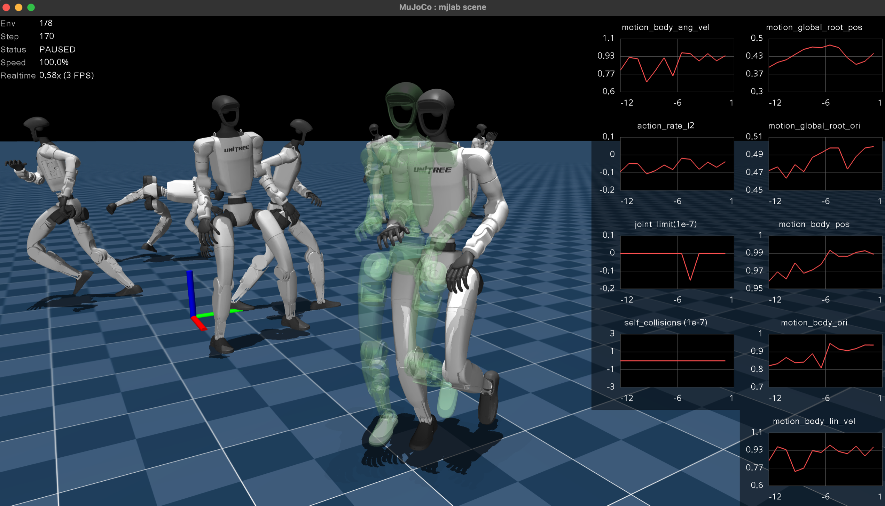

.. _viewers:

查看器
======

mjlab 提供两个交互式查看器，用于评估训练好的策略和调试环境行为：一个是基于 MuJoCo
`passive viewer <https://mujoco.readthedocs.io/en/stable/python.html#passive-viewer>`_
构建的 **原生查看器**，会打开一个桌面窗口；另一个是基于
`Viser <https://viser.studio/main/>`_ 的 **查看器**，运行在浏览器中。两者共享同一个
``ViewerConfig`` 并执行相同的仿真循环；区别在于界面、功能集，以及各自最擅长的场景。

启动查看器
----------

``play`` 脚本接受一个 ``--viewer`` 标志：

.. code-block:: bash

    # Desktop window (MuJoCo native viewer).
    uv run play Mjlab-Velocity-Flat-Unitree-G1 --viewer native \
        --wandb-run-path your-entity/your-project/run_id

    # Browser-based viewer (opens localhost:8080).
    uv run play Mjlab-Velocity-Flat-Unitree-G1 --viewer viser \
        --wandb-run-path your-entity/your-project/run_id

默认值为 ``auto``，当检测到显示服务器 (``DISPLAY`` 或 ``WAYLAND_DISPLAY``) 可用时选择原生查看器，否则在无显示器的机器上回退到 Viser。

如果想在没有训练好的 checkpoint 的情况下快速探索，可以传入 ``--agent zero`` 或 ``--agent random`` 来使用虚拟策略：

.. code-block:: bash

    uv run play Mjlab-Velocity-Flat-Unitree-G1 --agent zero --viewer viser

查看器配置
----------

相机位置、跟踪目标和渲染选项都保存在 ``ViewerConfig`` 中，通过
``ManagerBasedRlEnvCfg`` 的 ``viewer`` 字段进行设置：

.. code-block:: python

    from mjlab.viewer import ViewerConfig

    viewer = ViewerConfig(
        lookat=(0.0, 0.0, 0.5),
        distance=3.0,
        elevation=-20.0,
        azimuth=135.0,
    )

``origin_type`` 字段控制相机的参考系：

.. list-table::
   :header-rows: 1
   :widths: 22 78

   * - 原点类型
     - 行为
   * - ``WORLD``
     - 自由相机，锚定在世界原点（默认）。
   * - ``ASSET_ROOT``
     - 相机跟踪 ``entity_name`` 所指定实体的根刚体。适合机器人在世界中移动的运动控制类任务。
   * - ``ASSET_BODY``
     - 相机跟踪 ``entity_name`` 所指定实体内的某个具体刚体 (``body_name``)。适合观察末端执行器或头部的特写视角。

使用资产跟踪的示例：

.. code-block:: python

    viewer = ViewerConfig(
        origin_type=ViewerConfig.OriginType.ASSET_ROOT,
        entity_name="robot",
        distance=2.5,
        elevation=-15.0,
    )

其他字段：

- ``enable_shadows`` 和 ``enable_reflections`` 用于开关渲染质量选项。
- ``height`` 和 ``width`` 设置离屏渲染分辨率（供 ``OffscreenRenderer`` 和视频录制使用）。
- ``env_idx`` 选择启动时显示的环境。

原生 MuJoCo 查看器
-------------------

原生查看器在桌面窗口中打开 MuJoCo 的
`passive viewer <https://mujoco.readthedocs.io/en/stable/python.html#passive-viewer>`_ 。它渲染最快、最忠实，具备完整的 MuJoCo 视觉保真度。适合本地迭代开发和交互式扰动测试。MuJoCo 团队有一个
`视频教程 <https://www.youtube.com/watch?v=P83tKA1iz2Y>`_ ，介绍了该查看器的内置控件和导航操作。

**键盘控件。**

.. list-table::
   :header-rows: 1
   :widths: 18 82

   * - 按键
     - 作用
   * - ``Space``
     - 暂停或恢复仿真。
   * - ``Enter``
     - 重置环境。
   * - ``+`` / ``-``
     - 提高或降低回放速度。
   * - ``<`` / ``>``
     - 在不同环境之间切换（当 ``num_envs > 1`` 时）。
   * - ``A``
     - 开关是否同时渲染所有环境。开启后，调试可视化会为所有环境绘制。
   * - ``P``
     - 开关奖励曲线图。
   * - ``R``
     - 开关调试可视化。

**奖励曲线图。**
按 ``P`` 会在窗口右缘显示一条条带，逐项展示各奖励项的曲线。每一项都有自己的图，y 轴自动缩放。曲线实时更新，并在环境重置时清空。这是在 rollout 过程中诊断哪个奖励项占主导或表现异常的最快方式。

**交互式扰动。**
在回放过程中，点击并拖拽场景中的任意刚体即可施加外力。力会在下一步传入仿真，无需编写任何代码即可方便地测试平衡恢复、抓取鲁棒性或抗扰能力。

鼠标扰动产生的力与程序施加的力（例如 ``apply_body_impulse``）是分开的，它们通过不同的 MuJoCo 通道注入：程序施加的力写入 ``xfrc_applied`` (笛卡尔刚体力)，而鼠标力经 ``mj_applyFT`` 转换为 ``qfrc_applied`` (广义关节力)。两个通道在正向动力学中会被求和，因此二者可以共存而互不冲突。

**域随机化可视化。**
原生查看器每一帧都会把所有视觉域随机化 (DR) 字段从 GPU 同步到 CPU。随机化的几何体颜色、尺寸、位置、材质颜色、刚体位姿、相机参数、光源位置和惯性椭球都会被忠实渲染。只要某个 DR 事件改变了视觉属性，原生查看器就会显示出来。

Viser （基于浏览器）
---------------------

.. figure:: _static/viser_viewer.png
   :width: 100%
   :align: center
   :alt: Viser browser-based viewer

`Viser <https://viser.studio/main/>`_ 查看器在浏览器中的 ``localhost:8080`` 打开一个交互式 3D 场景。它可以经 SSH 隧道在远程机器上使用，因此是无头 GPU 服务器和共享调试会话的自然选择。其基于 Web 的架构使它比原生查看器更具可定制性。它还提供了原生查看器所没有的相机传感器输出专用面板。

**基于标签页的界面。**
侧边栏将控件组织为多个标签页：

- **Controls**： 播放/暂停、重置、速度调节、环境选择，以及显示设置（FOV、接触、几何体组、相机跟踪）。
- **Rewards**： 实时的逐项奖励图表，通过复选框开关。
- **Metrics**： 当存在 ``MetricsManager`` 时，显示实时的逐项指标图表。
- **Camera Feeds**： 场景中每个 ``CameraSensor`` 的实时 RGB 和深度图像面板。深度缩放滑块可调整可视化范围，视锥开关可在 3D 场景中绘制相机的视场范围。
- **Groups**： 显示或隐藏 MuJoCo 的几何体组和 site 组。

**相机传感器集成。**
Viser 会自动发现场景中的所有 ``CameraSensor`` 实例，并以实时图像面板的形式展示其输出。每个相机还会在 3D 视口中显示视锥可视化，因此你可以准确看到传感器覆盖的范围。这使得 Viser 成为调试相机摆放、视场和深度感知的最佳工具。

**接触可视化。**
Controls 标签页提供了接触渲染选项。开启后，接触点显示为彩色标记，接触力显示为红色箭头，为碰撞行为提供即时的视觉反馈。

.. note::

   Viser 查看器不支持交互式扰动（对刚体施加扭转力）。如需此功能，请使用原生查看器，或通过 :ref:`events <events>` 来设置扰动。

.. note::

   Viser 每一帧都直接从 GPU 读取世界坐标系下的刚体位置，因此刚体位姿能正确更新。但 ``geom_rgba`` 和 ``geom_size`` 在场景构建时就被烘焙进 GLB 网格中，不会反映各世界 (per-world) 的 DR 变化。这一问题将在未来的版本中解决。目前，如需验证视觉 DR，请使用原生查看器。

调试可视化
----------

两个查看器都支持共享的 ``DebugVisualizer`` 接口，管理器项可以向其中绘制。可用的图元包括：

- **箭头 (Arrows)**： 速度指令、力向量、朝向指示。
- **球体 (Spheres)**： 目标位置、接触点。
- **圆柱 (Cylinders)**： 肢体目标、距离标记。
- **椭球 (Ellipsoids)**： 惯性可视化。
- **坐标系 (Coordinate frames)**： 刚体坐标系姿态、末端执行器目标。
- **幽灵网格 (Ghost meshes)**： 机器人在目标位姿处的透明渲染，适用于动作跟踪或目标可视化。

在原生查看器中，用 ``R`` 开关调试可视化，按 ``A`` 可同时显示所有环境的调试绘制。在 Viser 中，Controls 标签页有对应的两个开关。借助 ``DebugVisualizer`` 抽象，奖励和指令项只需绘制一次，两个查看器就能直接显示结果，无需任何针对查看器的特定代码。

离屏渲染器
----------

为了在没有显示器的情况下录制视频，``OffscreenRenderer`` 使用 MuJoCo 的离屏渲染管线渲染帧。它支持与 ``ViewerConfig`` 相同的相机配置，并接受一个调试可视化回调。渲染器硬性限制最多 32 个环境，以保证内存和渲染时间可控。

设置 ``--video`` 标志时，``play`` 脚本会使用 ``OffscreenRenderer``：

.. code-block:: bash

    uv run play Mjlab-Velocity-Flat-Unitree-G1 --video --video-length 300 \
        --wandb-run-path your-entity/your-project/run_id

快速对比
--------

.. list-table::
   :header-rows: 1
   :widths: 24 38 38

   * -
     - Native
     - Viser
   * - 界面
     - 桌面窗口
     - 浏览器 (``localhost:8080``)
   * - 最适合
     - 本地迭代、扰动测试
     - 定制化、远程开发、相机
   * - 奖励曲线
     - ``P`` 键，右侧条带
     - Rewards 标签页，uPlot 图表
   * - 指标曲线
     -
     - Metrics 标签页
   * - 相机画面
     -
     - 自动发现，带视锥
   * - 扰动
     - 点击并拖拽
     -
   * - DR 可视化
     - 完整（同步所有视觉字段）
     - 部分（仅刚体位姿）
   * - 接触渲染
     -
     - 接触点与接触力
   * - 多环境
     - ``<`` ``>`` 切换，``A`` 显示全部
     - 下拉选择器

引用
----

如果你的研究中使用了 Viser 查看器，请考虑引用：

.. code-block:: bibtex

    @article{yi2025viser,
        title={Viser: Imperative, web-based 3d visualization in python},
        author={Yi, Brent and Kim, Chung Min and Kerr, Justin and Wu, Gina and Feng, Rebecca and Zhang, Anthony and Kulhanek, Jonas and Choi, Hongsuk and Ma, Yi and Tancik, Matthew and Kanazawa, Angjoo},
        journal={arXiv preprint arXiv:2507.22885},
        year={2025}
    }
