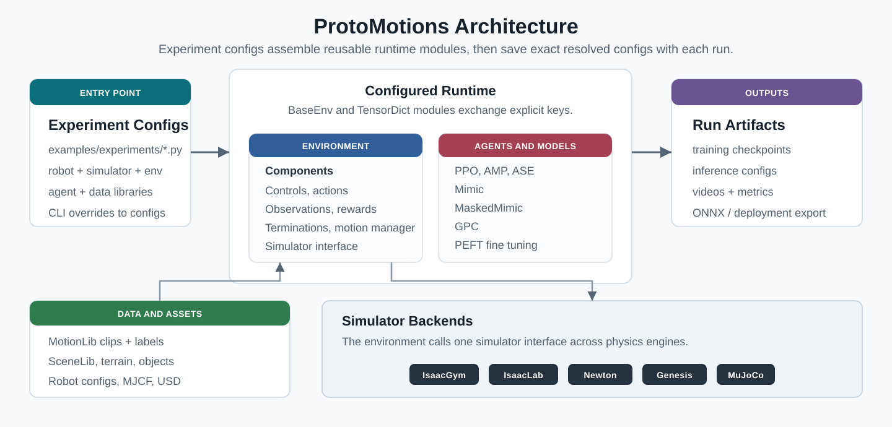

ProtoMotions 文档
==========================

.. raw:: html

   

     <video autoplay loop muted playsinline style="width: 100%; border-radius: 8px;">
       <source src="_static/banner.mp4" type="video/mp4">
       Your browser does not support the video tag.
     </video>
   

ProtoMotions 是一个 GPU 加速的仿真与学习框架，用于训练物理仿真的数字人与人形机器人。
我们的使命是提供一个快速原型平台，覆盖各类仿真人形学习任务与环境，衔接基于物理的动画、
数字人与人形机器人学三个方向的工作。

.. raw:: html

   

     <svg height="32" width="32" viewBox="0 0 16 16" fill="white" style="flex-shrink: 0;">
       <path d="M8 0C3.58 0 0 3.58 0 8c0 3.54 2.29 6.53 5.47 7.59.4.07.55-.17.55-.38 0-.19-.01-.82-.01-1.49-2.01.37-2.53-.49-2.69-.94-.09-.23-.48-.94-.82-1.13-.28-.15-.68-.52-.01-.53.63-.01 1.08.58 1.23.82.72 1.21 1.87.87 2.33.66.07-.52.28-.87.51-1.07-1.78-.2-3.64-.89-3.64-3.95 0-.87.31-1.59.82-2.15-.08-.2-.36-1.02.08-2.12 0 0 .67-.21 2.2.82.64-.18 1.32-.27 2-.27.68 0 1.36.09 2 .27 1.53-1.04 2.2-.82 2.2-.82.44 1.1.16 1.92.08 2.12.51.56.82 1.27.82 2.15 0 3.07-1.87 3.75-3.65 3.95.29.25.54.73.54 1.48 0 1.07-.01 1.93-.01 2.2 0 .21.15.46.55.38A8.013 8.013 0 0016 8c0-4.42-3.58-8-8-8z"/>
     </svg>
     

       
ProtoMotions on GitHub

       
Star us, report issues, and contribute

     

     <a href="https://github.com/NVlabs/ProtoMotions" target="_blank" rel="noopener noreferrer"
        style="display: inline-block; padding: 8px 20px; background: #238636; color: white; border-radius: 6px; text-decoration: none; font-weight: 600; font-size: 0.95em;">
       View Repository &rarr;
     </a>
   

.. note::

   本项目会下载并安装额外的第三方开源软件项目。使用前请查阅这些开源项目的许可条款。

核心特性
------------

* **多后端**：基于 NVIDIA Newton 1.0.0、IsaacGym、IsaacLab、Genesis（GPU）与 MuJoCo（CPU）后端的快速、可扩展仿真
* **模块化设计**：内置多种仿真后端、机器人形体结构、RL 环境与算法。轻松添加你自己的机器人、任务或算法
* **丰富工具集**：内置程序化地形生成、动作重定向（基于 PyRoki）、场景与物体生成。全部可扩展至大规模训练
* **前沿算法**：GPC/PEFT、MaskedMimic、AMP、ASE、PPO 实现
* **多机器人**：SMPL、SMPL-X、Unitree G1、H1 以及自定义形体结构
* **开源**：代码采用 Apache-2.0 协议；随附第三方资产的许可说明见 ``legal/`` 目录

仿真器支持
-----------------

.. raw:: html

   

     
     
     
     
     
   

高层架构
-----------------------

快速链接
-----------

* :doc:`getting_started/installation` - 安装与环境配置
* :doc:`getting_started/quickstart` - 运行预训练模型并开始训练
* :doc:`getting_started/pretrained_models` - 对比随附检查点及其运行预期
* :doc:`tutorials/index` - 分步教程与工作流
* :doc:`user_guide/gpc` - 训练离散 GPC 先验并用 PEFT 适配
* :doc:`concepts/index` - 核心抽象与设计
* :doc:`api_reference/index` - 完整 API 参考
* :doc:`changelog` - 当前版本的发布说明

.. toctree::
   :maxdepth: 2
   :caption: 快速上手
   :hidden:

   getting_started/installation
   getting_started/quickstart
   getting_started/pretrained_models
   getting_started/amass_preparation
   getting_started/phuma_preparation
   getting_started/seed_bvh_preparation
   getting_started/seed_g1_csv_preparation
   getting_started/kimodo_preparation

.. toctree::
   :maxdepth: 1
   :caption: 教程
   :hidden:

   tutorials/index
   tutorials/code_tutorials
   tutorials/workflows/amass_smpl
   tutorials/workflows/retargeting_pyroki
   tutorials/workflows/domain_randomization
   tutorials/workflows/g1_deployment
   tutorials/workflows/custom_robot
   tutorials/challenges

.. toctree::
   :maxdepth: 2
   :caption: 用户指南
   :hidden:

   user_guide/configuration
   user_guide/experiments
   user_guide/gpc
   user_guide/isaaclab3_migration
   user_guide/slurm_training
   user_guide/developer_tips

.. toctree::
   :maxdepth: 2
   :caption: 核心概念
   :hidden:

   concepts/index
   concepts/architecture
   concepts/abstractions
   concepts/environment_context
   concepts/pose_lib
   concepts/simulator_state

.. toctree::
   :maxdepth: 2
   :caption: API 参考
   :hidden:

   api_reference/index

.. toctree::
   :maxdepth: 1
   :caption: 社区
   :hidden:

   changelog
   contributing
