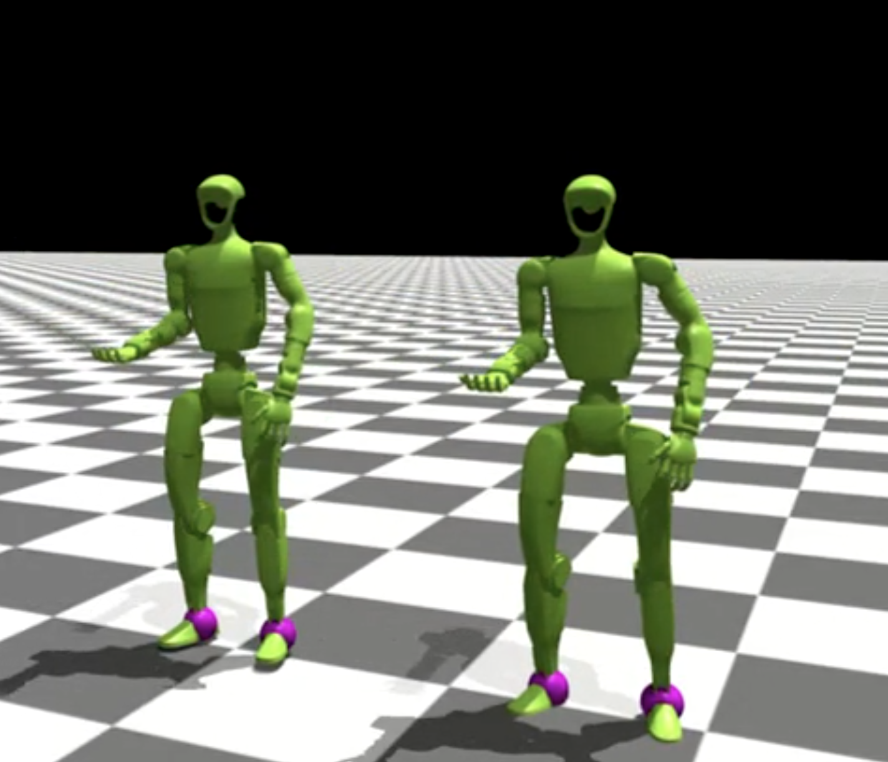

用 PyRoki 重定向 SMPL 动作
====================================

本工作流介绍如何使用 PyRoki（一种基于轨迹优化的重定向工具）将 AMASS 中的
SMPL 人形动作重定向到机器人形体结构（G1 与 H1_2）。

重定向的工作原理
---------------------

与许多逐帧求解逆运动学（IK）的常见重定向器不同，
PyRoki 执行的是**轨迹级的运动学优化**。这意味着：

1. **整条轨迹优化**：PyRoki 不逐帧独立求解，而是一次性优化整条动作轨迹。
   这使得保持时间上的一致性和平滑性容易得多。

2. **不会突然翻转**：使用我们修改过的 PyRoki 实现，几乎不会出现动作突然翻转
   或不连续的失败情况。这对大规模数据处理和训练至关重要。

3. **多个代价项**：优化同时平衡多个目标：

   - **局部对齐** （``local_alignment``）：匹配源与目标之间相对的关节/关键点位置和骨骼方向
   - **全局对齐** （``global_alignment``）：将关键点的绝对位置匹配到世界坐标系中的机器人连杆位置
   - **根节点平滑** （``root_smoothness``）：惩罚抖动的根节点运动
   - **关节平滑** （``joint_smoothness``）：惩罚抖动的关节运动
   - **关节限位** （``limit_cost``）：使关节保持在有效范围内
   - **关节速度限制** （``joint_vel_limit``）：防止不切实际的关节速度
   - **足部接触** （``foot_contact``）：当脚处于接触状态时，惩罚足部移动并保持踝-趾高度一致
   - **足部倾斜** （``foot_tilt``）：接触时保持脚掌放平

4. **固定轨迹长度**：所有动作都会被裁剪或填充到 15 秒
   （30 FPS 下共 450 帧），以便高效地进行 JAX 编译和批处理。

概述
--------

从 AMASS 到机器人的完整重定向管线：

.. code-block:: text

   Packaged AMASS MotionLib (.pt, SMPL format)
           │
           ▼ (extract_retargeting_input_keypoints_from_packaged_motionlib.py)
   Keypoints (.npy files)
           │
           ├──────────────────────────────────────┐
           ▼                                      ▼
   Retargeted robot motion               Contact labels from source
   (batch_retarget_to_<robot>_from_keypoints.py)  (--save-contacts-only)
           │                                      │
           └──────────────────────────────────────┘
                           │
                           ▼ (convert_pyroki_retargeted_robot_motions_to_proto.py)
                   ProtoMotions format (.motion)
                           │
                           ▼ (motion_lib.py)
                   Packaged MotionLib (.pt)

前置条件
-------------

* SMPL 格式的已打包 AMASS MotionLib（参见 :doc:`../../getting_started/amass_preparation`）
* 在**独立的** Python 环境中安装 PyRoki（见下文）

安装 PyRoki
~~~~~~~~~~~~~~~~~

由于 JAX/CUDA 依赖不同，PyRoki 需要与 ProtoMotions 分开安装在一个独立的
Python 环境中。安装方式如下：

.. code-block:: bash

   # Create a new environment for PyRoki
   conda create -n pyroki python=3.10
   conda activate pyroki
   
   # Clone and install PyRoki
   git clone https://github.com/chungmin99/pyroki.git
   cd pyroki
   pip install -e .

更多细节参见 `PyRoki GitHub repository <https://github.com/chungmin99/pyroki>`_。

快速上手：便捷脚本
-------------------------------

想要一键式方案，可以使用提供的 bash 脚本。由于 ProtoMotions 与 PyRoki
需要独立的 Python 环境，你必须提供两个 Python 解释器的路径：

.. code-block:: bash

   ./scripts/retarget_amass_to_robot.sh <proto_python> <pyroki_python> <amass_pt_file> <robot_type> [skip_freq]

**参数：**

* ``proto_python``：安装了 ProtoMotions 的 Python 解释器路径
* ``pyroki_python``：安装了 PyRoki 的 Python 解释器路径
* ``amass_pt_file``：已打包的 AMASS MotionLib .pt 文件路径（输出保存在同一目录）
* ``robot_type``：目标机器人（``g1`` 或 ``h1_2``）
* ``skip_freq``：（可选）每隔 N 个动作处理一次（默认：1 = 全部动作）

**示例：**

.. code-block:: bash

   # Retarget every 50th motion to G1 (for quick testing)
   ./scripts/retarget_amass_to_robot.sh \
       ~/miniconda3/envs/protomotions/bin/python \
       ~/miniconda3/envs/pyroki/bin/python \
       /path/to/amass_train.pt \
       g1 50
   
   # Retarget all motions to H1_2
   ./scripts/retarget_amass_to_robot.sh \
       ~/miniconda3/envs/protomotions/bin/python \
       ~/miniconda3/envs/pyroki/bin/python \
       /path/to/amass_train.pt \
       h1_2 1

脚本会自动执行所有步骤，并输出最终的 MotionLib ``.pt`` 文件。

**输出目录结构** （输出与输入 .pt 文件保存在一起）：

.. code-block:: text

   output_dir/
   ├── keypoints-for-retarget/   # Keypoints extracted from SMPL
   ├── pyroki-retargeted-g1/     # Retargeted robot motions
   ├── contacts/                 # Foot contact labels from source
   ├── proto-g1/                 # Robot proto format motions
   └── proto-g1.pt               # Packaged robot MotionLib

重定向单个动作文件
--------------------------------

要重定向单个 ``.motion`` 文件（而非打包的 ``.pt`` MotionLib），请使用专用脚本：

.. code-block:: bash

   ./scripts/retarget_single_motion_to_robot.sh <proto_python> <pyroki_python> <motion_file> <output_dir> <robot_type>

**参数：**

* ``proto_python``：安装了 ProtoMotions 的 Python 解释器路径
* ``pyroki_python``：安装了 PyRoki 的 Python 解释器路径
* ``motion_file``：输入 ``.motion`` 文件路径（SMPL 格式）
* ``output_dir``：所有输出的存放目录
* ``robot_type``：目标机器人（``g1`` 或 ``h1_2``）

**示例：**

.. code-block:: bash

   ./scripts/retarget_single_motion_to_robot.sh \
       ~/miniconda3/envs/protomotions/bin/python \
       ~/miniconda3/envs/pyroki/bin/python \
       /path/to/walk.motion \
       /path/to/output \
       g1

脚本会自动：

1. 从 SMPL 动作中提取关键点
2. 运行 PyRoki 重定向到目标机器人
3. 从源动作中提取足部接触标签
4. 连同接触标签一起转换为 ProtoMotions 格式
5. 报告输出 ``.motion`` 文件的路径

要可视化结果：

.. code-block:: bash

   python examples/motion_libs_visualizer.py \
       --motion_files /path/to/output/proto-g1.pt \
       --robot g1 \
       --simulator isaacgym

分步指南
------------------

步骤 1：从打包的 MotionLib 提取关键点
~~~~~~~~~~~~~~~~~~~~~~~~~~~~~~~~~~~~~~~~~~~~~~~~~

从打包好的 SMPL 动作中提取简化的关键点（骨盆、肩、肘、腕、髋、膝、踝、
脚，以及若干辅助点）：

.. code-block:: bash

   python data/scripts/extract_retargeting_input_keypoints_from_packaged_motionlib.py \
       /path/to/amass_train.pt \
       --output-path /path/to/output/keypoints-for-retarget/ \
       --skeleton-format smpl \
       --start-idx 0 \
       --skip-freq 15

**参数：**

* ``--output-path``：存放提取出的关键点 ``.npy`` 文件的目录
* ``--skeleton-format``：源骨骼格式（AMASS 使用 ``smpl``）
* ``--start-idx``：起始动作索引（默认：0）
* ``--skip-freq``：每隔 N 个动作处理一次（快速子集测试用 15-35，全部动作用 1）

.. tip::

   首次测试管线时，使用 ``--skip-freq 50`` 或更大的值，只处理一小部分动作。
   验证无误后，再设为 ``--skip-freq 1`` 处理全部动作。

步骤 2：运行 PyRoki 重定向
~~~~~~~~~~~~~~~~~~~~~~~~~~~~~~

激活 PyRoki 环境（与 ProtoMotions 分开）并运行批量重定向：

**G1：**

.. code-block:: bash

   conda activate pyroki  # Switch to PyRoki environment
   
   python pyroki/batch_retarget_to_g1_from_keypoints.py \
       --keypoints-folder-path /path/to/output/keypoints-for-retarget/ \
       --output-dir /path/to/output/pyroki-retargeted-g1/ \
       --source-type smpl \
       --subsample-factor 1 \
       --no-visualize \
       --skip-existing

**H1_2：**

.. code-block:: bash

   python pyroki/batch_retarget_to_h1_2_from_keypoints.py \
       --keypoints-folder-path /path/to/output/keypoints-for-retarget/ \
       --output-dir /path/to/output/pyroki-retargeted-g1/ \
       --source-type smpl \
       --subsample-factor 1 \
       --no-visualize \
       --skip-existing

**参数：**

* ``--keypoints-folder-path``：包含关键点 ``.npy`` 文件的输入目录
* ``--output-dir``：重定向动作（``.npz`` 文件）的输出目录
* ``--source-type``：源骨骼类型（AMASS 使用 ``smpl``）
* ``--subsample-factor``：时间下采样（1 = 不下采样）
* ``--no-visualize``：跳过可视化（批量处理时必须）
* ``--skip-existing``：通过跳过已完成的文件来续跑中断的任务

步骤 3：从源动作提取接触标签
~~~~~~~~~~~~~~~~~~~~~~~~~~~~~~~~~~~~~~~~~~~~~~~~~~~

足部接触标签应来自**源 SMPL 动作**，而不是从重定向后的机器人动作重新计算。
这是因为重定向过程可能不完美，而源动作的接触信息更可靠。

.. code-block:: bash

   python pyroki/batch_retarget_to_g1_from_keypoints.py \
       --keypoints-folder-path /path/to/output/keypoints-for-retarget/ \
       --source-type smpl \
       --subsample-factor 1 \
       --save-contacts-only \
       --contacts-dir /path/to/output/contacts/ \
       --skip-existing

``--save-contacts-only`` 标志会跳过重定向，只从源关键点提取处理后的足部接触标签。

步骤 4：转换为 ProtoMotions 格式
~~~~~~~~~~~~~~~~~~~~~~~~~~~~~~~~~~~~~~

将重定向后的动作转换为 ProtoMotions 格式，并合入源接触标签：

.. code-block:: bash

   python data/scripts/convert_pyroki_retargeted_robot_motions_to_proto.py \
       --retargeted-motion-dir /path/to/output/pyroki-retargeted-g1/ \
       --output-dir /path/to/output/proto-g1/ \
       --robot-type g1 \
       --contact-labels-dir /path/to/output/contacts/ \
       --apply-motion-filter \
       --force-remake

**参数：**

* ``--retargeted-motion-dir``：存放重定向后 ``.npz`` 文件的目录
* ``--output-dir``：存放 ``.motion`` 文件的输出目录
* ``--robot-type``：目标机器人（``g1`` 或 ``h1_2``）
* ``--contact-labels-dir``：存放步骤 3 接触标签的目录
* ``--apply-motion-filter``：应用平滑滤波以减少抖动
* ``--force-remake``：覆盖已有文件

.. note::

   转换脚本会自动调整机器人高度（``fix_height``），使用特定于机器人的脚部偏移，
   以确保脚不穿入地面。

步骤 5：打包成 MotionLib
~~~~~~~~~~~~~~~~~~~~~~~~~~~~~~

将转换后的动作打包成单个 ``.pt`` 文件：

.. code-block:: bash

   python protomotions/components/motion_lib.py \
       --motion-path /path/to/output/proto-g1/ \
       --output-file /path/to/output/proto-g1.pt

步骤 6：用动作可视化器验证
~~~~~~~~~~~~~~~~~~~~~~~~~~~~~~~~~~~~~

训练前，先用动作可视化器确认重定向后的动作看起来正确：

.. code-block:: bash

   python examples/motion_libs_visualizer.py \
       --motion_files /path/to/output/proto-g1.pt \
       --robot g1 \
       --simulator isaacgym

可视化器支持并排对比多个 MotionLib：

.. code-block:: bash

   python examples/motion_libs_visualizer.py \
       --motion_files /path/to/output/proto-g1.pt /path/to/reference.pt \
       --robot g1 \
       --simulator isaacgym

**操作按键：**

* **R**：切换到下一个动作
* **1/2**：加快/减慢回放速度
* **3/4**：调整高亮显示的平滑度阈值

为重定向添加新机器人
----------------------------------

要重定向到新机器人，请基于现有脚本创建一个新的重定向脚本。
对比 ``batch_retarget_to_g1_from_keypoints.py`` 与
``batch_retarget_to_h1_2_from_keypoints.py`` 可以看出关键差异：

1. **连杆名称映射**
   
   更新 ``get_humanoid_retarget_indices()`` 中的关键点到连杆的映射：

   .. code-block:: python
   
      # G1 example
      for human_name, g1_name in [
          ("pelvis", "pelvis_contour_link"),
          ("left_hip", "left_hip_pitch_link"),
          ("left_knee", "left_knee_link"),
          ("left_ankle", "left_ankle_roll_link"),
          ("left_foot", "left_foot_link"),
          ("left_shoulder", "left_shoulder_pitch_link"),
          ("left_elbow", "left_elbow_link"),
          ("left_wrist", "left_wrist_yaw_link"),
          # ... right side similarly
      ]:
   
      # H1_2 example  
      for human_name, h1_2_name in [
          ("pelvis", "pelvis"),
          ("left_hip", "left_hip_yaw_link"),
          ("left_knee", "left_knee_link"),
          ("left_ankle", "left_ankle_roll_link"),
          ("left_foot", "left_foot_link"),
          ("left_shoulder", "left_shoulder_roll_link"),
          ("left_elbow", "left_elbow_link"),
          ("left_wrist", "left_wrist_yaw_link"),
          # ... right side similarly
      ]:

2. **关键点缩放**
   
   不同机器人的身体比例不同。调整 ``load_motion_data()`` 中的缩放因子，
   以匹配你的机器人的尺寸：

   .. code-block:: python
   
      # G1 (smaller robot)
      if source_type == "smpl":
          simplified_keypoints_lower_body_local = (
              simplified_keypoints_lower_body_local
              * onp.array([0.9, 0.9, 0.85])[None, None, :]
          )
          simplified_keypoints_upper_body_local = (
              simplified_keypoints_upper_body_local
              * onp.array([0.9, 0.9, 0.8])[None, None, :]
          )
   
      # H1_2 (larger robot, closer to human scale)
      if source_type == "smpl":
          simplified_keypoints_lower_body_local = (
              simplified_keypoints_lower_body_local
              * onp.array([1.1, 1.1, 1.1])[None, None, :]
          )
          simplified_keypoints_upper_body_local = (
              simplified_keypoints_upper_body_local
              * onp.array([1.1, 1.1, 1.0])[None, None, :]
          )

3. **辅助点偏移**
   
   更新 ``pc_alignment_cost()`` 中手部和躯干的辅助点偏移：

   .. code-block:: python
   
      # G1 hand auxiliary point
      left_hand_aux_pos = link_pos_left_wrist + link_rot_mat_left_wrist @ jnp.array(
          [0.0, 0.0, 0.14]  # G1 specific offset
      )
      
      # H1_2 hand auxiliary point
      left_hand_aux_pos = link_pos_left_wrist + link_rot_mat_left_wrist @ jnp.array(
          [0.0, 0.0, 0.2]  # H1_2 specific offset
      )

4. **URDF 与网格路径**
   
   更新你的机器人的 URDF 与网格文件的默认路径：

   .. code-block:: python
   
      parser.add_argument(
          "--urdf-path",
          default=str(SCRIPT_DIR / "../protomotions/data/assets/urdf/for_retargeting/your_robot.urdf"),
      )
      parser.add_argument(
          "--mesh-dir",
          default=str(SCRIPT_DIR / "../protomotions/data/assets/mesh/YourRobot"),
      )

5. **优化权重**
   
   为你的机器人调整优化权重：

   .. code-block:: python
   
      weights_dict = RetargetingWeights(
          local_alignment=1.0,
          global_alignment=4.0,  # G1: 4.0, H1_2: 3.0
          root_smoothness=1.0,
          joint_smoothness=4.0,
          self_collision=0.0,
          joint_rest_penalty=1.0,
          joint_vel_limit=50.0,
          foot_contact=30.0,
          foot_tilt=1.0,
      )

6. **更新转换脚本**
   
   在 ``convert_pyroki_retargeted_robot_motions_to_proto.py`` 中加入你的机器人类型，
   以处理特定于机器人的逻辑（关节顺序、高度偏移等）。

下一步
----------

* :doc:`../../getting_started/amass_preparation` - 准备 AMASS 数据
* :doc:`amass_smpl` - 在 AMASS 上训练 SMPL 策略
* :doc:`custom_robot` - 将你自己的机器人添加到 ProtoMotions
