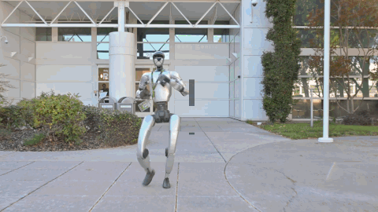

GR00T-WholeBodyControl 文档
===========================

.. image:: https://img.shields.io/badge/License-Apache%202.0%20%7C%20NVIDIA%20Open%20Model-blue.svg
   :target: resources/license.html
   :alt: License

.. image:: https://img.shields.io/badge/IsaacLab-2.3.0-blue.svg
   :target: https://github.com/isaac-sim/IsaacLab/releases/tag/v2.3.0
   :alt: IsaacLab

欢迎来到 **GR00T Whole-Body Control (WBC)** 的官方文档！这是一个用于开发和部署先进人形机器人控制器的统一平台。

GR00T-WholeBodyControl 是什么？
-------------------------------

本代码库是以下工作的基础：

- NVIDIA Isaac-Gr00t、Gr00t N1.5 和 N1.6 中使用的 **Decoupled WBC（解耦全身控制）** 模型（参见 :doc:`详细参考 <references/decoupled_wbc>`）
- **GEAR-SONIC 系列**：GEAR 团队最先进的控制器

新闻
----

- **[2026-08-31]** **SONIC 部署更新** —— 新增逐电机 Kp/Kd 缩放，以减少绊倒。
- **[2026-07-23]** **SONIC v1.1 检查点** —— 发布了采用腕部姿态增强训练、机器人朝向归一化的 SONIC 控制器，用于全身遥操作和基于 SONIC 的 VLA 执行。参见 `模型卡 <model_card.html>`_ 和 `下载模型 <getting_started/download_models.html#sonic-v11-checkpoint>`_。
- **[06/16]** **Isaac Teleop 配置（CloudXR / DeviceIO，进程内）** —— 新增通过 ``isaacteleop[cloudxr]`` 的进程内 CloudXR 路径调通文档，无需单独的 publisher 容器。参见 `Isaac Teleop 配置 <tutorials/isaac_teleop_publisher_setup.html>`_。
- **[2026-06-16]** **低延迟遥操作检查点** —— 发布了带 4 帧 SMPL 参考前瞻的 SONIC 检查点，实现响应更快的全身遥操作。用法参见 `模型卡 <model_card.html>`_、`下载模型 <getting_started/download_models.html#low-latency-teleoperation-checkpoint>`_ 和 `VLA 推理 <tutorials/vla_inference.html#low-latency-teleoperation-checkpoint>`_。
- **[2026-05-07]** **G1 上的端到端 VLA 工作流** —— 采集遥操作数据、微调 Isaac-GR00T N1.7，并使用 SONIC 全身控制进行部署。参见 `数据采集 <tutorials/data_collection.html>`_、`VLA 工作流 <tutorials/vla_workflow.html>`_ 和 `VLA 推理 <tutorials/vla_inference.html>`_。
- **[2026-04-14]** `在线网页演示 <https://nvlabs.github.io/GEAR-SONIC/demo.html>`_ —— 在浏览器中交互式体验 SONIC。集成了 `Kimodo <https://github.com/nv-tlabs/kimodo>`_ 文本生成动作功能。
- **[2026-04-10]** 在 `HuggingFace <https://huggingface.co/nvidia/GEAR-SONIC>`_ 上发布 **SONIC 训练代码与检查点**。支持从零训练或微调，新增 **更多机器人本体（embodiment）支持** 与 **VLA 数据采集流水线**。参见 `训练指南 <user_guide/training.html>`_。
- **[2026-03-24]** C++ 推理栈更新：电机误差监控、TTS 语音提示、ZMQ 协议 v4、待机模式重适配。**ZMQ 头部大小变更为 1280 字节。**
- **[2026-03-16]** `BONES-SEED <https://huggingface.co/datasets/bones-studio/seed>`_ 开源 —— 14.2 万余条人体动作（约 288 小时），附 G1 MuJoCo 轨迹。
- **[2026-02-19]** 发布 GEAR-SONIC：预训练检查点、C++ 推理、VR 遥操作与文档。
- **[2025-11-12]** 首次发布，包含用于 GR00T N1.5 和 N1.6 的 Decoupled WBC。

GEAR-SONIC
----------

.. raw:: html

   

     
     
     
   

**SONIC** 是一个人形行为基础模型，它让机器人具备从大规模人体动作数据中学到的核心运动技能。SONIC 不为每种动作单独构建控制器，而是将动作跟踪作为可扩展的训练任务，使单一统一策略能够产生自然的全身运动，并支持丰富多样的行为。

🎯 核心特性：

- 🚶 自然的全身移动（行走、爬行、动态动作）
- 🎮 实时 VR 遥操作支持
- 🤖 作为上层规划与交互的基础
- 📦 开箱即用的 C++ 推理栈

快速上手：Sim2Sim
-----------------

在部署到真机之前，先在 MuJoCo 中快速验证 SONIC 部署栈。

.. raw:: html

   <video width="100%" autoplay loop muted playsinline style="border-radius: 8px; margin: 0 0 1.5em 0;">
     <source src="_static/sim2sim.mp4" type="video/mp4">
   </video>

.. tip::

   **几分钟即可跑通！** 按照 :doc:`安装指南 <getting_started/installation_deploy>` 和 :doc:`快速上手 <getting_started/quickstart>` 操作，即可在你的机器上看到实际效果。

文档
----

.. toctree::
   :maxdepth: 2
   :caption: 快速开始

   model_card
   getting_started/installation_deploy
   getting_started/download_models
   getting_started/quickstart
   getting_started/vr_teleop_setup

.. toctree::
   :maxdepth: 2
   :caption: 教程

   tutorials/keyboard
   tutorials/gamepad
   tutorials/zmq
   tutorials/manager
   tutorials/isaac_teleop_publisher_setup
   tutorials/vr_wholebody_teleop
   tutorials/live_camera_teleop
   tutorials/data_collection
   tutorials/vla_workflow
   tutorials/vla_inference

.. toctree::
   :maxdepth: 2
   :caption: 训练

   getting_started/installation_training
   user_guide/training
   user_guide/training_data
   user_guide/new_embodiments

.. toctree::
   :maxdepth: 2
   :caption: 最佳实践

   user_guide/teleoperation
   user_guide/troubleshooting

.. toctree::
   :maxdepth: 2
   :caption: API 参考

..    api/index
..    api/teleop

.. toctree::
   :maxdepth: 2
   :caption: 参考文档

   references/index
   user_guide/configuration
   references/conventions
   references/training_code
   references/deployment_code
   references/observation_config
   references/motion_reference
   references/planner_onnx
   references/jetpack6
   references/decoupled_wbc

.. toctree::
   :maxdepth: 1
   :caption: 附加资源

   resources/citations
   resources/license
   resources/support
..    resources/contributing

索引与表格
==========

* :ref:`genindex`
* :ref:`modindex`
* :ref:`search`
